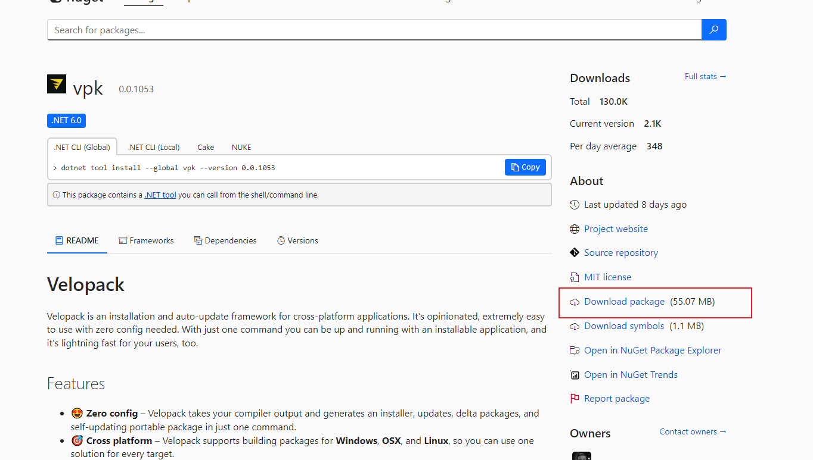

# velopack

# 简介

[velopack](https://github.com/velopack/velopack) 是最新出厂且最为通用的自动更新框架，基于 `NuGet` 包管理器实现，支持 `windows`、`linux` 、`OSX`平台，且适用于 `c#`、`c/c++`、`js`、`rust` 语言开发的应用程序。


- [vpk](https://www.nuget.org/packages/vpk): 下载 `.nupkg` 包后，直接用解压缩工具解压

    


# vpk 安装

>[!note]
> `velopack` 自己实现了打包工具 `vpk` ，并不是 valve 公司开发的 `vpk` 工具。


1. 下载 [.net 8.0](https://dotnet.microsoft.com/zh-cn/download)
2. 使用 `dotnet` 下载安装包

```term
triangle@LEARN:~$ dotnet tool install --global vpk // 安装位置 	%USERPROFILE%\.dotnet\tools
```


# 使用

1. 根据 [教程](https://docs.velopack.io/category/quick-start) 在代码中集成 `velopack`，编译得到目标程序

2. 程序打包，生成发布项目
    
    ```term
    triangle@LEARN:~$ vpk -h
    Description:
    Velopack CLI 0.0.1053, for distributing applications.

    Usage:
    vpk [command] [options]

    Options:
    -h, -H, --help, --vhelp  Show help (-h) or extended help (-H).
    -x, --legacyConsole      Disable console colors and interactive components.
    -y, --yes                'yes' by instead of 'no' in non-interactive prompts.
    --verbose                Print diagnostic messages.
    --skip-updates           Skip update checks

    Commands:
    pack      Creates a release from a folder containing application files.
    download  Download's the latest release from a remote update source.
    upload    Upload local package(s) to a remote update source.
    delta     Utilities for creating or applying delta packages.
    triangle@LEARN:~$ vpk pack -u <project_name> -v 1.0.0 -p <dir> -e <main exe>
    ```
    
3. 发布项目部署到服务