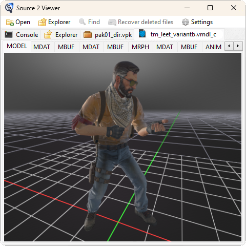

# VPK

# 介绍

[vpk](https://developer.valvesoftware.com/wiki/VPK) 打包工具是一款用于 Steam 游戏的文件打包工具，将游戏的资源文件打包成一个 `.vpk` 文件，方便游戏开发者进行管理和发布。其工作原理同 `NuGet`，`.vpk` 文件类似于 `.zip` 文件的压缩文件，包含了游戏资源文件的路径和文件名等信息。

# VPK CLI

- [vpk 手册](https://developer.valvesoftware.com/wiki/VPK)

# Source2Viewer

- [Source2Viewer 官网](https://valveresourceformat.github.io/)
- github 项目下载地址 [Source2Viewer](https://github.com/ValveResourceFormat/ValveResourceFormat)
    - `cli-windows-x64.zip` : 命令行工具
    - `Source2Viewer.exe` : 可视化工具

