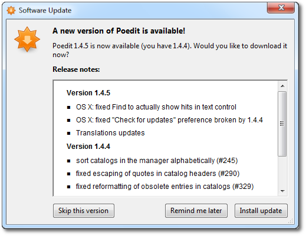

# WinSparkle

# 介绍

[WinSparkle](https://github.com/vslavik/winsparkle) 是 MAC 系统自动更新框架 [Sparkle](https://sparkle-project.org/) 框架的仿造版本，使用  `Appcast` 配置文件维护版本。其功能十分简单只实现了发布与更新，未集成任何打包与部署能力，此外对 Sparkle 的功能也未完全支持。

# 下载

直接在 [WinSparkle](https://github.com/vslavik/winsparkle) 的 Github 仓库就能下载编译好的库文件，且要使用 `generate_keys.bat`  与 `sign_update.bat` 还需下载 [openssl](https://www.openssl.org/source/)。

```term
triangle@LEARN:~$ D:\WORKSPACE\WINSPARKLE-0.8.3
│
│
├─bin
│      generate_keys.bat        # DSA 公匙与私匙生成脚本
│      sign_update.bat          # 签名脚本
│
├─include                       # 头文件
│      winsparkle-version.h
│      winsparkle.h
│
├─Release                       # 32 位动态库
│      WinSparkle.dll
│      WinSparkle.lib
│      WinSparkle.pdb
├─ARM64                         # arm64 动态库
│  └─Release
│          WinSparkle.dll
│          WinSparkle.lib
│          WinSparkle.pdb
└─x64                           # 64 位动态库
    └─Release
            WinSparkle.dll
            WinSparkle.lib
            WinSparkle.pdb
```

# 使用

1. 生成 DSA 公匙与私匙
   ```term
   triangle@LEARN:~$ generate_keys.bat
   ```

2. 集成动态库 `WinSparkle.dll`，添加自动更新检测

    ```cpp
    #include "sparkle/winsparkle.h"

    UpdateWidget::UpdateWidget()
    {
        // appcast.xml 文件地址
        win_sparkle_set_appcast_url("http://127.0.0.1:8080/appcast.xml");
        win_sparkle_set_app_details(L"winsparkle.org", L"WinSparkle Qt Example", L"1.0");

        // Set DSA public key used to verify update's signature.
        win_sparkle_set_dsa_pub_pem( R"(DSA 公匙)");

        // Initialize the updater and possibly show some UI
        win_sparkle_init();
    }

    void UpdateWidget::checkForUpdates()
    {
        // 显示根据提示界面
        win_sparkle_check_update_with_ui();
    }

    UpdateWidget::~UpdateWidget()
    {
        // 释放
        win_sparkle_cleanup();
    } 
    ```

3. 编译程序，并通过 `.rc` 文件设置版本号。**`WinSparkle`**
   - `ProductVersion` : 指定程序版本号，与服务配置进行校验。支持格式 `major.minor-build`，`major.minor.servicepack`，`major.minor`

    ```text
    #include <winver.h>

    // Version information; this, too, is used by WinSparkle
    1 VERSIONINFO
    FILEVERSION     1,0,0,0
    PRODUCTVERSION  1,0,0,0
    FILEFLAGSMASK   VS_FFI_FILEFLAGSMASK
    FILEFLAGS       0
    FILEOS          VOS_NT_WINDOWS32
    FILETYPE        VFT_APP
    FILESUBTYPE     VFT2_UNKNOWN
    BEGIN
        BLOCK "StringFileInfo"
        BEGIN
            BLOCK "040904B0" // US English, Unicode
            BEGIN
                VALUE "Comments", "Example app."
                VALUE "CompanyName", "winsparkle.org\0"
                VALUE "FileDescription", "WinSparkle example\0"
                VALUE "FileVersion", "1.0\0"
                VALUE "InternalName", "example_psdk\0"
                VALUE "OriginalFilename", "example_psdk.exe\0"
                VALUE "LegalCopyright", "Public Domain\0"
                VALUE "ProductName", "WinSparkle Example App\0"
                VALUE "ProductVersion", "1.0\0"
            END
        END

        BLOCK "VarFileInfo"
        BEGIN
            VALUE "Translation", 0x0409, 0x04B0
        END
    END
    ```

4. 可以使用 [Wix tool](https://wixtoolset.org/docs/wix3/) 得到安装包 `setup.msi`
5. 对安装包使用 DSA 进行签名

    ```term
    triangle@LEARN:~$ sign_update.bat setup.msi dsa_priv.pem
    ```

6. 配置 `appcast.xml` 文件，实现版本发布

    ```xml
    <?xml version="1.0" encoding="UTF-8"?>
    <rss version="2.0" xmlns:sparkle="http://www.andymatuschak.org/xml-namespaces/sparkle">
        <channel>
            <title>WinSparkle Test Appcast</title>
            <description>Most recent updates to WinSparkle Test</description>
            <language>en</language>
            <item>
                <title>Version 1.5.5880</title>
                <!-- 版本号，与 ProductVersion 进行比对 -->
                <sparkle:version>1.5.5880</sparkle:version>
                <sparkle:releaseNotesLink>
                    <!-- 更新信息，支持 html 文本-->
                </sparkle:releaseNotesLink>
                <pubDate>Fri, 06 Feb 2016 22:49:00 +0100</pubDate>
                <!-- 
                    url: 安装包下载链接
                    dsaSignature: 通过 sign_update.bat 生成的 setup.msi 签名
                 -->
                <enclosure url="https://your_domain/your_path/setup.msi"
                        sparkle:dsaSignature="MEQCICh10SofkNHa5iJgVWDi2O8RBYyN+nxkFEL7u/tBuWboAiB6VOV/WQMRJE+kRoICZXAhq5b24WkgqcDs0z7gyBkGVw=="
                        length="0"
                        type="application/octet-stream" />
            </item>
        </channel>
    </rss> 
    ```
7. 目标程序中执行 `win_sparkle_check_update_with_ui()` 便会检测更新，若存在更新会弹出对话框

    

8. 点击 `Install update` 后，默认会将安装包 `setup.msi` 下载到 `%temp%` 文件夹下，并启动。