# 生成汇编

# 环境描述

## CPU 模型

在开始汇编代码生成之前，需要先定义一下 CPU 模型
- 每个寄存器的大小为 `32 bit`
- `memory` 栈结构从高地址向低地址增长
- `a0` 寄存器表示 `accumulator`
- `t1` 临时寄存器，用来放临时值
- `sp` 寄存器表示 `memory` 栈结构下一个内存地址
- `sp + 4` 内存栈顶地址 （内存寻址单位为 `byte` ，寄存器大小为 `4 + byte`）
- `fp` 栈帧寄存器，存储当前函数栈帧地址
- `ra` 返回地址寄存器，函数调用退出时，CPU 需要继续执行的指令地址

汇编指令
- `lw r1 offset(r2)` : 将 `r2 + offset` 内存地址指向的 `32 bit` 数据加载 `r1`
- `sw r1 offset(r2)` : 将 `r1` 中的 `32 bit` 存储到 `r2 + offset` 地址指向的内存中
- `add r1 r2 r3` : 加法计算 `r1 = r2 + r3`
- `sub r1 r2 r3` : 减法计算 `r1 = r2 - r3`
- `addiu r1 r2 imm` : 加法计算 `r1 = r2 + imm`，
  - `u` : 无符号数，不检测溢出
  - `imm` : 立即数
- `li r imm` : 赋值 `r = imm`
- `move r1 r2` : 将 `r2` 的值移动到 `r1` 中
- `beg r1 r2 label` : 若 `r1 == r2` 则 CPU 跳转到 `label` 位置运行
- `b label` : CPU 直接跳转到 `label` 位置运行
- `jal fcn` : 跳转到函数标签 `fcn` 处运行，并将函数 `fcn` 返回时，CPU 需要继续执行的指令地址放入 `ra` 寄存器中
- `jr r` :  CPU 跳转到 `r` 寄存器中地址所指向的指令处运行


**案例：** `7 + 5` 的汇编代码

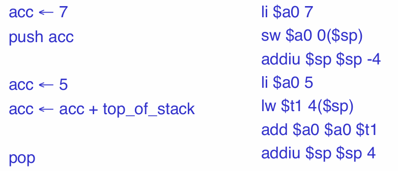


## 简易语言

为了便于学习，提供了一个简单的语言定义

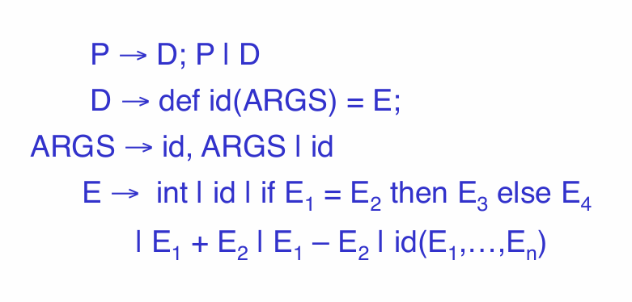


**案例：** 斐波拉级数计算

```text
def fib(x) = 
    if x = 1 then
        0
    else if x = 2 then
        1
    else 
        fib(x - 1) + fib(x - 2)
```

# 表达式运算


## 规则定义

> [!note]
> 在上述环境下，进行 `accumulator + memory` 栈式机器模型代码生成时，对于表达式 $e$ 而言
> - 表达式 $e$ 的计算结果存放在 `a0` 寄存器
> - 在 $e$ 计算结束后，`sp` 和 `memory` 栈结构与 $e$ 运算之前一样

定义函数 `cgen()` 表示编译器中的代码生成。例如常量表达式，其内涵就是将值赋给寄存器 `a0`，其代码生成过程如下


- 红色：编译器执行
- 蓝色：生成的程序代码

## 加法


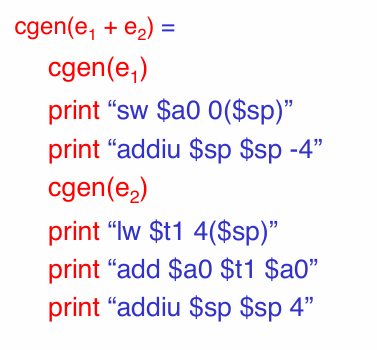

> 那么是否可以使用 `t1` 来存放 $e_1$ 的计算结果，使得对代码进行优化？**这个么干是错误的。**

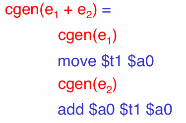

计算 `3 + ( 7 + 5 )`
1. 第一次调用 `cgen(e1 + e2)` 时，`e1 = 3` 与 `e2 = 7 + 5`
2. 运行 `cgen(3)` 后，移动计算 `a0 = 3 , t1 = a0 = 3`
3. 运行 `cgen(7 + 5)`，第二次调用 `cgen(e1 + e2)` 时 `e1 = 7` 与 `e2 = 5`
     1.  运行 `cgen(7)` 后，移动计算 `a0 = 7, t1 = a0 = 7`
     2.  运行 `cgen(5)` 后，加法计算 `a0 = 5, a0 = t1 + a0 = 12`
4. 运行 `cgen(7 + 5)` 后， 加法计算 `a0 = 12, a0 = t1 + a0 = 12 + 7 = 19`

> [!note]
> - 可知存在表达式嵌套时，临时寄存器会被覆写，因此，不能使用临时寄存器存储表达式计算结果。
> - 代码生成可以通过递归遍历 AST 实现

## 减法

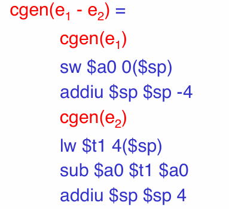

## if-else


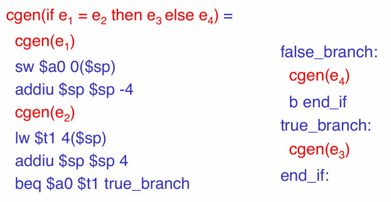

# 函数调用

## 规则定义

术语定义
- **调用者 `caller`** : 发起函数调用的函数
- **被调用者 `callee`** : 被调用的函数
- **调用序列 `calling sequence`** :  为发起函数调用而执行的一系列指令

对栈式机器模型的栈帧进行明确定义
- `result` : 表达式的返回结果都存储在 `a0` 中，那么 `return` 就不需要了
- `argument`: 调用者传入的形参按照从右到左的顺序放入激活记录
- `control link` : 在被调用者的激活记录中存储调用者的 `fp` 地址，便能实现栈帧追溯
- `return address` : 退出被调用者后，CPU 继续执行的指令地址，从 `ra` 中获取


**案例：** `f(x,y)` 函数在栈上的激活记录为

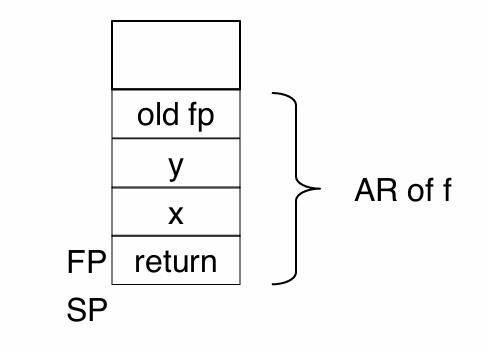

> [!note]
> 栈是由高地址向低地址增长，因此，在 `return address` 低地址处才是栈帧的首地址


## 函数调用前


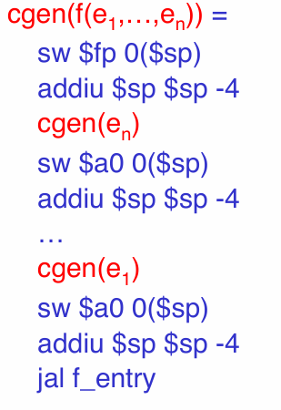

- 上述生成的所有操作由「调用者」执行，发生在 `f()` 运行之前，**即被调用者的激活记录中的参数是由调用者生成的**
- 执行 `jal f_entry` 后，**返回地址未被放入 `ra` 中，并没有记录到激活记录中**


## 函数执行

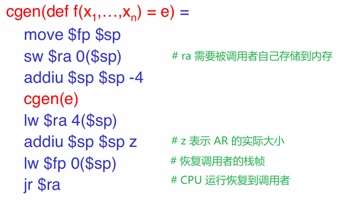

- 栈帧长度为 `z = 4 * n + 4 + 4`，其中 `n` 为形参个数，由编译器提前计算好


## 完整流程


调用函数 `f(x,y)` 是，寄存器与栈的完整变化流程

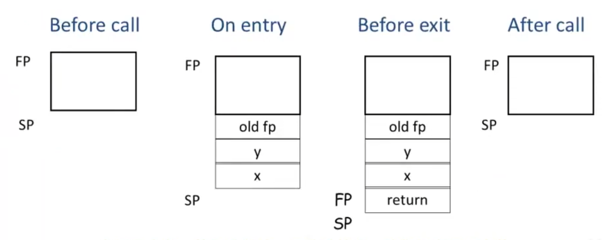

## 形参

上述流程可知，函数的形参是由调用者在调用函数前，放入函数的激活记录中，且在进入函数后，`fp` 就会一值指向被调用者栈帧的首地址，因此，**可以通过 `fp + offset` 实现对形参的访问**。 

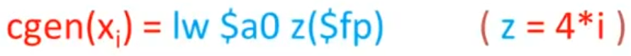

**案例：** 访问 `def f(x,y) = e` 的形参

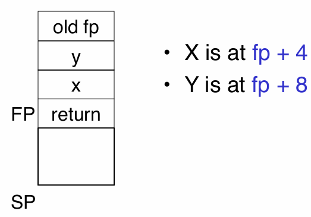


# 临时变量

## 思想描述

上述函数调用只介绍了「形参」如何存储，但是并未说明「局部变量」的处理方案，且加法、减法表达式中的「临时变量」都是先放入内存栈中，要使用时再读取到`t1` 中（很生成很多额外的入栈出栈操作指令）。**「临时变量」与「局部变量」的处理可以与同形参一样，直接存放到激活记录的参数列表中**。这就需要编译器计算好临时变量数量，提前在参数列表中预留空间。

```text
def fib(x) = 
    if x = 1 then       // `x = 1` :  需要临时存储 x 的结果，然后与 1 进行比较计算 
        0
    else if x = 2 then  // `x = 2` : 需要临时存储 x 的结果，然后与 2 进行比较计算 
        1
    else 
        // `x - 1` : 需要临时存储 x 的结果，然后计算减法
        // `fib(x - 1)` : x - 1 的结果会被存储在 fib(x - 1) 激活记录中
        // `x - 2` : 需要临时存储 x 的结果，然后计算减法
        // `fib(x - 2)` : x - 2 的结果会被存储在 fib(x - 2) 激活记录中
        // `fib(x - 1) + fib(x - 2)` :  需要临时存储 fib(x - 1) 的计算结果，然后计算加法
        fib(x - 1) + fib(x - 2)
```

分析上述函数的临时变量存储可知
- `x = 1` : 需要 1 个临时变量，且完成 `if` 判断就没用了
- `x = 2` : 需要 1 个临时变量，且完成 `if` 判断就没用了
- `fib(x - 1) + fib(x - 2)`  ： 需要 2 个临时变量
  - `x - 1` : 需要 1 个临时变量，且 `x - 1` 结果放入 `fib(x - 1)` 的激活函数后，临时变量没用了
  - `fib(x - 1)` : 后续需要计算加法，因此 **`fib(x - 1)` 的需要 1 个临时变量**
  - `x - 2` : 需要 1 个临时变量，**但此时并未完成 `fib(x - 1) + fib(x - 2)` 计算，需要再申请一个临时变量**，且 `x - 2` 结果放入 `fib(x - 2)` 的激活函数后，临时变量没用了

综上所述，完成 `fib(x)` 函数调用只需在「激活记录」中添加 2 个临时变量即可完成运算。


## 计算公式

定义运算 $\text{NT}(e)$  描述参与表达式 $e$ 运算的临时变量有多少个。

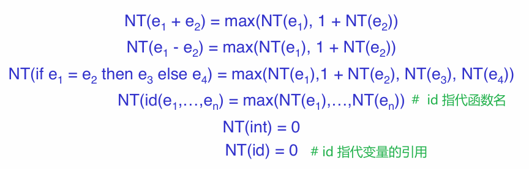

## 激活记录

函数 `f(x1,x2,...,xn) = e` 的激活记录长度为 ` 1 + 1 + n + NT(e)`
- `return address`
- `caller frame pointer`
- `n` 个形参
- `NT(e)` 个临时变量

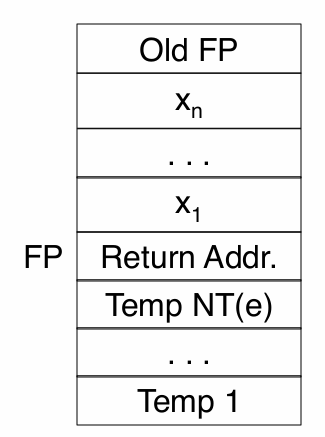

**`NT(e)` 大小的内存区域其实就相当于在栈帧内部又实现了一个存放临时变量的小型栈结构**。再定义一个地址偏移量 `nt`，与 `fp` 组合便能实现对临时内存区域的访问，且优化掉了大部分出栈入栈操作。

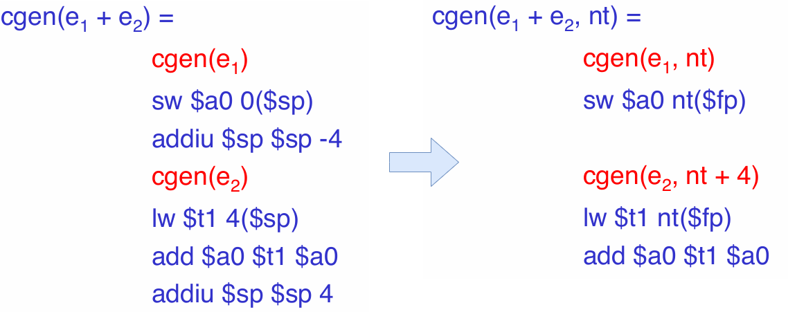


# 面向对象

```cool
Class A {
    a: Int;
    d: Int;
    f(): Int { a ← a + d };
};

Class B inherits A {
    b: Int;
    f(): Int { a };
    g(): Int { a ← a + b };
};

Class C inherits A {
    c: Int;
    h(): Int { a ← a + c };
};
```

## 类属性

根据类对象创建出来存储在内存中的变量被称之为「实例 `instance`」或「对象 `object`」。通过实例访问属性的方式 `obj.a` 其本质就是内存偏移，首先查询到实例 `obj` 所在内存的首地址，然后加上属性 `a` 相对于首地址的便宜量 `obj + offset(a)` 即可访问到属性。因此，实现实例的关键就在于内存结构
- 实例被存储在一片连续的内存上
- 父类属性在子类实例上的地址偏移量必须固定（实现多态的基础）
- 在类方法内部，`self/this` 均指向当前实例的内存地址

`cool` 语言对象内存布局

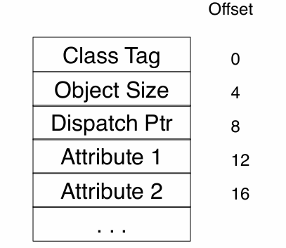

- `Class Tag` : 类标识，编译器生成，全局唯一
- `Object Size` : 对象占用内存的大小
- `Dispatch Ptr` : 调度指针，指向方法表的地址
- `Attribute` : 类属性


对于子类而言，就是在父类内存布局之后追加子类的属性

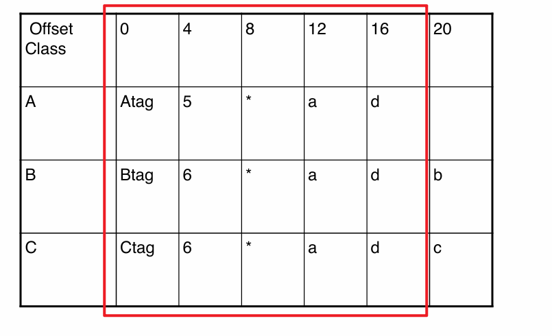

对于多层继承也是一样处理


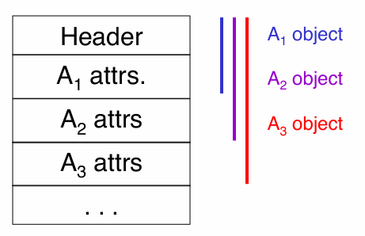

## 类方法

```python
class A:
    def __init__(self):
        self.data = 0

    def fcn(self, arg1,arg2):
        self.data = arg1 + arg2
```

类成员函数与普通函数的唯一区别：类成员函数会传递一个 `self/this` 的形参，例如 `python` 中需要显示的定义 `self` ，而 `c++`，`java` 中则是由编译器隐式添加 `this`。通过 `self/this` 便能将类对象实例传入类成员方法。由此可知，类成员方法其实是对所有实例均是通用的，不同实例调用成员方法，只要修改 `sefl/this` 就行，因此，在汇编层面类方法是通过一个固定的表结构进行管理。方法调用 `obj.f()` 的工作原理便是
- 通过 `obj.dispatchPtr` 访问方法表
- 再通过预先规定好的偏移量 `offset` 跳转到函数 `f()` 地址，即 `obj.dispatchPtr + offset`
- 调用 `f()` 函数时，会将 `obj` 的地址赋值给 `self` 参数（也称之为绑定到 `self`）

类成员方法表与属性的内存布局类似，父类的方法的地址存放在表的前面，子类的方法地址往后放。实现子类 `override` 父类方法，只需将子类的方法地址覆盖父类的地址即可。

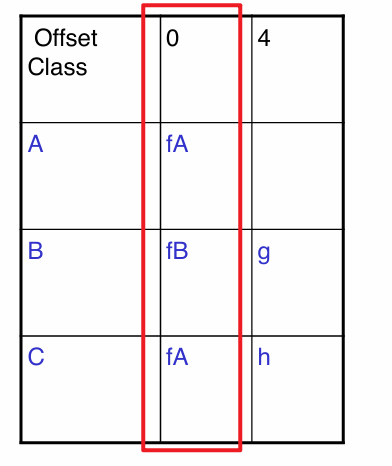

