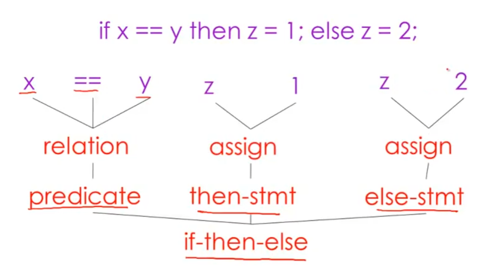

# 简介

# 编译器

执行编写好的代码存在两种机制
- 编译器 `Compiler`: 将源码编译成可执行程序，然后再运行，属于离线执行
- 解释器 `Interpreter` : 将源码和数据直接传递给解释器，然后解释器根据指令直接运行，属于在线执行

世界上第一个实现编译器机制的程序是 `Fortran 1`，如今市面上高级语言的编译器设计基于该框架实现
1. **词法分析 `Lexical Analysis`** :  将源码文本拆为分析过程中的最小单元 `token`，例如变量名、操作符、关键字等
2. **语法分析 `Parsing`** : 将 token 按照规则进行分类，组装成一棵语法树

3. **语义分析 `Semantic Analysis`** : 按照语言设计规则对语法树进行解析，例如变量绑定、类型检查 
4. **语言优化 `Optimization`** : 对语法树进行优化，使其更简洁高效，例如 `-O1`,`-O2` 加快运行速度
5. **代码生成 `Code Generation`** : 将最终得到语法树翻译成目标结果，例如二进制机器码、其他语言

# 目标

实现 `cool (Classroom Object Oriented Language)` (用于编译原理教学的一种语言) 编译器，使得 `cool` 语言能转换成 `MIPS assembly language` ，以达到在机器上运行。实现过程可以划分为以下阶段
- `cool program`
- `lexical analysis`
- `parsing`
- `semantic analysis`
- `code generation`

