# 语法分析

# 定义

## 目标

**词法分析 `Lexical Analysis`**: 将源码文本中拆分成 `token` 流。需要从源码中找出关键字、变量名、关系运算符、分号、括号等子字符串，并对这些子字符串进行类别标记，一般会使用的类别有
- `Identifier` : 以英文字符开头的字符串，一般包含字母、数字、下划线，例如 `test1`
- `Number` : 非空的数字字符串
- `Keyword` : 程序中具有特定含义的字符串，例如 `if` 、`for`
- `Whitespace` :  由空格、换行符、制表符组成的字符串序列

字符串经过词法分析器后，得到的就是一个 `token` 数组（即 `token` 流），一个 token 元素由 「字符串」与「字符串类型」组成，例如

```code
foo = 42;
```

经过词法分析器就会得到的 token 流便是

```code
[
    {identifier, "foo"},
    {operator, "="},
    {Int, "42"},
    {SemiColon, ";"}
]
```

> 综上所述，一个词法分析器需要完成两件事情
> 1. 从输入的字符串中识别出各类 token 对应的子字符串，即词法单元 `lexemes` 
> 2. 对词法单元进行分类，获取词法类别 `token class`
> 
> 最终得到的 token 流，便是由 `<token class, lexemes>` 组成的数组

## 案例分析

### Fortran

**Fortran 认为 `Whitespace` 无关紧要**，例如 `VAR1` 与 `V   AR1`、`VAR 1`、`VA  R1` 等价，这样便会导致源码解析时会出现歧义

```fortran
! 开启一个 for 循环，i 从 1 遍历到 25，循环体为之后的 5 条语句
DO 5 i = 1,25

! 定义了一个变量 DO5i 其值为 1.25
DO 5 i = 1.25
```

仅仅一个 `.` 与 `,` 的区别，就需要对 `DO` 进行不同的词法单元分类，而要明确 `DO` 的具体类别，就需要词法分析器向后再多看几个字符串，即 `look ahead`，才能确定。


### PL/1

**在 PL/1 中不需要保留关键字**。因此可以直接使用关键字做变量名

```pl/1
IF ELSE THEN 
    THEN = ELSE; 
ELSE 
    ELSE = THEN
```
此外

```pl/1
DECLARE(arg1,arg2,...,argn)
```
就更难区分 `DECLARE` 字符串是关键字，还是函数名，而且还要采用 `look ahead` 的方式，解析 `arg1,arg2,...,argn` 这些内容到底是啥

### c++

```cpp
std::vector<std::vector<int>> a;
std::cin >> a;
int b = 1000 >> 2;
```

在早期的编译器中，模板嵌套 `>>` 解析存在歧义，需要改写为 `std::vector< std::vector<int> > a;`


## 通用规则

> [!note]
> 词法分析通用规则
> 1. 从左到右扫描字符串，一次只识别一个 `token`
> 2. 可能需要进行 `look ahead` 操作，确定当前的子字符串到底是哪一类 token


# 正则表达式

## 形式语言

- 字母表 $\Sigma$ : 参与构成字符串的所有字符，**讨论语言前，必须先定义好字符集**
- 语言： 由字母表中字符构成的字符串集合
- 意义函数 $L$ `meaning function`: 将一个表达式映射到一个字符串集合的处理逻辑 $L: exp \rightarrow \text{set of strings}$
  - 语法 `syntax` : 意义函数的表达式，语言的书写规则
  - 语义 `semantics` : 通过表达式获取到的字符串表达的具体含义
  - **语法到语义是多对一的关系，绝不能一对多**

正则表达式是一种形式语言 `Formal Language`。

## 运算规则

> [!note]
> 一个正则表达式 `Regular Expressions` 描述的是一类字符串的集合 `exp = { "string1", ... ,"string2"}`

- 单字符：字母表中的一个字符, 也是一个正则表达式，例如 `'c'` 等价于 `{"c"}`
- 符号 $ \varepsilon $ : 空的正则表达式，即 `{""}`
- $A + B$ ： 并集运算，结果为 $\{a|a \in A\} \cup \{b | b \in B\}$
  - $A|B$ : 并集运算的另外一种写法
  - $A?$ : 表达式可以为空，即 $A + \varepsilon$
- $AB$ : 积运算，结果为 $\{ ab | a \in A \wedge  b \in B \}$ ，即依次从 A 与 B 中分别选择一个字符串，然后进行拼接（有顺序要求）
  - $A^n$ : $n$ 个一样的集合进行积运算， 即 $AAAA...A$，且 $A^0 = \varepsilon$
- $A^*$ : 闭包，$\bigcup_{i \ge 0} A^i$
  - $A^+$ : 正闭包，至少要有一个不能为 $\varepsilon$，即 $AA^*$
- 范围
  - $[0-9]$ : 表示从 `0` 到 `9`的数字字符，同 `'0' + '1' + ... + '9'`
  - $[a-z]$ : 表示从 `a` 到 `z`的字母字符，同 `'a' + 'b' + ... + 'z'`
  - $[abc]$ : 同 `'a' + 'b' + ‘c’`
  - $[^\wedge abc]$ : 对 $[abc]$ 集合取反，表示排除

假设字母表 $\Sigma = \{0,1\}$

$$
    \begin{aligned}
        (1 + 0) &= \{a| a \in \{0,1\}\}\\
        \\
        (1 + 0) 1 &= \{ab | a \in \{0,1\} \wedge b \in 1 \} \\
                  &= \{ 01, 11 \} \\
                  &= (01 + 11) \\
        \\
        1^* &= \bigcup_{i \ge 0} 1^i \\
            &= \varepsilon + 1 + 1^2 + \dotsm \qquad \text{ all strings of 1}\\
            &= 1^* + 11 + 1 \\
        \\
        \Sigma^* &= (0 + 1)^* \\
                 &= \bigcup_{i \ge 0} (0 + 1)^i\\
                 &= \varepsilon + (0 + 1) + (0+1)(0+1) + \dotsm \qquad \text{all strings}
    \end{aligned}
$$

## 表达式案例

1. 匹配关键字 `if` 或 `else` 或 `then`
    - `'if' + 'else' + 'then'`
2. 匹配数字
    - 匹配数字字符 : `digit = '0' + '1' + ... + '9' = [0-9]`
    - 匹配多位数字 : `digit*` 包含了 $\varepsilon$
    - 匹配非空数字 : `digit+` 

3. 匹配字母、数字、且以字母开头
    - `letter = [a-zA-Z]`
    - `letter(letter + digit)*`

4. 匹配所有数字
    $$
        \begin{aligned}
            digit &= [0-9]\\
            digits &= digit^+\\
            opt\_fraction &= ( \text{'.'}digits) + \varepsilon \\
            opt\_exponent &= ( \text{'E'} ( \text{'+'}  + \text{'-'} + \ \varepsilon)digits) \  + \ \varepsilon\\
            number &= digits \ opt\_fraction \ opt\_exponent
        \end{aligned} 
    $$


# 有限状态机

## 正则表达式集合

正则表达式只实现了对单一字符串语法规则的检测，要实现对源码的全面检测还需设计一套详细词法分类流程
1. 定义每个词法单元对应的正则表达式，**定义顺序很重要**
    $$
        \begin{aligned}
            Number &= digit^+ \\
            Keyword &= \text{'if' + 'else' +} \dotsm \\
            Identifier &= \text{letter(letter + digit)}^* \\
            OpenPar &= \text{'('} \\
            &\dotsm
        \end{aligned} 
    $$
2. 定义正则表达式合集 $R = \text{Keyword + Number + Identifier + } \dotsm = \{R_1 + R_2 + \dotsm + R_m\} $ 
3. 将源码拆分成字符串序列 $\{x_1,x_2,\dotsm,x_n\}$，并遍历检测字符串是否匹配 $R$ 规则

    ```python
    X = ''
    tokens = []
    for i in [1,n]:
        X.append(x[i]) # X 追加子串
        for j in [1,m]:
            if match(X, R[j]) :
                tokens.append(R[j], X) # 生成 token
                X = '' # 清空字符串
                break
    ```

上述三个步骤简单实现了一个词法分析器，**但是该词法分析器不完全正确**。

> 经过前辈总结，分析器需要满足几个基本准则
> 1. **最多匹配**：$ A = x_1 \dotsm x_{i}, B = x_1 \dotsm x_{j}, j > i$ 且 $A,B \in L(R)$ 需要保留 $B$，舍弃 $A$，例如字符串 `>=` 即匹配 `R1 = '>', R2 = '='` 也匹配 `R3 = '>='`，但最长的 `R3` 才应当是正确结果
> 2. **最先匹配**：$A \in L(R_1), A \in L(R_2)$ 匹配结果选择 $R_1$。例如 `else` 即满足 `Keywords` 匹配，也满足 `Identifier` 匹配，匹配结果肯定选 `Keywords`
> 3. **需要额外定义一个异常表达式 $R_{error}$ 用于存放 $A \notin L(R)$ 的字符串，且放到规则列表的最后**

## 有限自动机

有限自动机 `finite automata` 的组成
- 输入字符集 `alphabet` $\Sigma$
- 有限状态集 `states` $S$
- 起始状态 `start state` $s_0$
- 接受状态集 `accepting states` $S_f$
- 状态转移 `transitions` $s_i \rightarrow ^{input} s_j $，在状态 $s_i$ 输入 $input$ 后会得到状态 $s_j$
    - 接受 `accept` : 所有输入结束后 $s \in S_f$
    - 拒绝 `reject` ：所有输入结束后 $s \notin S_f$ 

有限状态机还可以通过有向图展示

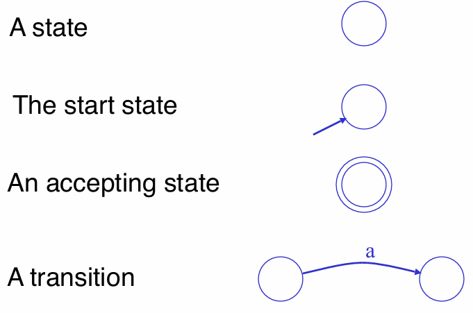

**案例1：**  $\Sigma = \{0,1\}$，只接受 `1` 输入的状态机如下图所示

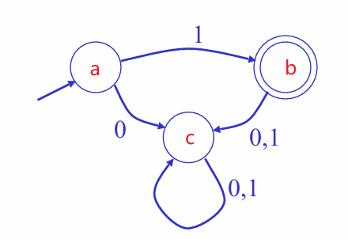

- 字符串 `1` : $s_a \rightarrow^1 s_b$，接受
- 字符串 `10` : $s_a \rightarrow^1 s_b \rightarrow^0 s_c$，拒绝
- 字符串 `011` : $s_a \rightarrow^0 s_c \rightarrow^1 s_c \rightarrow^1 s_c$，拒绝

**案例2：** $\Sigma = \{0,1\}$，只接受任意个连续 `1` 且以 `0` 结尾的字符串


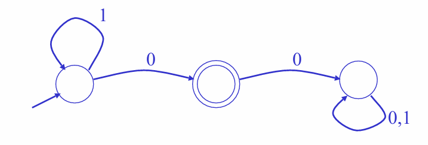

## DFA vs NFA

**确定性有限状态机 `deterministic finite automata`** 
- 不支持 $\varepsilon$ 移动

    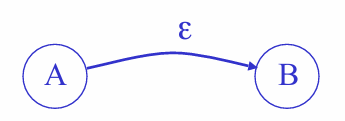

- 每个状态对于每个输入只存在一种转移，**即有向图中，同一输入节点的出度 `== 1`**

**非确定性有限状态机 `nondeterministic finite automata`** 
- 支持 $\varepsilon$ 移动
- 每个状态对于每个输入存在多种转移，**即有向图中，同一输入节点的出度 `≥1`**

> [!note]
> **结论：** 
> - `NFA` 与 `DFA` 均可以与正则表达式集合 $L(R)$ 等价
> - `DFA` 执行速度更快
> - `NFA` 的图结构规模更小

# 状态机实现

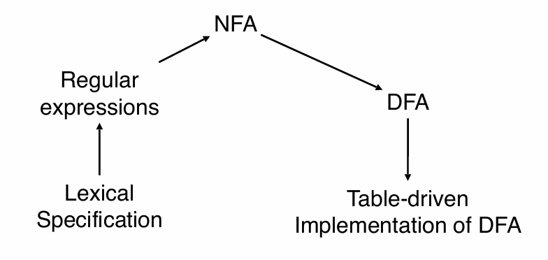

## 正则转NFA


- $\varepsilon$ 

    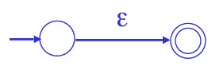

- `'a'`

    

- 正则表达式 $M$ 

    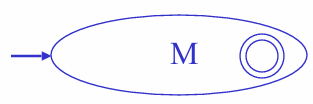

- $AB$

    

- $A + B$

    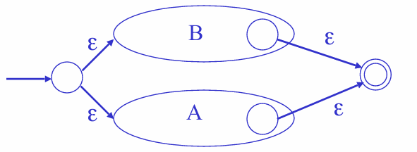

- $A^*$

    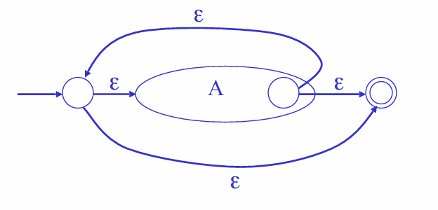


**案例：** $\Sigma = \{0,1\}$，将 $(1 + 0)^* 1$ 正则表达式转换为 NFA


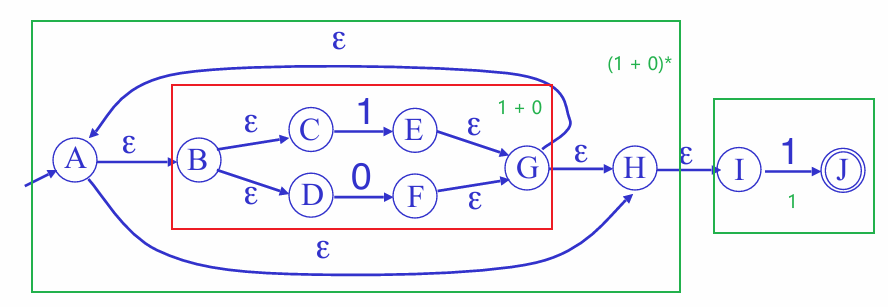

## NFA 转 DFA

NFA 的构成：

- 状态集合: $S$
- 开始状态: $s_0$
- 接受状态集合: $S_f$
- $a(X) = \{y|x\in X \wedge x \rightarrow^a y\}$ : 从状态集合 $X$ 为起点，通过输入 $a$ 能到达的状态集合
- $\varepsilon-close$：从一个节点开始能够连续通过 $\varepsilon$ 移动到达的所有节点

    

    - $B$ 的 $\varepsilon$ 闭包 $\varepsilon-close(B) = \{ C, D\}$
    - $G$ 的 $\varepsilon$ 闭包 $\varepsilon-close(G) = \{ A, B, C, D, H, I\}$

基于 NFA 的结构，实现 DFA
- 状态集合: $\{ X | X \subset S, X \neq \emptyset \}$ 非空子集的集合， 即 DFA 的节点不在是某个单一状态，而是从 $S$ 中抽取出来的状态集合
    - DFA 的状态数量 $\le 2^{|S|} - 1$
- 开始状态：$\varepsilon-close(s_0)$
- 接受状态集合 : $\{X | X \cap S_f \neq \emptyset\}$ 即状态子集中存在 $S_f$ 集合中的接受状态
- $X \rightarrow^a Y$ 等价于 $Y = \varepsilon-close(a(X))$

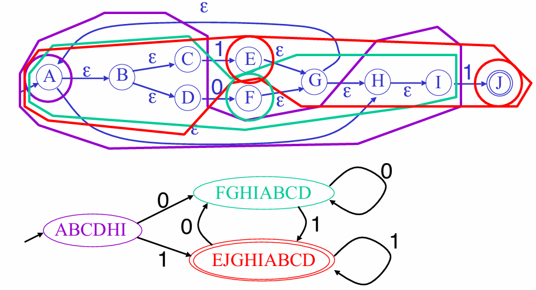

## DFA 实现

通过一个二维表便能实现 DFA
- 维度一为输入 $a$
- 维度二为状态 $x$
- 表格值为 $x$ 接收输入 $a$ 后转移结果 $x \rightarrow^a y$

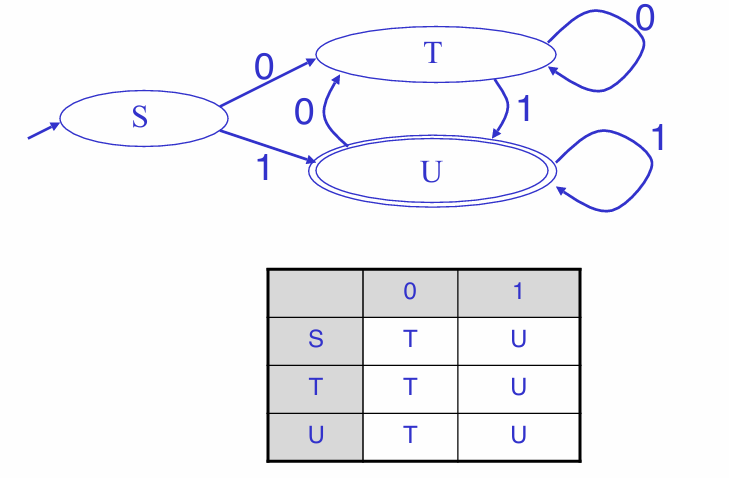

## NFA 实现

NFA 也可以通过一个二维表实现
- 维度一为输入 $a + \varepsilon$
- 维度二为状态 $x$
- 表格值为 $x$ 接收输入 $a$ 后转移结果的集合 $\{ y | x \rightarrow^a y\}$

**常规方案还是直接将 NFA 转换为有向图，市面上已经现成的转换库 `c\c++` 的 `flex`, `python` 的 `ply.lex`**
