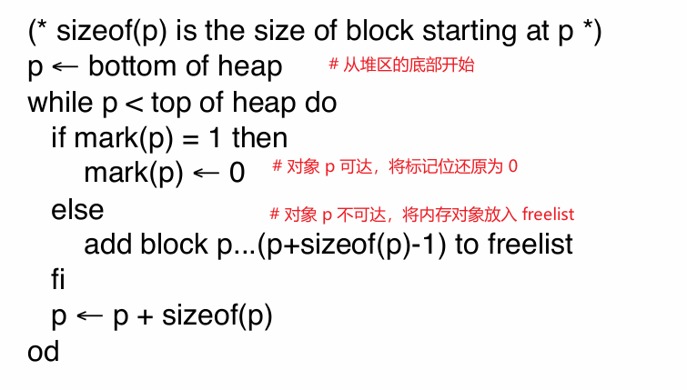

# 内存管理

# 缓存


对于 CPU 而言，内存的读写速度要远比寄存器的速度慢，为了提升性能，又在寄存器与内存之间添加了「缓存`cache`」。内存中的数据会预先读取到缓存中，CPU 会首先查询缓存中是否有目标数据，若有则直接使用缓存，否则再读取内存。缓存的加入虽然能加快了内存访问速度，但缓存无法命中 `hit` 也不能提升计算速度。**事实上，目前编译器只能做一小部分优化工作，要想真正利用好缓存，提供缓存命中率，还是得靠编码。**

```cpp

#include <iostream>
#include <chrono>

void fcn1(){
    auto a = new size_t[10];
    auto b = new size_t[10];
    for (size_t j = 0; j < 10; j++)a[j] = 2,b[j] = 2;

    for (size_t i = 0; i < 10000000; i++)
    {
        for (size_t j = 0; j < 10; j++)
        {
            a[j] *=  b[j];
        }
    }
}

void fcn2(){
    auto a = new size_t[10];
    auto b = new size_t[10];
    for (size_t j = 0; j < 10; j++)a[j] = 2,b[j] = 2;

    for (size_t j = 0; j < 10; j++)
    {
        for (size_t i = 0; i < 10000000; i++)
        {
            a[j] *=  b[j];
        }
    }
}


int main(int argc, char const *argv[])
{
    {
        auto start = std::chrono::high_resolution_clock::now();
        fcn1();
        auto end = std::chrono::high_resolution_clock::now();
        printf("fcn1: %lld ms\n", std::chrono::duration_cast<std::chrono::milliseconds>(end - start).count());
    }

    {
        auto start = std::chrono::high_resolution_clock::now();
        fcn2();
        auto end = std::chrono::high_resolution_clock::now();
        printf("fcn2: %lld ms\n", std::chrono::duration_cast<std::chrono::milliseconds>(end - start).count());
    }

    return 0;
}
```

`fcn1` 与 `fcn2` 的区别是修改了 `i` 与 `j` 嵌套循环的顺序，

```term
triangle@LEARN:~$ ./demo.exe // 关闭了代码优化
fcn1: 127 ms
fcn2: 116 ms
```

可以看到 `fcn2` 的耗时要比 `fcn1` 的少。
- 对于 `fcn1` 而言，先完全遍历 `j` 后，`i` 才完成一次遍历，而每次 `j` 遍历都需要从内存中读取出新的 `a[j]` 与 `b[j]`，这就会出现大量的缓存未命中 `miss` 的情况，需要从内存读取新值。
    ```cpp
    for (size_t i = 0; i < 10000000; i++)
    {
        for (size_t j = 0; j < 10; j++)
        {
            a[j] *=  b[j];
        }
    }
    ```

- 对于 `fcn2` 而言，先完全遍历 `i` 后，`j` 才完成一次遍历，而每次 `i` 遍历处理的值都是 `a[j]` 与 `b[j]` 没有引入新的参数。除第一次 `i` 遍历可能会从内存读取新值外，其余情况都能从缓存中命中 `hit`，减少了访问内存的次数。

    ```cpp
    for (size_t j = 0; j < 10; j++)
    {
        for (size_t i = 0; i < 10000000; i++)
        {
            a[j] *=  b[j];
        }
    } 
    ```

# 内存管理

## 垃圾回收

偏计算机底层的语言，例如 `c/c++`, 堆区内存全部交由程序员手动管理，即配对使用 `malloc()/free()`, `new / delete`。手动管理内存虽然能极大提供编码灵活性，但也增加了编码难度。若处理不好，则会造成内存泄漏，内存溢出，空指针异常等问题。因此，为了降低代码开发难度 `python`、`jave`、`javascript` 等语言引入了「垃圾回收`garbage collection`」机制实现堆内存的自动管理。 

要实现垃圾回收大前提：**内存啥时候才能被回收？** 在现代编译器中，使用内存对象的「可达性`reachable`」来标记堆区中内存对象是否可释放。内存对象是可达的，需要满足以下条件
- 当前有具体指针变量指向内存对象
- 具有可达性对象内部指针属性所指向的内存对象

**不具备可达性的对象则可以被回收。**

```cpp
void fcn(){
    Object* a = new A();
    Object* b = new B();

    if(true){
        a = b;
        /* 触发垃圾回收 */
        a = new C();
    }

    doSomething();
}
```

若在 `6` 行执行完成后，触发垃圾回收，此时堆内存中对象的状态为
- 基于 `A` 生成的内存对象不可达 `unreachable`，没有被任何局部变量所引用
- 基于 `B` 生成的内存对象可达 `reachable`，变量 `a`，`b` 均指向该内存

>[!note]
> 可达性与活跃性是两个不同的概念。可达性描述的是堆内存中存储的对象是否还使用，而活跃性描述的是变量在后续代码中是否还会被引用。

垃圾回收机制由编译器编译源码时额外添加的代码，且在程序实际运行过程中被执行。因此，垃圾回收分析一个内存对象是否可达，也肯定是在程序运行过程中进行分析。**垃圾回收机制会查询堆中的内存对象在寄存器与栈中的指针所引用，来确认内存对象的可达性。**


垃圾回收机制启动时，寄存器与栈帧是查询堆内存对象的根 `root`
- `root` 中的对象指针指向的对象是可达的，例如 `acc` 寄存指向的 `A`，栈帧 `Frame 2` 中指针指向的 `E`
- 可达对象内部指针所指向的对象也是可达的，例如 `A` 指向的 `C`，`C` 指向的 `E`

因此，`{A,C,E}` 是可达的，`{B,D}` 是不可达，即 `{B,D}` 所占有的内存可以被回收。

## 标记-清除算法

### 算法流程

**标记-清除算法 `mark sweep`** : 会为每一个堆中的内存对象额外分配 `1 bit` 的标记位 `mark`，用于存储当前对象是否可达 （`1` 可达，`0` 不可达），且默认值为 `0`

1. 从 `root` 开始，更新所有对象的标记 `mark`

    

2. 遍历堆内存，获取所有的不可达对象

    

3. 释放 `freelist` 中的内存对象，并合并邻接的内存块

**标记-清除算法案例：**


### 注意事项

> [!note]
> 由于垃圾回收机制一般是在内存紧张的情况下才会被执行，因此，就可能没有额外的内存来构建算法中的 `todo` 与 `freelist` 列表。

为解决内存占用问题，可以为每一个内存对象再增加额外的指针，用来实现 `todo` 与 `freelist` 链表连接，这样就不用开辟额外的空间来存储这两个列表。

## 停止-复制算法

**停止-复制算法 `stop copy`** : 将堆区划分为两个大区域
- `old space` : 存储了内存对象的区域
- `new space` : 空闲区域

**基本算法**

1. 当 `old space` 区域存储满后，开始执行垃圾回收机制
2. 在 `old space` 中找到所有可达的对象

    

3. 将所有可达的对象从 `old space` 复制到 `new space` 区域。赋值成功后，`old space` 所有内存释放，变成新的 `new space`，原来的 `new space` 则变为 `old space`

    


> 上述逻辑虽然实现了不可达内存的回收，但是也存在问题
> - **内存拷贝后，`root` 与内存对象的指针属性没有更新到最新的内存地址，这会导致内存异常访问**
> - 避免使用额外的内存来实现算法


重新优化算法得到真正的 `stop copy` 算法

1. 再将 `new space` 内存区域划分为三个区域
    - `copied and scanned` : 从 `old space` 拷贝内存对象成功，且指向这些对象的指针地址也更新完成
    - `copied` : 仅从 `old space` 拷贝内存对象成功，还未更新指针地址
    - `empty` : 空闲区域

    

2. `old space` 空间用完，启动垃圾回收

    

3. 从 `root` 中找到可达对象复制到 `copied` 区域，并更新 `root` 中的指针地址。**然后在原 `A` 对象内存中创建一个「转发指针 `forwarding pointer`」，通过转发地址，可以在 `old space` 中查询拷贝成功的对象在 `new space` 中的地址，用于更新指针。**

    

4. 复制 `A` 对象指针属性指向的 `C` 内存对象，并更新 `A` 内部的指针地址，在原 `C` 对象内部创建转发指针

    


5. 复制 `C` 对象指向的 `F`，并更新 `C` 的指针地址，在原 `F` 对象内部创建转发指针

    

6. 从 `F` 中查询到 `old space` 中的 `A`，发现 `A` 已经存在拷贝成功，且创建好了转发指针，根据转发指针更新 `F` 的属性地址

    

7. `old space` 所有内存释放，变成新的 `new space`，原来的 `new space` 则变为 `old space`

    


> [!note]
> **停止-复制算法是公认最快的垃圾回收机制**。但方式无法在 `c/c++` 这类语言中使用，因为 `c/c++` 中将内存地址的完全暴露给了程序员。若程序依赖直接对内存地址进行操作实现，当内存对象在后台被移动后，内存结构改变，程序可能会出现异常。

## 引用计数法

**引用计数法`reference counting`** : 内存管理思路是为每个内存对象创建一个引用计数器，当计数器变为 `0` 时，则可以释放对象内存。该方案主要被引用在 [c++ 智能指针](effective/chapter/SmartPointer.md) 中。
