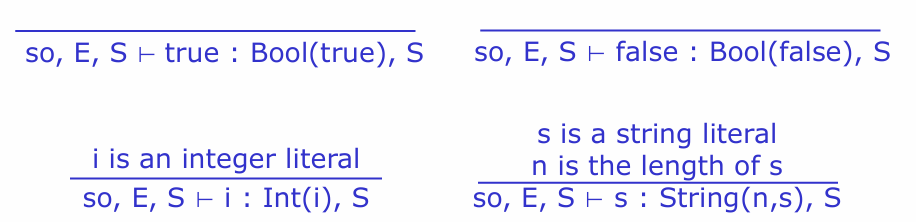
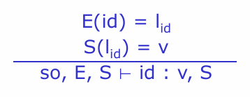
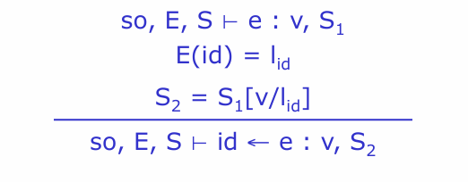
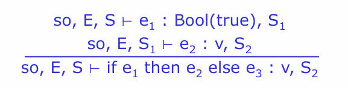
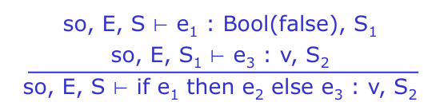
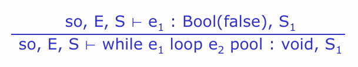
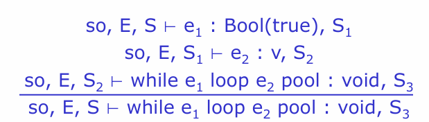
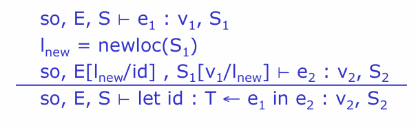
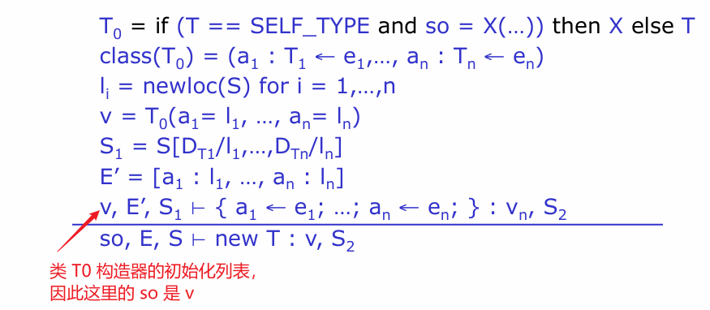
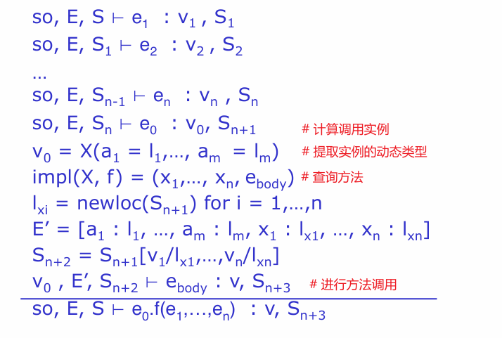

# 操作语义

# 引言

在上一章介绍了如何使用栈式机器模型将 AST 描述的表达式转直接换成汇编代码。该方法太过直接，用来描述代码生成存在过多的汇编实现细节

- 内存模型应该是啥样的，也不一定非得通过栈式机器模型实现
- 栈的增长方向
- 实际的汇编指令应该如何调用
- ...

考虑这么多的汇编细节会导致代码生成及其复杂，而且也容易出错。正如可通过状态机来描述词法分析，上下文无关文法描述语法，推理规则实现类型检测一样，也可利用特定的语义 `semantics` 来定义代码生成
- 操作语义 `operational semantics` : 通过一系列执行规则来描述程序运行
- 指称语义 `denotational semantics` : 程序代码被映射到一堆数学公式上
- 公理语义 `axiomatic semantics` : 通过逻辑公式来描述代码执行

# 概念

- 环境 `environment` : 在操作语义中，环境描述的是可以通过变量名查询变量值地址的一张表

    $$
        E = [a: l_1, b : l_2] 
    $$

    - $a, b$ ： 代码中的变量名字符
    - $l_1, l_2$ : 变量名对应值的内存地址

- 存储 `store` : 在操作语义中，存储描述的是可以通过地址查询变量值的一张表

    $$
        S = [l_1 \rightarrow 5, l_2 \rightarrow 7] 
    $$

- 存储更新 $S' = S[12/l_1]$ : 表示将 $S$ 中的 $l_1$ 对应的值更新为 `12`，然后得到了一个新的存储

- 上下文 `context` : 环境、存储、`self` 三者共同组成上下文

# 语义形式

有了上述概念，就可以定义操作语义运算规则，其形式类似类型检测使用的推理规则

$$
    so, E, S \vdash e : v, S'
$$

- `self` 符号 $so$
- 环境 $E$
- 存储 $S$
- 表达式 $e$
- 表达式 $e$ 执行退出后的结果 $v$
- 表达式 $e$ 执行后，得到新的存储 $S'$

# Cool 语义

## 基础语法

- 基本类型

- 变量

- 变量赋值

- 条件判断: 区分条件正确和失败两种情况

- `while` 循环

## 变量定义

在 `let id : T <- e1` 表达式中存在新增变量 `id` 的逻辑，需要向 $E$ 中新增地址，向 $S$ 中新增变量值。使用符号 `l = newloc(S)` 表示在 $S$ 中新增一个变量，且地址为 $l$。

## 面向对象

### 创建对象

创建对象 `new T` 的整体流程为 
1. 为 `class T` 分配内存
2. 使用默认值初始化所有属性
3. 通过 `T` 的构造器，计算属性的初始化表达式
4. 返回 `T` 的实例

- `SELF_TYPE` 是 cool 语法中的一个关键字，详情见之前的章节
- `class(A) = (a1 : T1 <- e1, ..., an : Tn <- en)` 是一个类定义
  - `a1, ..., an` 包含了所有父类中的属性，且最老的父类属性排在最左边
  - `T1 <- e1, ..., Tn <- en` 是类 `A` 构造器中的属性初始化表达式
- `D` 表示属性类型的初始值，例如字符串 `String` 的初始值为 `""`

### 方法调用

类实例调用方法 `e0.f(e1, ..., en)` 的流程为
1. 依次计算参数表达式 `e1, ..., en`
2. 计算 `e0` 表达式获取类实例
3. 确定类实例的动态类型 `X` （子类可以重写父类的方法，因此需要把实例的动态类型搞清楚）
4. 根据形参找到 `X` 的方法 `f()` （方法重载）
5. 为 `f()` 的形参创建 `n` 个地址 `lx`，以及一个新的「环境」映射表
6. 将 `e1, ..., en` 表达式计算结存储到 `lx` 指向的内存
7. 将实例设置到 `self` 并且计算函数 `e0.f()`

- `impl(A,f) = (x1, ... , xn, e_body)` 表示查询动态类型 `A` 的方法 `f`
  - `x1, ... , xn` 方法形参
  - `e_body` 方法的运算表达式
- `E'` 中可能存在属性名与形参名重名的情况，因此不能将两列参数合并
