# 代码优化


# 概念

## 中间语言

**中间语言`intermediate code`** : 介于源码于编译目标直接的临时文件，例如 `.i`、`.o`、`.obj`等编译过程中的临时文件
- 比源码的细节多：高级源码不涉及寄存器信息，这是中间语言就可以展开寄存器，便于代码优化
- 比目标的细节少：中间文件不完全是汇编指令，这样便于跨平台移植

编译器在编译过程中可能有很多类型的中间代码，但是后文只讨论一类 「高阶汇编语言`high level assembly`」
- 可操作无限多个寄存器
- 编写规则类似汇编
- 所使用的命令是汇编命令的二次封装，更易用一些

高阶汇编的命令形式如下
- `x = y op z`
- `x = op y`

高级语言的复杂表达式通过引入临时变量可以分解为上述形式，例如 `x + y * z` 可以分解为两次高阶汇编指令的运算
- `t1 = y * z`
- `t2 = x + t1`

将源码转换为高阶汇编与生成汇编的方式类似，使用 `igen(e,t)` 函数描述
- `e` : 待转换的表达式
- `t` : 用于表达式运算的寄存器

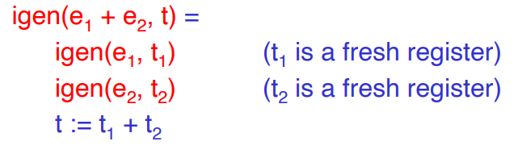


中间语言的文法表达

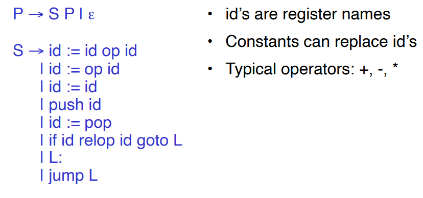

> [!note]
> 执行代码优化是在代码生成环节之前，代码优化一般发生在「中间语言」环节
> - 抽象语法树`AST` : 层级太高，无法涉及代码生成细节
> - 汇编代码 ：代码优化操作空间最大，但是汇编指令与机器平台强相关，无法统一优化
> - 中间语言（高阶汇编语言）： 能牵扯到代码生成细节，且与机器平台无关，特别适合进行代码优化

## 术语

**基本块`basic block`** : 高阶汇编的最长指令序列。CPU 运行基本块无需跳转到其他位置，必须从第一条指令开始，一直运行到最后一条指令退出
  - 序列中没有 `label` 定义，除了第一条指令
  - 序列中没有 `jump` 定义， 除了最后一条指令

> [!note]
> 基本块可视为一个内部无函数调用的函数，给输入就能得到输出，因此，编译器只要保证给定输入能得到基本块对应的正确输出就行，内部实现逻辑就可以随便改。

**控制流图 `control flow graph`** : 基本块执行的图表示形式
- 节点： 基本块
- 边方向：基本块的执行流程，例如 `A -> B` 表示执行完基本块 `A` 后，会紧接着执行基本块 `B`

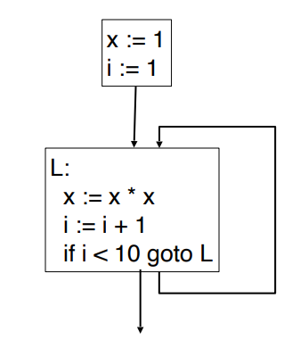

## 优化目标

代码优化通常会对某一项或多项指标进行优化
- 执行时间
- 代码大小
- 网络数据包大小
- 内存占用
- ...

代码优化的方式有
- 局部优化 `local optimization` : 优化单个基本块内部的代码
- 全局优化 `global optimization` : 对构成函数体的控制流图进行优化，**针对的是一个函数**
- 过程间优化 `inter-procedural optimization` : 对一个函数集合进行优化

> [!note]
> 代码优化最重要的前提条件：**对于同一初始条件，保证优化后的目标执行结果与源码描述的结果一致**

# 局部优化


## 代数运算简化

- 删除多余操作：下面几行代码删掉对计算无任何影响

```cool
x := x + 0
x := x * 1
```

- 运算简化

```cool
x := x * 0      ->      x := 0
y := y**2       ->      y := y * y
x := x * 8      ->      x := x << 3
```

## 常量折叠


**常量折叠 `constant fold`** : 对于输入均是常量的表达式，可以直接在编译阶段得到结果

```cool
# 编译时直接计算加法
x := 3 + 4      ->      x := 7

# 该指令被直接删除，因为 2 < 0 永远不可能成立
if 2 < 0 jump L
```

> [!note]
> 常量折叠在交叉编译中可能会出现问题，例如浮点运算在不同架构的 CPU 上处理方案不一致，会导致同一表达式的运算结果在编译器常量折叠与真实机器运算上不一致


## 删除冗余

开发时可能会搞出一些冗余代码，且这些代码永远不会执行，因此，将这些冗余代码在编译时进行删除，不仅能减少目标文件大小，还能提高代码的紧凑度


## 单一赋值

```cool
x := z + y      ->      b := z + y
a := x          ->      a := b
x := 2 * x      ->      x := 2 * b
```

**单一赋值 `static single assignment`** :  使用寄存器 `b` 将代码改写成对每一个变量均只赋值一次，可以简化代码优化。

- 子表达式消除 `common subexpression elimination` : 当两个赋值语句一样时，可以删除多余的运算

    ```cool
    x := y + z      ->      x := y + z
    w := y + z      ->      w := x 
    ```

- 复制传播 `copy propagation` : 当出现 `w := x` 时，后续均使用 `x` 代替 `w`

    ```cool
    x := y + z      ->      x := y + z
    w := z          ->      w := z
    a := y + w      ->      a := y + z  # 这条指令又与 x := y + z 一致，因此还能优化
                    ->      a := x
    ```
- 未引用变量 `dead code` :  在基本块中出现 `w := rhs` ，但是 `w` 未被使用，此时 `w` 被称之为 `dead code` ，可以直接删除

    ```cool
    x := y + z      ->      x := y + z      ->      x := y + z
    w := y + z      ->      w := x 
    x := x * y      ->      a := x * y      ->      a := x * y
    ```


## 窥孔优化

上述的「局部优化」是对生成的中间语言进行优化，而窥孔优化 `Peephole Optimization` 则跳过中间代码，直接对汇编代码进行优化：**用另外一段等价且速度更快的汇编序列，替换掉窥视到的一小段的汇编指令序列。**

$$
    i_1,\dotsm,i_n \rightarrow j_1,\dotsm,j_m
$$

将原指令序列 $i$ 修改为速度更快的指令序列 $j$，例如

```masm
    move $a $b, move $b $a -> move $a $b
```


# 全局优化


## 常量传播

### 概述

```python
def fcn():
    x = 3
    if condition() :
        y = z + w
    else:
        y = 0
    a = 2 * x
```
观察上述函数，可知 `x = 3` 是一个常量，因此可对 `a = 2 * x` 进行优化

```python
a = 2 * x -> a = 2 * 3 -> a = 6
```

但由于上述代码涉及 `if-else` 判断语句，不能简单地通过局部优化对常量 `x = 3` 进行处理，而需要首先对函数建立一张「控制流图」，然后进行全局优化分析，该方式被称之为「常量传播 `Global Constant propagation`」

### 算法

定义变量 `x` 存在三种类型的值
- $\bot$ :  底，表示常量只定义，但未被使用
- $C$ : 常量，表示任一常量值
- $\top$ : 顶，表示任意值，非常量

定义三种值类型存在顺序关系 

$$
    \bot < c < \top
$$

- 在该关系中 $c$ 代表的常量值均是平级，例如 `x = 'fuck'` 与  `y = 1` 是同一层级关系
- $lub()$ ：取最小上界运算。例如 $lub(\bot) = c$，$lub(1, 'fuck you') = \top$


三种值转换的表达式为
- $C(s,x,in) = v$ : 在进入状态 $s$ 前，变量 $x$ 的值为 $v$
- $C(s,x,out) = v$ : 在退出状态 $s$ 后，变量 $x$ 的值为 $v$
- 状态 $s$ : 一般指的是源码中的一条语句，例如 `a = fcn()`，`a = b + c`
- $p_i$ : 表示当前状态前项 predecessor 状态
- $s_i$ : 表示当前状态后继 successor 状态

此外还定义了 8 条规则用于实现三种值类型的转换

1. 若 $\exists i$, 使得 $c(p_i, x, out) = \top$，那么 $c(s,x,in) = \top$

    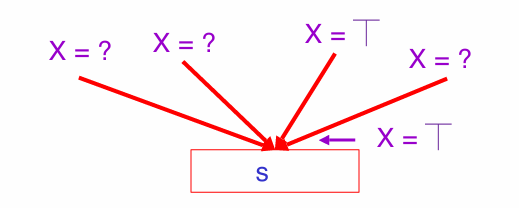

2. 若 $c(p_i, x, out) = c$ 且 $c(p_j, x, out) = d$ , $c \neq d$，则 $c(s,x,in) = \top$

    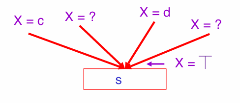

3. 若 $\forall i$, $c(p_i,x,out) = c \text{ or } \bot$ ，则 $c(s,x,in) = c$

    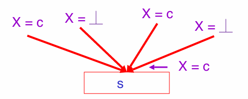

4. 若 $\forall i$, $c(p_i,x,out) = \bot$ 则 $c(s,x,in) = \bot$

    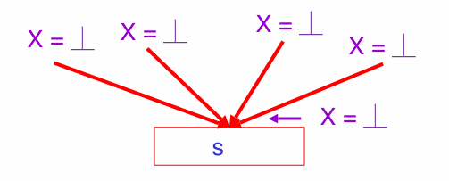

5. 若 $c(s,x,in) = \bot$ 则 $c(s,x,out) = \bot$

    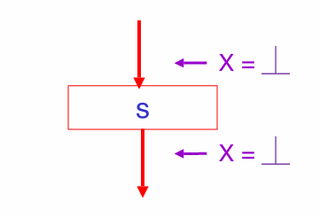

6. 若当前状态为常量赋值语句，则 $c(x := c, x, out) = c$

    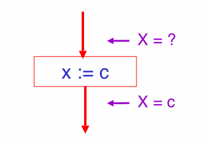

7. 若当前状态为表达式赋值语句，则 $c(x := e, x, out) = \top$

    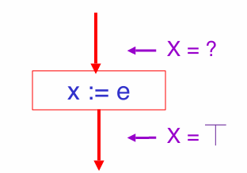

8. 若 $x \ne y$, 则 $c(y := \dotsm, x, out) = c(y := \dotsm, x, in)$

    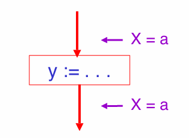


**算法处理流程**
1. 首先设置控制流图入口为 $c(s,x,in) = T$
2. 初始化所有的状态为 $c(s,x,in) = c(s,x,out) = \bot$

    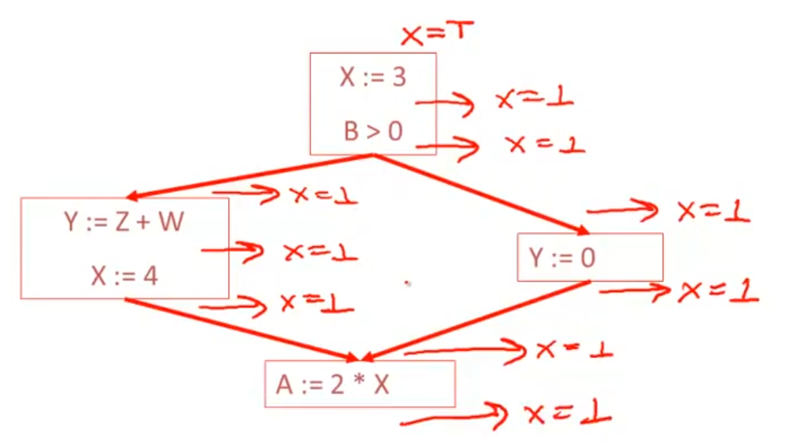

4. **前项状态开始运用规则更新变量状态**

    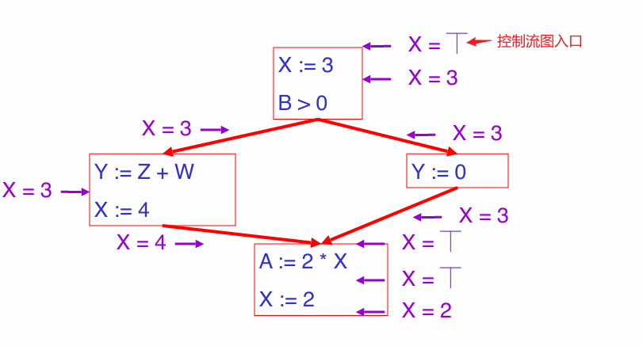


### 循环分析


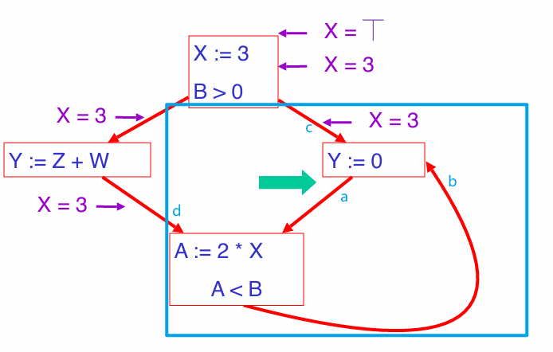

若使用上述算法对 `loop` 语句进行常量分析，蓝色框内会出死循环无法确定变量 $x$ 的值，例如需要得到在 `a` 除变量 $x$，则需要知道 `c` 与 `b` 处 $x$ 的值，而 `b` 处 $x$ 的值又由 `d` 与 `a` 处的 $x$ 值所确定，陷入了死循环。 **但实际算法的执行并不会出现这样的问题，因为算法会提前给所有位置的 $x$ 设置了一个初始值 $\bot$**。

<video src="./image/compiler/constloop.mp4"  controls="controls" width="100%" height="100%"></video>

> [!tip]
> **对于循环流程图处理，算法只需重复更新有限次，便能得到最终结果，并不会陷入死循环。**

**证明：** 由于变量值存在 $\bot < c < \top$ 层级关系，且根据变量的推导规则，变量值更新只会变大，不会变小，因此，最坏的情况就是所有状态下变量值被更新会 $\top$，然后更新便可停止。


## 活跃性

### 概述

```python
def fcn():
    x = 3
    if condition() > 0:
        y = z + w
    else:
        y = 0
    a = 2 * x
```

前文章节已经学会了如何使用常量传播算法对函数中的 `x` 常量进行优化。观察上述函数，变量 `y` 同样存在可优化的点，`y` 变量只被赋值，并未被使用过，因此可以直接删除掉。但是同样由于存在 `if-else` 结构，并不能利用局部优化方法。同常量传递分析，也可对函数建立一张「控制流图」，然后对变量 `y` 进行全局优化分析，该方式被称之为「活跃性分析 `liveness analysis`」

### 算法

对于变量的活跃性可以定义为两个状态
- `live` : 变量被赋值后，在之后的代码中会被使用
- `dead` : 变量被赋值后，后续代码中不会被使用

可以使用 `bool` 值表示两个状态

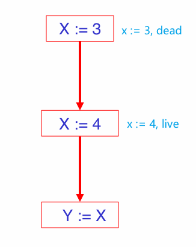

> [!note]
> $x$ 变量在 $s$ 状态是 `live` 的条件是
> 1. 在 $s$ 状态之后，存在 $s'$ 状态使用了变量 $x$
> 2. 状态 $s$ 可以抵达状态 $s'$
> 3. 在 $s -> s'$ 之间，不存在 $x$ 被再赋值的情况

对于活跃性也存在状态转换规则

1.  $L(p,x,out) = L(s_1, x, in) \  or \ \dotsm \ or \ L(s_i, x, in)$

    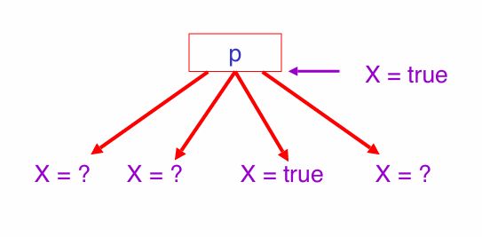

2. 若在状态 $s$ 使用了变量 $x$，则 $L(s,x,in) = true$

    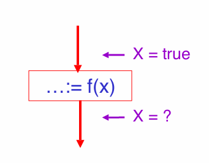

3. 若 $x$ 再次赋值未使用旧的 $x$，则 $L(x := e, x, in) = false$

    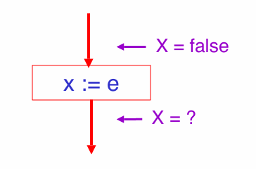

4. 若 $s$ 未使用变量 $x$，则 $L(s,x,in) = L(s,x,out)$

    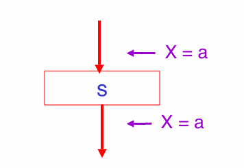

**算法处理流程**
1. 设置所有状态的初始值 $L(...) = false$
2. **从后继状态开始更新变量在所有状态下的活跃性**

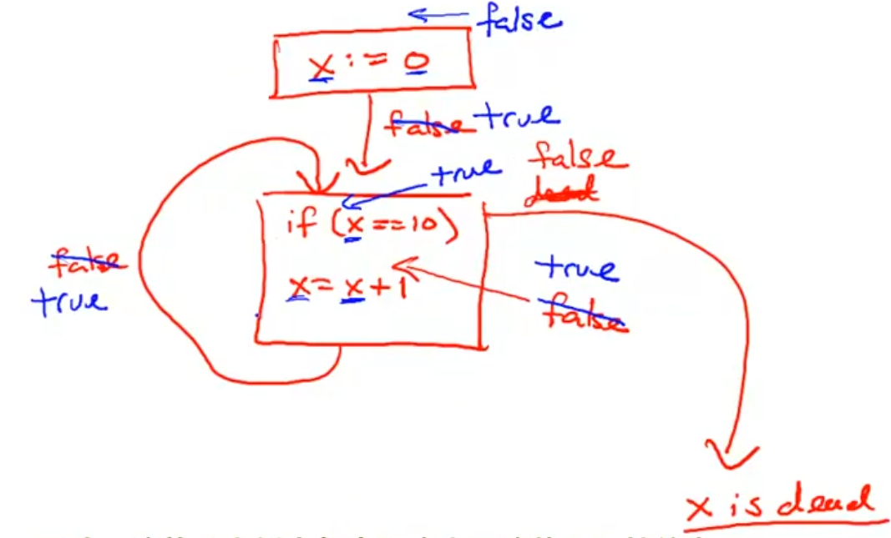


>[!note]
> - 常量传播从前项往后推理变量值，属于前向分析 `forwards analysis`
> - 活跃性分析从后继往前推理活跃性，属于反向分析 `backwards analysis`


## 寄存器分配

### 概述


在之前的中间语言中，假设寄存器有无限多个，但实际 CPU 中往往可能只有十几个寄存器，因此需要对寄存器分配进行优化。优化的核心思路：**将中间语言中的寄存器，尽可能多的映射到一个物理寄存器上，且不会改变程序的行为。**


```code
a := c + d
e := a + b
f := e - 1
```

针对上述中间语言代码可以优化为

```code
r1 := r2 + r3
r1 := r1 + r4
r1 := r1 - 1
```

`a,e,f` 临时变量都复用了同一个物理寄存器。


### 寄存器干扰图

现代编译优化方案中，临时变量 $t1$ 与 $t2$ 能共享同一物理寄存器的大前提：**在代码的任意位置下，只有 $t1$ 与 $t2$ 只有一个变量的活跃性是 `live`**

1. 分析所有临时变量在每一个状态下的活跃性

    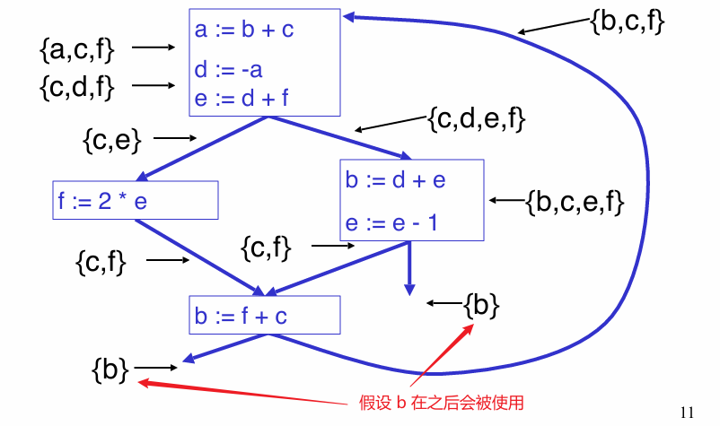

2. 根据活跃性变量的活跃性集合构建一张无向图，即寄存器干扰图 `register interference graph (RIG)`
    - 结点：每一个变量
    - 边：连接的两个变量会在某一状态下的活跃性集合中同时出现

    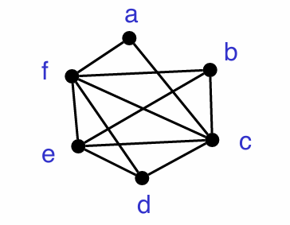

寄存器干扰图存在以下优点
- 可以查询哪些临时变量不能共用同一个寄存器
- 临时变量之间的关系是「全局」的，可以大胆用
- 根据寄存器干扰图构建的寄存器分配算法不依赖硬件平台


### 图着色法

**图着色 `Graph Coloring`** : 常用的寄存器分配算法，其工作原理就是给寄存器干扰图每个结点上颜色，每一个颜色就代表一个寄存器。根据寄存器干扰图定义，同一条边连接的两个变量不能放在同一寄存器中，**即同一边连接的两个结点颜色应当不同，没有直接相连的两个结点颜色可以一样**。
- `k-colorable` ： 使用 `k` 个颜色就能实现给寄存器干扰图的每个结点填上颜色，即使用 `k` 个寄存器就能实现完成运算。

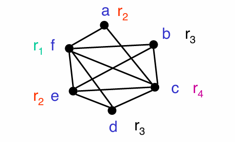


> [!tip]
> **定理：** 从 RIG 中选择一个邻接边数 $< k$ 的结点 `t`，并删除结点 `t` 及其邻接边。若删除 `t` 后的 RIG 图满足 `k-colorable` ，那么原 RIG 图也满足 `k-colorable`

根据定理可知，RIG 图的上色问题便能通过「分治法」的思路进行解决
- Divide： 将 RIG 图拆分成一个结点 `t` + 一张 RIG 子图，且 `t` 结点的邻接边数 $ < k$
- Conquer : 递归处理 RIG 子图
- Combine : 根据 RIG 子图的上色结果， 给结点 `t` 上与邻接结点不同的颜色


<video src="./image/compiler/RIG_color.mp4"  controls="controls" width="100%" height="100%"></video>

得到上好色的 RIG 图后，就知道要为临时变量分配哪个寄存器


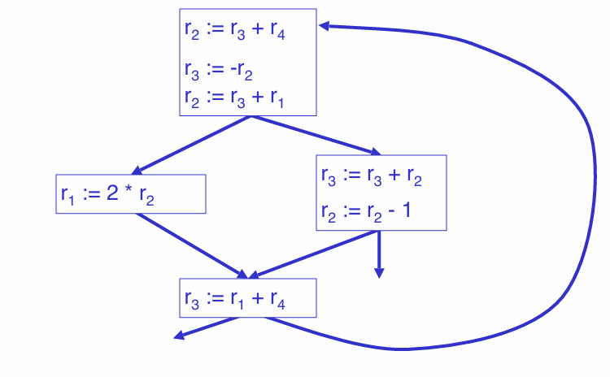

### 溢出

**溢出 `spilling`** : 当 RIG 图完成 `k-colorable` 上色后，至少需要 `k` 个寄存器，但实际 CPU 又并没有 `k` 个寄存器，为了解决该问题就需要「溢出操作」，**即将超出寄存器数量的临时变量存放到内存中**。

根据定理可知，RIG 图的上色问题便能通过「分治法」的思路进行解决
- Divide： 将 RIG 图拆分成一个结点 `t` + 一张 RIG 子图，且优先选择 `t` 结点的邻接边数 $ < k$
- Conquer : 递归处理 RIG 子图
- Combine : 判断 `t` 结点的邻接边数 $ < k$
    - true: 根据 RIG 子图的上色结果，给结点 `t` 上与邻接结点不同的颜色
    - false : 标记 `t` 表示的变量需要放到内存中

假设上述案例代码只能使用 `3` 个寄存器，那么 RIG 图将无法完成上色，选择变量 `f` 放入内存中

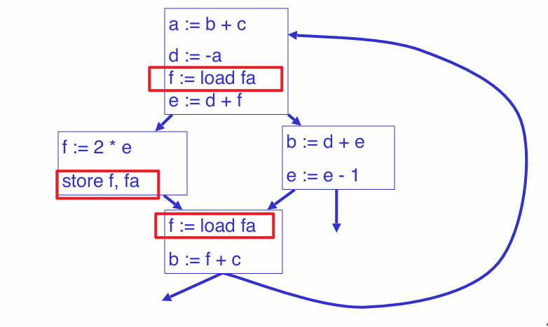
