# 语法解析

# 介绍

有限状态机无法解析嵌套规则、括号匹配、目标定位，因此需要解析器 `parsing` 进行语法解析
- 输入：通过词法解析获取的 token 序列
- 输出：解析树


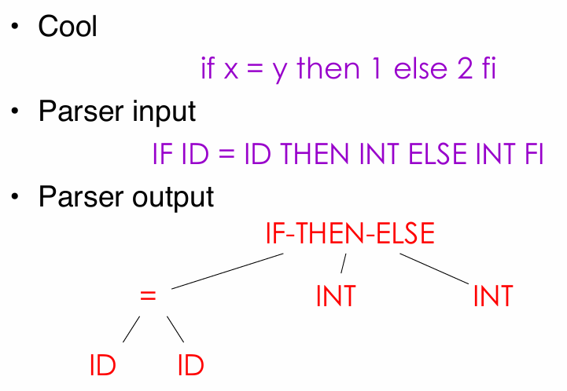


> [!tip]
> 词法分析得到的是全部 token 序列，因此，需要解析器区分出哪些 token 有效，哪些 token 无效。

# 上下文无关语法

上下文无关语法 `Context-Free Grammars` : 对递归结构的自然描述。其构成为
- 终结符集合 `terminals` : $T$
- 非终结符集合 `non-terminals` : $N$
- 开始符号 ： $S, S \in N$
- 生产式集合 `production` : $X \rightarrow Y_1 Y_2\dotsm Y_n \quad x \in N, y_i \in N \cup T \cup \{\varepsilon\}$
    1. 生产式只能从 $S$ 开始
    2. 右边的符号 $Y_1 Y_2\dotsm Y_n$ 可以替换左边的符号 $X$
    3. 重复步骤2，最终得到的字符串结果将不存在非终结符，即 $S \overset{*}{\rightarrow} a_1\dotsm a_n, \ a_i \in T$

定义 $G$ 代表开始符号是 $S$ 的上下文无关语法，那么 $L(G)$ 

$$
    L(G) = \{ a_1 a_2 \dotsm a_n | a_i \in T, S \overset{*}{\rightarrow} a_1 a_2 \dotsm a_n \}
$$


**案例**：为起始符号 `EXPR` 定义了三种生产式，`|` 表示或，终结符都使用了小写

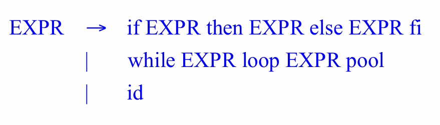

根据上述定义，以下语法结构都将合法

```cool
-- EXPR -> id
id

-- EXPR -> while EXPR loop EXPR pool
while id loop id pool

-- if 与 while 嵌套
if id then
    while id loop id pool
else
    if id then id else id if
if
```

> [!note]
> - 完全展开生产式得到的最终字符串都由终结符组成，字符串将不在改变，**因此终结符应当就是语言的 `token`**
> - CFG 只定义了正确的语法，但并未实现解析树的生成


# 解析树

## 定义

**推导 `Derivation`** : 描述一系列生产式递归展开的过程

$$
    S \rightarrow \dotsm \rightarrow \dotsm \rightarrow \dotsm
$$

推导流程可以绘制成一棵树，该树则被称之为「解析树 `Parse Tree`」
- 根结点 $S$ 
- 叶结点均是终止符
- 非终止符只存在于内部节点
- 生产式 $X \rightarrow Y_1\dotsm Y_n$ ，$Y_1 \dotsm Y_n$都是 $X$ 结点的子结点
- 叶子节点按照中序遍历得到的字符串就是原输入字符串
- 树的层级关系代表了表达式的优先级

**案例**： $E \rightarrow E + E | E * E | (E) | id$，字符串 `id * id + id` 的解析树结构


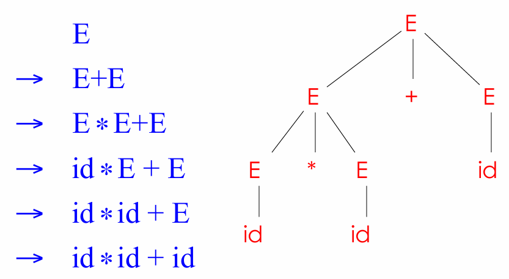


一般使用的两种推导方式
- 左推导 `left-most derivation` :  生产式每一步展开，都先替换最左边的非终止符号

    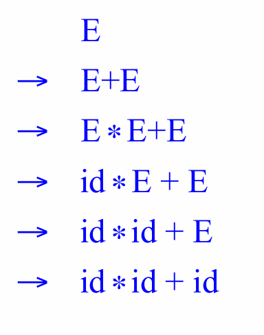

- 右推导 `right-most derivation` :  生产式每一步展开，都先替换最右边的非终止符号

    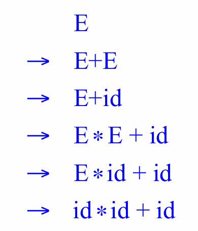

## 歧义

**歧义 `Ambiguity`** : 对于同一个字符串，根据同一个语法会获取到的不同的解析树。

- **重写语法消除歧义**。

**案例一：** 字符串 `id * id + id` 根据 $E \rightarrow E + E | E * E | (E) | id$ 描述就存在歧义

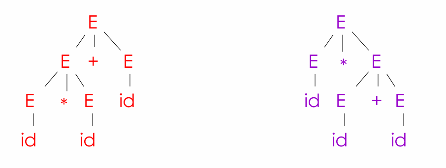

拆分语法规则 $E$ 处理运算层级低的加法，$E'$ 则处理优先级高的乘法与括号

$$
    \begin{aligned}
        E &\rightarrow E' + E | E' \\
        E' &\rightarrow id * E' | id | (E) * E' | (E)
    \end{aligned}
$$


**案例二**: $E \rightarrow \text{if E then E | if E then E else E | OTHER}$ 解析条件判断，对于字符串

```cool
if E1 then if E2 then E3 else E4
```
将存在歧义

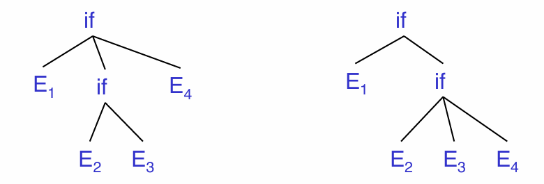

解决方式也是重写语法规则，使得 `else` 只与最近的 `then` 匹配


$$
    \begin{aligned}
        E \rightarrow&  \text{ MIF    all then are matched } \\
                    |&  \text{ UIF    some then is unmatched}  \\
        \\
        MIF \rightarrow& \text{ if E then MIF else MIF} \\
                      |& \text{ OTHER} \\
        \\
        UIF \rightarrow& \text{ if E then E} \\
                      |& \text{ if E then MIF else UIF} \\
    \end{aligned}
$$

- **通过歧义消除机制防止歧义**

重写语法规则难度很大，而且重写后的规则也晦涩难懂 （例如上述条件判断），为了使得定义语法规则更加方便，**语法解析工具提供了歧义消除机制，可以定义额外的规则**。 

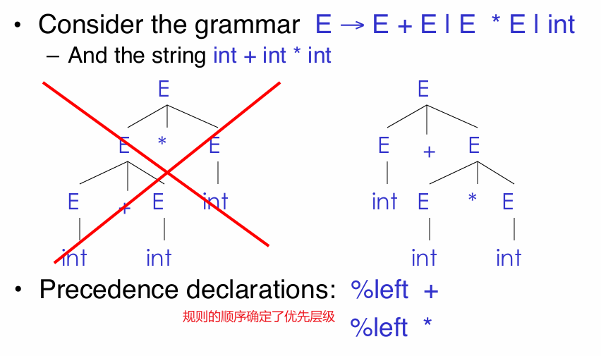

`%left` 限定了运算符 `+ *` 只能左推导，且通过顺序确定 `*` 的运算优先级比 `+` 的优先级高

## 异常处理

编译器的目的
1. 检测出无效的代码
2. 将代码翻译成目标结果

在检测阶段就需要编译器具有向程序报告代码错误的能力，例如无效符号、语法错误、语义错误等。现有的异常处理机制有
- `panic mode` 

当错误被检测到时，解析器丢弃当前的 token，直到找到正确的 token 为止，并继续解析。例如 `( 1 + + 2) + 3` ，当检测到第二个 `+` 时，解析器发现异常，然后丢弃 `+`，并继续解析 `2`。在 `Bison` 提供了终止符号 `error` 来实现跳过异常 token 

$$
    E \rightarrow \text{ int | E + E | (E) | error int | (error)}
$$


- `error production` ： 使用生产式将常见的错误语法标记出来，例如编译器产生的 `warning`

- `automatic local or global correction` : 希望编译器能自动纠错


## 抽象语法树


解析树内容臃肿并不适合进行编程，因此，对其进行改进又提出了抽象语法树 `Abstract Syntax Tree`，只保留关键的数据信息与层级结构

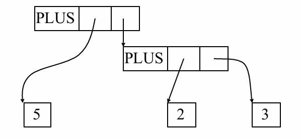


# 自上而下解析算法

> [!tip]
> 解析算法：基于 CFG 定义的规则解析输入的 token 流，其推导流程便是在生成一可棵解析树，
> - token 流的解析树生成成功，满足语法规则
> - token 流的解析树生成失败，语法错误

## 递归下降

### 思想

递归下降 `Recursive Descent` : 自顶向下 `top-down` 的语法解析算法，运行规则
- 从顶部开始
- 从左到右
- 叶子结点的中序遍历结果，就是输入的 token 流


<video src="./image/compiler/recursiveDescent.mp4"  controls="controls" width="100%" height="100%"></video>

简单算法实现检测字符串 `( 5 )`

1. 定义 token 的类型
2. 全局变量 `TOKEN * next;` 
3. 定义函数
   1. 检测 token 类型的函数 `bool term(TOKEN tok){ return *next++ == tok; }`
   2. 匹配符号 $S$ 对应的第 $n$ 条规则 `bool Sn();`
   3. 匹配 $S$ 对应的所有规则 `bool S();`


伪代码实现

```cpp
enum TOKEN_TYPE_E{
    INT,
    OPEN,   // (
    CLOSE,  // )
    PLUS,   // +
    TIMES   // *
};

struct TOKEN_S{
    TOKEN_TYPE_E type;
    std::string str;
};

class RecursiveDescent{
public:

    // 解析以 start 为起始，并以 end 结束的 token 流程，其范围为 [start, end)
    bool parse(TOKEN_S * start, TOKEN_S * end){
        m_next = start;

        // 1. 根据 CFG 定义，解析就是从非终结符号 E 开始的
        // 2. 输入 token 流 [start, end) 要与语法完全匹配才接受，部分匹配都是错的
        return E() && m_next == end;
    }

private:
    /* 
        E -> T
           | T + E
     */
    bool E1() { return T();}
    bool E2() { 
        // 使用 term(PLUS) 表示 +
        return T() && term(PLUS) &&  E();
    }
    bool E(){
        // 使用 save 实现了回溯
        auto save = m_next;
        return (m_next = save, E1())
            || (m_next = save, E2());
    }

    /* 
        T -> int
           | int * T
           | ( E )
     */
    bool T1() { return term(INT); }
    bool T2() { return term(INT) && term(PLUS) && T(); }
    bool T3() { return term(OPEN) && E() && term(CLOSE); }
    bool T(){
        auto save = m_next;
        return (m_next = save, T1())
            || (m_next = save, T2())
            || (m_next = save, T3());
    }

    // 输入 type 与当前的 token 类型是否匹配
    bool term(TOKEN_TYPE_E type){
        auto curr = m_next; 
        ++m_next; // 移动
        return curr->type == type;
    }

private:
    TOKEN_S * m_next; // 表示 token 流中，下一个将输入的 token
};
```

上述代码根据递归下降法实现了一个简单的解析器。但是该解析器只能正确匹配出 `int`，`( int )` 等类型的字符串。**当匹配 `int * int`时，`E() -> E1() -> T() -> T1()` 匹配到 `int` 后便直接返回，并未尝试解析 `T2()`，因此最后结论是失败**。

> [!tip]
> - 市面上存在真正通用的梯度下降算法，但是具有复杂的回溯机制，用以解决上述问题，后续的 `LL(1)` 也能解决该问题
> - 递归下降法通过函数递归实现了解析树生成


### 左递归问题

左递归问题 `Left Recursion` : 「递归下降算法」针对 $S \rightarrow S \alpha | \beta$ 的生产式会陷入死循环。

```cpp
bool S1() {return S() && term(a);}
bool S2() {return term(b);}
bool S(){
    auto save = next;
    return (next = save, S1()) 
        || (next = save, S2());
}
```
从 $S$ 进入，就会产生 `S() -> S1() -> S() -> S1() -> ...` 死循环调用。 $S \rightarrow S \alpha | \beta$ 描述的推导流程是 $S \overset{*}{\rightarrow} \beta \alpha \dotsm \alpha$，采用左递归的方式，是从右向左生成字符串，因此，要解决该问题只要从左向右生成字符串就行，即改写为右递归 `right recursion`

$$
    \begin{aligned}
        S \rightarrow& \beta S' \\
        S' \rightarrow& \alpha S' | \varepsilon
    \end{aligned}
$$


## 预测解析

### 概念

**预测解析 `Predictive Parse`:** 属于自上而下解析算法，可以预测接下来应该使用哪个生产式
- 会执行 `lookahead` 操作，向前多检测几个 token
- 没有回溯机制
- 适用于 `LL(k)` 文法

**`LL(k) `文法**： **每一步需要检索 k 个 token 后才能确定生产式，且每次最多仅有一个生产式能匹配，通常使用 `LL(1)`**
- `Left to right` : 从左向右扫描 token
- `Left-most derivation` : 左推导

### 左因子分解

在递归下降算法中

$$
\begin{aligned}
    E \rightarrow& \text{ T + E | T} \\
    T \rightarrow& \text{ int | int * T | (E)} \\
\end{aligned}
$$

- `int * int` : 对于 $T$ 而言， $T \rightarrow \text{ int | int * T }$ 都可以匹配字符串，若选择 $ T \rightarrow \text{ int}$ 将导致字符串将匹配失败
- `int + int` : 对于 $E$ 而言，$E \rightarrow \text{ T + E | T}$ 均能匹配字符串，若选择 $E \rightarrow \text{T} $ 也将导致字符串匹配失败

针对上述问题，可以采用 **左因子分解 `left-factor`** 进行处理

$$
    \begin{aligned}
        E \rightarrow& \text{ T + E}\\
          \rightarrow& \text{ T}
    \end{aligned}
$$

两个生产式都具有公共符号 $T$ 导致字符串推导可以具有不同选择，可以将公共部分提取，重新改写生产式，去除二义性

$$
    \begin{aligned}
        E \rightarrow& \text{ T X} \\
        X \rightarrow& \text{ + E | } \varepsilon
    \end{aligned}
$$

对于 $T$ 也一样提取公共 $int$

$$
    \begin{aligned}
        T \rightarrow& \text{ int Y | (E)}\\
        Y \rightarrow& \ \varepsilon \text{ | * T}
    \end{aligned}
$$

### LL(1) 解析表

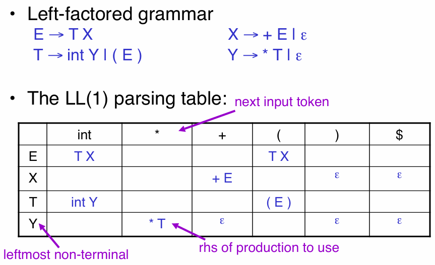

- `$` : 字符串结束的标记

将现有语法规则通过「左因子分解」分解后，可以绘制出 `LL(1)` 预测解析表，可以实现每个 token 至少存在一条生产式
- 当前处于 $E$ ，且输入 `int`，可得 $E \rightarrow \text{ T X}$
- 当前处于 $Y$ ，且输入 `*`，可得 $Y \rightarrow \text{ * T}$
- 当前处于 $X$ ，且输入 `int`, 没有生产式，语法错误


```cpp
// 基于 LL(1) 解析表的 token 流解析算法
bool parse(LL1 table,  Token[] tokens){

    // 初始化
    std::stack<Symbol> stack;
    stack.push('$'); // token 流结束标记
    stack.push('E'); // 解析算法开始的标记

    auto next = tokens;

    do{
        // 还没完成匹配，token 流输入就没了
        if(next == nullptr){
            return false;
        }

        Symbol top = stack.top();

        if(top.isTerminal()){
            if( top == *next++){
                stack.pop();
            }else {
                return false;
            }
        }else if(top.isNonTerminal()){

            // 查询 LL(1) 解析表获取生产式
            auto grammar = table[top, *next];

            // 生产式为空，输入异常
            if(grammar == nullptr) return false;

            stack.pop();

            // 将生产式的符号都入栈
            for(int i = grammer->size() - 1; i >= 0; --i){
                stack.push(grammer[i]);
            }    
        }
    }while(stack.size() > 0)

    return true;
}
```

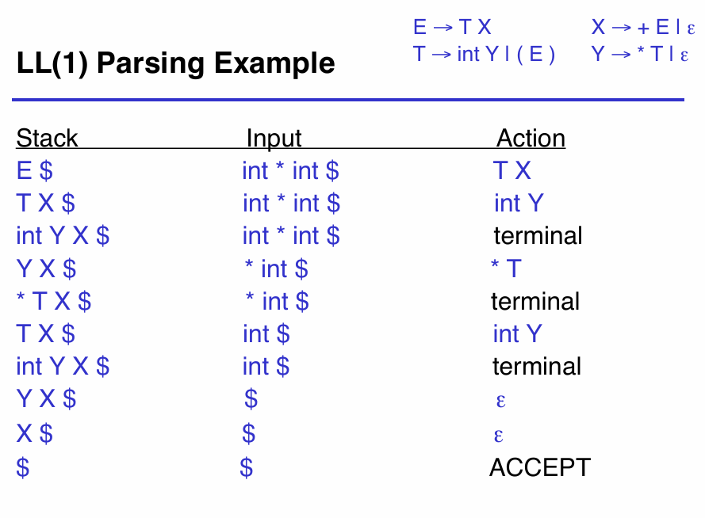

### 首集/跟随集

解析表 $T$ 中，在非终止符为 $A$且 token 为 $t$ 的情况下，生产式为 $T[A,t] = \alpha$。$\alpha$ 能匹配输入 $t$ 只存在两种情况
- $\alpha \rightarrow^* t \ \beta$ ：最终展开 $A$ 后得到的 stack 栈顶是 $t$，该情况称之为 $t \in first(\alpha)$
- $\alpha \rightarrow^* \varepsilon$ 且 $S \rightarrow^* ..At..$: 最终展开 $A$ 的结果是 $\varepsilon$；在生产式推导过程中，一定存在符号 $t$ 在符号 $A$ 后面的结果，该情况称之为 $t \in follow(A)$

#### 首集

首集 `First Set` 定义

$$
    First(X) = \{ t | X \rightarrow^* t \alpha\} \cup \{ \varepsilon | X \rightarrow^* \varepsilon \} , \ t \in \text{terminals}
$$


引理：
1. $First(t) = \{ t \}$
2. $\varepsilon \in First(X)$ 的成立条件
    - $X \rightarrow \varepsilon$
    - $X \rightarrow A_1 \dotsm A_n, \ \varepsilon \in Fisrt(A_i)$
3. 若 $X \rightarrow A_1 \dotsm A_n \alpha, \ \varepsilon \in First(A_i)$，则 $First(\alpha) \subseteq Fisrt(X)$
4. 若 $E \rightarrow X \ Y, \ \varepsilon \notin First(X)$，则 $First(E) = First(X)$

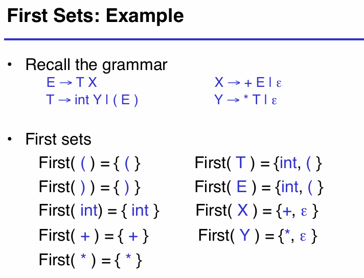

#### 跟随集

跟随集 `Follow Set` 定义：**在生产式推导过程中，存在 $X$ 在 $t$ 前面的情况，且不包含 $\varepsilon$**

$$
    Follow(X) = \{ t | S \rightarrow^* \beta X t \delta \} , \ t \in \text{terminals}
$$

引理
1. $S$ 是开始符号，则一定存在 $ \$ \in Follow(S) $
2. 若 $X \rightarrow \text{ A B}$，则 $Follow(X) \subseteq Follow(B)$
3. 若 $A \rightarrow \alpha X \beta$， 则 $First(\beta) - \{ \varepsilon \} \subseteq Follow(X)$
4. 若 $A \rightarrow \alpha X \beta, \ \varepsilon \in First(\beta)$，  则 $Follow(A) \subseteq Follow(X)$


**引理4 证明：**

根据生产式规则，多次推导一定能得到 $S \rightarrow^* \omega \alpha X \beta \delta$

- 当 $\beta \rightarrow^* \varepsilon$ 时，$A_1 \rightarrow \alpha X$ 且 $S \rightarrow^* \omega \alpha X  \delta$，则 $Follow(A_1) = First(\delta) - \{ \varepsilon \}$
- 当 $ \beta \neq \varepsilon $ 时，$A_2 \rightarrow \alpha X \beta$ 且 $S \rightarrow^* \omega \alpha X \beta  \delta$，则 $Follow(A_2) = First(\delta) - \{ \varepsilon \}$

无论 $\beta$ 是否为 $\varepsilon$ ，$Follow(A) = First(\delta) - \{ \varepsilon \}$ 均成立。且当 $\beta \rightarrow^* \varepsilon$ 时，$First(\delta) - \{ \varepsilon \} \subseteq Follow(X)$，因此  $Follow(A) \subseteq Follow(X)$ 成立

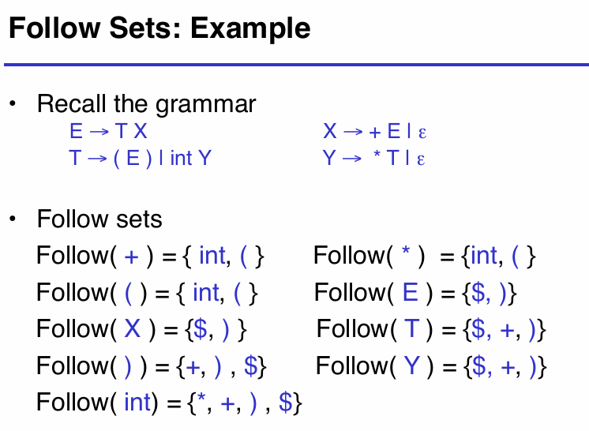

### LL(1) 表构建

$T$ 表示根据 CFG 创建的 `LL(1)` 解析表。将生产式 $A \rightarrow \alpha$ 放入表中的规则为
- 若终结符 $t \in First(\alpha)$，则 $T[A,t] = \alpha$
- 若 $\varepsilon \in First(\alpha), \ t \in Follow(A)$，则 $T[A,t] = \alpha$
- 若 $\varepsilon \in First(\alpha), \ \$ \in Follow(A)$, 则 $T[A, \$] = \alpha$


### 适用范围

$$
    \begin{aligned}
        S &\rightarrow \text{ S a | b} \\
        Fisrt(S) &=  \text{{ b }} \\
        Follow(S) &= \text{{ a, \$ }}
    \end{aligned}
$$ 

- $S \rightarrow Sa$ 且终结符为 $b$ 时，$b \in First(Sa) = First(S)$，则 $T[S,b] = Sa$ 成立
- $S \rightarrow b$ 且终结符为 $b$ 时，$b \in First(b)$，则 $T[S,b] = b$ 成立

综上 $T[A,b]$ 存在两个生成式，违反 `LL(1)` 文法规则，因此 $T$ 并不是 `LL(1)` 解析表。

> [!note]
> - 预测解析算法只适用于 `LL(1)` 文法，判断 CFG 是否为 `LL(1)`，则观察解析表 $T[S,t]$ 是否映射到多值
> - 大多数语言的 CFG 都不满足 `LL(1)` 文法

# 自下而上解析算法


自下而上算法 `Bottom-up` 相较于自上而下算法适用性更广，是现代解析器首选方案。
- 性能更好
- 不需要生产式左因子化
- 对生产式的限制更低，表达上可以更加人性化一些

## Reduce

自下而上算法是扫描字符串 token，从解析树的叶子结点开始，从下往上还原生产式，直到起始符号停止。将字符串还原成生产式的操作称之为 「归约 `reduce`」，归约与生产 `product` 相对应，是生产的反向操作。

$$
    \begin{aligned}
        E \rightarrow& \text{ T + E | T}\\
        T \rightarrow& \text{ int * T | int | (E)}
    \end{aligned}
$$

- 归约：将字符串 token 还原成生产式，例如输入字符串 `int ` 可以反向推理出 $T \rightarrow  \text{ int }$
- 生产：将生产式展开字符串，例如字符串 `int + int` 的推理展开流程为 $E \rightarrow T + E \rightarrow int  +  E \rightarrow int + T \rightarrow int + int$


<video src="./image/compiler/reduce.mp4"  controls="controls" width="100%" height="100%"></video>


> [!note]
> 自下而上算法是在反向追踪右推导的生产路径

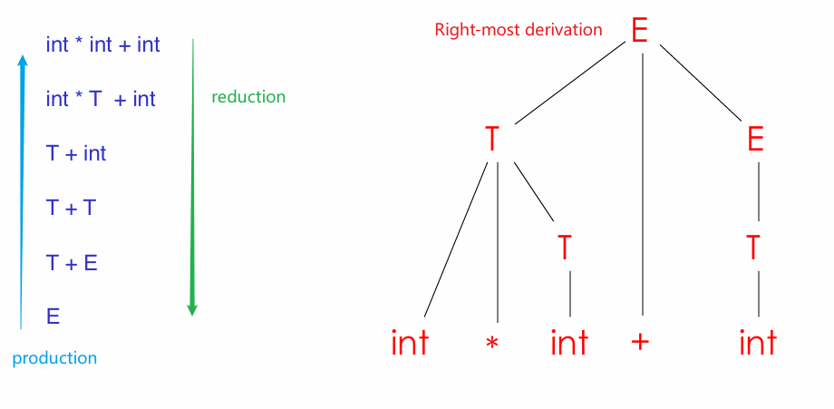


## Shift

> [!note]
> **定理：**执行自下而上算法，若序列 $\alpha \beta \omega$ 的下一步归约为 $X \rightarrow \beta$，则 $\omega$ 必定是终结符，**即最右侧非终结符的右侧应当是终结符**

证明： 当前归约追踪的「右推导」步骤为 $\alpha X \omega \rightarrow \alpha \beta \omega$，若 $\omega$ 不是非终结符，那么当前的右推导应该是 $\omega \rightarrow a_1 \dotsm a_n$，而非 $X \rightarrow \beta$，因此，$\omega$ 必然是终结符，即最右侧非终结符的右侧均是终结符。


根据上述定理可知，右推导流程中，最右侧非终结符的右侧均是终结符，即最右侧非终结符右侧的终结符都是最先被推导出来的；此外，归约是对右推导的逆向追踪，也就是说最右侧非终结符右侧的终结符将在后续步骤中被归约处理，**即最右侧非终结符右侧的所有终结符都是自下而上算法还未处理的符号**。根据这一事实，可以将符号序列根据最右侧非终结符位置划分为两部分
- 左子序列：包含终结符与非终结符，已经被算法处理过
- 右子序列：全是终结符，未被算法处理

利用符号 $|$ 来标记左右子序列，例如 $\alpha X | \omega$。符号 $|$ 的移动操作则被称之为「移进 `Shift`」：
- 从左向右移动
- 每次移动则从右侧序列中读取一个终结符放入左侧序列

## Shift-Reduce 解析

自下而上算法就是通过「移进」与「归约」完成对输入序列的解析


<video src="./image/compiler/shift-reduce.mp4"  controls="controls" width="100%" height="100%"></video>


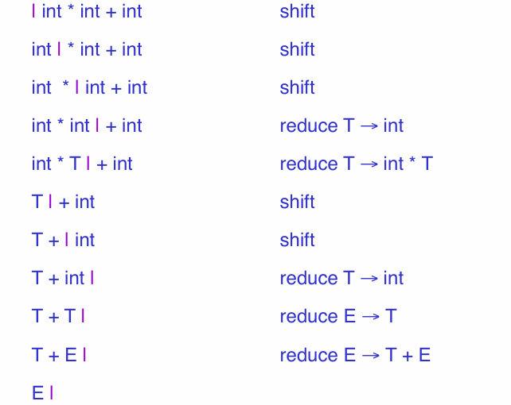


对于 `Shift-Reduce` 解析存在两个问题
- `Shift-Reduce Conflict` : 下一步解析操作，无论进行归约还是移进都有正确的生产式能与之对应，可以消除
- `Reduce-Reduce Conflict` : 下一步归约操作，有两个生产式能与之对应，解析器具有严重错误

## Handle

Shift 与 Reduce 只解释了自下而上算法如何运行，但是并未规定每次操作应当选择 Shift 还是 Reduce 。算法的运行目标：每次执行的 Reduce 操作都能保证最后能够抵达起始符号。

**定义：** 假设右推导流程为

$$
    S \rightarrow^* \alpha X \omega \rightarrow \alpha \beta \omega
$$

只要在 $\alpha \beta \omega$ 选择 $X \rightarrow \beta$ 的方式进行 Reduce 操作，便能保证的归约肯定能抵达 $S$，为了标记这里可以执行 Reduce 操作，便将 $\alpha \beta$ 称之为 $\alpha \beta \omega$ 符号序列的句柄 `Handle`，**即 Handle 标记了何处可以执行 Reduce 操作, 只要能正确找到的 Handle 那么就能确定何时应当执行 Redcue 操作**。

> [!note]
> **定理：** 在 `Shift-Reduce` 解析算法中，`Handle` 只会出现在 $|$ 符号的左侧


## Viable

- **可行前缀 `viable prefix`**: 若存在符号 $\omega$ 使得 $\alpha | \omega$ 是 shift-reduce 解析的一个有效环节， 那么 $\alpha$ 则是一个可行前缀。
    - 可行前缀也是句柄的前缀
    - $|$ 左侧有可行前缀，就表明当前解析没有出错

>[!note]
> **定理：** 对于任何语法，可行前缀合集 `viable prefixs set` 是是一类正则语言 `regular language`，即可行前缀合集可以通过有限状态机识别。


- **项 `item`**: 生产式的右侧足有一个 `.` 符号，表示生产式右侧有多少符号位于 $|$ 的左侧
  - $T \rightarrow \text{ (E.)}$ 表示基于 $T \rightarrow \text{ (E)}$ 生产式，解析到 $\beta (E|) \omega$ 的情况
  - $LR(0)$ 项： $X \rightarrow \varepsilon$ 的项 $X \rightarrow .$

- **有效项 `valid item`**: 根据右推导，若 $S' \rightarrow^* \alpha X \omega \rightarrow \alpha \beta \gamma \omega$ 成立，则 $X \rightarrow \beta . \gamma$ 则称之为有效项

通过 `item` 可以看出 $|$ 的左符号序列存放的都是生产式右侧部分的前缀

$$
    P_1P_2P_3\dotsm P_n | \omega
$$

- $P_i$ 是 $X_i \rightarrow \alpha_i$ 中 $\alpha_i$ 的部分前缀，即只要凑齐 $\alpha_i$ 的剩余部分，就能将 $P_i$ 归约为 $X_i$
- $X_i$ 又是 $X_{i-1} \rightarrow \alpha_{i-1}$ 中 $\alpha_{i-1}$ 的缺失部分， $P_{i-1}X_i$ 又能组成 $\alpha_{i-1}$ 的前缀，最终也能归约成 $X_{i-1}$

**案例：** 基于以下规则解析字符串 `(int * int)`

$$
    \begin{aligned}
        E &\rightarrow \text{ T + E | T} \\
        T &\rightarrow \text{ int * T | int | (E)} 
    \end{aligned}
$$

当字符串处于 $\text{(int * | int)}$ 状态时，项的结构为
1. $T \rightarrow \text{ int * . T}$ : `int *` 是 $T \rightarrow \text{ int * T}$ 的前缀
1. $E \rightarrow \text{ . T}$ : `ε`  是 $E \rightarrow \text{ T}$ 的前缀
1. $T \rightarrow \text{ (. E)}$ : `(`  是 $T \rightarrow \text{ ( E)}$ 的前缀
1. $E \rightarrow \text{ .T}$ : `ε`  是 $E \rightarrow \text{ T}$ 的前缀

按照上述步骤进行归约便能实现对字符串 `int * int` 的 `Shift-Reduce` 解析。

> [!note]
> **由此可知，识别出 `Viable Prefix` 就能找到有效的 `Handle`**


## Viable 状态机

定义新的起始符号 $S'$，其对应的唯一生产式为 $S' \rightarrow S$ 得到语法 $G$。应构造的 NFA 定义如下

- 状态: $G$ 的项 $E \rightarrow \alpha . X \beta$
- 开始：$S' \rightarrow .S$
- 转移：$(E \rightarrow \alpha . X \beta) \  \rightarrow^X \ (E \rightarrow \alpha X . \beta)$
- $\varepsilon$ 转移：当前状态处于 $E \rightarrow \alpha . X \beta$ 且 $X$ 为非终结符，此时需要先处理 $X$ 的状态，才能确定 $E \rightarrow \alpha . X \beta$ 应当转移，即需要从  $E \rightarrow \alpha . X \beta$ 状态切换到 $X \rightarrow . \gamma$ 的状态

$$
    (E \rightarrow \alpha . X \beta) \ \rightarrow^\varepsilon \ (X \rightarrow . \gamma)
$$

- 每一个状态都是接受状态

**案例**： 构建 NFA

$$
    \begin{aligned}
       S' &\rightarrow \text{ E} \\
        E &\rightarrow \text{ T + E | T} \\
        T &\rightarrow \text{ int * T | int | (E)} 
    \end{aligned}
$$

<video src="./image/compiler/NFA_viable.mp4"  controls="controls" width="100%" height="100%"></video>

同样也能将 NFA 转换为 DFA


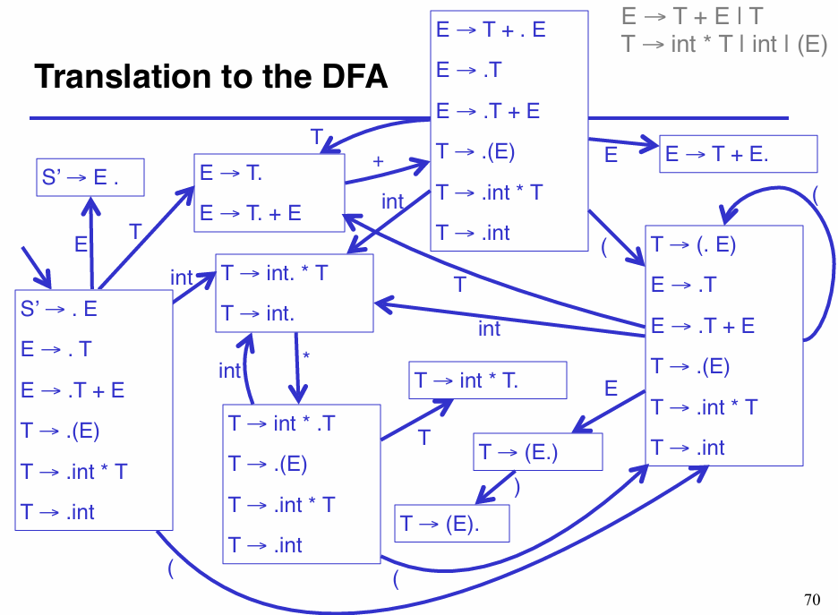

在 DFA 中的状态被称之为规范项集合 `canonical collections of items` 或 $LR(0)$ 项的规范集合 `canonical collections of LR(0) items`。

## LR(0) 算法

`LR(0)` 算法：用一个栈存储存储 $\alpha | \beta \omega$ 中的 $\alpha$，$t$ 为马上需要被读取的终结符，viable 相关的 DFA 在输入为 $\alpha$ 时，所处的状态为 $s$
- 归约：若 $s$ 包含项 $X \rightarrow \beta .$，则 $\alpha$ 进行基于 $X \rightarrow \beta$ 的归约操作 
- 移动：若 $s$ 包含项 $X \rightarrow \beta . t \omega$，则将 $t$ 放入 $\alpha$ 中，且 DFA 也进行相应的状态转移

`LR(0)` 算法存在的问题:
- `reduce-reduce Conflict` : $s$ 包含 $X \rightarrow \beta.$ 与 $Y \rightarrow \omega. $，无法确定应当进行那个项的归约
- `reduce-shift Conflict` :  $s$ 包含 $X \rightarrow \beta.$ 与 $Y \rightarrow \omega . t \delta$，无法确定当前是进行归约，还是进行移动 


## SLR 算法

`SLR` 算法：用一个栈存储存储 $\alpha | \beta \omega$ 中的 $\alpha$，$t$ 为马上需要被读取的终结符，viable 相关的 DFA 在输入为 $\alpha$ 时，所处的状态为 $s$
- 归约：若 $t \in Follow(X)$ 且 $s$ 包含项 $X \rightarrow \beta .$，则 $\alpha$ 进行基于 $X \rightarrow \beta$ 的归约操作 
- 移动：若 $s$ 包含项 $X \rightarrow \beta . t \omega$，则将 $t$ 放入 $\alpha$ 中，且 DFA 也进行相应的状态转移


`SLR` 算法是对 `LR(0)` 算法的改进，唯一区别就是对「归约」操作增加了一个判断条件 $t \in Follow(X)$。


**解析处理流程：**

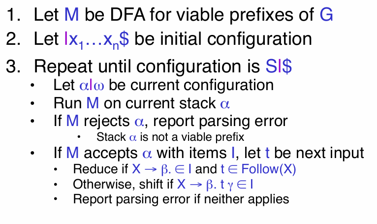

上述 `SLR` 算法放入的栈中的元素 $\alpha$ 是生产式右侧符号的 `viable prefix`。当进行一次归约操作后，就需要从栈底开始重新执行 DFA 状态机，获取归约后新的 $\alpha'$ 所对应的状态。归约操作只修改了栈顶元素，这状态机对栈的遍历就存在大量重复操作，因此可以对栈结构进行优化，栈不仅存储符号，还要存储符号输入时 DFA 所处状态。

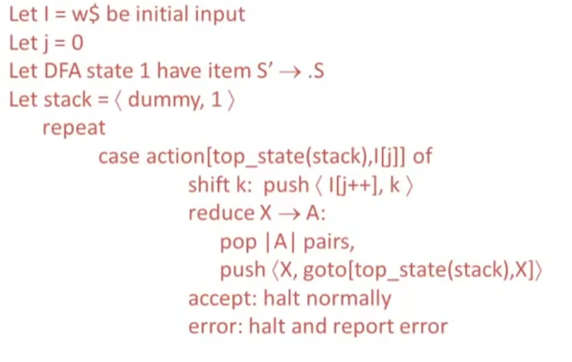


- $goto[i,A] = j$ 描述 $state_i \rightarrow^A state_j$，表示 DFA 的在 $A$ 输入下的状态转移
- $action$ 定义在状态 $s_i$ 与输入终结符 $a$ 情况下，应当采取何种操作
  - 若 $s_i$ 包含 $X \rightarrow \alpha . a \beta$ 且 $goto[i,a] = j$，则 $action[i,a] = shift \ j$
  - 若 $s_i$ 包含 $X \rightarrow \alpha . \ , X \neq S'$ 且 $a \in Follow(X)$，则 $action[i,a] = reduce \ X \rightarrow \alpha$
  - 若 $s_i$ 包含 $S' \rightarrow S$ ， 则 $action[i, \$] = accept$
  - 其他情况，$action[i,a] = error$


> [!note]
> 检查 DFA 状态图，若结点中出现任何冲突，那么定义的文法不属于 `SLR`，解析算法失效。

## LR(k) 算法


`LR(k)` 算法：用一个栈存储存储 $\alpha | \beta \omega$ 中的 $\alpha$，$t$ 为马上需要被读取的终结符，viable 相关的 DFA 在输入为 $\alpha$ 时，所处的状态为 $s$
- 归约：若 $[X \rightarrow \beta .  , T]$ (表示 $s_i$ 包含 $X \rightarrow \alpha .$ 且 $a \in T$ )，则 $\alpha$ 进行基于 $X \rightarrow \beta$ 的归约操作 
- 移动：若 $s$ 包含项 $X \rightarrow \beta . t \omega$，则将 $t$ 放入 $\alpha$ 中，且 DFA 也进行相应的状态转移

`LR(k)` 相比于 `SLR` 的改动也是归约条件，集合 $T$ 的定义将比 $Follow(X)$ 更加精确，且 `k` 表示 $\alpha$ 的字符数量，例如 `LR(1)` 表示 $len(a) == 1$。

> [!note]
> - `LR(k)` 更加通用，可以使用 `yacc` 工具创建。
> - `LR(1)` 会被进一步优化，得到 `LALR(1)`


