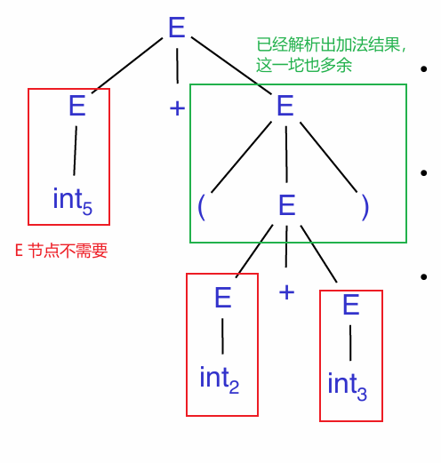

# 语法解析

# 介绍

有限状态机无法解析嵌套规则、括号匹配、目标定位，因此需要解析器 `parsing` 进行语法解析
- 输入：通过词法解析获取的 token 序列
- 输出：解析树


> [!tip]
> 词法分析得到的是全部 token 序列，因此，需要解析器区分出哪些 token 有效，哪些 token 无效。

# 上下文无关语法

上下文无关语法 `Context-Free Grammars` : 对递归结构的自然描述。其构成为
- 终结符集合 `terminals` : $T$
- 非终结符集合 `non-terminals` : $N$
- 开始符号 ： $S, S \in N$
- 生产式集合 `production` : $X \rightarrow Y_1 Y_2\dotsm Y_n \quad x \in N, y_i \in N \cup T \cup \{\varepsilon\}$
    1. 生产式只能从 $S$ 开始
    2. 右边的符号 $Y_1 Y_2\dotsm Y_n$ 可以替换左边的符号 $X$
    3. 重复步骤2，最终得到的字符串结果将不存在非终结符，即 $S \overset{*}{\rightarrow} a_1\dotsm a_n, \ a_i \in T$

定义 $G$ 代表开始符号是 $S$ 的上下文无关语法，那么 $L(G)$ 

$$
    L(G) = \{ a_1 a_2 \dotsm a_n | a_i \in T, S \overset{*}{\rightarrow} a_1 a_2 \dotsm a_n \}
$$


**案例**：为起始符号 `EXPR` 定义了三种生产式，`|` 表示或，终结符都使用了小写


根据上述定义，以下语法结构都将合法

```cool
-- EXPR -> id
id

-- EXPR -> while EXPR loop EXPR pool
while id loop id pool

-- if 与 while 嵌套
if id then
    while id loop id pool
else
    if id then id else id if
if
```

> [!note]
> - 完全展开生产式得到的最终字符串都由终结符组成，字符串将不在改变，**因此终结符应当就是语言的 `token`**
> - CFG 只定义了正确的语法，但并未实现解析树的生成


# 解析树

## 定义

**推导 `Derivation`** : 描述一系列生产式递归展开的过程

$$
    S \rightarrow \dotsm \rightarrow \dotsm \rightarrow \dotsm
$$

推导流程可以绘制成一棵树，该树则被称之为「解析树 `Parse Tree`」
- 根结点 $S$ 
- 叶结点均是终止符
- 非终止符只存在于内部节点
- 生产式 $X \rightarrow Y_1\dotsm Y_n$ ，$Y_1 \dotsm Y_n$都是 $X$ 结点的子结点
- 叶子节点按照中序遍历得到的字符串就是原输入字符串
- 树的层级关系代表了表达式的优先级

**案例**： $E \rightarrow E + E | E * E | (E) | id$，字符串 `id * id + id` 的解析树结构


一般使用的两种推导方式
- 左推导 `left-most derivation` :  生产式每一步展开，都先替换最左边的非终止符号

    

- 右推导 `left-most derivation` :  生产式每一步展开，都先替换最右边的非终止符号

    

## 歧义

**歧义 `Ambiguity`** : 对于同一个字符串，根据同一个语法会获取到的不同的解析树。

- **重写语法消除歧义**。

**案例一：** 字符串 `id * id + id` 根据 $E \rightarrow E + E | E * E | (E) | id$ 描述就存在歧义


拆分语法规则 $E$ 处理运算层级低的加法，$E'$ 则处理优先级高的乘法与括号

$$
    \begin{aligned}
        E &\rightarrow E' + E | E' \\
        E' &\rightarrow id * E' | id | (E) * E' | (E)
    \end{aligned}
$$

且 $E \rightarrow E' + E$ 实现了递归

$$
    E \rightarrow E' + E \rightarrow E' + E' + E \rightarrow E' + E' + E' + E \rightarrow \dotsm 
$$

**案例二**: $E \rightarrow \text{if E then E | if E then E else E | OTHER}$ 解析条件判断，对于字符串

```cool
if E1 then if E2 then E3 else E4
```
将存在歧义


解决方式也是重写语法规则，使得 `else` 只与最近的 `then` 匹配


$$
    \begin{aligned}
        E \rightarrow&  \text{ MIF    all then are matched } \\
                    |&  \text{ UIF    some then is unmatched}  \\
        \\
        MIF \rightarrow& \text{ if E then MIF else MIF} \\
                      |& \text{ OTHER} \\
        \\
        UIF \rightarrow& \text{ if E then E} \\
                      |& \text{ if E then MIF else UIF} \\
    \end{aligned}
$$

- **通过歧义消除机制防止歧义**

重写语法规则难度很大，而且重写后的规则也晦涩难懂 （例如上述条件判断），为了使得定义语法规则更加方便，**语法解析工具提供了歧义消除机制，可以定义额外的规则**。 


`%left` 限定了运算符 `+ *` 只能左推导，且通过顺序确定 `*` 的运算优先级比 `+` 的优先级高

## 异常处理

编译器的目的
1. 检测出无效的代码
2. 将代码翻译成目标结果

在检测阶段就需要编译器具有向程序报告代码错误的能力，例如无效符号、语法错误、语义错误等。现有的异常处理机制有
- `panic mode` 

当错误被检测到时，解析器丢弃当前的 token，直到找到正确的 token 为止，并继续解析。例如 `( 1 + + 2) + 3` ，当检测到第二个 `+` 时，解析器发现异常，然后丢弃 `+`，并继续解析 `2`。在 `Bison` 提供了终止符号 `error` 来实现跳过异常 token 

$$
    E \rightarrow \text{ int | E + E | (E) | error int | (error)}
$$


- `error production` ： 使用生产式将常见的错误语法标记出来，例如编译器产生的 `warning`

- `automatic local or global correction` : 希望编译器能自动纠错


## 抽象语法树




解析树内容臃肿并不适合进行编程，因此，对其进行改进又提出了抽象语法树 `Abstract Syntax Tree`，只保留关键的数据信息与层级结构


# 解析算法

> [!tip]
> 基于 CFG 定义的规则解析输入的 token 流，解析推导流程就能构造出一颗解析树（代码运行逻辑层面，并未真正创建）

## 递归下降

### 思想

递归下降 `Recursive Descent` : 自顶向下 `top-down` 的语法解析算法，运行规则
- 从顶部开始
- 从左到右
- 叶子结点的中序遍历结果，就是输入的 token 流


<video src="/image/compiler/recursiveDescent.mp4"  controls="controls" width="700" height="400"></video>

简单算法实现检测字符串 `( 5 )`

1. 定义 token 的类型
2. 全局变量 `TOKEN * next;` 
3. 定义函数
   1. 检测 token 类型的函数 `bool term(TOKEN tok){ return *next++ == tok; }`
   2. 匹配符号 $S$ 对应的第 $n$ 条规则 `bool Sn();`
   3. 匹配 $S$ 对应的所有规则 `bool S();`


伪代码实现

```cpp
enum TOKEN_TYPE_E{
    INT,
    OPEN,   // (
    CLOSE,  // )
    PLUS,   // +
    TIMES   // *
};

struct TOKEN_S{
    TOKEN_TYPE_E type;
    std::string str;
};

class RecursiveDescent{
public:

    // 解析以 start 为起始，并以 end 结束的 token 流程，其范围为 [start, end)
    bool parse(TOKEN_S * start, TOKEN_S * end){
        m_next = start;

        // 1. 根据 CFG 定义，解析就是从非终结符号 E 开始的
        // 2. 输入 token 流 [start, end) 要与语法完全匹配才接受，部分匹配都是错的
        return E() && m_next == end;
    }

private:
    /* 
        E -> T
           | T + E
     */
    bool E1() { return T();}
    bool E2() { 
        // 使用 term(PLUS) 表示 +
        return T() && term(PLUS) &&  E();
    }
    bool E(){
        // 使用 save 实现了回溯
        auto save = next;
        return (next = save, E1())
            || (next = save, E2());
    }

    /* 
        T -> int
           | int * T
           | ( E )
     */
    bool T1() { return term(INT); }
    bool T2() { return term(INT) && term(PLUS) && T(); }
    bool T3() { return term(OPEN) && E() && term(CLOSE); }
    bool T(){
        auto save = next;
        return (next = save, T1())
            || (next = save, T2())
            || (next = save, T3());
    }

    // 输入 type 与当前的 token 类型是否匹配
    bool term(TOKEN_TYPE_E type){
        auto curr = m_next; 
        ++m_next; // 移动
        return curr->type == type;
    }

private:
    TOKEN_S * m_next; // 表示 token 流中，下一个将输入的 token
};
```

上述代码根据递归下降法实现了一个简单的解析器。但是该解析器只能正确匹配出 `int`，`( int )` 等类型的字符串。**当匹配 `int * int`时，`E() -> E1() -> T() -> T1()` 匹配到 `int` 后便直接返回，并未尝试解析 `T2()`，因此最后结论是失败**。

> [!tip]
> 市面上存在真正通用的梯度下降算法，但是具有负责的回溯机制，用以解决上述问题


### 左递归问题

左递归问题 `Left Recursion` : 「递归下降算法」针对 $S \rightarrow S \alpha | \beta$ 的生成式会陷入死循环。

```cpp
bool S1() {return S() && term(a);}
bool S2() {return term(b);}
bool S(){
    auto save = next;
    return (next = save, S1()) 
        || (next = save, S2());
}
```
从 $S$ 进入，就会产生 `S() -> S1() -> S() -> S1() -> ...` 死循环调用。 $S \rightarrow S \alpha | \beta$ 描述的推导流程是 $S \overset{*}{\rightarrow} \beta \alpha \dotsm \alpha$，采用左递归的推导方式，是从右向左生成字符串，因此，要解决该问题只要从左向右生成字符串就行，即改写为右递归 `right recursion`

$$
    \begin{aligned}
        S \rightarrow& \beta S' \\
        S' \rightarrow& \alpha S' | \varepsilon
    \end{aligned}
$$


