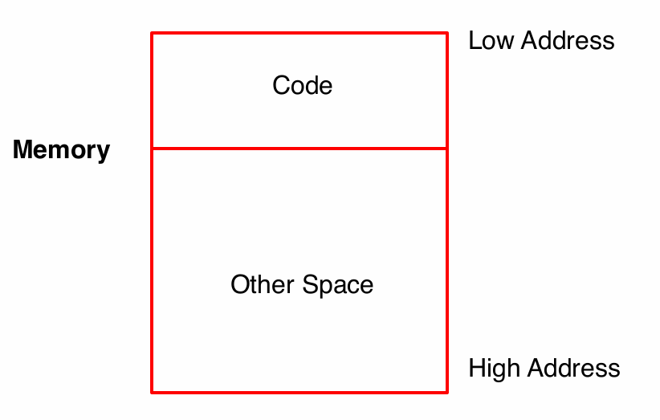
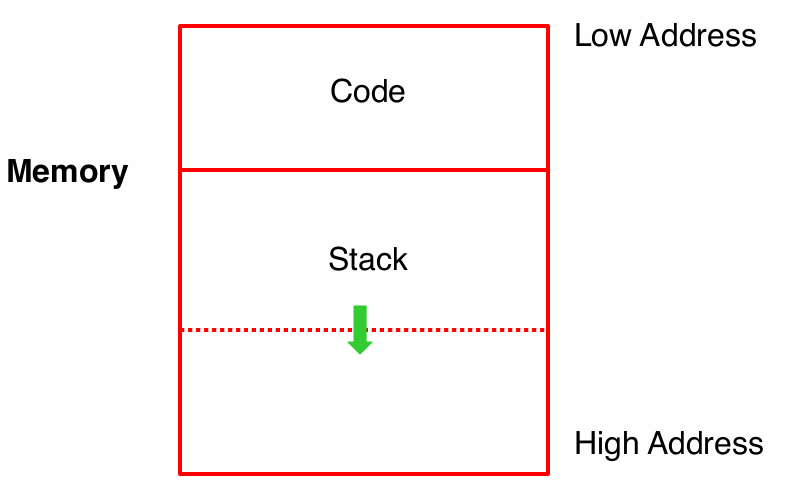
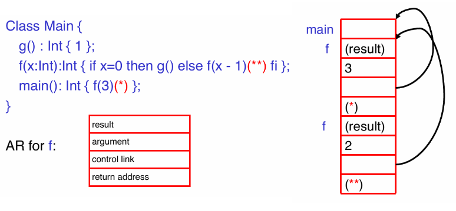
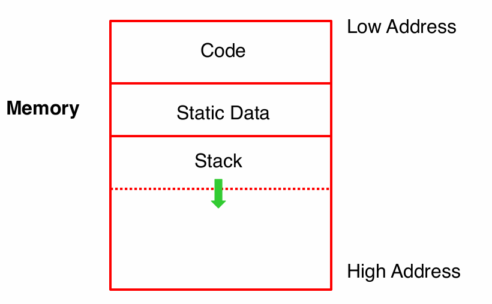
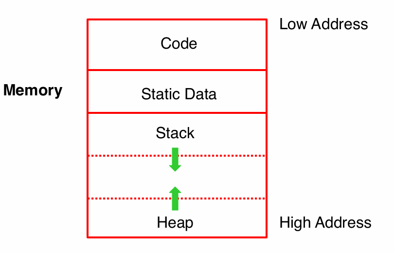

# 运行时结构

# 可执行文件

可执行程序序需要在操作系统中运行起来，需要以下步骤
1. 操作系统分配存放程序的内存空间
2. 加载可执行文件到内存空间中
3. 操作系统跳转到可执行文件的入口，开始执行程序

编译器所要做的工作是提供「可执行文件」
- 生成内存 `code` 区的代码
- 控制内存 `other space` 区如何存放数据

编译器生成可执行文件需要保证：正确且快速。

# 激活

> [!note]
> 可执行文件执行假设：
> 1. CPU 会按照可执行程序中的指令顺序执行
> 2. 退出函数调用时，CPU 接着会执行函数调用指令的下一条指令

## 概念

- **激活 `activation`**: 描述一次过程 `procedure` 被调用，即函数调用。过程 $P$ 的一次激活生命周期包括
  - CPU 执行过程 $P$ 中的所有指令
  - CPU 执行过程 $P$ 中所激活的所有过程

- **变量 $X$ 的生命周期：** 从 CPU 执行变量的定义指令开始到执行变量销毁指令结束

> [!note]
> - 生命周期 `lifetime` : 是程序运行时 `run-time` 概念，即动态的 `dynamic`
> - 作用域 `scope` : 是编译时 `compile` 概念，即静态的 `static`

- **激活树 `activation tree`**: 根据假设可知过程 $P$ 调用了过程 $Q$， $Q$ 会先于 $P$ 返回，即过程激活执行生命周期存在嵌套关系。因此，过程激活的生命周期可以用树结构来表示。**激活树是程序执行时动态生成的，且能够栈结构进行存储**

<video src="./image/compiler/runtime_activationtree.mp4"  controls="controls" width="100%" height="100%"></video>

在程序执行中，数据区域内存会有一片专门的内存来存放这个栈结构

## 激活记录

**激活记录 `activation record`**: 完成一次过程激活存储到栈上的所有信息，即栈帧 `frame`。通常一次过程激活的激活记录包含
- `result` : 返回值
- `argument`: 传入过程的形参
- `control link` : 上一级过程激活的激活记录内存首地址，可用来遍历所有的记录以及过程回退
- `return address` : 退出过程后，CPU 继续执行的指令地址

`*` 与 `**` 表示在 `code` 内存区域存储的指令的地址

> [!note]
> 编译器必须在编译阶段确定激活记录的布局，且生成的代码指令能正确访问记录中的数据。因此，激活记录布局与代码生成必须同时一起设计。

# 全局变量

**全局变量 `global variable`**: 程序中所有代码都能访问到的全局变量，因此全局变量不能存放到激活记录中。**全局变量被分配内存后，该内存地址会固定下来。这些在运行时具有固定地址的变量也被称之为「静态分配 `statically allocated`」**。

# 堆

**堆存储 `heap`**: 任何在过程结束后仍然存在的值，例如 `new` 或者 `malloc` 创建的对象，这些数据也不能放在激活记录中。这数据存在的内存区域就被称之为「堆 `heap`」。

> [!tip]
> 栈与堆所占用的内存可能随着代码执行而增长，为了防止这两个区域的内存重叠，就将栈与堆放在一片内存的两端，均向着中间增长。只要栈与堆增长端的地址重合，就说明内存耗尽。

# 内存对齐

现代对于 `32` 或 `64` 位系统对于内存有如下规定
- 字节 `byte` : `8 bits`
- 字 `word` : 4 个或 8 个字节
- 机器可以按照 `byte` 或 `word` 进行内存操作

**字对齐 `word aligned`** : 数据在内存中的起始地址是字长度的整数倍，例如字长度为 `4` 个字节，数据的起始地址是 `0x0001000`，则该数据在内存中满足字对齐。

> [!tip]
> - 满足对齐规则，CPU 能更快的读写内存
> - 某些平台机器强制要求程序适配对齐规则，否则无法执行