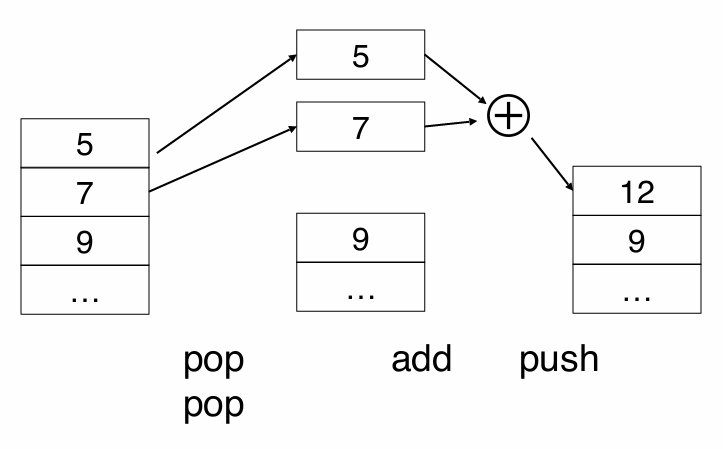
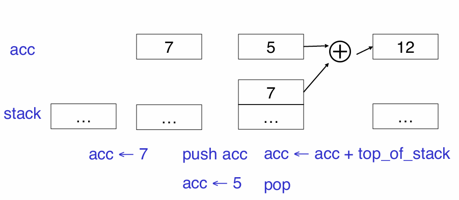
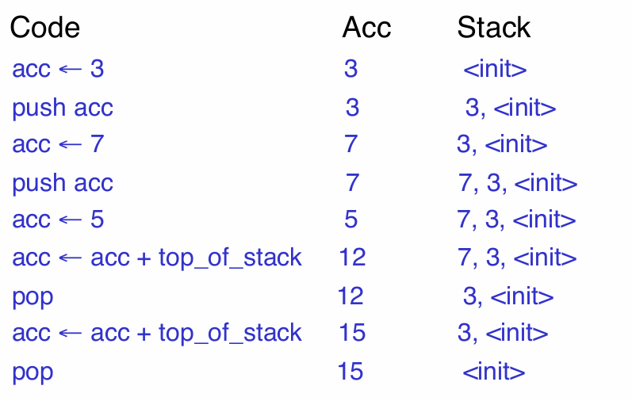

# 运行时结构

# 可执行文件

可执行程序序需要在操作系统中运行起来，需要以下步骤
1. 操作系统分配存放程序的内存空间
2. 加载可执行文件到内存空间中
3. 操作系统跳转到可执行文件的入口，开始执行程序


编译器所要做的工作是提供「可执行文件」
- 生成内存 `code` 区的代码
- 控制内存 `other space` 区如何存放数据

编译器生成可执行文件需要保证：正确且快速。


# 激活

> [!note]
> 可执行文件执行假设：
> 1. CPU 会按照可执行程序中的指令顺序执行
> 2. 退出函数调用时，CPU 接着会执行函数调用指令的下一条指令

## 概念

- **激活 `activation`**: 描述一次过程 `procedure` 被调用，即函数调用。过程 $P$ 的一次激活生命周期包括
  - CPU 执行过程 $P$ 中的所有指令
  - CPU 执行过程 $P$ 中所激活的所有过程

- **变量 $X$ 的生命周期：** 从 CPU 执行变量的定义指令开始到执行变量销毁指令结束

> [!note]
> - 生命周期 `lifetime` : 是程序运行时 `run-time` 概念，即动态的 `dynamic`
> - 作用域 `scope` : 是编译时 `compile` 概念，即静态的 `static`


- **激活树 `activation tree`**: 根据假设可知过程 $P$ 调用了过程 $Q$， $Q$ 会先于 $P$ 返回，即过程激活执行生命周期存在嵌套关系。因此，过程激活的生命周期可以用树结构来表示。**激活树是程序执行时动态生成的，且能够栈结构进行存储**

<video src="./image/compiler/runtime_activationtree.mp4"  controls="controls" width="100%" height="100%"></video>


在程序执行中，数据区域内存会有一片专门的内存来存放这个栈结构


## 激活记录

**激活记录 `activation record`**: 完成一次过程激活存储到栈上的所有信息，即栈帧 `frame`。通常一次过程激活的激活记录包含
- `result` : 返回值
- `argument`: 传入过程的形参
- `control link` : 上一级函数的栈帧在内存地址，可用来遍历所有的记录以及过程回退
- `return address` : 退出过程后，CPU 继续执行的指令地址


`*` 与 `**` 表示在 `code` 内存区域存储的指令的地址


> [!note]
> 编译器必须在编译阶段确定激活记录的布局，且生成的代码指令能正确访问记录中的数据。因此，激活记录布局与代码生成必须同时一起设计。


# 全局变量

**全局变量 `global variable`**: 程序中所有代码都能访问到的全局变量，因此全局变量不能存放到激活记录中。**全局变量被分配内存后，该内存地址会固定下来。这些在运行时具有固定地址的变量也被称之为「静态分配 `statically allocated`」**。


# 堆

**堆存储 `heap`**: 任何在过程结束后仍然存在的值，例如 `new` 或者 `malloc` 创建的对象，这些数据也不能放在激活记录中。这数据存在的内存区域就被称之为「堆 `heap`」。


> [!tip]
> 栈与堆所占用的内存可能随着代码执行而增长，为了防止这两个区域的内存重叠，就将栈与堆放在一片内存的两端，均向着中间增长。只要栈与堆增长端的地址重合，就说明内存耗尽。

# 内存对齐

现代对于 `32` 或 `64` 位系统对于内存有如下规定
- 字节 `byte` : `8 bits`
- 字 `word` : 4 个或 8 个字节
- 机器可以按照 `byte` 或 `word` 进行内存操作

**字对齐 `word aligned`** : 数据在内存中的起始地址是字长度的整数倍，例如字长度为 `4` 个字节，数据的起始地址是 `0x0001000`，则该数据在内存中满足字对齐。

> [!tip]
> - 满足对齐规则，CPU 能更快的读写内存
> - 某些平台机器强制要求程序适配对齐规则，否则无法执行


# 表达式计算

> [!note]
> 上述的内存模型只描述了如何使用栈实现函数调用，下文的栈式机器模型将描述如何使用栈结构进行表达式运算

## 栈式机器

**栈式机器`Stack Machines`** : 是一个简单的求值模型，程序运行没有使用寄存器来存储操作数，而是使用一个「栈」结构
- 从栈顶弹出参与计算的操作数
- 根据操作数计算结果，并将结果压入栈顶


**案例：** 计算 `7 + 5`



实现上述加法运算，只需定义两条机器指令便能实现
- `push` : 将一个操作数压入栈中
- `add` : 从栈中弹出两个操作数，然后将计算结果压入栈中

```nasm
push 7
push 5
add
```

使用栈式机器模型进行求值的好处
- 每条机器码指令都是从栈中获取操作数进行运算，总是在栈顶
- 指令运算结果存储地方也是固定的，总是在栈顶
- 生成的运算指令更紧凑，例如汇编中加法计算 `add r1,r2,r3` 还需要额外描述三个寄存器，栈式机器中只需要一个 `add` 就搞定（操作数、计算结果都放在栈顶、不需要描述存储位置）

栈式机器模型虽然指令十分简洁，但是相对于寄存器指令，性能上稍显不足，例如 `add` 需要进行两次内存读与一次内存写，而 `add r1,r2,r3` 不涉及内存，都在寄存器进行处理（寄存器就在 CPU 内部，计算速度最快，而内存是单独的硬件，还存在内存寻址的过程）。对此，可以将寄存器也纳入栈式机器模型的栈结构中：**使用寄存器来充当栈结构的栈顶**。

**案例：** 使用 `r1 + memory` 来描述栈，`r1` 寄存器里面存放栈顶的操作，那么 `7 + 5`  的 `add` 指令就变成了
- 栈顶 `r1` 中存放的是 `5` ，弹出
- 将 `7` 从内存读出，放入栈顶 `r1` 并弹出
- 然后计算 `7 + 5` 结果放回栈顶 `r1`

使用 `r1` 表示栈顶，就将原来 `add` 的两次内存读与一次内存写优化为只有一次内存读

> [!note]
> - `r1 + memory` 栈结构的 `r1` 寄存器有个更官方的名称 `accumulator`
> - **`r1 + memory` 栈式机器模型最大的特点：严格保证一次表达式运行前后，未改变 `memory` 中的栈结构**

## 通用化

 `accumulator + memory` 栈式机器模型还可以进一步通用化，实现计算更复杂的表达式

$$
    \text{op}(e_1,\dotsm, e_n)
$$

1. 计算 $e_1$ 的结果，直接放入 `accumulator` （**第一初始运行，认为 `accumulator` 没有值**）
2. 依次循环计算 `2 ~ (n-1)` 表达式
    1. 计算 $e_i$ 前，将 `accumulator` 的值放入 `memory` 的栈结中
    2. 计算 $e_i$ 的结果放入 `accumulator` 中
3. 计算 $e_n$ 结果，直接放在 `accumulator` 中，$e_1, \dotsm, e_{n-1}$ 的结果在 `memory`
4. 从 `memory` 中弹出 $e_1, \dotsm, e_{n-1}$ 的结果，与 `accumulator` 一起参与 $\text{ op }()$ 的运算，并将其计算结果放入 `accumulator`

> [!note]
> - $\text{ op }()$ 指的语言允许的表达式操作（加法、减法），并非函数调用（函数调用靠激活记录实现）。
> - 这只是最简易的通用模型，某些表达式还能进一步优化，例如对于 `if e1 then e2 else e3` 表达式，只需计算 `e2` 或 `e3` 即可，不用全部计算。

**案例：** 计算 `7 + 5`
 



**案例：** 计算 `3 + (7 + 5)`





