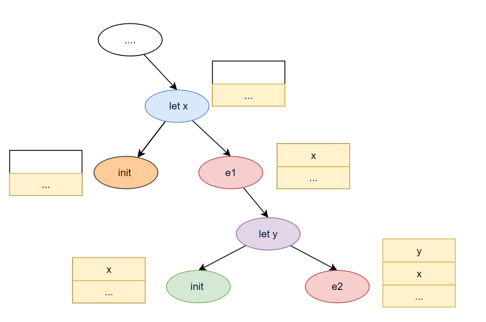

# 语义分析

# 引言

语义分析 `semantic analysis` 的基本思路是对语法分析得到的查询语法树 `AST` 进行遍历解析，从而实现
- 变量的声明/定义检测
- 类型检测
- 多态检测
- 类定义检测
- 其他

上述机制的实现均是对 AST 中结点的递归遍历，每个结点处理流程可划分为三个阶段
1. before 
2. recurse
3. after

```python
def visit(node):
    if(node == None) return

    # before: 结点前处理
    before_process(node)

    # recurse: 遍历子结点 
    for child in node.children:
        visit(child)

    # after: 结点后处理
    after_process(node)
```

# Scope

## 定义

**作用域 `Scope`** : 标记出标识符 `identifier` 的作用范围，保证同一作用域内 `identifier` 的含义不存在歧义。
- 静态作用域：变量的使用范围仅依赖于程序源码，在程序实际运行之前就已经明确。**优先绑定变量所在作用域的定义**

    ```cool
    let x : Int <- 0 in
        {
            let x : String <- "test" in
                x; // 绑定的是第 3 行
            x; // 绑定的是第 1 行
        }
    ```

- 动态作用域：变量的使用范围在程序运行起来时才确定。**变量绑定最近一次的定义**

    ```python
    print(min(1,2)) # 打印 1

    # 重新定义 min 为数字
    min = 10

    print(min) # 打印 10
    ```

## 符号表

**符号表 `symbol tables`**: 在解析 AST 树时，通过符号表可以知道当前结点能访问哪些标识符 `identifiers`，且通常以「栈结构」实现

- **案例1：** 假设 `let x : Int <- 0 , y : Int e1 in e2` 的 AST 树如下



递归解析结点，解析流程为
1. 进入蓝色结点
2. 解析黄色结点
4. 解析红色 e1 结点。标识符 `x` 在表达式 `e1` 中使用，因此 `x` 入栈，放入符号表
5. 进入紫色结点
6. 解析绿色结点
7. 解析红色 e2 结点。标识符 `y` 在表达式 `e2` 中使用，因此 `y` 入栈，放入符号表
8. 回退紫色结点。退出 `y` 作用域，`y` 出栈，且符号表与进入紫色结点时状态一致
9. 回退红色 e1
10. 回退蓝色结点。退出 `x` 作用域，`x` 出栈，且符号表与进入蓝色结点时状态一致

> 栈结构的符号表可以实现: 
> - 进入结点与退出结点时，符号表保持一致；
> - 支持静态作用域嵌套，且保证作用域能正确访问到该作用域内的符号标识；
> - 内部作用域标识符能覆盖外部作用域标识符


- **案例2：** 解析出 `f(x:Int, x:Int)` 中的表示符 `x` 重定义

在案例1中，能实现内部作用域标识符能覆盖外部作用域标识符，但是无法检测同作用域内标识符重定义，**因为简单的栈结构并没有区分符号属于哪个作用域，只是简单的对符号进行入栈、出栈操作**。只要改变栈的操作方式即可

```python
class SymbolTable:
    # 进入一个作用域
    def enter_scope()

    # 从符号表中查找符号 x 
    def find_symbol(x)

    # 添加符号 x
    def add_symbol(x)

    # 检查 x 是否在当前作用域已经被定义
    def check_scope(x)

    # 退出栈顶的作用域并清空该作用域下的符号
    def exit_scope()
```

- **案例3**：检测类定义

类名符号在符号表中应当是全局可访问，应当在遍历 AST 之前就明确，而上述的两个案例均是在解析 AST 时才会向符号表插入符号标签，**解决方案便是遍历两次 AST，第一次遍历收集所有的类名符号，第二次才真正解析**


# Type

## 定义

- **类型 `Type`**: 代表一类「数据」，以及这些数据能进行的相关「操作」，例如 `int` 代表整型数据，可以进行加减乘除运算、大小比较等操作。**在面向对象语言中，为了简便，通常将类`class`与类型的概念画等号，但是类与类型是不同的概念。**

- **类型检测 `type check`** : 类型严格定义了数据可以执行哪些操作，**因此类型检测的目标便是保证这些类型操作正确**。
  - 静态类型检测 `statically typed` : 在编译阶段进行类型检测，例如 `c/c++` 
  - 动态类型检测 `dynamically typed` : 在程序运行时进行类型检测，例如 `python`
  - 无类型检测 `untyped` : 机器码不进行任何类型检测，本身就不存在类型概念

- **类型推测 `type inference`** : 根据表达式中的已知类型去推测类型，例如编译器处理 `var a = 10 + 12`时，会推测出 `a` 的类型是 `int`

> [!note]
> 虽然「类型检测」与「类型推测」是完全不同的，但是研究语义分析时，两个概念实现上都是一致的，不进行严格区分

## 推理规则

**推理规则 `inference rule`**: 像词法分析中的正则表达式与语法分析的上下文无关文法一样，类型检测（类型推测）也能通过一套严格的逻辑规则进行实现，这套规则被称之为推理规则。

推理规则语法严格遵循以下结构

```txt
if Hypothesis is true, then Conclusin is true.
```
符号定义：
- $\wedge $: 且
- $\Longrightarrow $ : 推理

    $$
         Hypothesis \wedge Hypothesis \Longrightarrow Conclusin
    $$

- $x:T$ : $x$ 得到的类型是 $T$
- $\vdash \alpha$ : 能证明 $\alpha$ 为真。对 $\Longrightarrow$ 的通用表示，上方的条件可以推理得到下方的结论

    $$
        \frac{
            \begin{array}{c}
                \vdash Hypothesis \\
                \dotsm  \\
                \vdash Hypothesis
            \end{array}
        }{\vdash Conclusion}
    $$

    假设从上到下进行推理，且所有条件均成立，才能得到结论


> [!note]
> 推理规则表达式本质就是自下而上检测 AST 中类型的正确性，当检测结点 $node$ 时
> - $Hypothesis$ 是 $node$ 的子结点相关表达式
> - $Conclusion$ 是 $node$ 结点的类型
> **即 AST 中的每个结点为根结点的子树，就对应一条类型推理规则**

**案例1：** 描述整型字面量

$$
    \frac{\text{ i is an integer literal}}{\vdash i : \text{Int}}
$$

**案例2：** 整型相加得到整型

$$
    \frac{\vdash e_1: \text{Int} \ + \ \vdash e_2: \text{Int} }{ \vdash e_1+e_2 : \text{Int}}
$$


## 类型环境

- **自由变量 `free variable`** : 若一个变量(标识符号)未在当前表达式中被定义，则被称之为自由变量。不查询其他表达式，根本不知道这个变量是啥含义。

    ```cool
    let x : int <- 0,       // x 不是自由变量
        y : int <- 1 + x    // x 是自由变量，y 不是
        z : int <- 0        // z 不是自由变量
    in {                  
        z <- y + x;              // x y z都是自由变量
    } 
    ```

- **类型环境 `type environments`** : 类型环境本质是一个函数，映射标识符号到具体类型。专门用于处理自由变量

- $O \vdash e : T$ : 表达式 $e$ 中的自由变量能通过类型环境 $O$ 查找到具体类型，表达式 $e$ 的结果可以是类型 $T$

    引入 $O$ 之后，可以使得推理规则更加通用，将允许推理含有自由变量的表达式

    $$
        \frac{\vdash e_1: \text{Int} \ + \ \vdash e_2: \text{Int} }{ \vdash e_1+e_2 : \text{Int}}
    $$

    该推理规则无法验证表达式 `z <- y + x` 是否正确，因为 `x,y,z` 符号均是自由变量，类型不确定。通过 $O$ 对推理规则进行加强
    

    $$
        \frac{O \vdash e_1: \text{Int} \ + \ O \vdash e_2: \text{Int} }{ O \vdash e_1+e_2 : \text{Int}}
    $$

- $O(x) = T$ : 表示自由变量 $x$ 通过 $O$ 查找到的类型是 $T$

    $$
        \frac{O(x) = T}{O \vdash x: T} 
    $$

- $O[T/x]$ ：表示 $O[T/x](x) = T$ 且 $y \neq x, \ O[T/x](y) = O(y)$， 即 $O[T/x]$ 比 $O$ 多了一个自由变量 $x$ 

    $$
        \frac{O[T_0/x] \vdash e_1 : T_1}{O \vdash \text{let }  x : T_0 \text{  in  } e_1 : T_1 } 
    $$

    - $O \vdash \text{let }  x : T_0 \text{  in  } e_1 : T_1 $  ， 在检查结点 $node$
    - $O[T_0/x] \vdash e_1 : T_1$ ， 在检查结点 $node$ 的子结点，且子结点的类型环境中多了一个自由变量 $x$


>[!note]
> - 「类型环境」代码实现就是「符号表」，根据 AST 树自上而下创建
> - 类型检测依赖类型环境（符号表），根据 AST 树自下而上解析


## 子类

带初始化赋值的表达式 `let x: T0 <- e0 in e1 : T1` 推理规则

$$
    \frac{
        \begin{array}{c}
            O \vdash e_0 : T_0 \\
            O[T_0/x] \vdash e_1 : T_1
        \end{array}
    }{
        O \vdash \text{let } x : T_0  \leftarrow e_0 \text{ in } e_1 : T_1
    }
$$

表示推理条件 $e_0$ 的结果必须是 $T_0$ ，推理结果才成立，这样就限制死了 $x$ 的类型必须是 $T_0$，但在面向对象语言中只要 $x$ 的类型是 $T_0$ 的父类，推理条件也应当成立。因此还需要在推理规则引入子类继承的概念

$$
    X \le Y
$$

使用 $\le$ 表示 $X$ 类继承 $Y$ 类，$X$ 类是 $Y$ 类的子类。重新改写上述规则

$$
    \frac{
        \begin{array}{c}
            O \vdash e_0 : T_0 \\
            O[T/x] \vdash e_1 : T_1 \\
            T_0 \le T
        \end{array}
    }{
        O \vdash \text{let } x : T \leftarrow e_0 \text{ in } e_1 : T_1
    }
$$

赋值表达式 `x <- e1 : T1`

$$
    \frac{
        \begin{array}{c}
            O(x) = T_0 \\
            O\vdash e_1 : T_1 \\
            T_1 \le T_0
        \end{array}
    }{
        O \vdash  x \leftarrow e_1 : T_1
    }
$$

对于类 $C$ 的属性 $x:T$ 进行赋值，则需要限制 $O$ 中的符号查找范围

$$
    \frac{
        \begin{array}{c}
            O,C(x) = T_0 \\
            O,C\vdash e_1 : T_1 \\
            T_1 \le T_0
        \end{array}
    }{
        O,C \vdash  x \leftarrow e_1 : T_1
    }
$$

除了赋值需要考虑类继承关系外，进行三目运算类型校验也同样需要

```cpp
struct Object{};
struct A : public Object {};
struct B : public A{};
struct C : public A{};

void fcn(int a, int b){
    auto res =  a > b? C() : B(); 
}
```

在推理 `res` 的类型时，需要选择 `class C` 与 `class B` 的最小上界父类，即 `class A`，运算符号为

$$
    lub(C,B) = A
$$

引入 $lub()$ 运算便能表示三目运算

$$
    \frac{
        \begin{array}{c}
            O \vdash e_0 : bool \\
            O\vdash e_1 : T_1 \\
            O\vdash e_2 : T_2 \\
        \end{array}
    }{
        O \vdash  (e_0 ? e_1 : e_2 ) : lub(T_1, T_2)
    }
$$

## 函数标签


目前为止介绍的规则只描述了对变量名类型的推理，对于表达式中的函数调用也需要进行类型推理

```cool
fact(i: Int) : Int {
    fact(i - 1) 
};
```

针对函数类型的类型环境（符号表），不同语言有这不同的处理，后文讨论均认为函数的符号表与变量的符号表严格独立，使用 $M$ 函数标签 `method signature` 表示

$$
    M(C,f) = (T_1, \dotsm , T_n , T_{n+1})
$$

$f$ 为函数，$C$ 为函数所在类，$T_1, \dotsm , T_n$ 表示函数形参类型，$T_{n+1}$ 函数返回类型，函数的调用规则为

$$
    \frac{
        \begin{array}{c}
            O,M \vdash e_0 : T_0 \\
            O,M \vdash e_1 : T_1 \\
            \dotsm \\
            O,M \vdash e_n : T_n \\
            M(T_0, f) = (T'_1, \dotsm , T'_n, T_{n+1}) \\
            T_i \le T'_i, 1 \le i \le n
        \end{array}
    }{
        O, M \vdash  e_0.f(e_1, \dotsm, e_n) : T_{n+1}
    }
$$

此外在面向对象中，子类还可以调用父类的函数

```cpp
struct A  {
    bool test();
};
struct B : public A{};

void fcn(){
    B b;
    b.A::test();
}
```

对应的推导逻辑为

$$
    \frac{
        \begin{array}{c}
            O,M \vdash e_0 : T_0 \\
            O,M \vdash e_1 : T_1 \\
            \dotsm \\
            O,M \vdash e_n : T_n \\
            T_0 \le T \\
            M(T, f) = (T'_1, \dotsm , T'_n, T_{n+1}) \\
            T_i \le T'_i, 1 \le i \le n
        \end{array}
    }{
        O, M \vdash  e_0.T::f(e_1, \dotsm, e_n) : T_{n+1}
    }
$$

> [!note]
> 到此可知一个自由的符号标识 `identifier` 的类型环境有
> - 变量符号表 $O$
> - 函数符号表 $M$
> - 当前类 $C$
> 
> 除了上述基本三大类，不同语言可能还有其他更大的类型环境，例如命名空间、包、模块等。

## 动态类型与静态类型

静态检测具有一定的局限性，只关注源码是否正确，而没有对代码实际运行起来的真实情况进行检测。为了保证程序实际运行与类型检测结果一致，静态类型检测时，将标识符将具有两种类型

- 动态类型 `dynamic type` : 类 $C$ 通过表达式 $new C()$  所创建的实例对象，标识符在实际运行时的类型
- 静态类型 `static type` : 源码层面确定，能包含表达式可以得到的所有动态类型，这样才能保证代码正常运行

```cpp
struct A  {};
struct B : public A{};

void fcn(){
    /* 
    变量 a 
    - 静态类型是 A
    - 动态类型是 A
     */
    A a = new A();

    /* 
    变量 a 
    - 静态类型是 A
    - 动态类型是 B
     */
    a = new B();
}
```

> [!note]
> 为了保证静态类型检测结果的健全性，源码层面的表达式 $E$ 必须满足
> $$\forall E, \quad  \text{dynamic_type(E)}  \le \text{static_type(E)} $$

## SELF_TYPE

> [!tip]
> 拓展静态类型检测系统的一个案例，不通用

### 定义

```cool
class Count {
    i : Int <- 0;
    add(): Count{
        {
            i <- i+1;
            self;
        }
    };
};

class Stock inherits Count{};
```

根据上述定义，类型检测将会对 `Stock a <- (new Stock).add()` 报错，因为 `add()` 返回的 `self` 是 `Count ` 类型，若想要返回 `Stock` 类型可以使用 `SELF_TYPE` 关键字


```cool
class Count {
    i : Int <- 0;
    add(): SELF_TYPE{
        {
            i <- i+1;
            self;
        }
    };
};

class Stock inherits Count{};
```

通过使用 `SELF_TYPE` 
- `(new Stock).add()` 将返回 `Stock`
- `(new Count).add()` 将返回 `Count`

> [!note]
>  `SELF_TYPE`  是静态类型，类型检测时，靠编译器推导出类型


### 操作

```cool
class C{
    ...
    E:SELF_TYPE
    ...
};
```

上述源码中，表达式 $E$ 的返回是 `SELF_TYPE` ，对于表达式 $E$ 而言肯定满足

$$
    \text{dynamic_type(E)} \le C
$$

可知 `SELF_TYPE` 在源码中的位置就明确了 `SELF_TYPE` 能推理类型的上限，因此使用 $\text{SELF_TYPE}_C$ 标记定义在类 $C$ 中的 `SELF_TYPE`，即 $\text{SELF_TYPE}_C$ 可以是 $C$ 以及 $C$ 的子类

$$
    \text{SELF_TYPE}_C \le C
$$

定义任意类型 $T$  但不含 $\text{SELF_TYPE}$

1. $\text{SELF_TYPE}_C \le \text{SELF_TYPE}_C$
2. 若 $C \le T$ , 则 $\text{SELF_TYPE}_C \le T$
3. $T \le \text{SELF_TYPE}_C$  不成立

    ```cool
    class C  {
        type:SELF_TYPE
    };
    class A inherits C{};
    class B inherits C{};
    class T inherits A{}; 
    ```
    `A、B、C` 都可以是 $\text{SELF_TYPE}_C$，若 $\text{SELF_TYPE}_C$ 是 $B$，则 $T \le \text{SELF_TYPE}_C$ 不成立

4. $lub(\text{SELF_TYPE}_C, \text{SELF_TYPE}_C) = \text{SELF_TYPE}_C$
5. $lub(\text{SELF_TYPE}_C, T) = lub(C,T)$

### 规则

当函数返回 `SELF_TYPE` 时，函数调用规则就变成了

$$
    \frac{
        \begin{array}{c}
            O,M,C \vdash e_0 : T_0 \\
            O,M,C \vdash e_1 : T_1 \\
            \dotsm \\
            O,M,C \vdash e_n : T_n \\
            M(T_0, f) = (T'_1, \dotsm , T'_n, \text{SELF_TYPE}) \\
            T_i \le T'_i, 1 \le i \le n
        \end{array}
    }{
        O, M,C \vdash  e_0.f(e_1, \dotsm, e_n) : T_0
    }
$$

子类调用父类的函数

$$
    \frac{
        \begin{array}{c}
            O,M,C \vdash e_0 : T_0 \\
            O,M,C \vdash e_1 : T_1 \\
            \dotsm \\
            O,M,C \vdash e_n : T_n \\
            T_0 \le T \\
            M(T, f) = (T'_1, \dotsm , T'_n, \text{SELF_TYPE}) \\
            T_i \le T'_i, 1 \le i \le n
        \end{array}
    }{
        O, M,C \vdash  e_0.T::f(e_1, \dotsm, e_n) : T_0
    }
$$


## 异常处理

类型检测过程中存在两种异常处理方案

> 错误类型全部设置为 `Object`，且 $T \le \text{Object} $，即除了 `Ojbect`支持以外的类型操作都不对

解析 `let y: Int <- x + 2 in y + 3`
1.  `x` 未定义，将类型设置为 `Object` 并报错 `error: x is undefined`
2.  `x + 2` 中 `Object` 不能进行 `+` 运算，返回 `Object` 并报错 `error: failed to + with object`
3. `let y: Int <- x + 2` 中 `Object` 不能赋值给 `Int`，将 `y` 设置为 `Object` 并报错 `error: object is non-match with int`
4. ...

异常信息会一直传递，直到正确位置停止

> 错误类型设置为 `none_type`，且 $\text{none_type}  \le T$，即所有类型操作均支持，且返回 `none_type`

解析 `let y: Int <- x + 2 in y + 3`
1.  `x` 未定义，将类型设置为 `none_type` 并报错 `error: x is undefined`
2.  `x + 2` 中 `none_type + int` 返回 `none_type` 
3.  `let y: Int <- x + 2` 中 `none_type` 赋值给 `y`
4. ...

异常信息一般只在错误位置产生，不会使劲往下传递