# 行为树

# 概念

**行为树 `Behavior Tree`**: 是一种广泛应用于游戏AI和机器人系统中的行为决策模型。它以树状结构组织行为逻辑，具有模块化、易扩展和高复用性的特点。行为树通过从根节点开始的递归遍历，逐步执行节点的逻辑，直到完成任务或遇到失败条件。
- **树**：行为树是一个树形结构，其中每个节点代表一个行为或决策点。
- **行为树执行**
  - **行为状态**：行为给出执行结果后，便会退出节点，将状态返回给父节点处理
    - **成功`Success`**: 行为执行成功
    - **失败`Failure`**: 行为执行失败
    - **运行中`Running`**: 行为还未执行完成
  - **整体调度流程**
    1. 最外层会用一个 `while` 循环执行 `root` 节点的 `tick()/run()`
    2. 父节点的 `tick()/run()` 递归调度子节点的 `tick()/run()` 
    3. `tick()/run()` 执行完成后，返回的状态由父节点处理
    4. 通常当 `root` 节点的 `tick()/run()` 返回时，满足`while`退出条件，则调度结束
- **行为**: 树的**节点**，代表具体的动作或操作
  - **读写行为**: 基本行为，**树的叶子节点**
    - **条件/读行为`condition`**：仅读取环境信息，不改变环境状态，例如：感知环境、判断条件等。
        - 成功：条件满足
        - 失败：条件不满足
        - 运行中：无
    - **动作/写行为`action`**：读取环境信息，并改变环境状态，例如：移动、攻击、跳跃等。
        - 成功：执行成功
        - 失败：执行不成功
        - 运行中：正在执行中
  - **控制行为**: 组合行为，**树的枝干节点**
    - **与行为(序列行为)`sequence`**: 按顺序执行子节点
        - 成功：所有子行为都成功
        - 失败：任一子行为失败
        - 运行中：任一子行为正在执行
    - **或行为(选择行为)`fallback`**: 按顺序执行子节点
        - 成功：任一子行为成功
        - 失败：所有子行为都失败
        - 运行中：任一子行为正在执行
    - **并行行为`parallel`**: 子节点"并行"执行
        - 成功：`m` 个子行为成功则成功
        - 失败：`n` 个子行为失败则失败
        - 运行中：其他情况
    - **装饰器`decorator`**: 装饰子行为，自定义规则且可修改子行为状态，例如：限制次数、倒计时、随机选择等

    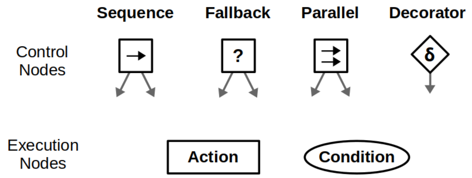


> [!tip]
> - 行为树最开始是为游戏设计，每个节点的 `tick()/run()` 是在一个 `while` 中被依次执行，因此，每个节点 `tick()/run()` 中应当执行的是非阻塞式且执行时间短的代码逻辑。
> - 若只是使用行为树来编排业务流程，只用从根节点开始只执行一次，则可以在 `tick()/run()` 中使用阻塞式逻辑

**案例**：实现一个机器人搜索特定物品的控制逻辑

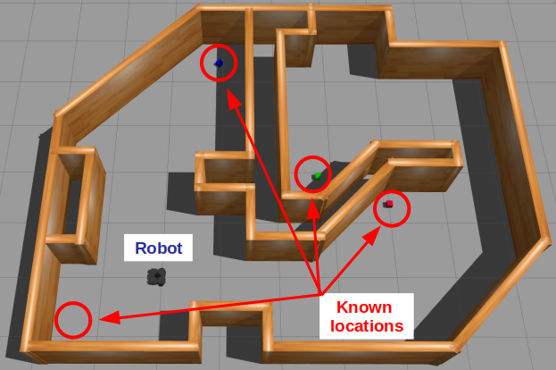

1. 走到位置 `A`，然后找到物体

    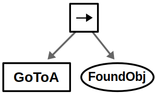

2. 在抵达 `A` 的过程中，机器人肯定要实时检测是否到达了 `A`，因此，还需加入是否抵达位置的判断

    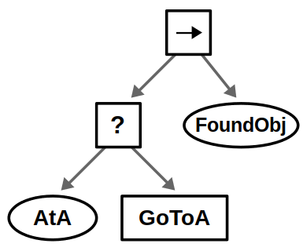

3. 添加其他待检测地点

    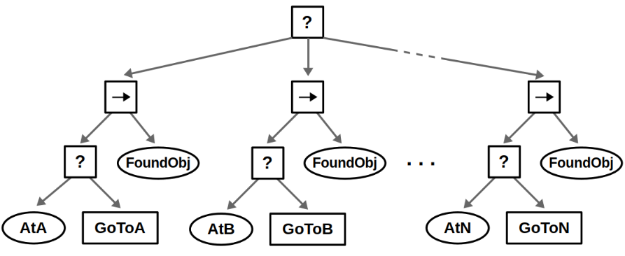

4. 增加被搜索物品

    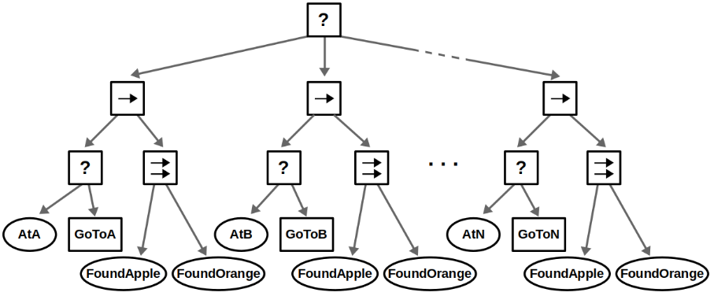

5. 上述行为树虽然实现了功能，但是流程太冗余，例如新增地点后，就需要重新添加大量行为。可引入 `repeat` 装饰器进行流程复用
   - `blackboard`: 行为树的上下文数据存放区域，可存储能被所有行为访问的共享数据
   - 实现流程
     1. 使用 `GetLoc` 从 `LocationQueue` 中读取地点并写入 `blackboard`，实现外部输入地址
     2. 后续流程均通过 `blackboard` 动态获取地点
     3. `repeat` 重复上述流程，实现流程复用

    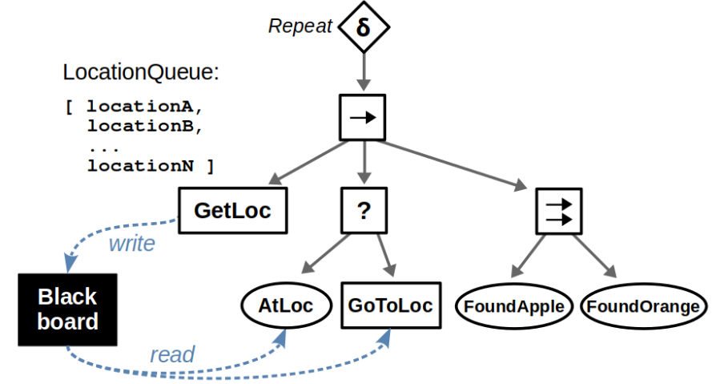

# 行为树 vs 状态机

行为树与状态机各有优势，二者适用于不同的场景，选择时需要根据具体需求进行权衡。
- **模块化`modularity`**: 行为树代码结构清晰，易于维护和扩展
- **反应性`reactivity`**: 状态机决策链路简单，能快速完成状态转移

> [!note]
> - **状态机**：由外部输入激励，使得系统状态改变，用于角色控制、NPC 决策
> - **行为树**：系统按流程自动处理任务，主要用于 NPC 决策

**案例1**：实现一个机器人从`A`前往`B`夹取物品，然后返回`A`

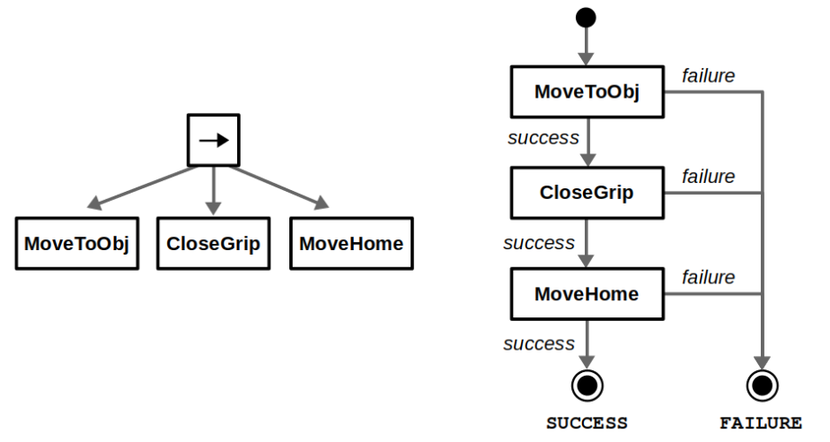

现在追加一个流程，机器人夹取物品时，需要检测夹取是否有效，且必要时进行修正

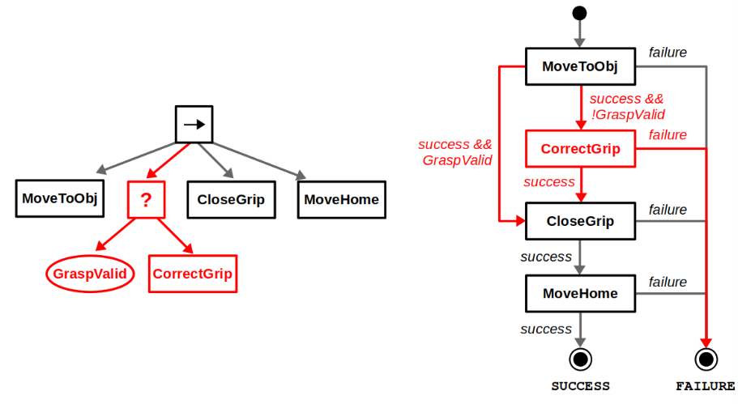

可以看出行为树流程更加清晰，符合直觉，且便于拓展。

**案例2**：机器人增加充电功能

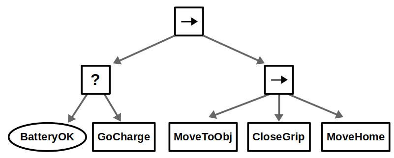
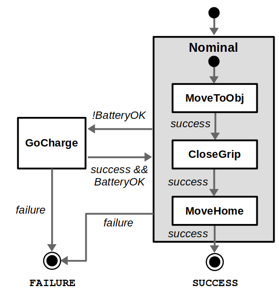

行为树虽然能马上实现功能，但要保证机器人在任何状态发现电量过低时都能及时充电，就需要在每个行为中添加电量检测的条件，导致冗余。相反，层次状态机则能快速实现机器人无论在哪个状态都能及时检测电量并进行充电。

为解决实际问题，行为树与状态机并不是互斥的，结合各自优势，设计混合架构反而是最优解
- **行为树**: 适用于复杂的行为逻辑，尤其是需要频繁修改和扩展的场景, **重点关注业务流程实现**
- **状态机**: 适用于状态转移关系复杂且需要快速响应的场景, **重点关注高层级状态管理**

结合行为树与状态机可设计出一个更为合理的充电流程

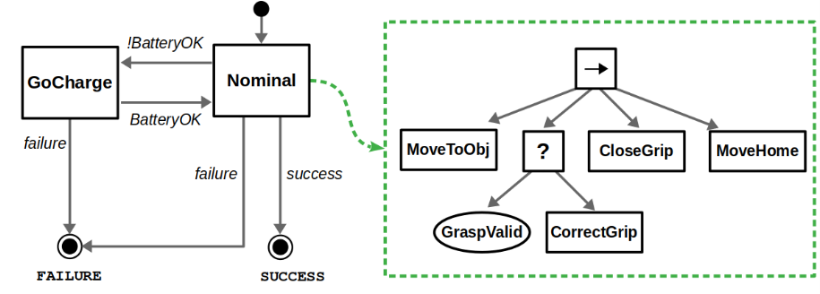

# 实现

- `cpp`
  - [behaviortree](https://www.behaviortree.dev/) : 最成熟的行为树库，但是体量较大，且依赖较多
  - [behavior3cpp](https://github.com/cleverpo/behavior3cpp): 轻量级，`behavior3` 的 `c++` 实现，功能全
  - [用C++实现一个高效可扩展的行为树（Behavior Tree）框架](https://jishuzhan.net/article/1978291782287949826): 纯手搓，最简单
- `python`
  - [py_trees](https://py-trees.readthedocs.io/en/devel/): 最成熟的行为树库，功能完善，且易于使用
  - [behavior3py](https://github.com/behavior3/behavior3py): `behavior3` 的 `python` 实现，轻量级，功能全


**案例**：实现机器人捡苹果

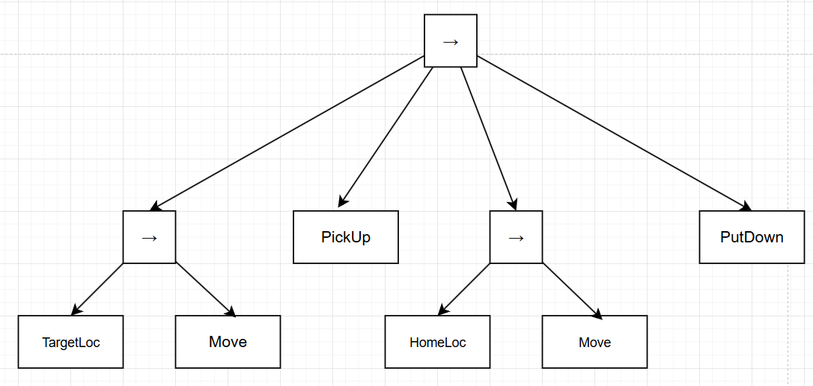

> [!note]
> 该行为树正常执行的前提是**控制行为**能记住状态，即 `memory=True`。
> - `memory == true`: 当子节点返回 `RUNNING` 后，父组合节点能记住该节点，并在下一轮 `tick()` 时，父节点从该子节点继续执行
> - `memory == false`: 当子节点返回 `RUNNING` 后，父组合节点不会记住该节点，并在下一轮 `tick()` 时，父节点从第一个子节点开始运行

```python
import py_trees
from dataclasses import dataclass,field
from typing import Optional

# 环境定义

@dataclass
class Location:
    name:str
    object: Optional[str] = None
    position: int = 0


@dataclass
class Enviroment:
    home_location: Location = field(default_factory=lambda: Location(name="home", position=0)) 
    patrol_locations: list[Location] = field(default_factory=list)
    apple_count: int = 0

@dataclass
class Robot:
    patrol_index: int = -1
    has_apple: bool = False
    position: int = 0
    target_position: int = 0

world = Enviroment()
robot = Robot()

# 行为定义

class TargetLocation(py_trees.behaviour.Behaviour):

    def update(self):
        robot.patrol_index = (robot.patrol_index + 1) % len(world.patrol_locations)
        robot.target_position = world.patrol_locations[robot.patrol_index].position
        print(f"指定目标 {robot.target_position}")
        return  py_trees.common.Status.SUCCESS

class HomeLocation(py_trees.behaviour.Behaviour):

    def update(self):
        robot.target_position = 0
        print(f"准备回家")
        return  py_trees.common.Status.SUCCESS

class MoveToTarget(py_trees.behaviour.Behaviour):
    def update(self): 

        if robot.target_position == robot.position:
            print(f"抵达目标 {robot.target_position}")
            return py_trees.common.Status.SUCCESS
        elif robot.target_position > robot.position:
            robot.position += 1
        elif robot.target_position < robot.position:
            robot.position -= 1
        
        return py_trees.common.Status.RUNNING

class PickUpApple(py_trees.behaviour.Behaviour):

    def update(self):
        loc = world.patrol_locations[robot.patrol_index]

        if loc.object == "Apple":
            robot.has_apple = True
            loc.object = None
            print(f"捡起苹果，位置 {loc.name}")
            return py_trees.common.Status.SUCCESS
        else:
            print(f"没有苹果，位置 {loc.name}")
            return py_trees.common.Status.FAILURE

class PutDownApple(py_trees.behaviour.Behaviour):

    def update(self):
        robot.has_apple = False
        world.apple_count += 1
        print(f"放下苹果，位置 {world.home_location.name}")
        return py_trees.common.Status.SUCCESS

# 行为树定影

def create_robot_tree():

    # 根节点
    root = py_trees.composites.Sequence(name="robot", memory=True)
    
    # 前往目标
    move_sequence = py_trees.composites.Sequence(name="move", memory=True)
    move_sequence.add_child(TargetLocation("target location"))
    move_sequence.add_child(MoveToTarget(name="move to target"))

    # 回家 
    home_sequence = py_trees.composites.Sequence(name="home", memory=True)
    home_sequence.add_child(HomeLocation("home location"))
    home_sequence.add_child(MoveToTarget(name="move to target"))

    # 流程整合
    root.add_children(
        [
            move_sequence,
            PickUpApple(name="pick up"),
            home_sequence,
            PutDownApple(name="put down")
        ]
    ) 
    
    return root


def main():
    # 环境初始化
    world.patrol_locations = [
        Location(name="A", object="Banana", position=5),
        Location(name="B", object="Apple", position=7),
        Location(name="C", object="Apple", position=-5),
    ] 


    # 创建树
    root = create_robot_tree()
    
    # 打印树的结构
    print("\n树的结构：")
    print(py_trees.display.unicode_tree(root, show_status=True))
    
    # 执行树
    print("\n执行树的过程：")
    while world.apple_count < 2:
        root.tick_once()
        print(f"机器人位置: {robot.position}, 苹果数量: {world.apple_count}")

if __name__ == "__main__":
    main()
```

```term
triangle@LEARN:~$ python demo.py
树的结构：
{-} robot [-]
    {-} move [-]
        --> target location [-]
        --> move to target [-] 
    --> pick up [-]
    {-} home [-]
        --> home location [-]  
        --> move to target [-] 
    --> put down [-]


执行树的过程：
指定目标 5
机器人位置: 1, 苹果数量: 0     
机器人位置: 2, 苹果数量: 0     
机器人位置: 3, 苹果数量: 0     
机器人位置: 4, 苹果数量: 0     
机器人位置: 5, 苹果数量: 0     
抵达目标 5
没有苹果，位置 A
机器人位置: 5, 苹果数量: 0     
指定目标 7
机器人位置: 6, 苹果数量: 0
机器人位置: 7, 苹果数量: 0
抵达目标 7
捡起苹果，位置 B
准备回家
机器人位置: 6, 苹果数量: 0
机器人位置: 5, 苹果数量: 0
机器人位置: 4, 苹果数量: 0
机器人位置: 3, 苹果数量: 0
机器人位置: 2, 苹果数量: 0
机器人位置: 1, 苹果数量: 0
机器人位置: 0, 苹果数量: 0
抵达目标 0
放下苹果，位置 home
机器人位置: 0, 苹果数量: 1
指定目标 -5
机器人位置: -1, 苹果数量: 1
机器人位置: -2, 苹果数量: 1
机器人位置: -3, 苹果数量: 1
机器人位置: -4, 苹果数量: 1
机器人位置: -5, 苹果数量: 1
抵达目标 -5
捡起苹果，位置 C
准备回家
机器人位置: -4, 苹果数量: 1
机器人位置: -3, 苹果数量: 1
机器人位置: -2, 苹果数量: 1
机器人位置: -1, 苹果数量: 1
机器人位置: 0, 苹果数量: 1
抵达目标 0
放下苹果，位置 home
机器人位置: 0, 苹果数量: 2
```