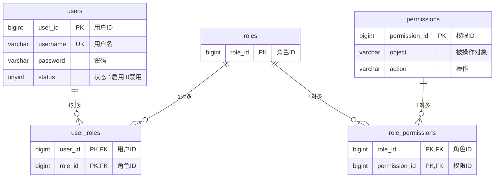
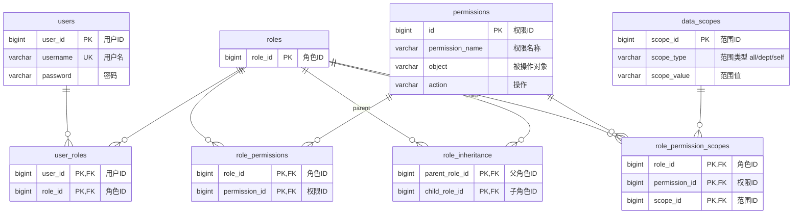

# 权限管理

# RBAC

**`RBAC（Role-Based Access Control)` 基于角色的访问控制**: 不直接把权限给用户，而是先建角色，给角色分配权限，再将用户绑定到具体的角色。**当人员变动时，只改用户-角色关系就行，不用动几百条权限记录。**

经典五表设计方案

增加角色继承和数据范围控制的进阶版

# ACL

**`ACL（Access Control List)` 访问控制列表**: 给每个数据对象（表、视图、函数等）创建记录用户权限的表。表中的一条权限访问条目`ACE`主要声明 “谁能对哪个东西做什么”，因此至少至少有三个字段

| 要素             | 说明   | 示例                                |
| -------------- | ---- | --------------------------------- |
| **主体** (Subject) | 谁    | 用户 `alice`、角色 `role`              |
| **客体** (Object) | 哪个东西 | `orders` 表、`user_view` 视图、`resource` 资源 |
| **权限** (Privilege) | 能做什么 | `SELECT`、`INSERT`、`DELETE`        |

# RBAC vs ACL

| 维度  | RBAC    | ACL        |
| --- | ------- | ---------- |
| 粒度  | 粗粒度，账号级 | 细粒度，数据级    |
| 场景  | 为账号设置权限 | 针对具体数据设置权限 |

> [!note]
> 一般使用 `RBAC` 实现对账号进行权限控制即可，当有特别需求时，才使用 `ACL` 进行精细化控制