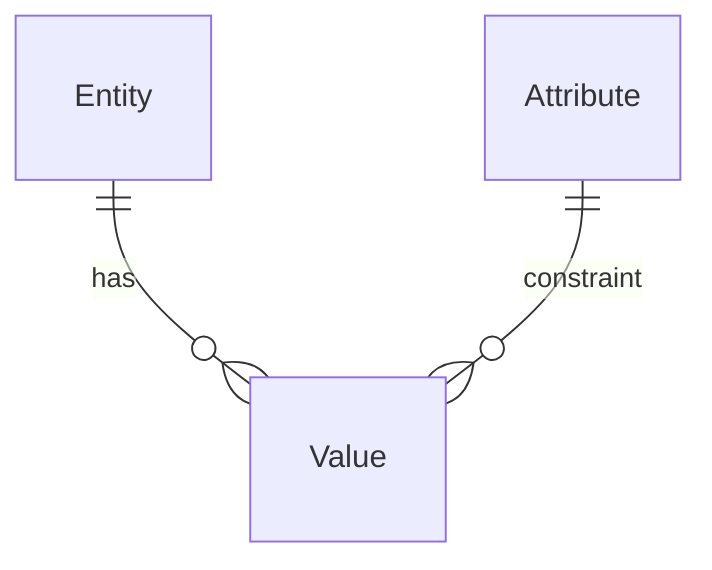
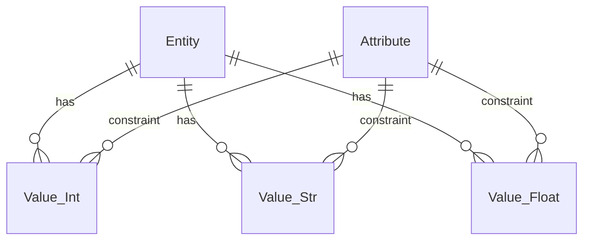
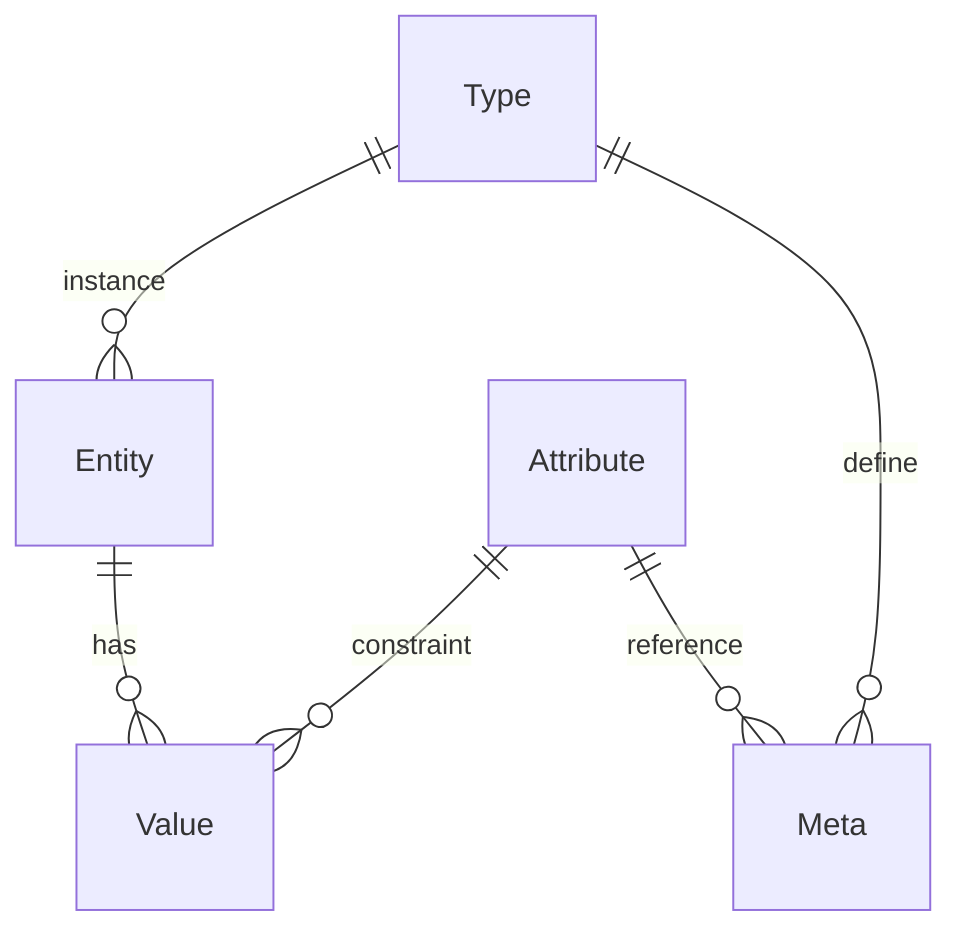

# 数据存储设计模式

# 存储模式

## 数据实例

针对**关系型数据库**，数据实例在表中的存储方式主要有三种设计模式

- 传统固定列：数据表的一行就是一个数据实例，一列就是数据的一个属性
- `JSONB`字段：数据表的一行就是一个数据实例，用一个 `JSONB` 字段来存储所有属性（`json`格式）
- `EAV(Entity-Attribute-Value)` 模型：一张表存储数据实例`Entity`，一张表存储数据属性定义`Attribute`，一张表存储属性值`Value`（连接`Entity`与`Attribute`的关系表）

| 特性         | 传统固定列                      | JSONB 字段                 | EAV 模型                      |
| ---------- | -------------------------- | ------------------------ | --------------------------- |
| **Schema 灵活性** | 低，需预先定义列结构，修改需 ALTER TABLE | 高，可随时添加新属性，无需修改表结构       | 极高，属性可动态定义，完全无 Schema 限制    |
| **查询性能**   | 高，支持索引优化，JOIN 少            | 中，支持 GIN 索引，但复杂查询性能不如固定列 | 低，多表 JOIN 开销大，查询复杂          |
| **存储效率**   | 高，数据类型精确，无冗余               | 中，JSON 格式有存储开销，重复键名      | 低，大量行存储，关系表膨胀快              |
| **数据完整性**  | 强，可定义约束、类型、默认值             | 弱，需应用层校验 JSON 结构         | 弱，需应用层保证一致性                 |
| **适用场景**   | 结构固定、查询频繁的业务数据（如订单、用户）     | 半结构化数据、属性多变（如配置、日志、元数据）  | 属性高度动态、实例间属性差异大（如医疗记录、产品规格） |
| **使用复杂度**  | 低，ORM 直接映射                 | 中，需处理 JSON 序列化/反序列化      | 高，需封装复杂的 CRUD 逻辑            |
| **字段扩展性**  | 差，列数有限制，宽表性能下降             | 好，单字段承载任意属性              | 理论上无限，但性能随数据量下降严重           |

> [!note]
> - 模式的选择顺序：固定列 > 固定列 + `JSONB` > 固定列 + `JSONB` + `EAV` > 固定字段 + `EAV`
> - **`EAV` 只适用于字段高度动态变化的场景，其他场景使用「固定列 + `JSONB`」便能解决**


## 元数据

元数据`Metadata`是对数据字段结构的抽象，例如类实例对象是数据，而类定义则是元数据；`json` 是数据，`json schema`是元数据。针对元数据的存储也有以下三种设计模式

| 特性    | 表结构       | `json schema`          | 类        | `Type-Attribute-Meta` 表                                  |
| ----- | --------- | ---------------------- | -------- | -------------------------------------------------------- |
| 实现    | 数据库的表结构定义 | 使用 `json schema`定义数据字段结构 | 应用层定义类结构 | \- `Type`表：一行数据就是一个类型</br>- `Meta`表：存储类型的字段结构，即`Type`与`Attribute`的关联关系 |
| 适用场景  | 固定列模式     | 通用                     | 与语言绑定    | 通用                                                       |
| 数据约束  | 数据库自动执行   | 应用层控制                  | 应用层控制    | 应用层控制                                                    |
| 使用复杂度 | 简单        | 中等                     | 中等       | 复杂                                                       |

> [!note]
> 元数据相对于数据实例，量比较少，因此，没啥特别限制，按照实际功能选型即可

# 元数据驱动

**元数据驱动`Metadata-driven`** 就是使用 `json schema` 、 `Type-Attribute-Meta` 形式存储数据的元数据，而非使用数据库表结构硬编码，**从而在逻辑层面实现数据定义与数据存储分离**。因此，便能对数据库进一步封装，创建一个更加方便的数据管理平台。用户只需定义自己的数据结构，而不用关心数据如何存储。

| 维度      | **NocoBase**        | **Directus**     | **Strapi**          | **veops/cmdb** | **OpenMetadata** |
| :------ | :------------------ | :--------------- | :------------------ | ---------- | :------------ |
| **定位**  | 搭建复杂业务系统的**低代码平台**  | 给现有数据库套上**API和管理后台** | 为前端定制的**无头内容中心**    | 资产管理       | 管理数据资产的**数据治理门户** |
| **数据策略** | 支持 PostgreSQL、MySQL | **连接你的现有数据库**    | 支持 PostgreSQL、MySQL | MySQL      | **采集元数据**，不碰业务数据 |
| API 吞吐量 | 一般                  | 较好               | 好                   | 一般         | 最好，但不是管理数据的   |
| **最佳场景** | 企业级后台、CRM、ERP       | 快速API化老系统或数据库    | 官网、电商App、内容中台       | 资产管理       | 数据资产目录、血缘分析   |

# EAV 模式

## 数据存储

```txt
┌─────────────────┐     ┌─────────────────┐     ┌─────────────────┐
│    Entity       │     │   Attribute     │     │     Value       │
├─────────────────┤     ├─────────────────┤     ├─────────────────┤
│ entity_id (PK)  │     │ attribute_id(PK)│     │ entity_id (FK)  │
│ entity_type     │     │ attribute_name  │     │ attribute_id(FK)│
│                 │     │ data_type       │     │ value           │
└─────────────────┘     └─────────────────┘     └─────────────────┘
```

对应的 `ER` 关系图为



对于 `Value` 表，还会进一步按照字段值类型进行分类，拆分为多张表

```txt
┌─────────────────┐  ┌─────────────────┐  ┌─────────────────┐
│    Value_Int    │  │    Value_Str    │  │   Value_Float   │
├─────────────────┤  ├─────────────────┤  ├─────────────────┤
│ entity_id (FK)  │  │ entity_id (FK)  │  │ entity_id (FK)  │
│ attribute_id(FK)│  │ attribute_id(FK)│  │ attribute_id(FK)│
│ value           │  │ value           │  │ value           │
└─────────────────┘  └─────────────────┘  └─────────────────┘
```

对应的 `ER` 关系图就变成



## 元数据

```txt
┌─────────────────┐     ┌─────────────────┐     ┌─────────────────┐
│    Entity       │     │   Attribute     │     │     Value       │
├─────────────────┤     ├─────────────────┤     ├─────────────────┤
│ entity_id (PK)  │     │ attribute_id(PK)│     │ entity_id (FK)  │
│ type_id (FK)    │     │ attribute_name  │     │ attribute_id(FK)│
│                 │     │ data_type       │     │ value           │
└─────────────────┘     └─────────────────┘     └─────────────────┘
┌─────────────────┐     ┌─────────────────┐   
│      Type       │     │      Meta       │   
├─────────────────┤     ├─────────────────┤   
│ type_id (PK)    │     │ attribute_id(FK)│   
│                 │     │ type_id(FK)     │   
│                 │     │                 │   
└─────────────────┘     └─────────────────┘   
```

对应的 `ER` 关系图就变成



# JSONB

## 介绍

`JSONB（JSON Binary）`是 `PostgreSQL` 数据库中一种特殊的 `JSON` 数据类型，它将 `JSON` 数据以二进制格式存储，而不是纯文本格式

- `GIN` 索引：通用倒排索引，是 `PostgreSQL` 中一种特殊的索引类型，专门用于复合数据类型的快速搜索。**可用于`JSONB`数据的`JSON`字段查询**
- **以 `JSON` 格式存储数据，可实现根据灵活的字段控制，而不会影响表结构**

## SQL

### 案例

假设 `users` 表中的 `info` 字段为 `JSONB`，且数据结构如下

```json
{
  "name": "张三",
  "age": 25,
  "email": "zhangsan@example.com",
  "tags": ["vip", "tech"],
  "address": {
    "city": "北京",
    "street": "长安街1号"
  },
  "scores": [85, 92, 78],
  "orders": [
    {"id": 1, "product": "手机", "price": 2999},
    {"id": 2, "product": "耳机", "price": 399}
  ]
}
```

### 基础操作符

1. `->` 获取 JSON 对象字段（返回 JSONB 类型）

```sql
-- 获取 name 字段，返回 JSONB 类型
SELECT info -> 'name' FROM users WHERE id = 1;
-- 结果: "张三"（带引号的JSON字符串）

-- 获取嵌套对象
SELECT info -> 'address' FROM users WHERE id = 1;
-- 结果: {"city": "北京", "street": "长安街1号"}

SELECT info -> 'address' -> 'city' FROM users WHERE id = 1;
-- 结果："北京"

-- 获取数组元素（按索引）
SELECT info -> 'tags' -> 0 FROM users WHERE id = 1;
-- 结果: "vip"
```

1. `->>` 获取 JSON 对象字段（返回 TEXT 类型）

```sql
-- 获取 name 字段，返回纯文本
SELECT info ->> 'name' FROM users WHERE id = 1;
-- 结果: 张三（不带引号）

-- 获取嵌套字段
SELECT info -> 'address' ->> 'city' FROM users WHERE id = 1;
-- 结果: 北京

-- 在 WHERE 条件中使用
SELECT * FROM users WHERE info ->> 'name' = '张三';
```

1. `#>` 获取指定路径的值（返回 JSONB 类型）

```sql
-- 获取嵌套路径
SELECT info #> '{address, city}' FROM users WHERE id = 1;
-- 结果: "北京"

-- 获取数组元素
SELECT info #> '{tags, 0}' FROM users WHERE id = 1;
-- 结果: "vip"
```

1. `#>>` 获取指定路径的值（返回 TEXT 类型）

```sql
-- 获取嵌套路径的文本值
SELECT info #>> '{address, city}' FROM users WHERE id = 1;
-- 结果: 北京

-- 获取深层嵌套
SELECT info #>> '{orders, 0, product}' FROM users WHERE id = 1;
-- 结果: 手机
```

### 包含与存在

1. `@>` 包含操作符（左侧包含右侧）

```sql
-- 查询 tags 包含 "vip" 的记录
SELECT * FROM users WHERE info @> '{"tags": ["vip"]}';
-- 结果: 返回所有 tags 数组中包含 "vip" 的用户

-- 查询嵌套对象包含指定键值
SELECT * FROM users WHERE info @> '{"address": {"city": "北京"}}';
-- 结果: 返回地址城市为北京的用户

-- 查询多个条件
SELECT * FROM users WHERE info @> '{"age": 25, "tags": ["tech"]}';
-- 结果: 返回年龄25且标签包含tech的用户
```

1. `<@` 被包含操作符（左侧被右侧包含）

```sql
-- 查询 JSON 数据是否被指定结构包含
SELECT * FROM users WHERE info <@ '{"name": "张三", "age": 25, "tags": ["vip", "tech"]}';
-- 结果: 返回完全匹配或字段更少的记录

-- 检查简单值
SELECT '{"name": "张三"}'::jsonb <@ info FROM users WHERE id = 1;
-- 结果: true（如果info包含name字段且值为张三）
```

1. `?` 检查键是否存在

```sql
-- 检查是否存在 email 键
SELECT * FROM users WHERE info ? 'email';
-- 结果: 返回所有包含email字段的记录

-- 检查嵌套键（仅检查顶层）
SELECT info ? 'address' FROM users WHERE id = 1;
-- 结果: true
```

1. `?|` 检查任意键是否存在

```sql
-- 检查是否存在 name 或 phone 键
SELECT * FROM users WHERE info ?| ARRAY['name', 'phone'];
-- 结果: 返回包含name或phone字段的记录

-- 实际应用
SELECT info ?| ARRAY['status', 'email'] FROM users WHERE id = 1;
-- 结果: true（因为存在email键）
```

1. `?&` 检查所有键是否存在

```sql
-- 检查是否同时存在 name 和 email 键
SELECT * FROM users WHERE info ?& ARRAY['name', 'email'];
-- 结果: 返回同时包含name和email字段的记录

-- 检查多个键
SELECT info ?& ARRAY['name', 'age', 'address'] FROM users WHERE id = 1;
-- 结果: true（所有键都存在）
```

### 连接操作符

1. `||` 合并两个 JSONB

```sql
-- 添加新字段
SELECT info || '{"status": "active"}' FROM users WHERE id = 1;
-- 结果: 原JSON加上 status 字段

-- 更新现有字段（后面的值覆盖前面的）
SELECT info || '{"age": 26, "phone": "13800138000"}' FROM users WHERE id = 1;
-- 结果: age 被更新为26，添加了phone字段

-- 合并数组（整个数组替换）
SELECT info || '{"tags": ["new_vip"]}' FROM users WHERE id = 1;
-- 结果: tags 完全替换为 ["new_vip"]

-- 实际UPDATE操作
UPDATE users SET info = info || '{"last_login": "2026-06-10"}';
```

### 删除操作符

1. `-` 删除键或元素

```sql
-- 删除单个键
SELECT info - 'age' FROM users WHERE id = 1;
-- 结果: 返回不包含age字段的JSON

-- 删除多个键
SELECT info - ARRAY['age', 'email'] FROM users WHERE id = 1;
-- 结果: 返回不包含age和email字段的JSON

-- 删除数组中的元素（按索引）
SELECT info #- '{tags, 0}' FROM users WHERE id = 1;
-- 结果: tags 数组删除第一个元素

-- 删除嵌套路径
SELECT info #- '{address, street}' FROM users WHERE id = 1;
-- 结果: address 对象中删除 street 字段
```

### JSONB 函数

1. `jsonb_set()` 设置值

```sql
-- 更新顶层字段
UPDATE users SET info = jsonb_set(info, '{age}', '26') WHERE id = 1;

-- 更新嵌套字段
UPDATE users SET info = jsonb_set(info, '{address, city}', '"上海"') WHERE id = 1;

-- 创建不存在的路径（需要 create_missing 参数）
UPDATE users SET info = jsonb_set(info, '{profile, level}', '"gold"', true) WHERE id = 1;
-- 结果: 添加 profile: {"level": "gold"} 结构

-- 更新数组元素
UPDATE users SET info = jsonb_set(info, '{scores, 0}', '90') WHERE id = 1;
```

1. `jsonb_insert()` 插入值

```sql
-- 在数组指定位置插入
UPDATE users SET info = jsonb_insert(info, '{tags, 0}', '"new_tag"') WHERE id = 1;
-- 结果: tags 数组开头插入 "new_tag"

-- 在对象中插入新字段（需指定 after 参数）
UPDATE users SET info = jsonb_insert(info, '{new_field}', '"value"', true) WHERE id = 1;
```

1. `jsonb_strip_nulls()` 删除 `null` 值

```sql
-- 删除所有 null 值字段
SELECT jsonb_strip_nulls('{"name": "张三", "phone": null}'::jsonb);
-- 结果: {"name": "张三"}
```

1. `jsonb_pretty()` 格式化输出

```sql
-- 格式化 JSON 输出
SELECT jsonb_pretty(info) FROM users WHERE id = 1;
-- 结果: 格式化的、易读的JSON
```

### 数组操作

1. `jsonb_array_elements()` 展开数组

```sql
-- 展开 tags 数组
SELECT jsonb_array_elements(info -> 'tags') FROM users WHERE id = 1;
-- 结果:
-- "vip"
-- "tech"

-- 展开对象数组
SELECT jsonb_array_elements(info -> 'orders') -> 'product' FROM users WHERE id = 1;
-- 结果:
-- "手机"
-- "耳机"
```

1. `jsonb_array_length()` 数组长度

```sql
-- 获取数组长度
SELECT jsonb_array_length(info -> 'tags') FROM users WHERE id = 1;
-- 结果: 2

-- 在WHERE条件中使用
SELECT * FROM users WHERE jsonb_array_length(info -> 'tags') > 1;
```

### GIN 索引

```sql
-- 创建 GIN 索引
CREATE INDEX idx_users_info ON users USING GIN (info);

-- 创建特定路径索引
CREATE INDEX idx_users_name ON users ((info ->> 'name'));
```


## 完整实战示例

```sql
-- 创建测试表
CREATE TABLE users (
    id SERIAL PRIMARY KEY,
    info JSONB
);

-- 插入数据
INSERT INTO users (info) VALUES (
    '{
        "name": "张三",
        "age": 25,
        "email": "zhangsan@example.com",
        "tags": ["vip", "tech"],
        "address": {
            "city": "北京",
            "street": "长安街1号"
        },
        "scores": [85, 92, 78],
        "orders": [
            {"id": 1, "product": "手机", "price": 2999},
            {"id": 2, "product": "耳机", "price": 399}
        ]
    }'::jsonb
);

-- 综合查询示例
SELECT 
    info ->> 'name' AS name,
    info -> 'address' ->> 'city' AS city,
    jsonb_array_length(info -> 'tags') AS tag_count,
    info @> '{"tags": ["vip"]}' AS is_vip
FROM users
WHERE info ?& ARRAY['name', 'email']
  AND (info -> 'address' ->> 'city') = '北京'
  AND jsonb_array_length(info -> 'tags') > 0;
```