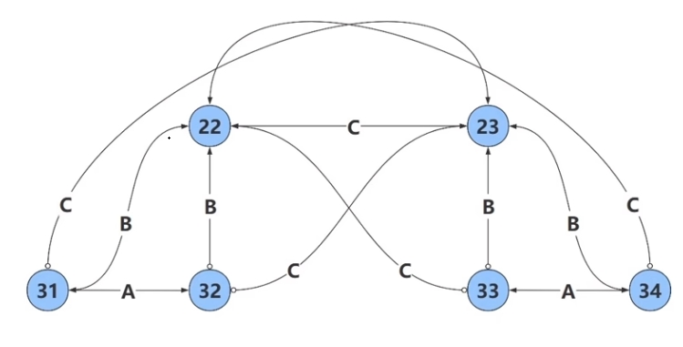
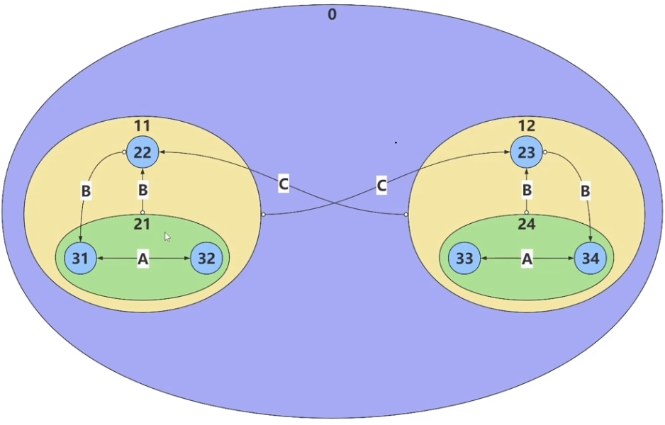
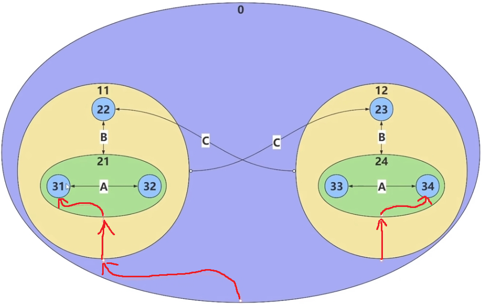
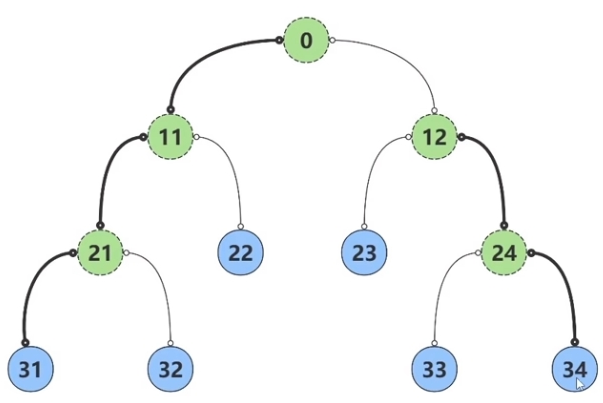
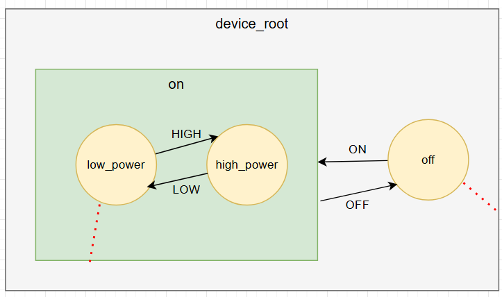

# 状态机

# 有限状态机

## 概念

有限状态机由四个核心要素构成
1. 状态（States）: 系统可能处于的有限个状态。例如：待机、移动、攻击、跳跃、受伤、死亡。
2. 转换（Transitions）: 从一个状态到另一个状态的条件和规则。例如：按下移动键时，从待机状态转换到移动状态。
3. 事件（Events）: 触发状态转换的输入。例如：键盘按下、血量变化、动画完成等。
4. 动作（Actions）: 在进入、退出状态或转换时执行的操作。例如：播放动画、播放音效、设置属性等

```txt
        [待机状态]
    <退出状态 quite-action>
            |
            | 按下移动键
            ↓
    <进入状态 enter-action>
        [移动状态]
    <退出状态 exit-action>
            |
            | 按下攻击键
            ↓
        [攻击状态]
            |
            | 攻击完成
            ↓
        [待机状态]
            |
            | 受到伤害
            ↓
        [受伤状态]
            |
            | 血量 <= 0
            ↓
        [死亡状态]
```

## 实现

```cpp
#ifndef __FSM__
#define __FSM__

#include <mutex>
#include <memory>
#include <typeindex>
#include <unordered_map>

enum STATUS_E{
    STATUS_TRAN,    /**< 状态转换标志 */
    STATUS_HANDLED, /**< 事件已处理标志 */
};

class Fsm;
class AbstractState{
public:
    using ptr = AbstractState*;
public:
    virtual STATUS_E transit(Fsm & fsm , int event) = 0;
    virtual void enter() {};
    virtual void exit() {};
};

class Fsm{
public:
    Fsm()
        :m_state(nullptr)
    {}

    template<class T>
    static AbstractState::ptr state(){
        std::lock_guard<std::mutex> lock(m_mutex);
        auto index = std::type_index(typeid(T));
        auto item = m_mapStates.find(index);
        if (item != m_mapStates.end()){
            return item->second.get();
        }
        auto ptr = std::static_pointer_cast<AbstractState>(std::make_shared<T>());
        m_mapStates.insert(std::pair(index, ptr));
        return ptr.get(); 
    }

    void init(AbstractState::ptr state){
        m_state = state;
        m_state->enter();
    }

    void dispatch(int event){
        auto preState = m_state;
        auto status = m_state->transit(*this, event);

        if (status == STATUS_E::STATUS_TRAN){
            preState->exit();
            m_state->enter();
        }
    }

    void setState(AbstractState::ptr state) { m_state = state;}
    AbstractState::ptr & state() { return m_state;}
private:
    AbstractState::ptr m_state;

    static std::mutex m_mutex;
    static std::unordered_map<std::type_index, std::shared_ptr<AbstractState> > m_mapStates;
};

std::mutex Fsm::m_mutex;
std::unordered_map<std::type_index, std::shared_ptr<AbstractState> > Fsm::m_mapStates;

#endif /* __FSM__ */
```

使用

```cpp
#include "Fsm.hpp"

#include <iostream>

class RunState;
class IdleState;

enum EVENT_E{
    EVENT_NONE,
    EVENT_RUN,
    EVENT_STOP
};

class RunState : public AbstractState{
public:

     virtual STATUS_E transit(Fsm & fsm , int event) override{
        switch (event)
        {
        case EVENT_E::EVENT_STOP:
            std::cout << "run -> idle" << std::endl;
            fsm.setState(Fsm::state<IdleState>());
            return STATUS_E::STATUS_TRAN;
        default:
            break;
        }
        return STATUS_E::STATUS_HANDLED;
     }

    virtual void enter() {
        printf("\t run enter\n");
    };
    virtual void exit() {
        printf("\t run exit\n");
    }
};

class IdleState : public AbstractState{
public:
    virtual STATUS_E transit(Fsm & fsm , int event) override {
    switch (event)
    {
    case EVENT_E::EVENT_RUN:
        std::cout << "idle -> run" << std::endl;
        fsm.setState(Fsm::state<RunState>());
        return STATUS_E::STATUS_TRAN;
    default:
        break;
    }
    return STATUS_E::STATUS_HANDLED;
    }
    virtual void enter() {
        printf("\t idle enter\n");
    };
    virtual void exit() {
        printf("\t idle exit\n");
    }
};


int main(int argc, char const *argv[])
{
    Fsm fsm;
    fsm.init(Fsm::state<IdleState>());

    fsm.dispatch(EVENT_E::EVENT_RUN);
    fsm.dispatch(EVENT_E::EVENT_STOP);
    return 0;
}
```

```term
triangle@LEARN:~$ ./demo
         idle enter
idle -> run
         idle exit
         run enter
run -> idle
         run exit
         idle enter
```

# 分层状态机

## 概念

有限状态机难以处理复杂的状态转移关系，代码会变得不直观且难以维护。



**分层状态机**通过状态归类和嵌套来解决这个问题。
- 状态 `31` 与 `32` 接收到事件 `B` 时，均转换为 `22`，因此，将 `31` 与 `32` 合并为一个虚拟状态 `21`，由 `21` 统一处理事件 `B`
- 状态 `33` 与 `34` 接收到事件 `B` 时，均转换为 `23`，因此，将 `33` 与 `34` 合并为一个虚拟状态 `24`, 由 `24` 统一处理事件 `B`
- 状态 `22`、`31` 与 `32` 接收到事件 `C` 时，均转换为 `23`，因此，将 `21` 与 `22` 合并为一个虚拟状态 `11`，由 `11` 统一处理事件 `C`
- 状态 `23`、`33` 与 `34` 接收到事件 `C` 时，均转换为 `22`，因此，将 `24` 与 `23` 合并为一个虚拟状态 `12`, 由 `12` 统一处理事件 `C`



> [!note]
> - 需要保证合并后的虚拟状态对于每种事件只存在一种转移，**即有向图中，同一事件下节点的出度 `== 1`**，若不满足，则不能合并
> - 虚拟状态就是对真实状态分组(分层)

为了保证每个虚拟状态能对应上一个真实状态，就需要给每个虚拟状态定义一个「默认子状态」，**即父状态到子状态的转移路径，红色线条表示**
- 当状态处于一个虚拟状态时，会沿着默认状态路径，将状态转移到真实状态上停止
- 父状态转移处理的是所有子状态的共性逻辑，而子状态则处理自身的特有逻辑，**即父状态拥有子状态**




上述的层次图可转化成一个树状图



状态机初始化流程，假设指定初始化状态为 `21`
1. 从 `21` 节点开始，找到抵达 `0` 节点的路径，`21 -> 11 -> 0`
2. 依次完成 `0 -> 11 -> 21` 的 `Enter Action`
3. 由于 `21` 是虚拟状态，还需将实际状态移动到默认子状态 `31` 上
4. `31` 是实际状态，初始化完成

状态分发流程，假设在状态 `31` 时，接收到了事件 `B` 
1. `31` 不处理事件 `B`，将事件传递到父状态 `21`
2. `21` 处理处理事件 `B`，完成 `21 -> 22` 的状态转移
3. `22` 按照默认路径转移
4. 由于 `22` 是实际状态，不存在默认状态，因此，分发结束

可知，`current_state` 处理事件的分发流程可概括为
1. 从 `current_state` 往 `root_state` 遍历，找到真正能处理事件的状态 `pre_state`, 以及 `target_state`
2. `pre_state` 要么是 `current_state` 要么是其父状态，因此，将 `current_state` 逐层移动到 `pre_state`
3. 完成 `pre_state -> target_state` 状态转移，状态转移流程会有以下几种情况
  - `pre_state == target_state` 自己跳转自己：执行退出事件，再执行进入事件
  - `target_state` 是 `pre_state` 的子状态：无需执行退出事件，直接执行进入事件
  - `target_state` 与 `pre_state` 处于同一层级：执行退出事件，再执行进入事件
  - `target_state` 是 `pre_state` 的父状态：执行退出事件，不执行进入事件
  - `target_state` 与 `pre_state` 没有直接联系，例如`34 -> 22`：找出公共祖先状态，执行退出和进入事件
4. 状态机抵达 `target_state` 后，还要根据默认路径，将 `target_state` 变换为实际状态


## 实现

```cpp
#ifndef __HIERARCHY_FSM__
#define __HIERARCHY_FSM__

#include <memory>
#include <vector>
#include <mutex>
#include <typeindex>
#include <unordered_map>

enum STATUS_E{
    STATUS_NONE,    // 空状态
    STATUS_TRAN,    // 发生状态
    STATUS_HANDLED, // 事件处理
    STATUS_PARENT,   // 事件传递给父状态
};


/* 状态父类定义 */
class HierarchyFsm;
class AbstractState{
public:
    using ptr = AbstractState*;
public:
    virtual ~AbstractState() = default;

    virtual ptr upState() { return nullptr; };
    virtual ptr downState() { return nullptr; };

    virtual STATUS_E transit(HierarchyFsm & fsm , int event) = 0;
    virtual void enter() {};    // 状态进入 action
    virtual void exit() {};     // 状态退出 action
};


class HierarchyFsm{
 
public:

    HierarchyFsm()
        :m_root(nullptr),m_state(nullptr)
    {

    }

    template<class T>
    static AbstractState::ptr state(){
        std::lock_guard<std::mutex> lock(m_mutex);
        auto index = std::type_index(typeid(T));
        auto item = m_mapStates.find(index);
        if (item != m_mapStates.end()){
            return item->second.get();
        }
        auto ptr = std::static_pointer_cast<AbstractState>(std::make_shared<T>());
        m_mapStates.insert(std::pair(index, ptr));
        return ptr.get(); 
    }

    void setState(AbstractState::ptr state) { m_state = state;}
    AbstractState::ptr & state() { return m_state;}

    void init(const AbstractState::ptr & init, const AbstractState::ptr & root){
        m_root = root;
        m_state = init;

        // 初始化 root -> init 状态
        m_state = moveDown(root, init);
    }
    void init( const AbstractState::ptr & root){
        m_root = root;
        m_state = root;

        // 初始化 root -> init 状态
        m_state = moveDown(root, root->downState());
    }

    void dispatch(int event){
        auto currState = m_state;
        auto preState = AbstractState::ptr(nullptr);
        auto enStatus = STATUS_E::STATUS_NONE;

        // 查找目标状态 
        do {
            preState = m_state;
            enStatus = m_state->transit(*this, event);
            if(enStatus == STATUS_E::STATUS_PARENT){
                m_state = m_state->upState();
            }
        }while(enStatus == STATUS_E::STATUS_PARENT);

        // 不用状态转移
        if (enStatus != STATUS_E::STATUS_TRAN){
            m_state = currState;
            return;
        }

        // 完成状态转移 currState -> preState -> m_state
        stateTransit(currState, preState, m_state);

        // 转移到 targetState 后，完成进入默认子状态
        m_state = moveDown(m_state, m_state->downState());
    }


private:
    void stateTransit(AbstractState::ptr startState, AbstractState::ptr preState, AbstractState::ptr targetState){

        // start 移动到 middle，一直退出
        while(startState != preState){
            startState->exit();
            startState = startState->upState();
        }

        // 1. 跳转到自身：执行退出事件，再执行进入事件
        if (startState == targetState){
            startState->exit();
            targetState->enter();
            return;
        }
        
        // // 2. 跳转到子状态：无需执行退出事件，直接执行进入事件
        // if (startState == targetState->upState()){
        //     targetState->enter();
        //     return;
        // }

        // 3. 跳转到兄弟状态：执行退出事件，再执行进入事件
        if (startState->upState() == targetState->upState()){
            startState->exit();
            targetState->enter();
            return;
        }

        // 4. 跳转到父状态：执行退出事件，不执行进入事件
        if (startState->upState() == targetState){
            startState->exit();
            return;
        }

        // 5. 跳转到非相邻状态：找出公共祖先状态，执行退出和进入事件
        std::vector<AbstractState::ptr> vecPath = {targetState};

        // 从当前状态开始，向上遍历到根节点，记录路径
        auto ancestor = targetState->upState();
        while (ancestor != nullptr) {
            // 5.1 preState 是 targetState 的祖先, vecPath 全部
            if (ancestor == startState){
                enterTargetState(vecPath, vecPath.size() - 1);
                return;
            }

            vecPath.push_back(ancestor);
            ancestor = ancestor->upState();
        }

        // 5.2 vecPath 中存放的就是，从 targetState 一直到 RootState 的路径
        // 从 startState 依次退出，直到抵达 vecPath 中状态，然后进入
        while(true){
            startState->exit();
            startState = startState->upState();

            for (size_t i = vecPath.size()-1; i >= 0; i--){
                if (startState == vecPath[i]){
                    enterTargetState(vecPath, i);
                    m_state = targetState;
                    return;
                }
            }
        }
    }

    void enterTargetState(std::vector<AbstractState::ptr> & vecPath, int nIndex){
        while (nIndex-- >= 0){
            vecPath[nIndex]->enter();
        }
    }

    /* 从 startState 开始进入子状态 */
    AbstractState::ptr moveDown(AbstractState::ptr startState, AbstractState::ptr targetState){

        while(targetState != nullptr){
            std::vector<AbstractState::ptr> vecPath;

            // startState 到 endStart 的路径
            while(targetState != startState){
                vecPath.push_back(targetState);
                targetState = targetState->upState();
            }

            // startState 到 endStart 激活 enter
            for (int i = vecPath.size() - 1; i >= 0; --i){
                vecPath[i]->enter();
            }

            // 继续进入
            if (vecPath.size() > 0){
                startState = vecPath.front();
            }
            targetState = startState->downState();
        }

        return startState;
    }

private:
    AbstractState::ptr m_state;
    AbstractState::ptr m_root; // 顶层状态

    static std::mutex m_mutex;
    static std::unordered_map<std::type_index, std::shared_ptr<AbstractState> > m_mapStates;
};

std::mutex HierarchyFsm::m_mutex;
std::unordered_map<std::type_index, std::shared_ptr<AbstractState> > HierarchyFsm::m_mapStates;

#endif /* __HIERARCHY_FSM__ */
```

实现一个简易的电源控制



```cpp
#include "hierarchyFsm.hpp"

#include <iostream>

enum EVENT_E: int{
    EVENT_NONE = 0,
    EVENT_ON,
    EVENT_OFF,
    EVENT_LOW_POWER,
    EVENT_HIGH_POWER,
};

class PowerOffState;
class PowerOnState;
class PowerLowState;
class PowerHighState;


class RootState : public AbstractState{
public:
    virtual ptr downState(){return HierarchyFsm::state<PowerOffState>();}

     virtual STATUS_E transit(HierarchyFsm & fsm , int event) override{
        return STATUS_E::STATUS_HANDLED;
     }
};

class PowerOffState : public AbstractState{
public:
    virtual ptr upState(){return HierarchyFsm::state<RootState>();}

    virtual STATUS_E transit(HierarchyFsm & fsm , int event) override{
        switch (event)
        {
        case EVENT_E::EVENT_ON:
            printf("\tpower off -> power on\n");
            fsm.setState(HierarchyFsm::state<PowerOnState>());
            return STATUS_E::STATUS_TRAN;
        default:
            break;
        }
        return STATUS_E::STATUS_PARENT;
    }


    virtual void enter() {
        printf("\tpower off enter\n");
    }
    virtual void exit() {
        printf("\tpower off exit\n");
    }

};

class PowerOnState : public AbstractState{
public:
    virtual ptr upState(){return HierarchyFsm::state<RootState>();}
    virtual ptr downState(){return HierarchyFsm::state<PowerLowState>();}

     virtual STATUS_E transit(HierarchyFsm & fsm , int event) override{
        switch (event)
        {
        case EVENT_E::EVENT_OFF:
            printf("\tpower on -> power off\n");
            fsm.setState(HierarchyFsm::state<PowerOffState>());
            return STATUS_E::STATUS_TRAN;
        default:
            break;
        }
        return STATUS_E::STATUS_PARENT;
     }

    virtual void enter() {
        printf("\tpower on enter\n");
    }
    virtual void exit() {
        printf("\tpower on exit\n");
    }
};


class PowerLowState : public AbstractState{
public:

    virtual ptr upState(){return HierarchyFsm::state<PowerOnState>();}

     virtual STATUS_E transit(HierarchyFsm & fsm , int event) override{
        switch (event)
        {
        case EVENT_E::EVENT_HIGH_POWER:
            printf("\tpower low -> power high\n");
            fsm.setState(HierarchyFsm::state<PowerHighState>());
            return STATUS_E::STATUS_TRAN;
        default:
            break;
        }
        return STATUS_E::STATUS_PARENT;
     }

    virtual void enter() {
        printf("\tpower low enter\n");
    }
    virtual void exit() {
        printf("\tpower low exit\n");
    }
};

class PowerHighState : public AbstractState{
public:

    virtual ptr upState() { return HierarchyFsm::state<PowerOnState>(); }

     virtual STATUS_E transit(HierarchyFsm & fsm , int event) override{
        switch (event)
        {
        case EVENT_E::EVENT_LOW_POWER:
            printf("\tpower high -> power low\n");
            fsm.setState(HierarchyFsm::state<PowerLowState>());
            return STATUS_E::STATUS_TRAN; 
        default:
            break;
        }
        return STATUS_E::STATUS_PARENT;
     }
    virtual void enter() {
        printf("\tpower high enter\n");
    }
    virtual void exit() {
        printf("\tpower high exit\n");
    }
};

int main(int argc, char const *argv[])
{
    HierarchyFsm fsm;
    fsm.init(HierarchyFsm::state<RootState>());

    printf("[event_on]\n");
    fsm.dispatch(EVENT_E::EVENT_ON);
    printf("[event_low_power]\n");
    fsm.dispatch(EVENT_E::EVENT_LOW_POWER);
    printf("[event_off]\n");
    fsm.dispatch(EVENT_E::EVENT_OFF);
    printf("[event_on]\n");
    fsm.dispatch(EVENT_E::EVENT_ON);
    printf("[event_high_power]\n");
    fsm.dispatch(EVENT_E::EVENT_HIGH_POWER);
    return 0;
}
```

```term
triangle@LEARN:~$ ./demo
        power off enter
[event_on]
        power off exit
        power on enter
        power low enter
[event_low_power]
[event_off]
        power on -> power off
        power low exit
        power on exit
        power off enter
[event_on]
        power off -> power on
        power off exit
        power on enter
        power low enter
[event_high_power]
        power low -> power high
        power low exit
        power high enter
```

# 行为树

## 概念


**行为树 `Behavior Tree`**: 是一种广泛应用于游戏AI和机器人系统中的行为决策模型。它以树状结构组织行为逻辑，具有模块化、易扩展和高复用性的特点。行为树通过从根节点开始的递归遍历，逐步执行节点的逻辑，直到完成任务或遇到失败条件。
- **树**：行为树是一个树形结构，其中每个节点代表一个行为或决策点。
  - **行为**: 树的**节点**，代表具体的动作或操作
- **行为状态**：行为的执行结果，为**成功**、**失败**和**运行中**三种状态。
- **读写行为**: 基本行为，状态由当前节点决定
  - **条件/读行为**：仅读取环境信息，不改变环境状态，例如：感知环境、判断条件等。
      - 符号 `?`
      - 成功：条件满足
      - 失败：条件不满足
      - 运行中：无
  - **动作/写行为**：读取环境信息，并改变环境状态，例如：移动、攻击、跳跃等。
      - 符号 `!`
      - 成功：执行成功
      - 失败：执行不成功
      - 运行中：正在执行中
- **控制行为**: 组合行为，状态由子节点决定
  - **与行为**: 也称之序列行为, 子节点按顺序执行
      - 符号 `&`
      - 成功：所有子行为都成功
      - 失败：任一子行为失败
      - 运行中：任一子行为正在执行
  - **或行为**: 也称选择行为，子节点按顺序执行
      - 符号 `|`
      - 成功：任一子行为成功
      - 失败：所有子行为都失败
      - 运行中：任一子行为正在执行
  - **并行行为**: 子节点并行执行
      - 符号 `=`
      - 成功：`k` 个子行为成功
      - 失败：`n` 个子行为失败
      - 运行中：任一子行为正在执行
  - **装饰器**: 自定义行为，可以修改子行为的行为状态，例如：限制次数、倒计时、随机选择等