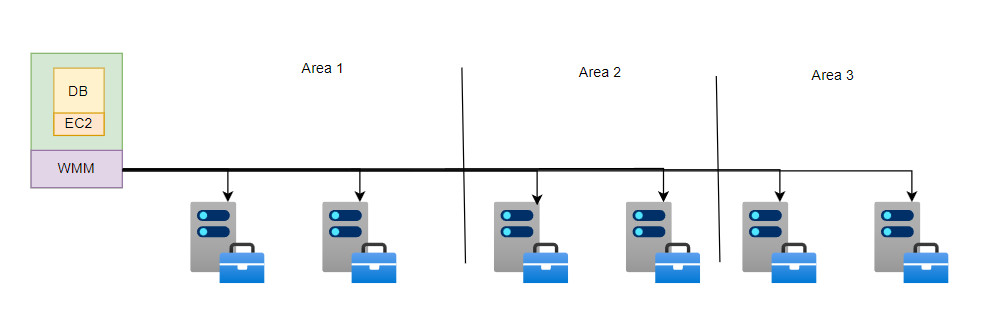

# Amazon Aurora

# 背景

## EC2

`EC2` 实现了一套云服务系统。每台物理机上安装了一个虚拟机；在虚拟机中存在多个 `EC2` 实例；每个 EC2 实例由应用程序 + 操作系统构成。**然后亚马逊便能出售这些 `EC2` 实例给用户使用，用户可以在 `EC2` 的操作系统上部署自己的定制服务。**


虽然 `EC2` 能够实现服务机器共享，但其 `EC2` 内部的用户程序数据均存储在物理机的磁盘上，当物理磁盘损坏，用户数据也就全没了。**为了保证用户数据不丢失，便需要一个分布式存储系统。**


## EBS

针对 `EC2` 数据丢失问题，亚马逊设计了 `EBS` 文件存储服务替代虚拟机的物理磁盘，用户数据都会存储到 EBS 文件服务上。EBS 会为每一个虚拟机分配专属的卷，且一个卷只能由一个虚拟机持有,而一个虚拟机可以持有多个卷。


## RDS

### 事务

```sql
START TRANSACTION;

insert into data_table (x) values (550);
insert into data_table (y) values (750);

commit;
```

「事务`transaction`」会将多条 `SQL` 语句打包发送给数据库，数据库会以「原子」的形式执行这些语句。当所有指令均执行成功，数据库才会记录这些变动。
- **数据树 `data tree`**: 数据库会在本地磁盘以 的形式将数据「分页」存储到本地
- **缓存`cache`**: 在数据库程序运行的机器上，数据库会将存储在磁盘的数据页读取到内存的中，**当缓存中修改累积到一定量时，数据库程序才会将数据保存到磁盘中**
- **预写日志`WAL(Write Ahead Log)`**: 数据库所有的修改操作都会被预先写入该日志中，**用于事务回滚、程序故障恢复**
  - **提交 `commit`**: **在 `WAL` 中记录了`commit`标记，表示当前事务执行成功**
  - **撤销 `undo`**: 事务执行失败，数据库检查 WAL 中事务没有 `commit`标记，恢复被事务修改的数据
  - **重做 `redo`**: 事务执行成功，但数据库崩溃，`cache`中的数据未及时落盘，数据库重启后检查 WAL 中事务有 `commit`标记，重新执行事务


### 原理

`RDS (Relational Database Service)`: 是一种在线数据库服务，提供安全、稳定和可靠的数据库解决方案。它支持多种数据库引擎，如`MySQL`、`PostgreSQL`、`SQL Server`等。
- 将 `data tree` 与 `WAL` 分别存储在两个 `EBS` 的卷上
- 当 `EC2` 中的数据库要写数据到磁盘时，`EC2` 便会将写操作更改为修改 `EBS` 卷的写请求，请求去向主要有两个
  1. 发送给本地机房的 `EBS` 
  2. 将该写请求从 `Area 1` 机房转发到 `Area 2` 机房的机器上，由 `Area 2` 机房的机器写入 `Area 2` 中的 `EBS` 卷中，**实现数据库跨地区备份**


> [!note]
> 可见 `EBS` 对于数据库系统而言就不怎么友好，当产生一点数据操作，`EBS` 内部的节点就会产生较高的网络负载。**因此，诞生了高性能的分布式数据库 `Amazon Aurora`**


# Aurora


## 结构

`Amazon Aurora`: 是专为云构建的一种兼容 `MySQ`L 和 `PostgreSQL` 的「关系数据库」，它既具有传统企业数据库的性能和可用性，又具有开源数据库的精简性和成本效益。




相比于传统的 `RDS` 方案，`Aurora` 做出了以下改变
- 磁盘数据备份只存储 `LOG`，而不备份 `data tree`
- 数据备份系统舍弃了 `EBS`，而是针对数据库定制了一套数据备份服务
- 数据库可快速响应客户端，而无需等待所有数据备份服务确认写入操作，只等待部分写入成功

`Aurora` 数据存储服务的容错目标
- 某个 `Area` 完全失效，系统可正确「写」
- 某个 `Area` 完全失效，且正常`Area`中的某台服务宕机，系统可正确「读」
- 存储服务出现瞬时慢速或暂时不可用时，系统正常运行
- 某个节点宕机后，能快速创建新的备节点

## Quorum

**法定人数复制 `Quorum replication`**: 在存储系统中，存在 `N` 个副本节点 `replica`
- **写操作**：将写请求与版本号发送给所有节点，若 `W` 副本写入成功（同时更新版本号），则写操作成功
- **读操作**：将读请求发送给所有节点，若 `R` 副本响应，则读成功，版本号最大的结果是正确的
- `W + R = N + 1`: 保证写入的节点与读取数据节点至少有1个重叠的节点

假设存在`3`个区域且每个区域`2`台节点，实现 `Aurora` 存储系统时，为了满足容错目标其配置为：`N = 6, W = 4, R = 3`


