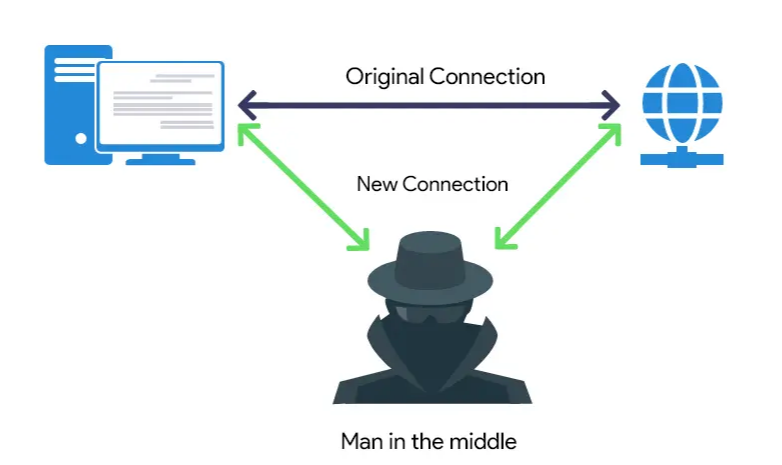
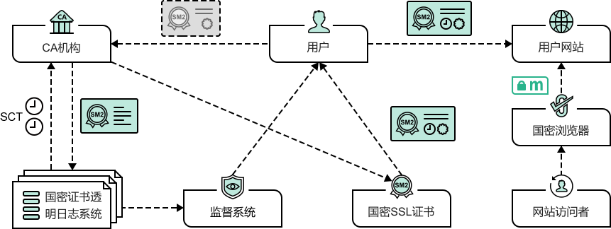

# 证书透明

# 概述

## 中间人

**中间人`middle man`**: 有人劫持 `DNS` ，用自己的服务 IP 掉包了原始服务的 IP，并用自己服务与客户建立连接，并将客户端请求转发给原始服务，从而窃取用户信息

## 证书

为了防止中间人攻击，服务器采用公钥与私匙加密，以及证书颁发机构，实现安全消息通信
- 服务端
  - 可使用私匙对公钥内容解密
  - 公匙会在第三方权威证书颁发机构进行验证
- 客户端
  - 可以去证书颁发机构验证服务证书的真假
  - 可以从证书中获取服务的公匙
  - 发送给服务的报文会使用服务的公匙进行加密

但证书机构参差不齐，这样就存在收钱办事的投机者，**即伪造证书**

## 证书透明

**证书透明`Certificate Transparency`** : 证书透明系统的目的便是防止「证书伪造」，构造一个系统来识别哪些证书是真的，哪些证书是假的。证书透明系统会为所有正规机构颁发的证书 `CA` 建立一个日志系统，用于验证证书的合法性
- 日志只能追加
- 日志不允许建立分支，只存在一个

# 日志系统

>[!tip]
> 借鉴该系统设计最大应用在于虚拟货币，可能这辈子都接触不了，之后再学....

