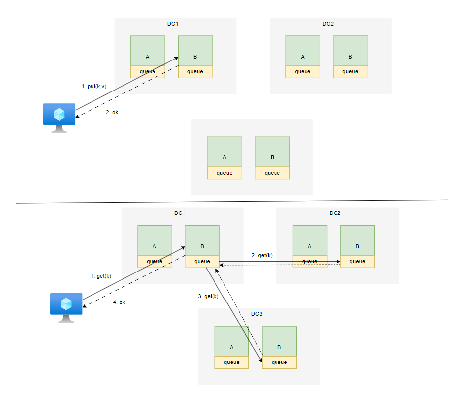
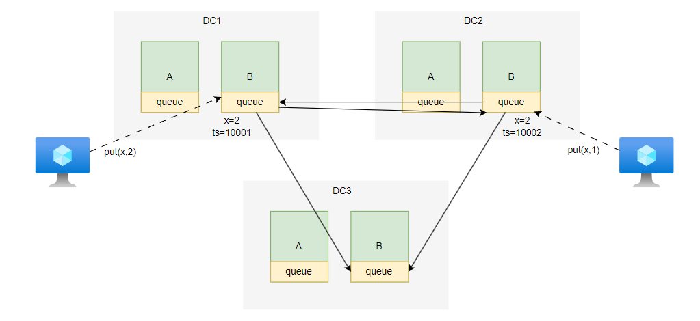
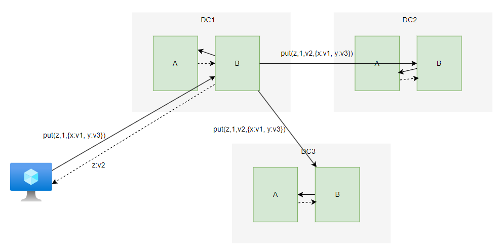

# COPS


# 背景

像 `Spanner` 、`RDS`、`farm`、`Memcache` 等大型数据库设计方案，均能极大提升「读」的性能，但「写」的性能可能没啥提升，反而弱于单机性能。`COPS` 的目标便是：**数据的读/写均在访问数据服务的客户端本地执行，且能绕过主节点，直接将操作提交到备节点。**


# 最终一致性

## 思路

最终一致性`eventual consistency` 方案的设计思
1. 数据「分片」存储
2. 写：客户端与数据节点通信，并写入数据
3. 读：客户端与数据节点通信，然后数据节点去同步数据，返回最新的结果



使用该方案的系统有 `Dynamo` 与 `Cassandra`，其特性为
- **写不保证顺序**：同一客户端依次发送 `put(a,1)` 与 `put(b,2)` ，但系统并不保证实际的写入顺序与请求一致
- **最终一致性**： 所有写操作执行完成，整个系统中的节点才会呈现出一种统一的写入操作顺序


## 数据同步

1. 在 `T1` 时刻，两个客户端几乎同时往不同的数据节点提交了针对同一变量的写操作
   - 节点接收到数据时，会为每个数据追加一个 `ts` 时间戳标记
2. 在 `T2` 时刻，有客户端在读取数据，需要节点间进行数据同步
   - 更新本地数据时，会比较 `ts` 大小，最新数据将被写入，旧数据备忽略
   - 若 `ts` 大小一样，则看「数据中心」优先级，优先级高的数据中心数据被写入





为了防止某个节点服务的时间过快，或者过慢，可以使用 `lamport clock`
- `Tmax`: 从其他节点获取到的最大时间戳
- `ts = max(Tmax + 1, system_clock_ts)`  : 保证了当前节点生成的时间戳，比所有节点的要大

## 异常现象

```python
# client 1
put(a,1)
list_append(lst,a)

# client 2
values = get(lst)
if a in values:
    val = get(a)
```

`client 1` 与 `client 2` 并发执行，根据「最终一致性」规则便会出现以下异常现象
1. `client 1`: `list_append(lst,a)` 写入
2. `client 2`: 读取 `get(lst)`
3. `client 2`: 判断 `a in values` 成功
4. `client 2`: **获取 `get(a)` 失败**
5. `client 1`: `put(a,1)` 写入

> [!tip]
> 该异常现象是「最终一致性」的特性，而非 `BUG`

## 屏障


由于「最终一致性」对读/写操作的约束太弱，很难实现对数据的精确控制，为了增强一点约束性，引入了「屏障`barrier`」机制
- `version = put(key,val)`
- `sync(key,version)` : 强制所有节点同步写操作，并等待同步成功

利用屏障便可避免 `client 1` 与 `client 2` 并发执行出现奇怪现象

```python
# client 1
version = put(a,1)
sync(a,version)         # 保障了 list_append(lst,a) 之前一定执行了 put(a,1)
list_append(lst,a)

# client 2
values = get(lst)
if a in values:
    val = get(a)
```

# COPS 机制

## 目标

「最终一致性」的异常现象，就是由于执行顺序可能与客户端请求顺序不一致导致，使用 `sync` 虽然能避免该问题，但可能在系统的一些异常情况，会造成客户端长时间阻塞。而 `COPS` 的目标便是：**既能保证请求顺序与执行顺序一致，又不会造成客户端长时间阻塞等待**


## 依赖

`COPS` 要求客户端需要在本地上下文中`context`中记录请求操作的依赖关系 `dependent`

```python
get(x)      # context 记录 'x:v1'，v1 为 x 值版本号 
get(y)      # context 记录 'y:v3'，v3 为 y 值版本号 
put(z,1)    # context 记录 z 修改依赖 x:v1 与 y:v3，并在服务请求成功后记录 z:v2
put(w,2)    # context 记录 w 修改依赖 x:v1, y:v3, z:v2:，并在服务请求成功后记录 w:v4
```

当客户端执行「写」操作时，便会将依赖关系与写数据一起发送给数据节点
- `DC1:B` 节点接收到写操作后便会将依赖关系记录到本地
- `DC1:B` 会询问 `DC1:A` 中 `x` 与 `y` 变量目前存储的版本是否满足 `>= v1` 与 `>= v3` 关系
  - 满足：答复 `DC1:B`
  - 不满足：等待满足
- `DC1:B` 收到 `DC1:A` 答复后，便答复客户端完成，并返回版本号 `z:v2`
- 当数据同步时， `DC1:B` 会将依赖关系发送给 `DC2:B` 与 `DC3:B`
-  `DC2:B` 与 `DC3:B` 同样会循环 `DC2:A` 与 `DC3:A` ，检查 `x` 与 `y` 是否满足当前依赖关系的版本号要求



> [!note]
> - 依赖关系虽然解决了「最终一致性」的问题，但会出现长依赖链路，导致更新缓缓，例如 `a` 等待 `b`，`b` 等待 `c`，`c` 等待 `d` 这种情况出现，**即级联延迟**
> - 版本判断使用的是 `>=`，「因果一致性」无法阻止客户端获取到更高版本的数据，`COPS-GT` 版本针对此问题进行了优化

## 因果一致性

**因果一致性`causal consistency`**: 关注事件之间的因果关系，并保证满足因果关系的事件顺序不会被颠倒，如果事件 `A` 依赖 `B`，即 `B -> A`，那么当看见 `A` 事件发生，`B` 肯定已经发生。
- 对于两个相互独立的依赖关系链，将并发执行，例如 `A -> B -> Y` 与 `C -> D -> Z` 


