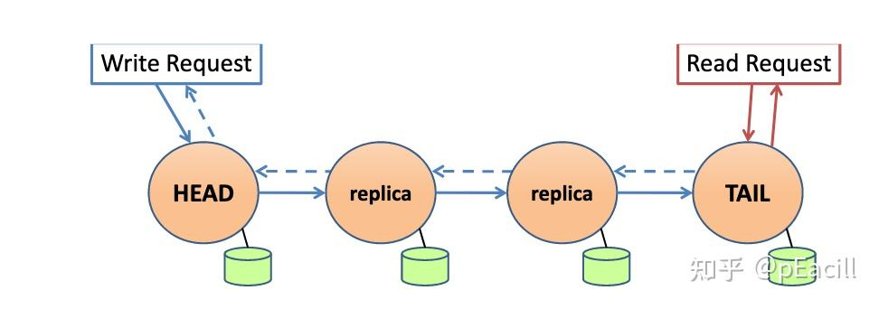

# CRAQ

# 介绍

`CRAQ(Chain Replication with Apportioned Queries)` : 分布式对象存储系统，完美地平衡了一致性与性能的需求。它在保持强一致性的同时，通过独特的设计解决了传统链式复制中的性能瓶颈问题
- 全局数据线性化读/写，即强一致性
- 支持从节点读取数据

# 链式复制

## 原理

**链式复制`Chain Replication, CR`** : 其核心思想是将多个节点按照顺序组织成一条链，写操作从链头开始，逐步传播至链尾，而读操作则全部由链尾处理，以确保数据的一致性。
- **写**：客户端发送写请求给 `HEAD` 节点；`HEAD` 节点完成写入操作后，便会将请求转发给 `replica` 节点；`replica` 完成写入操作，并继续转发写请求，直到 `TAIL` 节点结束；`TAIL` 节点写入成功后才将写操作请求响应返回给客户端
- **读**：所有客户端的读请求都由链尾节点处理。

## 容错性

这种大道至简的复制方式，对于单机故障同样简单
- `HEAD` 节点崩溃，第二个节点充当 `HEAD` 节点即可
- `TAIL` 节点崩溃，倒数第二个节点充当 `TAIL` 节点即可
- `replica n` 节点崩溃，`replica n-1` 将请求直接下发给 `replica n+1` 节点即可
- 写操作从 `HEAD` 传递到 `TAIL`，只有每个节点都成功才会对用户可见，保证了数据强一致性

>[!note]
> 虽然 CRAQ 大道至简，但其模型本身存在严重缺陷，**即无法模型内部解决`HEAD`、`TAIL`、`replica` 角色分配，当出现「分区问题」，便会导致「脑裂」**

## 配置管理器

由于 CRAQ 模型内部无法分配 `HEAD`、`TAIL`、`replica` 角色，因此需要在外部部署一个「配置管理器`Config Manager`」：由配置管理器监控每个 CRAQ 节点存活状态，且当某个节点故障时，重新通知每个节点的应当扮演的角色。**该配置管理器通常使用 `zookeeper` 实现。**

 