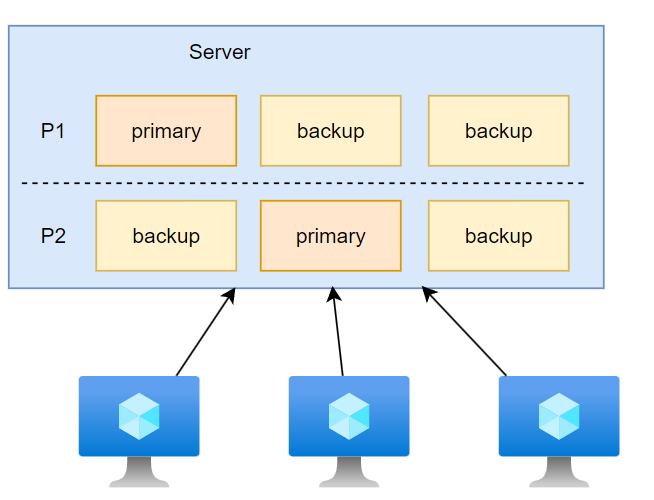
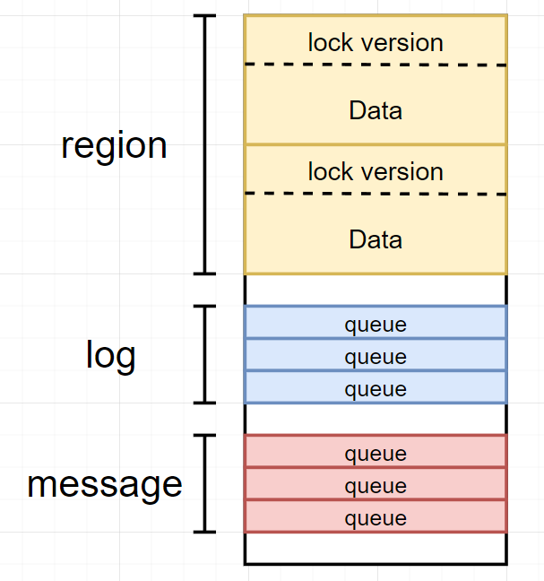
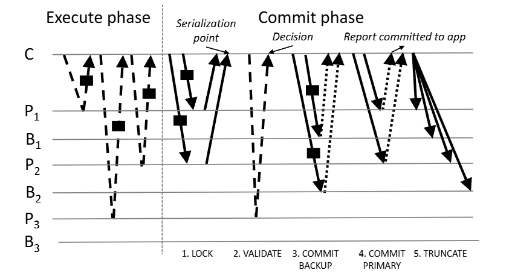

# farm

# 系统介绍

`farm`: 是一种处于研究阶段的大型数据库框架，其与 `spanner` 关注点不同
- 重点关注在一个数据中心部署，而非跨区域
- 使用 `zookeeper` 管理配置
- 分片数据备份的 `Participants` 未使用类 `Raft` 算法系统
  - `primary` : 读写数据
  - `backup` : 只备份数据
- 客户端充当事务协调者执行事务




`farm` 为了获取高性能，做了以下改进
- 分片 `shading`: 数据分片粒度更小，将数据尽可能分散到多台机器上
- 非易失内存 `NVRAM`: 数据存储在内存中，所有机器都会连接一个备用电源。当数据中心停电时，各个节点会停止所有工作，并利用备用电源将数据写入本地磁盘。
- 远程内存访问 `RDMA (remote direct memory access)`：一种特殊网卡，**能根据指令包直接读写机器内存**，而无需操作系统介入
- 内核旁路 `kernel bypass` ： 应用程序能直接访问网卡`NIC (network interface card)`，无需内核介入，**即跳过操作系统，由应用程序自行处理网络通信**


> [!tip]
> 远程内存访问与内核旁路的目的：结合硬件与软件，替换掉了操作系统的 `IP/TCP` 协议机制，自定义了一套更加简约的网络通信系统，使得网络性能提升。


# 事务

## 接口

在客户端调用事务的伪代码如下

```python
trans_create()                  # 创建事务
oid = {
    "region": "xx",         # 数据块的主/备节点网络位置
    "address": "0xffff"     # 数据在内存的存放地址
}
obj = trans_read(oid)           # 读，通过 RDMA 直接读取目标节点的内存
obj.val += 1
trans_write(oid, obj)           # 写，数据修改的是本地缓存
ok = trans_commit()             # 提交，将本地写缓存提交到服务节点
```

## 节点内存

存储数据的参与者 `Participants` 服务节点的内存模型为
- `region` : 存储数据对象的区域
  - `lock version`: 内存高位为 `lock` 标志位，低位为 `version`，**为了实现读写 `lock version` 的原子性（编程技巧）**
  - `data` : 实际的数据
- `log` : 操作日志队列，每个节点中会为存储同一分片数据的参与者创建一个
- `message` : 消息通信队列，每个节点中会为存储同一分片数据的所有参与者创建一个




## 实现


读写事务的执行分为两个大阶段
- `Excute phase` : 客户端执行事务阶段，从 `primary` 参与者节点读取数据，然后完成事务的执行
- `commit phase`: 客户端执行完事务后，开始向服务提交修改
  1. `lock` : 客户端将修改日志写入 `primary` 的 `log` 队列，然后 `primary` 会校验`log` 操作
     1. 校验操作的 `region` 数据的 `lock` 标志位，若是锁定状态则拒绝事务提交
     2. 检查日志中 `version` 与 `region` 中的是否一致，若不一致则拒绝事务提交
     3. `lock` 非锁定，且 `version` 一致，**修改 `lock` 锁定数据** ，答复客户端 `ok`
     4. 客户端作为 `TC` 会根据 `primary` 给出答复确定当前事务提交是否还能继续
        - 全部答复 `ok`： 事务提交继续执行
        - 某一个拒绝：事务停止提交，并通知所有 `primary` 事务中止，需要释放 `lock`
  2. `validate`: `primary` 均答复 `ok`，则获取 `Excute phase` 期间 `trans_read()` 数据的 `version` ，与 `Excute phase` 获取的 `version` 进行比较，一致则事务成功，否则失败
  3. `commit backup` : `primary` 均答复 `ok`，那么客户端便提交 `commit` 操作到 `backup` 的 `log`
  4. `commit backup` : `primary` 均答复 `ok`，那么客户端便提交 `commit` 操作到 `primary` 的 `log`
    - 当前 `primary` 执行到 `commit` 标志位后，便会还原 `lock` 并且实现`version` 自增
  5. `truncate`: 客户端从 `primary` 参与者收到事务提交成功的答复，便通知参与者可以清理当前事务涉及的 `log`





