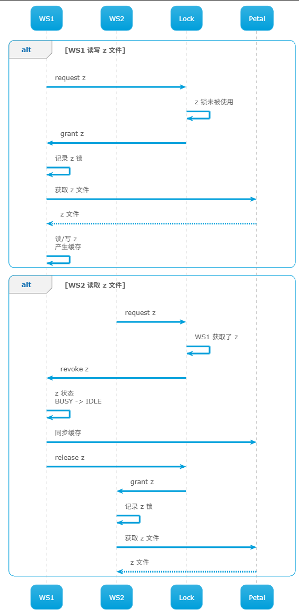

# Frangipani


# 概述

## 背景

`Frangipani`: 一个分布式网络文件系统。
- 在线的文件共享服务 `Petal`
- 应用程序通过 `Frangipani` 访问文件共享服务


但与`GFS`、`EBS` 这些文件存储系统不同，`Petal` 只提供简单的文件备份能力，各个客户端间文件修改同步则是靠 `Frangipani` 客户端实现：**用户修改 `Frangipani` 共享的文件，不是直接修改 `Petal` 服务中的备份文件，而只是修改当前机器上的「本地缓存文件」，只有在恰当时机才会将这些修改同步到共享服务，类似`git`，`svn`等工具。**
- 客户端修改文件是本地操作，不会与服务频繁通信验证操作是否能成功
- 共享文件系统接入新客户端后，并不会给 `Petal` 产生多大的负担，复杂操作均发生本地 `Frangipani` 程序上

> [!tip]
> 在现代计算机系统中 `Frangipani` 用处不大，有更好的替代品，应当主要关注 `Frangipani` 背后「去中心化」相关问题的处理技巧：**同步操作由客户端完成，而非在线服务**。

## 问题

在`Frangipani`系统中，文件修改均发生在本地「缓存」文件中，要实现文件在多台机器间共享就要处理以下问题
- **缓存一致性`cache coherence`**：客户端 `A` 添加了文件夹 `/a` 后，客户端 `B`获取新目录时，需要知道 `/a` 的存在
- **操作原子性`atomicity`** ： 客户端 `A` 添加文件 `/a` (添加文件，需要修改文件目文件，会涉及`2`个文件的修改)，同时客户端 `B` 也添加文件 `/b`，两个写操作不会互相干扰，最终在共享路径下 `/a` 与 `/b` 都应当创建成功
- **崩溃恢复 `crash recovery`**: 客户端 `A` 在本地累计的较多的写操作，但并未将所有修改都同步到 `Petal` ，客户端 `A` 崩溃后，不会破坏整个文件系统的一致性


# 缓存一致性

## 锁服务

为了实现缓存一致性，`Frangipani` 系统中还存在一个管理文件锁的「锁服务」
- 锁直接以文件路径命名
- 服务会记录每一把锁的拥有者
- 客户端会记录自己当前持有的文件锁，以及锁的状态
  - `BUSY`: 文件被上锁，正在被修改中
  - `IDLE`: 锁被获取，但是未被使用
- 客户端会在 `Content` 中记录当前文件修改的缓存信息


为了保证缓存一致性，`Frangipani` 为锁的使用制定了以下规则
1. 任何工作机器本地都不应当存在文件修改缓存，除非该机器持有文件的锁
2. 获取文件锁后，才能从 `Petal` 服务中读取该文件
3. 只有将文件修改缓存写入 `Petal` 服务成功后，工作机器才能释放锁


## 一致性协议

**一致性协议`cohernce protocol`**: 工作机与锁服务之间的「单向」消息通信，**即类似`UDP`的形式**
- `reuqest` : 工作机向锁服务请求锁
- `grant` : 无工作机持有目标锁，锁服务将锁返回给工作机
- `revoke`: 有工作机持有目标锁，锁服务通知工作机释放该锁
- `release`: 工作机接收到 `revoke` 消息后，检查到锁状态
  - `BUSY` : 等待锁状态变成 `IDLE`
  - `IDLE` ：提交缓存数据到 `Petal` 服务，然后将锁返回给锁服务



> [!note]
> 该方案读/写操作均会独占同一把锁，`Frangipani` 已经进一步优化为多机器可同时持有读锁，只有一台机器能持有写锁

# 操作原子性

## 目的

在操作系统中「文件目录」本质上也是一个文件，创建一个新文件的流程为
1. 读取「文件目录」文件
2. 在「文件目录」追加一条新文件记录，并分配文件存储地址
3. 在文件存储地址写入该文件数据

「创建文件」这个操作就会涉及文件系统系统中`2`个不同文件的读/写操作，且只有保证这`2`个文件的读/写操作原子性，才能保证文件系统的正确性。**但`lock server`机制只能保证`1`个文件读/写操作原子性，因此还需要引入新的机制，即「事务`transaction`」**

> [!note]
> 删除文件、重命名文件、移动文件与创建文件一样，均需要利用「事务」完成

## 事务

基于`lock server`机制，在 `Frangipani` 中实现事务就十分简单粗暴
1. 从锁服务获取事务操作相关文件的所有锁
2. 完成事务操作
3. 提交所有相关文件的修改到 `Petal` 服务
4. 释放事务相关的所有锁


# 崩溃恢复

## 目的

为了保证文件系统的缓存一致性、操作原子性，`Frangipani` 必须依赖 `lock server` 机制，为每一个文件上锁。而工作机必须在将缓存修改同步到`Petal`服务后，才能释放锁。**若工作机在提交了部分修改到 `Petal` 服务后就崩溃**
- 直接释机器持有的锁：其他机器能访问到不完整的脏数据
- 不释放机器持有的锁：虽然其他机器能访问到不脏数据了，但是相关文件也被完全锁死

因此，`Frangipani` 需要具有一套完整异常处理机制。


## WAL

**预写日志`write ahead log`** : 工作机在往 `Petal` 服务同步缓存数据时
1. 首先工作机会将操作记录写入 `Petal` 服务的 `WAL` 日志
2. 然后工作机按照日志向 `Petal` 提交缓存数据
3. 最后工作机收到 `Petal` 服务同步完成的消息后才会释放锁

但 `Frangipani` 对该机制进行了一些特殊修改
- `Petal` 服务会为每一台工作机创建一个独立的 `WAL`
- `WAL` 对所有机器共享可见
- 以循环队列的形式记录每条日志，保证日志不会无限占用磁盘空间
- 日志实例结构

    ```cpp
    struct OPE_DESCRIPTION_S{
        int block;          // 块编号
        int version;        // 版本号
        OPERATE_S operate;  // 操作
    };

    struct LOG_ENTRY_S{
        int lsn; // 日志递增编号,最大编号的日志就是最后记录的日志
        OPE_DESCRIPTION_S[] opts;
    };
    ```

## 异常处理

### 处理流程

`Frangipani` 的故障处理的最终目标：**保证「写操作」正常**

- **故障信号**: 根据 `WAL` 三步处理流程，只有在流程结束时才会释放锁，因此其他工作机向 `lock server` 索要对应锁时，`lock server` 便会发现该工作机寄了（锁要不回来）
- **`WAL`回放**：工作机寄了，但是其 `WAL` 记录在 `Petal` 上存放着，那么 `lock server` 便会另找一台存活的工作机根据 `WAL` 记录恢复故障。当故障恢复后，`lock server` 便会释放相关的锁

### WAL 回放

工作机在 `WAL` 三步流程中的任意流程崩溃
- 工作机未更新任何 `WAL` 日志便崩溃：故障修复机啥也不用修复
- 工作机在更新过 `WAL` 日志后崩溃
  1. 修复机扫描 `WAL` 日志，找到工作机崩溃前更新的日志
  2. 修复机解析这些日志，校验日志完整性，并将完整的日志重新提交给 `Petal` 处理
  3. 修复机直到处理到 `lsn` 最大的日志处停止，并通知 `lock server` 释放相关锁

### 版本校验

现处于以下场景

1. `WS1` 在某次事务中，执行 `delete(/d/f)` 操作成功后，成功释放了 `/d/` 与 `/d/f` 锁，**但是还未释放其他锁未释放，便崩溃**
2. `WS2` 在检测到  `/d/` 与 `/d/f` 锁释放后，又新建了 `/d/f` 文件，将修改同步 `Petal` 成功
3. `lock server` 检测到 `WS1` 崩溃，然后让 `WS3` 进行修复
4. `WS3` 查看 `WS1` 的 `WAL` 日志发现了 `delete(/d/f)` 记录，便提交 `Petal` 执行 


`WS3` 只是严格按照 `WAL` 回放流程提交 `delete(/d/f)` 操作，其无法检测 `WS1` 在崩溃前是否已经成功执行 `delete(/d/f)` 。**若 `Petal` 接纳了 `WS3` 提交的 `delete(/d/f)` 操作，那便会删除 `WS2` 创建的 `/d/f`，为解决该问题，`Petal` 需要有检测历史操作的能力**。

`Frangipani` 的解决方案便添加版本号
- `Petal` 会记录每个文件（包括存放目录文件）的版本号
- 当文件发生修改时，版本号便会修改，**即通过`OPE_DESCRIPTION_S::version` 修改`Petal`中记录的版本号**


在上述案例中，当 `WS2` 执行 `create(/d/f)` 成功后，`/d` 文件目录的版本号已经被修改为了 `version = 4`。`Petal` 在处理 `WS3` 提交的 `delete(/d/f)` 操作时会检测处日志中的版本号 `version = 3` 与当前系统中的版本号 `version = 4` 不一致，便会忽略该操作 (**只有当日志版本号 > 系统版本号，才会执行操作**)。

### 锁

按照正常流程，工作机修改文件前，必须首先获取该文件的锁，**但对于修复机而言，在`WAL`回放过程中，不需要获取任何文件的锁。**
- 工作机在释放锁之前崩溃：在修复机完成 `WAL` 回放之前，`lock server` 并不会释放这些锁
- 工作机在释放锁之后崩溃：由于 `version` 机制的存在，`Petal` 并不会执行修复机在 `WAL` 回放过程中提交的操作


