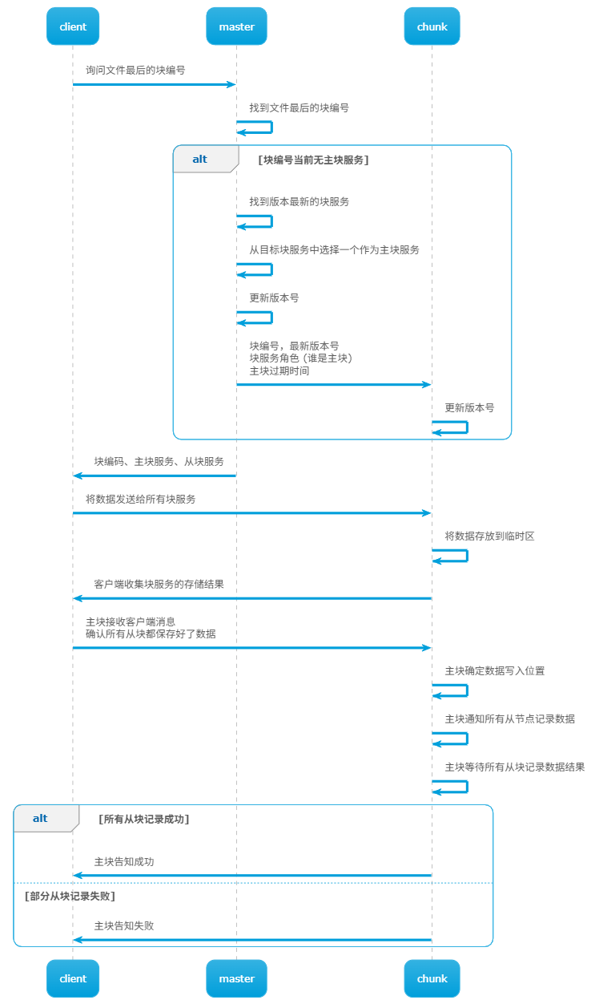

# GFS

# 问题

## 分布式

构建大型分布式存储系统虽然能提高系统的读/写性能，但会引发一连串的问题

- 性能 `performance` -> 分片 `sharding` : 追求性能，会将数据存放到不同的机器上
- 故障 `faults` -> 容错 `/tolerance` : 机器多了就会导致故障率上升，需要考虑容错性
- 容错 `/tolerance` -> 复制 `replication` : 提高系统容错性，往往采用数据备份的方式
- 复制 `replication` -> 一致性 `consistency`: 数据备份，又要需要考虑多份数据读/写是否一致
- 一致性 `consistency` -> 性能 `performance` : 保证一致性的代价就是降低性能 (多份数据需要频繁同步)

## 一致性

文件系统中的一致性是一个很棘手的问题，太强的一致性会导致性能严重下降，太差的一致又会导致系统不可用

- **强一致性**： 其目标是实现和单机文件系统一样的效果，**所有的读操作获取的数据与最新写操作写入的数据一样**

- **最坏的一致性** ： 当分布式系统存在两份备份时，若用户写操作请求处理顺序安排不当，就会导致在 A 文件系统中 `a == 2` ，在 B 文件系统中 `a == 1`

# GFS

## 介绍

`GFS(Google File System)`:  `Google` 开发的一套分布式存储系统。GFS 会将数据拆分成 `64 MB` 的小块，然后存在不同机器上
- 大规模数据存储
- 快速读写
- 对外提供简单接口
- 自动故障恢复
- 作为应用程序后台组件，而非一个独立的产品
- 只适用于大规模数据顺序访问，不支持随机访问\
- 数据存储非强一致性：搜索引擎获取的结果并非要完全准确，可以容忍部分错误

## 单一主控

- 主节点 `master`: 主要维护两张表
  - 文件名 -> 块编号序列 `chunk ID/handle` ：文件被分成了块，并用块编号标记，将所有的块整合到一起，便能得到文件
  - 块编号 -> 块服务列表: 一个文件块会创建多个副本，因此一个块编号会对应多个块服务。此外，还会记录版本号 `version`、主块服务 `primary`、主块服务过期时间 `lease expiration`
  - 上述两张表会通过「日志`log`」的形式保存到本地磁盘，但为了防止每次启动都要重新加载全部日志，又增加「存档点`checkpoint`」机制
- 块服务 `chunk server`: 存储实际数据
  - 主块服务 `primary` : 每一个块的「写操作」均由该块编号的主块服务完成，且块编号下的块服务会轮流充当主块服务角色，由过期时间 `lease expiration` 确定
  - 从块服务 `second`：实现块的「读操作」

## 读/写

- 读操作

- 追加文件: **版本号只有在选择主块时才会更新**

基于上述的追加流程会导致**文件块的存储顺序与文件顺序不一致**：假设现在有三台块服务，需向一文件追加 `A,B,C` 三块数据，且由三个客户端同时执行。A 首先存储成功，但 B 在一个块服务上丢失导致存储失败；紧接着 C 存储成功；客户端发现 B 失败后，又再次发起追加文件请求，GFS 则将其当成新的块，在 C 块之后追加；此时，追加的 `A,B,C` 三块数据在 GFS 上实际存储顺序就变成 `A,C,B`

> [!tip]
> 要将 GFS 的结构改成「强一致性」的系统，所要做的重点工作便是增强主块与从块之间的数据写操作同步，保证所有写操作在所有块服务上都执行成功，且存储结构一致

## 过期时间

主块服务的身份改变使用过期时间 `lease expiration` 而非定时心跳 `ping` 检测，**主要防止同一时间存在两个主块服务**: 假设主节点与主服务通过定时 `ping` 确认主块的存活状态，若主块与主节点间出现网络故障，主节点便重新选择一个主块，这样就会同时存在两个主块，**该问题被称之为「脑裂`split brain`」**

