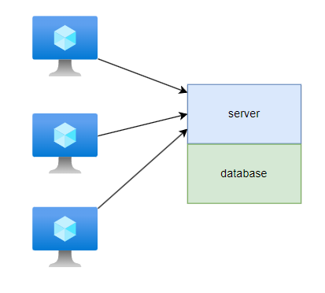

# Memcache

# 服务模型

## 传统模型

1. **单机服务** :  网络响应与数据库在一台机器上




2. **负载均衡** ： 将网络响应分布到不同前台服务，前台服务连接同一个数据库


3. **`RDS`** : 当一个数据库顶不住了，那就通过 `RDS` 将数据库数据「分片」存储到多个数据库节点中


使用 `RDS` 虽然可以提升服务整体的吞吐量，但是硬件成本也很高，为了降低数据库硬件成本，又能提升服务整体吞吐量，便诞生了 `Memcache`

## Memcache 模型

在前台服务与`RDS` 之间添加一个数据缓存层
- **读**：前台服务首先会去 `Memcache` 中读取数据，当 `Memcache` 中没有目标数据时，才会去数据库进行读取，并将读取结果写入 `Memcache` 中进行缓存
- **写**：前台服务会直接将数据写入 `RDS` ，不经过 `Memcache`


虽然 `Memcache` 模型能为「读」带来 `10` 倍的速度提升，但也存在一些隐患
- 提升了系统复杂性，需要保证 `Memcache` 与 `RDS` 数据一致
- 当 `Memcache` 出现故障，就会将 `Memcache` 分担的「读」请求直接转移给了 `RDS`，可能导致 `RDS` 过载
 
> [!note]
> `Memcache` 不会与 `RDS` 相连

# 旁路缓存

## 概念

**旁路缓存`look aside caching`** : `cache` 与 `DB` 并不相互连接，需要外部来同步数据
```python
def read(key):
    """ 读操作 """
    val = get_cache(key)
    if val == None:
        val = fetch_db(key)
        set_cache(key,val)
    return val

def write(key, val):
    """ 写操作 """
    send_db(key, val)
    delete_cache(key)   # 1
```

写操作有以下细节需要注意
- **在写操作中 `delete_cache` 必须在 `send_db` 之后执行**。当 `delete_cache` 在 `send_db` 之前执行，若前台服务在 `delete_cache` 与 `send_db` 之间执行了一次 `read(key)`，便会导致 `Memcache` 中再次缓存旧数据
- **`#1` 使用 `delete_cache(key)` 比 `set_cache(key,val)` 更安全**。假设 `send_db` 之后执行 `set_cache`，此时 `write(x,1)` 与 `write(x,2)` 同时执行，但其执行顺序会变成 `send_db(x,1)`, `send_db(x,2)`, `set_cache(x,2)`, `set_cache(x,1)` ,这就导致缓存值其实不正确


## 多机部署

`facebook` 针对多台 `Memcache` 部署，提出了「复制」与「分片」组合的设计方案
- **复制**：几台前台服务与几台 `Memcache` 构成一个独立的 `cluster`，且各个 `cluster` 相互独立
- **分片**：一个 `cluster` 中的 `Memcache` 会分片存储缓存数据
- **公共缓存`common`**： 对于一些很冷门的数据，会被放入 `common Memcache` ，所有 `cluster` 中的前台服务均能访问
- **备用缓存`gutter`**: `Memcache` 的备用机器，平时处于闲置状态，当 `cluster` 中的某台 `Memcache` 宕机后，便会从 `gutter` 选一台使用


这么做的好处
- 每个 `cluster` 独立运行，因此每个 `cluster` 中的 `memcache` 可以存储不同的「热点」数据
- `cluster` 内机器数量少，多台 `memcache` 数据「分片」进行的通信次数也不会太多
- 降低「汇聚阻塞」的影响程度。当某个前台服务突然大范围读取数据，就会导致多台 `memcache` 高负载从 `RDS` 读取数据，但由于 `cluster` 内机器少，且相互独立，并不会对整个系统造成太大问题。


## 雷鸣般的兽群

**雷鸣般的兽群`thundering herd`**: 现存在一个热点数据，被多个前台服务频繁读取，但此时有个前台服务修改了该热点数据，便会导致 `memcache` 中的缓存被删除，此时，前台服务便会一拥而上去请求 `RDS` ，导致 `RDS` 高负载。


```python
def read(key):
    """ 读操作 """
    val = get_cache(key)
    if val == None:
        if (try_distribute_lock(key)):
            val = fetch_db(key)
            set_cache(key,val)
            distribute_unlock(key)
        else:
            return None
    return val
```

解决方案便是在 `fetch_db()` 前添加分布式锁
- 保证同一`key`只有一个前台服务能去 `RDS` 获取数据，并更新缓存
- 其他想要获取 `key` 的前台服务只能等待 `memcache` 中创建该 `key`

# 一致性

采用「旁路缓存」方案，可能会导致 `Memcache` 中缓存旧数据
1. 有两个前台服务并发运行，`A` 执行 `get(key)`，而 `B` 执行 `write(key,val_1)`
2. 在 `A` 执行 `#1` 之前，`B` 已经完成 `write(key,val_1)` 操作
3. 在 `Memcache` 将存入旧值 `val` 而非新值 `val_1`

```python
def read(key):
    """ 读操作 """
    val = get_cache(key)
    if val == None:
        if (try_distribute_lock(key)):
            val = fetch_db(key)
            # write(key,val_1)
            set_cache(key,val) # 1
            distribute_unlock(key)
        else:
            return None
    return val
```

针对该问题，`Memcache` 会对 `set_cache` 进行校验，不是任何情况都能更新
1. `get_cache` 会返回一个在 `Memcache` 端记录的版本号
2. `write()` 过程中执行了 `delete_cache` 便会更新 `version`
3. 在 `#1` 步骤的 `set_cache` 将被 `Memcache` 端忽略

```python
def read(key):
    """ 读操作 """
    val,version = get_cache(key)
    if val == None:
        if (try_distribute_lock(key)):
            val = fetch_db(key)
            # write(key,val_1)
            set_cache(key,val, version) # 1
            distribute_unlock(key)
        else:
            return None
    return val
```

