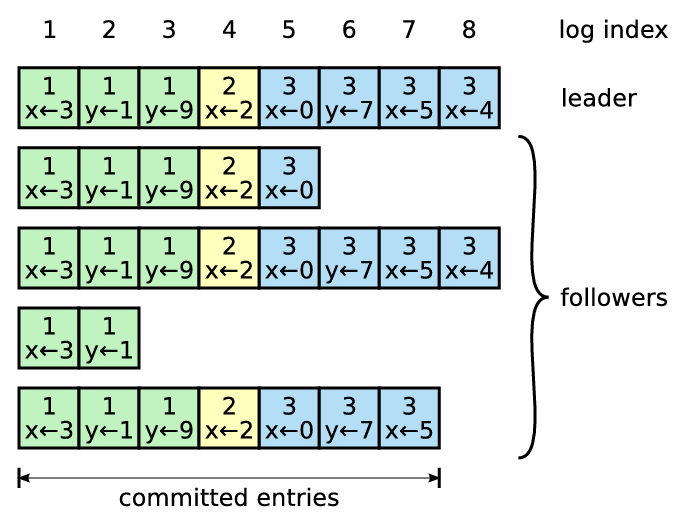
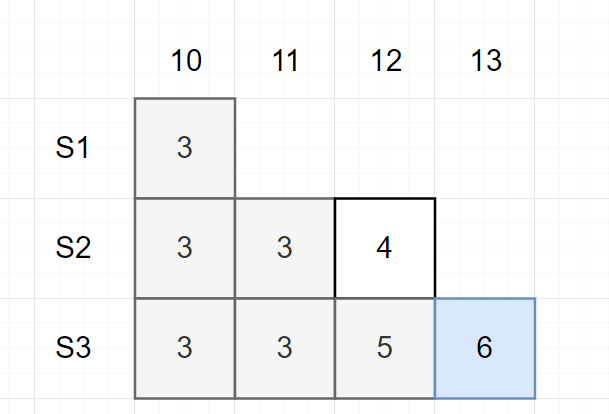
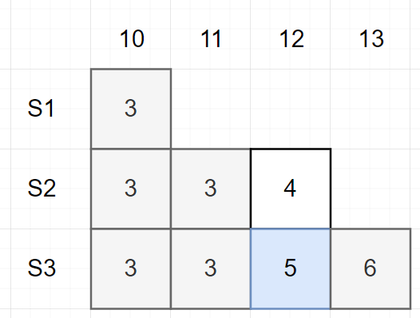
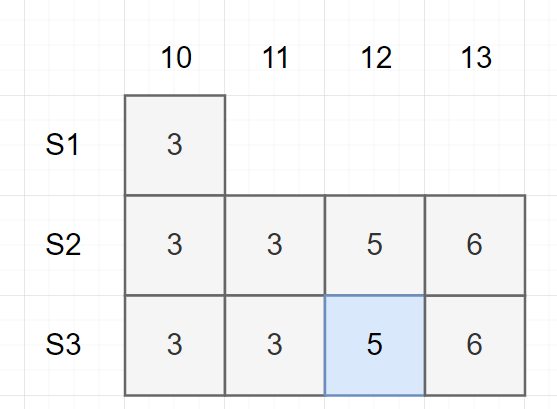
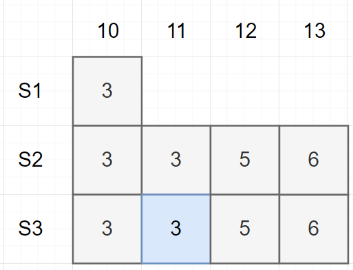
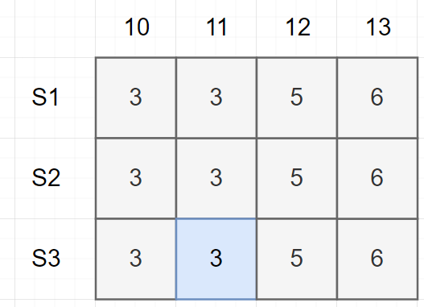
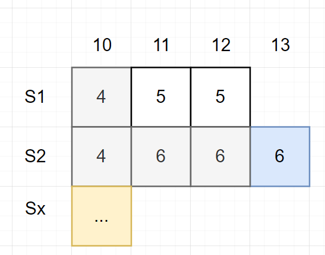
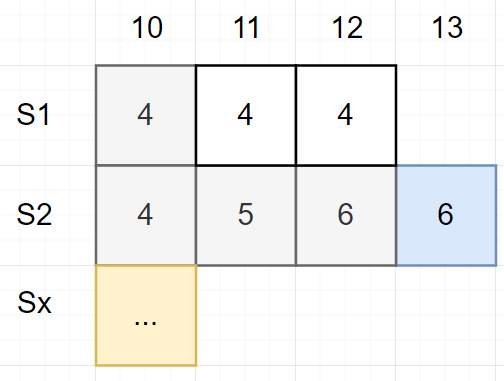
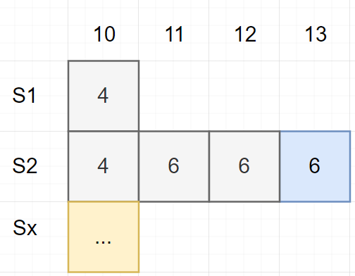

# Raft

# 脑裂问题

主/从节点是通过「复制」手段提升单机故障容错性，但在主/从切换时，会导致「**脑裂问题**」。导致脑裂的根本原因： `S1` 与 `S2` 之间的网络连接可能出现故障，从而使得备/从节点误判，认为自己应当升级为主节点为客户端提供服务。


- **主控** : 分布式框架 MapReduce、GFS、VMware FT 会设置一台主控节点用于实现主/从、主/备职责分配。**虽然主控节点可以避免脑裂问题，但是主控节点故障，那么整个系统将瘫痪。** 
- **分区`partition`** : 若网络断得十分干脆，将网络一分为二，使得 `C1` 只能与 `S1` 通信，`C2` 只能与 `S2` 通信，该情况则被称之为「分区」。在该情况下，不仅会出现脑裂问，还存在修复网络后，如何合并分区的问题。


# Raft 算法

> [!tip]
> `Raft` 算法的定位是一个「库」，用于快速实现基于「复制状态机」模型的主备系统


## 简介

为解决脑裂问题引出的额外设置主控节点问题、节点间的分区问题，诞生了 `Raft` 算法。**由 `Raft` 算法来保证主备系统的一致性**，其基本设计思路
- **前提** ： 系统中节点的数量一定要为「奇数」，即主/从节点至少要有 3 个
- **思路**：同一系统下所有节点一起参与投票 (出现故障的机器也要参与计票)，**少数服从多数**，选出领导节点 `leader`，而剩余节点则被称之为 `follower`。
  - `leader` : 只有 leader 才能处理客户端的请求响应、创建日志、同步日志、发起心跳
  - `candidate`: 从 follower 中提拔的 leader 候选人，在 leader 选举阶段存在
  - `follower` : 接受 leader 的心跳和日志同步数据，以及给 candidate 投票

该算法还存在一些特性
- 由 `2f + 1` 台机器组成的系统，可以容忍 `f` 台机器发生故障
- 现任 leader 的大多数选票一定来自于上任 leader 的选民，因此，现任 leader 肯定能知道上任 leader 是谁，以及上任 leader 执行哪些操作 (保证了「复制状态机」正确性)


## 请求响应


`Raft` 会作为一个应用程序附加库部署到系统中的每一个服务节点上，其结构如图所示
- `State` : 用于记录状态的一张「键值对」表
- `Log` : 操作日志，确定了所有客户端操作请求，以及执行顺序


## 领导选举

### 选举规则

raft 算法将时间划分为任意长度的任期`term`，每段任期的开始都会举行竞选 `election`，且每段任期均会使用任期号进行标识 `trem n`
- **每一个任期内至多只存在一个 `Leader`**
- 没有 leader 就不处理用户请求


触发 `election` 的时机
- **心跳超时**：每个节点会设置检测 leader 心跳的定时器，当某个 follower 在定时时间未收到 leader 心跳，便会成为 candidate 竞选 leader
  - 每个节点的超时时间值可以不一样：可预防所有节点同时检测到 leader 寄了，然后都变成 candidate，导致本轮无法竞选出 leader
  - 超时时间不能太长：太长的超时时间会导致 leader 宕机后，新 leader 的选举时间太迟，系统瘫痪时间太长
  - 超时时间不能太短：超时时间小于了选举过程中的投票确认时间，又会导致 follower 全变成了 candidate


- **分区**: Follower 与 Leader 间通信发生问题，导致发分区，这时没有 Leader 的那个分区就会进行一次选举。**对于少数结点的分区，即使仍存在 Leader，但由于写入日志的结点数量不可能超过半数（当前 leader 只能收到当前分区的少数同意票，另外一个分区的节点就相当于全部投反对票），因此，该分区 leader 不可能完成交操作，也不会响应客户端的请求**


### 投票规则

不是任何 `candidate` 都有资格变成 `leader`，要收获 `follower` 的选票，`candidate` 也必须具有 `leader` 资质
1. `follower` 不会主动投票，只有接收到 `candidate` 的邀请投票请求后，才会给 `candidate` 赞成票
2. `follower` 会校验 `candidate` 的资格
   - `candidate` 的 `Log` 记录最新的 `term` 值大于 `follower` 最新的 `term`
   - `candidate` 最新的 `term` 值等于 `follower` 最新的 `term` 时，`candidate` 的 `Log` 长度要大于等于 `follower` 的 `Log` 长度

> [!note]
> `follower` 成为 `candidate` 还是给 `candidate` 投票时，自己的 `term` 都会自增

## 日志

### 结构


```cpp
struct COMMIT_ENTRY_S{
    int term;         // 产生记录的任期编号
    int index;        // 日志索引
    Command command;  // 操作命令
};
```




### 同步

1. 方块中的数字为 `term`，上方的数字为 `index`；在 `term = 6` 时，`S3` 为 `leader`，且 `S2` 中的 `index = 12` 为异常提交记录

  

2. 在 `term = 6` 时，`S3` 需要通知所有 `follower` 同步日志，此时 `prevLogIndex = 12; preLogTerm = 5; logs = [log_13]`，此外 `leader` 还会使用 `nextIndex[s1] = 13; nextIndex[s1] = 13` 记录 `follower` 当前应当需要同步日志的索引

    ```cpp
    // 由 leader 下发给所有 follower 的同步命令
    struct  SYNC_COMMAND_S{
        int prevLogIndex;     // 当前日志应当放在哪个索引后
        int preLogTerm;       // prevLogIndex 对应的日志的 term 编号
        COMMIT_ENTRY_S[] logs;// 需要同步的日志
    }
    ```

   -  `S2` 接收到同步请求，发现自己的 `Log` 中 `prevLogIndex = 12` 处的 `term = 4` 与 `preLogTerm = 5` 不匹配，返回同步失败
   - `S1` 接收到同步请求，发现自己的 `Log` 中 `prevLogIndex = 12` 处根本每数据，返回同步失败
3. `S3` 根据返回结果更新记录  `nextIndex[s1] = 12; nextIndex[s1] = 12`，重新下发同步请求 `prevLogIndex = 11; preLogTerm = 3; logs = [log_13，log_12]`

  
  
  - `S2` 发现自己的 `Log` 中 `prevLogIndex = 11` 处的 `term = 3` 与 `preLogTerm = 3` 匹配，更新日志，并返回成功。**`S2`可以直接删除 `4` ，因为根据 `raft` 特性，该提交是失败的，也不可能响应客户端**

  

  - `S1` 发现自己的 `Log` 中 `prevLogIndex = 11` 还是没有东西，返回失败


1. `S3` 根据返回结果更新记录  `nextIndex[s1] = 12; nextIndex[s1] = 11`，重新下发同步请求 `prevLogIndex = 10; preLogTerm = 3; logs = [log_13，log_12,_log_11]`

  

  - `S2` 校验通过，返回成功
  - `S1` 发现自己的 `Log` 中 `prevLogIndex = 10` 处的 `term = 3` 与 `preLogTerm = 3` 匹配，更新日志，并返回成功

  

  - **注意**：此时 `S1` 能否更新成功对于 `S3` 来说不是那么重要，**`S2` 与 `S3` 的日志均完成同步，已经可以达成 `Raft` 要求，少数服从多数**

### 快速备份


上述日志同步的方式，需要 leader 与 follower 之间来回确认，若 follower 与 leader 之间的日志区别过大，就会带来严重的性能影响，**因此，期望 leader 只需有限次同步请求即可,无需依次确认 Log 并通知，即「快速备份`Fast Backup`」**。

1. follower 接收到 leader 的同步命令请求后，根据 `prevLogIndex = n; preLogTerm = m;` 检查自身的 log
2. follower 比对 log 失败，在回复 leader 的响应中需要额外添加字段信息

    ```cpp
    struct  SYNC_COMMAND_RESP_S{
        ...
        int xTerm;  // follower 在 prevLogIndex 的 term 值，-1 表示没有
        int xIndex; // xTerm 在 follower 的日志中第一次出现的索引
        int xLen;   // 若在 prevLogIndex 处日志为空，返回 follower 的 log 长度，否则返回 -1
    };
    ```


leader 与 follower 之间的冲突问题主要有以下三种情况

- `S2` 通知 `S1` 同步日志，`S1` 记录了前 `term = 5` 任领导的异常操作

  

  1. `S1` 返回结果 `xTerm = 5; XIndex = 11; XLen = -1`
  2. 由于 `S2` 没有 `XTerm = 5` 的情况； 更新 `nextIndex[s1] = XIndex`，然后下发 `prevLogIndex = XIndex - 1; preLogTerm = 4; logs = [log_13，log_12,_log_11]`


- `S2` 通知 `S1` 同步日志，`S1` 记录了前 `term = 4` 任领导的异常操作

  

  1. `S1` 返回结果 `xTerm = 4; XIndex = 10; XLen = -1`
  2.  `S2` 找到最后出现 `term = 4` 的记录；更新 `nextIndex[s1] = 11`，然后下发 `prevLogIndex = 10; preLogTerm = xTerm; logs = [log_13，log_12,_log_11]`

- `S2` 通知 `S1` 同步日志，`S1` 未记录到数据

  

  1. `S1` 返回结果 `xTerm = -1; XIndex = -1; XLen = 11` (假设索引从 `0` 开始)
  2.  `S2` 更新 `nextIndex[s1] = xLen `，然后下发 `prevLogIndex = xLen - 1; preLogTerm = 4; logs = [log_13，log_12,_log_11]`


### 快照

`Raft` 的操作 `Log` 需要一直存储，且新增节点也需要从头执行这些操作才能还原 `state`，当系统运行几年后， `Log` 将变得及其庞大，新增节点与日志存储将变得麻烦。为解决该问题，可以在 `Log` 达到一定量后，对 `state` 创建快照保 `snopshot` 存到本地，那么 `state` 快照之前的日志便能全部丢弃，**即为整个状态机创建了一个存档点，但悲催的是 leader 与 follower 除了要同步 `Log` 外，还需要同步 `snopshot`**。


## 持久化

为了保障机器断电后，仍能重启接入 `Raft` 算法，每个节点需要将一些关键数据进行本地持久化 `Persistent`
- 操作日志 `Log`
- 当前任期 `Current Term`
- 选举时，票给了谁 `Voted For`


