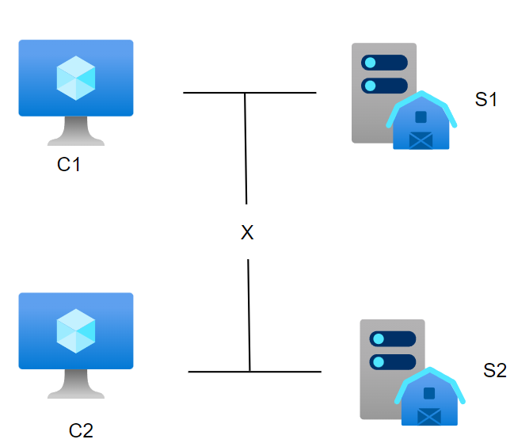
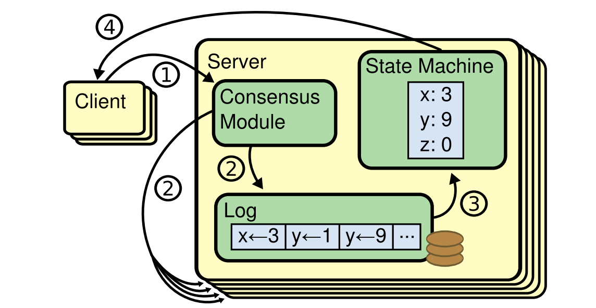
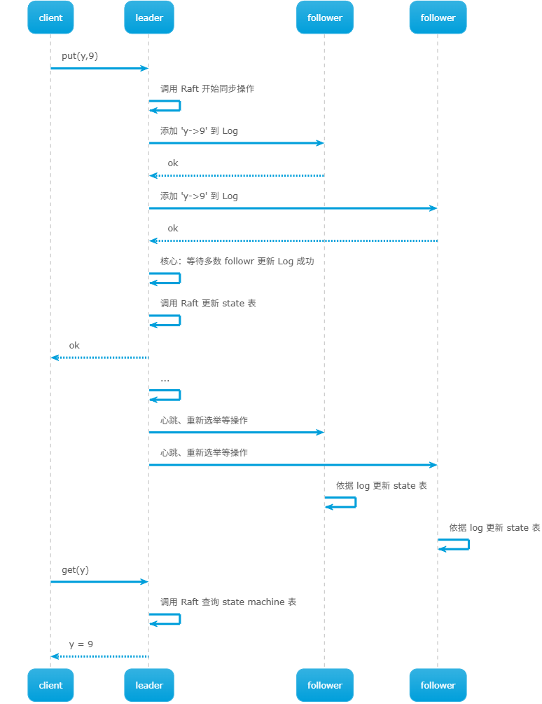
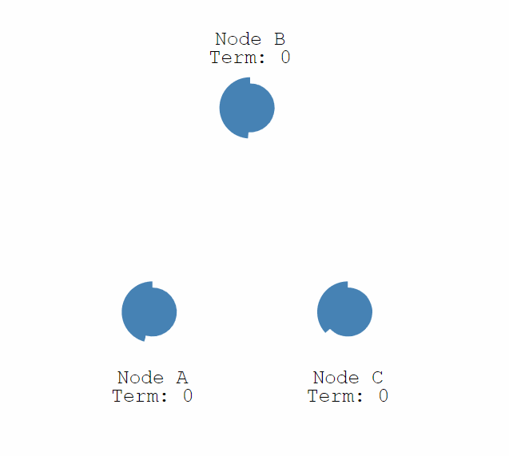
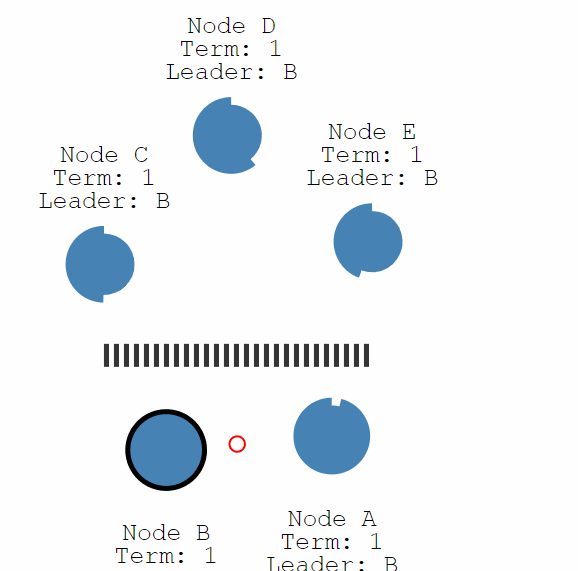

# Raft

# 脑裂问题

主/从节点是通过「复制」手段提升单机故障容错性，但在主/从切换时，会导致「**脑裂问题**」。导致脑裂的根本原因： `S1` 与 `S2` 之间的网络连接可能出现故障，从而使得备/从节点误判，认为自己应当升级为主节点为客户端提供服务。

- **主控** : 分布式框架 MapReduce、GFS、VMware FT 会设置一台主控节点用于实现主/从、主/备职责分配。**虽然主控节点可以避免脑裂问题，但是主控节点故障，那么整个系统将瘫痪。** 
- **分区`partition`** : 若网络断得十分干脆，将网络一分为二，使得 `C1` 只能与 `S1` 通信，`C2` 只能与 `S2` 通信，该情况则被称之为「分区」

# Raft 算法

## 简介

前文所述有复制诞生的主/从节点，可统称为「集群」。为解决脑裂问题引出的额外设置主控节点问题、节点间的分区问题，诞生了 `Raft` 算法。**由 `Raft` 算法来保证集群系统的一致性**，其基本设计思路
- **前提** ： 集群节点的数量一定要为「奇数」，即主/从节点至少要有 3 个
- **思路**：同一集群下所有节点一起参与投票 (出现故障的机器也要参与计票)，**少数服从多数**，选出领导节点 `leader`，而剩余节点则被称之为 `follower`。
  - `leader` : 只有 leader 才能处理客户端的请求响应、创建日志、同步日志、发起心跳
  - `candidate`: 从 follower 中提拔的 leader 候选人，在 leader 选举阶段存在
  - `follower` : 接受 leader 的心跳和日志同步数据，以及给 candidate 投票

该算法还存在一些特性
- 由 `2f + 1` 台机器组成的集群，可以容忍 `f` 台机器发生故障
- 现任 leader 的大多数选票一定来自于上任 leader 的选民，因此，现任 leader 肯定能知道上任 leader 是谁，以及上任 leader 执行哪些操作 (保证了「复制状态机」正确性)

## 请求响应

`Raft` 会作为一个应用程序附加库部署到集群中的每一个服务节点上，其结构如图所示
- `State` : 用于记录状态的一张「键值对」表
- `Log` : 操作日志，确定了所有客户端操作请求，以及执行顺序

## 领导选举

raft 算法将时间划分为任意长度的任期`term`，每段任期的开始都会举行竞选 `election`，且每段任期均会使用任期号进行标识 `trem n`
- **每一个任期内至多只存在一个 `Leader`**
- 没有 leader 就不处理用户请求

触发 `election` 的时机
- **心跳超时**：每个节点会设置检测 leader 心跳的定时器，当某个 follower 在定时时间未收到 leader 心跳，便会成为 candidate 竞选 leader
  - 每个节点的超时时间值可以不一样：可预防所有节点同时检测到 leader 寄了，然后都变成 candidate，导致本轮无法竞选出 leader
  - 超时时间不能太长：太长的超时时间会导致 leader 宕机后，新 leader 的选举时间太迟，系统瘫痪时间太长
  - 超时时间不能太短：超时时间小于了选举过程中的投票确认时间，又会导致 follower 全变成了 candidate

- **分区**: Follower 与 Leader 间通信发生问题，导致发分区，这时没有 Leader 的那个分区就会进行一次选举。**对于少数结点的分区，即使仍存在 Leader，但由于写入日志的结点数量不可能超过半数（当前 leader 只能收到当前分区的少数同意票，另外一个分区的节点就相当于全部投反对票），因此，该分区 leader 不可能完成交操作，也不会响应客户端的请求**

## 日志

