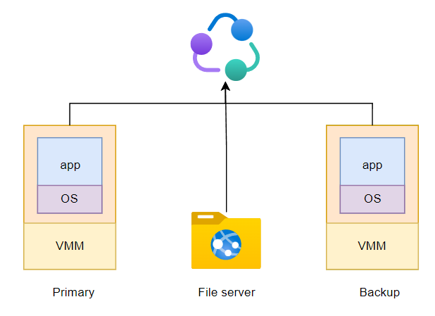

# 复制

# 解决问题

复制 `Replication` 是应对故障问题最简单粗暴的方式，例如将数据多备份几份、将机器多部署几台。「复制」并不是万能手段，**其只能解决节点不可用时，造成这个系统不可用的问题，即`fail-stop`**
- `fail-stop`: 由于断电、断网、系统崩溃等原因，单台节点机器就会马上不可用，**但不包含应用程序 `bug` 导致的节点计算结果异常**

但也不是所有的 `fail-stop` 问题都需要使用复制的技术，如果产生 `fail-stop` 问题并不会对整个平台造成任何损失，那也可放任不管，毕竟「复制」是有成本的

# 复制方案

> [!tip]
> 在计算机视角，所有的程序执行都可以转换为一个状态机模型

实现复制主要有两类方案
- **状态传递 `state transfer`** : 主节点会将程序状态复制并分到每一个从节点上，备节点时刻备份主节点的状态，从而实现主节点挂掉后，从节点能立马顶上。
- **副本状态机 `replicated state machine`**: 主备节点上运行的程序是一样，**即程序的状态机是一样**。没有外界干预，那么主备上执行的命令以及命令的执行顺序都应当是一样，进而可用认为造成状态机执行不一致的根因是主备节点受到的外界干预不同，**即接收到输入事件不同**，因此，**副本状态机不同步状态机的状态，而是同步状态机的输入事件**

副本状态机只需备节点同步主节点的事件即可，且事件的体量要比状态更小（事件可能就是一条操作指令，而状态可能是主节点程序的堆栈内存信息、数据库信息）。看似副本状态机的同步成本要比状态传递要小得多，**但是在多核机器上，程序执行的指令是乱序的，并不能完全遵守副本状态机实现的前提条件**

复制方案只是确定了大方向，仍有许多问题需要考虑
- 明确状态成员
- 主备节点间的状态同步策略
- 主备切换 `cut-over`
- 新备份节点接入: 主节点挂了，备节点顶上，为了防止备节点挂掉，这时就需要补充新的备节点

# VMware FT

## 系统介绍

复制的深度可分为两类

- 系统级：主备节点间最理想的情况是保证机器上运行的程序完全一致，这就需要对整个操作系统进行复制
- 应用级: 应用级的复制成本要远低于系统级复制，但功能就比较定制，不通用

系统级复制最通用，根本不在乎运行的是什么程序，但是其成本高，而应用级复制成本低，但功能定制。因此，一种折中的方案诞生：**`VMware FT` ，以应用程序的形式运行在物理机器上，但是其内部运行了一个虚拟的操作系统，在虚拟操作系统上运行节点程序**。

主备节点程序均运行在 `VMware FT` 的虚拟机上，且程序会将数据写到公共的文件系统服务，而主备机程序之间的状态同步则依靠 VMware 虚拟机的「副本状态机」模式实现，**规定输入事件只能是网络请求**
- **主虚拟机**：接收用户的网络请求操作，并拦截这些操作同步下发给备虚拟机，且主虚拟机完成用户请求并返回响应
- **备虚拟机**：接收由主虚拟机转发的用户请求操作，实现应用程序状态机同步，且应用程序返回的客户端响应会被忽略
- **日志通道 `log entry channel`**: 用于主备虚拟机间同步用户操作的网络通信连接。若主虚拟机宕机，该连接也会中断，这样备虚拟机就能检测到主虚拟机异常，并升级为主节点

## 遗留问题

### 不确定事件

通过 `VMware FT` 虚拟技术确实可以构建一个十分接近理想状态的主备系统，针对「副本状态机」模型仍然存在一些干扰，**即不确定事件**
- 用户请求在主备虚拟机之间存在的延迟
- 用户请求延迟还导致主备虚拟机系统接收网络请求时，操作系统中断点位置可能不一致
- 随机数据
- 多核处理

**这些不确定事件都需要硬件和虚拟机系统配合解决，将这些事件变成可在主备虚拟机之间执行的确定事件**

### 输出规则

**问题**：主虚拟机负责用户请求接收与响应，若主节点返回响应后崩溃，且这时用户请求还未通过日志通道发送给备虚拟机，**这便导致客户端感知到的程序状态版本要高于备虚拟机上的程序状态版本**。

解决该问题的一种思路便是制定「输出规则 `output rule`」，防止该问题产生：**主虚拟机在返回用户响应前，会等待所有备虚拟机成功接收主虚拟机转发的用户请求**

> [!tip]
> 使用 `TCP/IP` 通信协议还能处理一类隐藏问题：主节点返回响应后崩溃，备节点升级未主节点，但备节点还没来得及执行主节点已经返回的请求，那么升级成主节点的备节点则在会执行这些请求后推送给客户端。**因此，客户端会接收到两个一摸一样的响应，但 `TCP/IP` 通信协议会自动忽略重复的响应包。**

### 主备切换

**每个主/备虚拟机都能时时刻刻明确自己的角色**，这是 `VMware FT` 系统必须保障的前提，若这个前提无法保证便会导致「**脑裂问题**」：主/备节点均在正常运行，但「日志通道」由于网络异常中断，若此时直接将备节点提升为主节点，便会导致系统中存在两个主节点。

`VMware FT` 系统解决该问题是通过另外一台主控节点仲裁
- 主/备节点的本地数据均存放在共享的文件系统服务上
- 存在一个共享文件上会记录哪个节点是主节点、哪个是备节点
- 每个节点均会查询该共享文件，确认自己的主/备角色
- 当需要主备切换时，由主控机修改该共享文件，确定每个节点的角色

