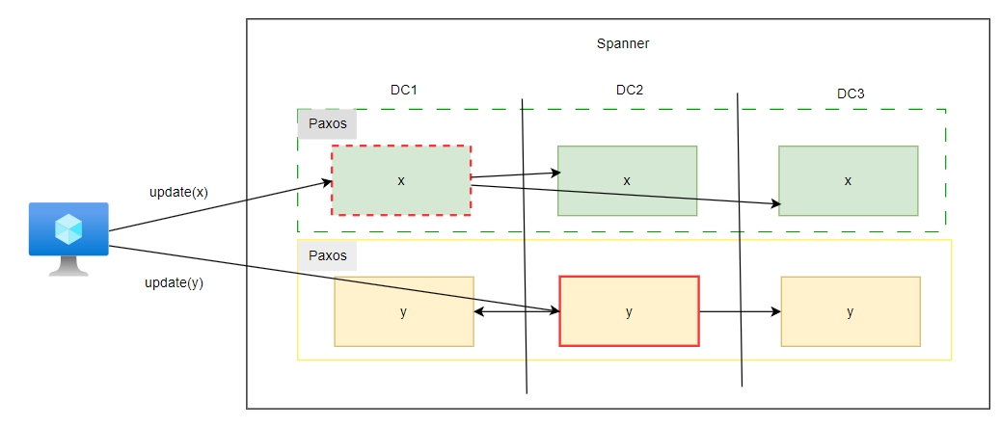

# Spanner


# 系统结构

`spanner`: `Google` 公开的新一代分布式数据库，它既具有`NoSQL`系统的可扩展性，也具有关系数据库的功能。
- 数据分片存储，例如 `A`，`B` 数据块
- 每块数据使用 `Paxos` 实现「复制」，类似 `Raft` 算法
  - `leader`: 数据写操作、数据锁维护
- `Paxos` 中的副本会存储在不同地方的数据中心 `DC (data center)`
- 事务实现
  - 二阶段锁
  - 二阶段提交


# 事务

## 读写事务

```sql
begin transaction;
    xval = read(x) + 1;
    yval = read(y) - 1; 
    update(x,xval);
    update(y,yval);
     ...
end
```

`spanner` 实现上述事务操作
1. 假设 `x,y` 数据分布在不同的分片上

    

2. 客户端从各个分片的`leader` 处读取数据，且 `leader` 对这些数据进行「加锁」

    

3. 客户端执行完事务流程后，会从所有的 `Paxos` 中选择一组作为 `TC`

    

4. 提交数据写操作到 `leader` 节点，每个 `leader` 也会将写操作同步到每一个 `follower` 节点

    

5. 等待 `follower` 都更新完成后， `leader` 节点又会发送 `prepare` 信号，确认是否大多数`follower` 都更新成功（`Raft` 投票）

    

6. 在多数的 `follower` 确认 `prepare` 后，`leader` 便会向 `TC` 组的 `leader` 发送 `prepare` 确认信号

    

7. 所有的 `Paxos` 都确认 `prepare` 成功，`TC` 组的 `leader` 便会发送 `commit` 信号；`follower` 完成 `commit` 提交后， `leader` 便会相关放锁

    

8. `TC` 组的 `leader` 接收所有 `Paxos` 组的 `commit` 确认后，便通知客户端事务执行成功

    


## 只读事务

### 目标

只读事务与读写事务之间需要满足以下要求
- **序列化 `serializable`**
- **外部一致性 `external consistency`**: 若在只读事务之前执行了一次读写事务，那么当前只读事务应当能读取到读写事务更新的数据，**即线性化**


### 快照隔离

**快照隔离`snapshot isolation`**: `spanner` 系统中所有节点时间同步，只读事务与读写事务追加一个 `ts (timestamp)` 时间戳属性
- 只读事务：`ts = transaction start time`
- 读写事务：`ts = transaction commit time`

现在有三个事务 `T1,T2,T3` 要执行
- `T1` 读写事务 `ts=5`
- `T2` 读写事务 `ts=9`
- `T3` 只读事务 `ts=5`

根据序列化与外部一致性要求，`T3` 只能读取 `ts <= 5` 的数据，因此 `T3` 的读取结果为 `x=10,y=11`。


利用「快照隔离」实现只读事务虽然不需要去争夺「锁」，但还需要一些额外的机制
- **系统可以存储一段时间内被修改数据的所有旧值**
- **安全时间 `safe time`**：客户端通过副本节点执行只读事务时，副本操作日志可能会落后 `leader` 几个版本，因此，在完成与 `leader` 的操作日志同步后，副本才会响应客户端的读请求
- **时钟同步**：现实中所有节点的时间无法做到统一，但只要只读事务的时间不要偏得太离谱，系统还是正常执行
  - **只读事务时间戳过大**：等到系统执行到那个时间戳，再响应读取
  - **只读事事务间戳过小**：小于系统缓存数据的时间戳，无法执行事务

### 时间同步

节点同步时间得依靠访问接收卫星`GPS`信号的时间同步服务，这样会导致由于网络传输问题，节点之间的时间肯定存在一定偏差。为解决该问题， `spanner` 节点从时间同步服务获取到的时间格式为`TT`时间，`[earliest time, latest time]` ，即当前时间的取值范围。


`TT` 时间进行时间同步遵循两条
- **启动规则 `start rule`**
  - 只读事务：`ts = TT.now().latest`
  - 读写事务：`ts = TT.now().latest`
- **提交等待 `commit wait`** : 针对「读写事务」，在 `TC` 收集投票结果并能确定 `ts` 值后，需要等待一会儿，直到 `ts < TT.now().earliest` 时才真正提交 `commit`。


> [!tip]
> 通过 `TT` 时间、安全时间与同步规则，`spanner` 实现了「外部一致性」


