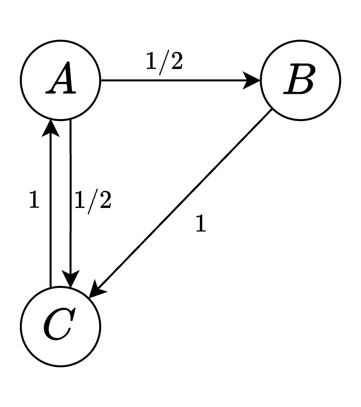

# spark


# 简介

[spark](https://spark.apache.org/): 是一个大型数据处理引擎，提供了一整套开发 API，支持流计算和机器学习。**主要贡献是将 `MapReduce` 模型进一步优化**。
- `HDFS` : 是`Hadoop`生态系统中的核心组件，提供类似 `GFS` 的文件存储能力

# PageRank

## 介绍

[`PageRank`算法](https://www.mlpod.com/36.html): 在互联网早期历史中，该算法被引入作为一种评估网页重要性的方法。搜索引擎会为每个网页分配一个正实数（`PageRank` 值），代表该网页的重要性。这些数值组成一个向量，其中较高的值意味着该网页在重要性上的优势，因此在搜索结果中可能会被优先显示。

假设有三个网页 A、B 和 C。A 链接到 B 和 C，B 只链接到 C，而 C 只链接到 A。在用户模型中
- 用户在 A 界面有 50% 的概率跳转到 B 或 C
- 用户在从 B 界面有 100% 跳转到 C
- 用户在 C 界面会有 100% 跳转到 A



经过多次 `PageRank` 迭代，会发现 C 的 `PageRank` 值可能会比 A 和 B 都高，因为它接收到了 A 和 B 的流量。

> [!note]
> 若通过 `MapReduce` 模型来运行该算法，则会存执行多轮 `map，reduce` 操作，将产生大量的输出、输出数据


## spark 实现


输入文件 `in.txt`，每一行描述的是图中的一条有向边，例如 `u1 u2` 表示 `u1 -> u2`

```txt
u1 u2
u2 u3
u1 u2 
```

`spark` 针对 `rdd` 数据构建串行的处理流程图 `lineage graph`，只有调用 `collect()` 时才会真正在节点上执行 `lineage graph` 并收集执行结果。

```js

/* ================== 构建 lineage graph ============ */ 

// 从 HDFS 取文本
val links = spark.textFile("in.txt").rdd

// 将 in.txt 的每一行按照空白符进行分割，即 'u1 u2' 分割为 (u1,u2)
var links1 = links.map{s => 
  val parts = s.split("\\s+")
  (parts(0), parts(1))
}

val links2 = links1.distinct()      // 去重
val links3 = links2.groupByKey()    // 按照 key 分组，即按照 parts(0) 进行分组
val links4 = links3.cache()

val ranks = links4.mapValues(v => 1.0)
for (i <- 1 to 10) {
  val jj = links4.join(ranks)
  val contribs = jj.values.flatMap{
  case (urls, rank) =>
    urls.map(url => (url, rank / urls.size))
  }
  ranks = contribs.reduceByKey(_ + _).mapValues(0.15 + 0.85 * _)
}

/* =================== 真正执行 spark 脚本 ============= */
val output = ranks.collect()
output.foreach(tup => println(s"${tup._1} has rank:  ${tup._2} ."))
```


