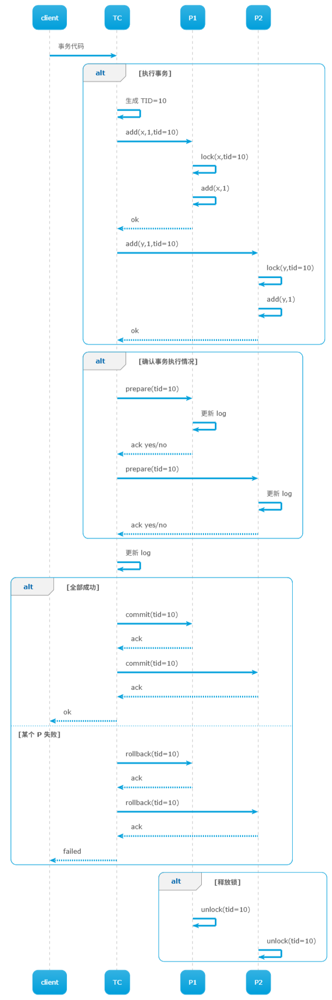

# 分布式事务

# 概念

## 事务

**事务`transaction`** : 通常会将能实现并发控制 `concurrency control` 与原子提交 `atomic commit` 的机制称之为事务，即在可并发的系统中，用户提交的一系列操作可以原子的执行。
- 并发控制 `concurrency control`: 多个事务并发时，保证各个事务读/写相同数据时，正确操作
- 原子提交 `atomic commit`: 事务中的操作要么都成功，要么都失败，**不允许出现部分成功的情况**


在数据库中，一个可行的事务系统需要满足以下条件
- **原子性 `Atomic`**: 事务中的操作要么都成功，要么都失败
- **一致性 `Consistent`**: 事务提交前后只存在两个状态，提交前的状态和提交后的状态，绝对不会出现中间的状态
- **独立性 `Isolation`**: 对于任意两个并发的事务`T1`和`T2`，在事务`T1`看来，`T2`要么在`T1`开始之前就已经结束，要么在`T1`结束之后才开始。每个事务都感觉不到有其他事务在并发地执行。
  - **可序列化 `serializable`**: 多个并发执行的事务会生成一组结果输出序列，而针对这组结果序列，可以找到一组能与之对应的事务串行执行序列。例如 `T1 -> R1`，`T2 -> R2,R3`, `T3 -> R4` 三个事务同时执行的输出结果序列为 `R4,R1,R2,R3`，当事务按照 `T3,T1,T2` 的顺序串行执行时也会产生 `R4,R1,R2,R3` 序列结果
- **持久化 `Durable`**: 事务一旦被提交了，那么对数据库中的数据的改变就是永久性的

## 中止

**中止`abort`**: 事务由于某种原因，在执行过程中失败。出现中止问题后，就需要系统具有优秀的故障处理系统，实现事务的 「原子性」与「一致性」 
- **撤销 `undo`**: 事务执行失败，恢复被事务修改的数据
- **重做 `redo`**: 事务执行成功，但数据库崩溃，`cache` 中的数据未及时落盘，数据库重启后重新执行事务

# 并发控制

## 锁

在并发流程中解决共享资源冲突，主要有两种加锁方式
- **悲观锁`pessimistic`**: 必须加锁成功后，才能访问共享资源，且访问共享资源完成后才能释放锁。适用于高并发场景
- **乐观锁`optimistic`** : 在提交共享资源写操作时，才会检测是否存在冲突。适用于低并发场景


## 二阶段锁定

**二阶段锁定`two-phase locking`**: 「悲观锁」的一种实现方式
1. 访问共享资源前，首先获取锁
2. 在事务完成或中止后，才会释放所有相关锁


```sql
-- T1
begin transaction;
    -- 获取 x 数据相关的锁
    add(x,1); -- 1 
    -- 获取 y 数据相关的锁
    add(y,-1); -- 2
commit;
-- 释放 x,y 相关的锁
```

该方式虽然实现了「悲观锁」，**但是容易陷入死锁**: 假设 `T1` 与 `T2` 并发执行， `T1:1` 处获取了 `x` 的锁，`T2:1` 处获取了 `y` 的锁；`T1:2` 处想要获取 `y` 的锁，但是 `T2` 事务未完成不会释放 `y` 的锁；`T2:2` 想要获取 `x` 的锁，但时 `T1` 事务未完成不会释放 `x` 的锁 

```sql
-- T2
begin transaction;
    -- 获取 y 数据相关的锁
    get(y); -- 1
    -- 获取 x 数据相关的锁
    get(x); -- 2
commit;
-- 释放 x,y 相关的锁
```


# 原子提交

## 事务协调器

**事务协调器`TC-transaction coordinator`**: 专门用于收集用户事务并执行事务的程序
- 事务协调器实例会存在多个，实现事务并发
- 事务执行追踪，会用编号 `TID` 标记每个事务
- 会与其他事务的参与者 `Participants` 进行数据交互，例如 `P1`、`P2`


## 两段提交

**两段提交`two-phase commit`** : 事务执行完成后，`TC`会发送 `prepare` 确认每个 `participants` 是否都完成了事务操作
- 参与者全部完成：事务成功，`TC` 发送 `commit` 
- 参与者部分完成：事务失败，`TC` 发送 `rollback` 




> [!tip]
> 事务完全执行完成后（包括机器故障恢复处理），`TC` 与参与者便可以清理在事务执行过程中产生的 `log`


## 事务异常


```sql
-- T1
begin transaction;
        ...
    add(x,1); -- 1 
    add(y,-1); -- 2
        ...
    if (get(y) < 0)
    begin
        rollback;   -- 3
    end
commit;
-- 释放 x,y 相关的锁
```

在分布式数据存储系统中，数据 `x` 与 `y` 可能存储在不同的机器上。为了实现事务的原子性，所要考虑的故障情况就有
1. `P2` 机器故障，无法执行 `T2:1`
2. `P1` 机器故障，无法执行 `T1:2`
3. `TC` 机器故障
4. 事务代码逻辑上就会失败 `T1:3` 

代码逻辑异常只要按照 `rollback` 逻辑处理即可，而机器故障则是分布式需要重点考虑的问题
- `P1`在 `prepare` 前宕机：`TC` 接收不到回复信息，事务肯定失败；而`P1`恢复后需撤销该事务涉及的操作
- `P1`在 `prepare` 答复`ok`后宕机：此时 `P2` 可能已经完成序列化，`TC` 必须答复客户端事务执行成功，当 `P1` 恢复后需要按照 `LOG` 完成本次事务操作提交
- `TC` 收到`prepare`答复前宕机: 事务失败，`TC` 重启后通知参与者撤销事务即可
- `TC` 收到所有`prepare`答复后宕机：
  - 全部答复 `ok`: `TC` 可能发送了 `commit`, 可能有参与者完成序列化操作，`TC` 重启后需要再次发送 `commit` 确认所有的参与者完成事务提交
  - 部分答复 `ok`: 事务失败，`TC` 重启后通知参与者撤销事务即可
- 网络异常：`TC` 与参与者都有权力中止当前事务
  - **特例**:`P1` 在恢复 `prepare` 信号 `ok` 后，必须阻塞等待 `commit` 信号，不能设置超时，因为 `P1` 无法确认 `TC` 是否已经发送了部分 `commit`


