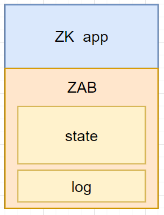
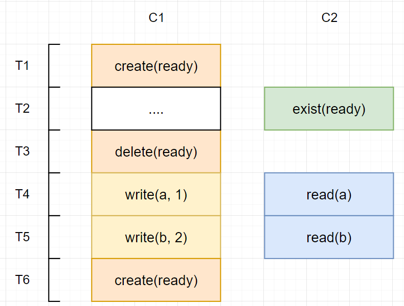

# Zookeeper


# 介绍

## 概述

[zookeeper](https://zookeeper.readthedocs.io/zh/latest/intro.html): 是一个开源的分布式协调服务，广泛应用于分布式系统中。它采用树形目录结构，提供统一命名服务、配置管理、分布式锁、集群管理等功能，确保数据一致性和高可用性。
- 通用的分布式框架
- 支持复制



`zookeeper` 主要结构如图
- `ZK app` : zookeeper 的应用层，以服务的形式提供，用于处理客户端业务逻辑
- `ZAB` : 一套实现了类似 `Raft` 算法机制的系统，用于支持 `ZK app` 的「复制」部署能力


## 应用

zookeeper 的一些应用场景
- `Test-and-Set` 语意
  
  ```cpp
    volatile int lock = 0; // 共享变量

    int test_and_set(int & value){
        // 只要保证下述操作是原子的，便能实现
        int old = value;
        value = 1;
        return old;
    }

    void critical() {
        // 自旋锁：无限循环直到获取锁
        while (test_and_set(&lock) == 1);

        // 临界区代码，一次只有一个进程可以进入此区域
        // ...（执行临界区操作）

        lock = 0; // 完成临界区操作后释放锁
    }
  ```
- 配置管理: 将[乐观锁](#乐观锁)描述案例中的 `a,b` 状态换成配置文件即可
- 主/备节点管理：`ZAB` 本来就是魔改的 `Raft` 算法，天然支持
- 乐观锁


# 一致性

## ZAB vs Raft

但 `ZAB` 与 `Raft` 有着显著差异：**`ZAB`允许 `follower` 节点响应用户的「读操作」，而 `Raft` 只允许 `leader` 处理用户请求与响应** 。`Raft` 算法无法通过增加节点机器，使得读/写操作加速（可能还会不如单机性能），而 `ZAB` 随着节点机器的增加，会大大增强「读操作」性能。**但代价是 `ZAB` 并不保证系统读/写操作「强一致性」。**


## FIFO

`zookeeper` 虽然舍弃「强一致性」换来了「读操作」的性能提升，但也不是完全放弃了读/写操作的一致性，其保证
- **写操作一定是线性化的**：对于同一状态，系统不会同时执行两个写操作，写操作具有先后顺序
- 在客户端视角，zookeeper 会按照 `FIFO` 的顺序执行客户端的读/写操作请求并响应
  - 先写后读情况：备节点会等待主节点执行完相邻的写操作后，才执行读操作


> [!tip]
> `zookeeper` 只保证了同一客户端读/写操作的「强一致性」，而非整个系统
> - 每个客户端是独立线程
> - `state` 是全局变量
> 在 zookeeper 系统下，这些线程对 `state` 的写上锁，而只要检测到没上写锁，便能随便读。**即两个线程间同时读的操作，在系统中并没有强制约束谁先谁后。**


## sync


假设存在多个客户端对 `A` 状态进行读写操作，若某个客户端想读取到 `A` 最新的写入状态，可在读取前发送一个 `sync` 同步操作，**保证在 `read(A)` 之前，其他客户端的写入操作肯定都完成了**。


## 乐观锁

假设有两个客户端 `C1` 与 `C2` 再对状态 `a,b` 进行读/写操作，**且保证`C2` 只能在 `C1` 更新好 `a,b` 状态成功后，才能对数据进行读取**。针对该问题，便能基于 `zookeeper` 提供的 `FIFO` 特性，实现「乐观锁」
1. 使用 `ready` 状态来标记 `C1` 是否已经准备好了 `a,b` 
2. 在 `T2`时刻， `C2` 使用 `exist` 指令检测 `ready` 是否存在
 - 不存在：`exist` 返回失败
 - 存在：`exist` 返回成功，且 `zookeeper` 会对 `ready` 状态进行监控
3. 在 `T3` 时刻，`C1` 想要对 `a,b` 进行修改，删除了 `ready`。**由于 zookeeper 对 `ready` 进行了监控`watch`，便会记录 `ready` 已经被修改**
4. `C2` 由于在 `T2` 检测 `ready` 成功，因此在`T4,T5` 时刻，对 `a,b` 数据进行读取。**但 zookeeper 已经知道 `ready` 被修改，`C1` 正在改数据，因此`read(a)，read(b)` 都将返回失败**




# API

## 状态表


在 `zookeeper` 中，状态并非以 `key-value` 的形式存储，而是通过 `data-tree` 实现
- `ZNode`: 树中的节点，存储数据大小 `< 1MB`
- `path`: 每个节点的路径标识，唯一不重复，用于节点定位

对于 `ZNode` 还存在一些特殊属性
- 类型 `flag`
  - 常规 `regular`：一旦创建，只能手动删除
  - 临时 `ephemeral` : 需要客户端定时发送心跳，若心跳消失，则自动删除
  - 序列 `sequential` : zookeeper 会为同一个节点标识自动添加一个编号
- 版本号 `version` : 当节点数据创建、修改、删除时，会自增

## 操作

`zookeeper` 中数据的状态存储与文件系统类似，因此其操作指令也十分雷同
- `create(path,data,flag)`
  - 成功： `path` 不存在，且创建成功
  - 失败：其他情况
- `delete(path,version)` : 检测 `ZNode` 当前版本号与 `version` 是否一致，一致才执行操作
- `exist(path,is_watch)` : 通过设置 `is_watch`，告知 zookeeper 是否监听该 `path` 是否执行写操作（删除、修改、创建），**当 zookeeper 监听到修改后，会通知客户端**
- `getData(path,is_watch)`
- `setData(path, data, version)` ：检测 `ZNode` 当前版本号与 `version` 是否一致，一致才执行操作
- `lists(path)` : 获取 `sequential` 类型 `path` 的所有实际路径名，例如 `path=/a/b/c` 其对应的真实路径有 `/a/b/c_1`，`/a/b/c_2`,`/a/b/c_3`


## 同步应用

### 小型事务

通过 `version` 也能实现针对单个 `ZNode` 节点数据的「乐观锁」

```python
def update_count(path):
    """
        利用 path 变量进行计数
        注意：
            该方式只适用于低负载情况，在高负责会存在严重性能问题
            例如若 1000 个客户端同时更新，那么当1个客户端成功后，另外 999个都将失败，重新进入循环
    """
    while True:
        val,version = getData(path)
        val += 1
        if setData(path, val, version):
            break
```

该方式通过循环重试与 `version`，在客户端层面保证了针对 `path` 数据的读/写操作的原子性，即一个简单的「小型事务`min-transition`」。

### 分布式锁

```python
def lock(path):
    while True:
        # 尝试创建锁
        if version := create(path, "lock",ephemeral = True):
            return version

        if exist(path, is_watch = True):
            # 等待 path 被修改，zookeeper 下发通知
            wait(path)

def unlock(path,version):
    delete(path,version)
```

上述 zookeeper 通知客户端退出等待获取锁的方式类似条件量的 `condition.notifyAll()`，zookeeper 会唤醒所有的客户端，在高负载下，也会造成性能问题。

```python
def lock(path):
    # num 就是 sequential 模式下，zookeeper 创建 path 时，自动生成编号
    version,num = create(path, "lock",sequential =True , ephemeral = True)
    while True:
        # 获取所有现在还存在的 path 
        paths = lists(path)
        paths = sort_ascend_by_num(paths) 

        # 编号 < num 的 path 均已经被删除，即已经获取锁并释放，或者持有锁的时间已经超时
        if paths[0].num >= num:
            return (version,num)

        # 等待 num - 1 对应的 path 被删除
        pre = path + "_" + (num - 1)
        if exists(pre,is_watch=True):
            wait(pre)

def unlock(path, num,version):
     delete(path + "_" + num,version)
```

利用 `sequential` 类型的 `path` 便能实现  `condition.notifyOne()` 的效果
