# Ansys HPC

- [Ansys RSM](https://ansyshelp.ansys.com/public//////Views/Secured/corp/v242/en/wb_rsm/wb_solution_job_status.html)

# 概念

- **任务`Job`** : 从客户端提交的需要使用 RSM 集群处理任务\
- **客户机`Client Machine`** : 安装有 Ansys 程序，且向 RSM 提交任务的机器
- **客户端`Client Application`** : 提交 RSM 任务的 Ansys 程序
- **HPC 资源 `HPC Resource`** : 支持高性能计算的系统，例如集群、云计算
- **节点 `Node`** : HPC 中的单个计算机器
  - 头节点 `Head Node` : 具有任务接收与分发功能的节点，也被称之为 `submit host`
  - 执行节点 `Execution Node` : 只负责计算的节点
- **队列 `Queue`** : 存放待执行任务的队列
  - `RSM Queue` : 在 RSM 系统中所使用的任务队列，会被转换为 `HPC Queue`
  - `HPC Queue` : 在 HPC 系统中所使用的任务队列

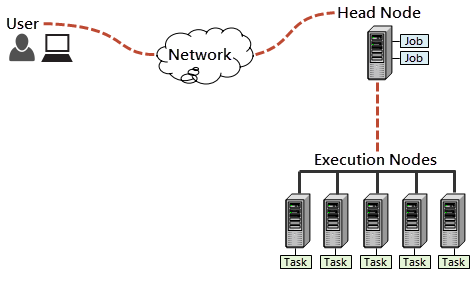

# RSM

`RSM (Remote Solve Manager)` : 提供了配置和监视作业提交到HPC资源的核心框架。Ansys 所有模块均是通过该模块实现 HPC，**即集群机器、客户端机器均要安装 RSM 才能实现 HPC。** 
- [支持的模块](https://ansyshelp.ansys.com/public/account/secured?returnurl=/////Views/Secured/corp/v242/en/wb_rsm/rsmsupslv.html)
- **AEDT 请直接看 Ansys Electronics Desktop 章节**

此外，只有以下的 HPC 集群计算方案才需要手动进行 RSM 配置
- Platform LSF
- PBS Professional
- Altair Grid Engine
- Slurm Workload Manager : Linux 系统推荐
- Windows HPC : windows 系统推荐
- ARC : Ansys 自带，配置简易，但是不是所有的 Ansys 软件都支持，例如 `HFSS` 就不行

## RSM service

手动开启 RSM 服务，（在使用 `Register with RSM` 工具时，会自动开启）
1. 电脑要管理员账号
2. 要杀死 `ans.rsm.*`
3. 以管理原权限打开 powershell / cmd
4. 控制台切换路径 (ansys 安装路径下搜索 `ansconfigrsm.exe`)
5. 执行 `ansconfigrsm.exe -launcher` 命令，**界面卡住需要按一下回车键**

可在 `C:\Windows\Temp` 路径下查看 `rsmlauncher242-<timestamp>.log` 日志

## RSM Configuration

配置 RSM 与 HPC ，使得 RSM 能够正确识别 HPC 资源
- 任务应该被发送到哪个 HPC 资源
- 客户端与 HPC 资源的通信协议
- 客户端与HPC 资源如何进行文件传输
- 任务队列映射

工具在 `\RSM\bin` 下
- `Ans.Rsm.ClusterConfig.exe`  不带控制台的版本
- `Ans.Rsm.ClusterConfigC.exe` 带控制台的版本


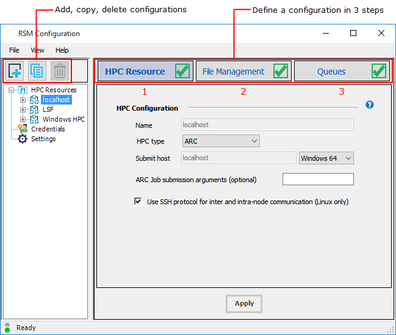


### 集群配置

RSM 配置为以下三个方面，[详细介绍](https://ansyshelp.ansys.com/public/account/secured?returnurl=/////Views/Secured/corp/v242/en/wb_rsm/rsm_define_clus_config.html)

- `HPC Resource` : 配置 HPC 资源
- `File Management` : 配置本机与 HPC 资源文件传输方式
- `Queues` : 导入或创建 HPC Queue ，且指定 HPC Queue 与 RSM Queue 的映射关系

每个 Tab 页的图标会提示当前是否配置成功

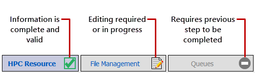


默认情况下，会存在一个名为 `localhost` 的 RSM 配置（一个部署在本地的单节点的 ARC 集群）。 `Queues` 中存在一个名为 `Local` 的 `RSM Queue`，同时该队列会被映射到名为 `local` 的 `HPC queue` 上。通过 `Local` 队列，便能向本机的单节点集群提交任务。**默认的 `localhost` 配置不要动，该配置是 RSM 系统把当前机器加到集群中的固定配置。**


### 集群配置文件

通过配置工具，可以生成集群配置文件
- 队列配置文件格式 `queues.rsmq`
- 集群配置文件格式 `.rsmcc`

配置文件默认路径为

- windows : `%APPDATA%\ANSYS\v242\RSM`
- linux : ` ~/.ansys/v242/RSM`

自定义路径

1. 创建文件夹，例如 `C:\some\folder`
2. 修改 RSM 设置

```term
triangle@LEARN:~$  cd ./RSM/bin
triangle@LEARN:~$  rsm.exe appsettings set JobManagement ConfigurationDirectory C:\some\folder
```

3. 再次启动 `Ans.Rsm.ClusterConfig.exe` 工具，集群配置就会生成到 `C:\some\folder\ANSYS\v242\RSM` 文件夹下

> [!tip]
> 客户端提交任务前，需要将 `queues.rsmq` 与 `.rsmcc` 拷贝到客户端，让客户端的 RSM 保持一样的配置，才能成功提交任务


# Ansys RSM Cluster

## 介绍

**ASM (Ansys RSM Cluster)** : ansys 自带的集群实现工具
- 在 windows 上， `Ansys Mechanical` 与 `Mechanical APDL` 求解器只能在一个节点上运行
- ARC 版本必须统一
- **不是所有的 ansys 模块都支持，例如 `HFSS` 就不能使用**

工具路径
- 工具 ： `.\RSM\ARC\bin`
- 脚本：`.\RSM\ARC\tools\winx64`


## 集群模型

使用 ARC 可以搭建两种集群模型
- 单节点模型：头节点与执行节点都运行在一台机器上，即 `localhost` 配置
- 多节点模型：一个头节点，多个执行节点，且头节点对执行节点具有控制权

根据用户使用场景又可以划分为三种类型
- 单节点模型，单用户使用
- 单节点模型，多用户使用
- 多节点模型，多用户使用

## 集群搭建


构建 ARC 集群的前提

1. 所有机器的操作系统要么 windows，要么 linux 
2. 所有机器都需要安装 Ansys，且安装路径必须一致，例如都是 `C:\Program Files\ANSYS Inc` 

集群的搭建方式

- [ARC Configuration](https://ansyshelp.ansys.com/public/account/secured?returnurl=/////Views/Secured/corp/v242/en/wb_rsm/arc_config_app.html): 界面配置工具 `\RSM\ARC\bin\ArcConfigConsole.exe` **[推荐]**
- [arcdeploy](https://ansyshelp.ansys.com/public//////Views/Secured/corp/v242/en/wb_rsm/arcdeploy_command.html) : 执行脚本 `RSM\ARC\tools\winx64\arcdeploy.cmd`，能提供 `ARC Configuration` 的所有功能，自动创建。

## 命令脚本

ARC 相关的命令行脚本都在  `\RSM\ARC\tools\winx64` 路径下，**通过这些脚本，也能实现上述集群搭建。**

- **权限认证**

```term
triangle@LEARN:~$ arccredentials.cmd 
```

- **服务创建**

```term
triangle@LEARN:~$ installservice.cmd /?

Usage: installservice -arcmaster|-arcnode

Options:
   -arcmaster                   # 头节点服务
   -arcnode                     # 可执行节点服务
```

在头节点所在机器推荐使用 `ARC_ROOT` 环境变量来表明头节点使用的 ARC 版本。

```term
triangle@LEARN:~$ set ARC_ROOT = %AWP_ROOTxxx%\RSM\ARC
```


- **任务管理**

```term
triangle@LEARN:~$ arcsubmit [Options] Script_Name [Script_Args] // 提交一个任务到 ARC 中，并返回任务 ID
Options
    -n                  任务使用几核
    -q                  任务发送到的集群队列名
    -a                  任务别名
    -d                  任务执行策略。
                            fill 一个节点的 core 使用满，才使用下一个节点的 core
                            span 每一台机器提供一个 core
                            none 等待能够执行当前任务的节点
    -r                  任务资源限制
       m                内存
       d                磁盘
    -w                  工作路径，能在所有节点间共享 
    -x                  任务独占节点
    -e                  错误日志
    -o                  标准日志
triangle@LEARN:~$ arcstatus [id] // 查看任务状态
triangle@LEARN:~$ arckill [id] // 删除任务
```

- **节点管理**

```term
triangle@LEARN:~$ arcconfig node modify [execHostName] [options]
Options
    -mn [masterHostName]                    将执行节点关联到头节点，在执行节点上运行
    -c [Cores]                              限制执行节点核数
    -r d:10gb,m:10gb                        限制节点的内存和磁盘使用量
triangle@LEARN:~$ arcnodes [nodename] // 查看所有节点状态
```

- **队列管理**

每个 ARC 集群会存在两个默认队列
- `default` : 集群中所有的执行节点都会监听该队列
- `local` : 只有本地节点会监听该队列

```term
triangle@LEARN:~$ arcconfig queue add [queueName] // 创建队列
triangle@LEARN:~$ arcconfig queue remove [queueName] // 删除队列
triangle@LEARN:~$ arcconfig queue modify [queueName] [options] // 配置队列
Options
    -m                          指定可以监听该队列的机器，'machine1:machine2:machine3'
    -e                          是否启用该队列
    -p                          指定队列优先级
    -s                          暂停队列
    -n                          限制任务数
    -b                          队列启用时间
    -q                          队列关闭的时间
    -u                          限制用户
triangle@LEARN:~$ arcqueues // 队列状态查询
```

# Ansys Electronics Desktop

使用 `Ansys Electronics Desktop` 进行 `HFSS` 仿真时，无法使用 ARC 进行 HPC 计算。Ansys 也提供了对应的解决方案
- [方案一](https://support.ozeninc.com/help-center/setting-up-the-remote-simulation-manager-in-ansys-electronics-desktop) ：对应 AEDT 工具，Ansys 提供了 `AnsoftRSMService.exe` 工具，该工具对 RSM 进行了封装，配合 `MPI` 工具即可实现 HPC
- 方案二 ：采用第三方集群工具实现 HPC ，例如 `Windows HPC`

下文将详细介绍「方案一」

## 工具安装

1. 启动 AEDT 安装程序
2. 选择 `Install Distributed Simulation Technologies`
3. 点击 `Install Electromagnetics RSM` 安装 RSM
   
   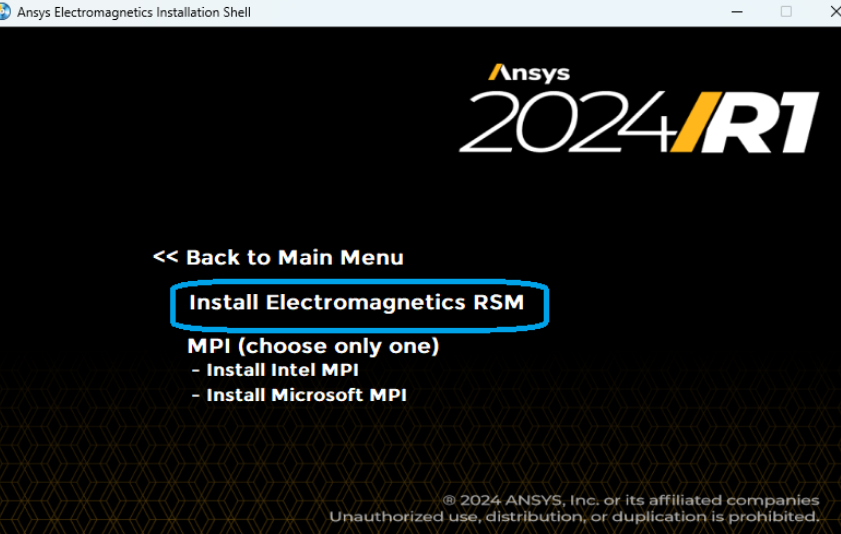

4. 点击 `Install xxx MPI`，**参与集群运算的机器都要安装一样的**

   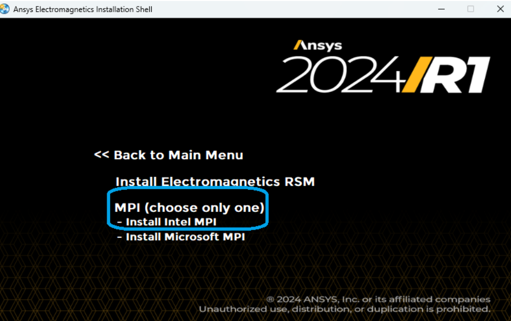

5. 点击 `Register with RSM` 启动 RSM 服务

   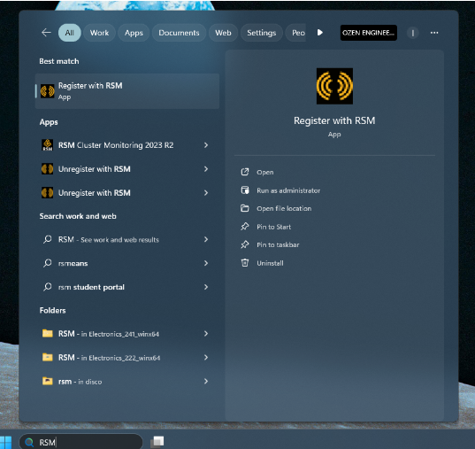

6. 启动 MPI 

```term
triangle@LEARN:~$ cd "%I_MPI_ROOT%/em64t/bin/"
triangle@LEARN:~$ hydra_service -install      // 安装 MPI 服务
triangle@LEARN:~$ hydra_service -start        // 启动 MPI 服务
triangle@LEARN:~$ mpiexec -register           // 生成 MPI 账号
account (domain\user) : 账号
password: 密码
```

7. 在 Ansys Electronics Desktop 中配置 MPI，`Tools > Options > General Options > Remote Analysis`

   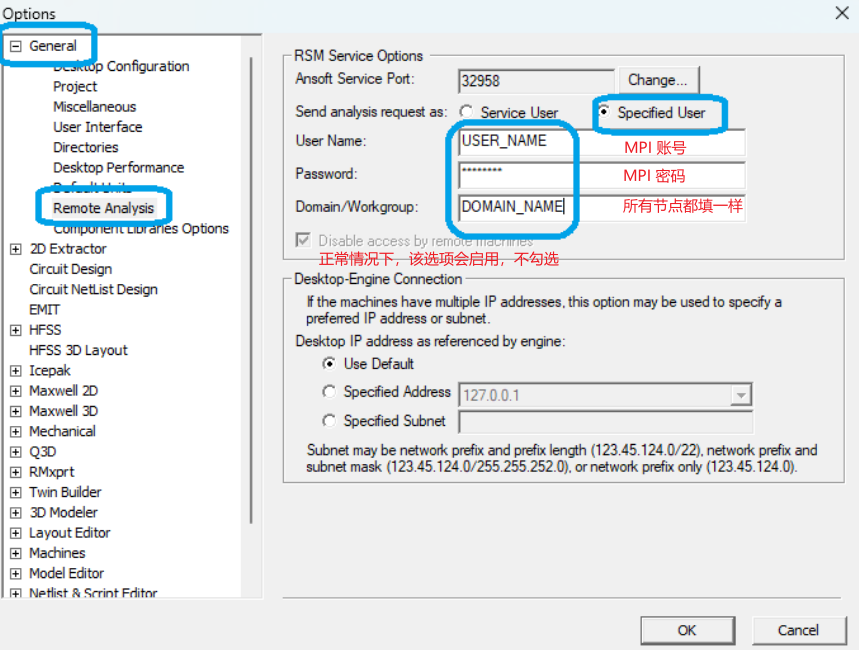


> [!tip]
> HPC 集群中的所有节点都需要进行上述软件安装与配置

## 集群配置

1. 打开 `Ansys Electronics Desktop` 工具
2. 切换到 `simulation` 工具栏

  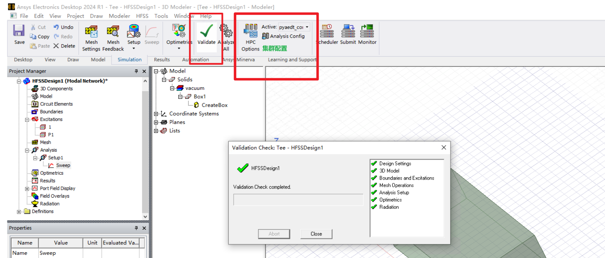

3. 点击 `HPC and Analysis Options`，创建新的集群配置

  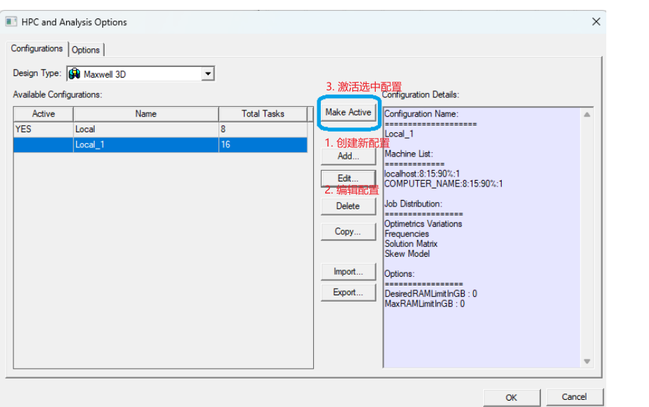

4. 点击 `edit` 编辑配置，采用 IP 地址与 UNC（计算机局域网名）都能添加节点，且可对节点进行资源限制

  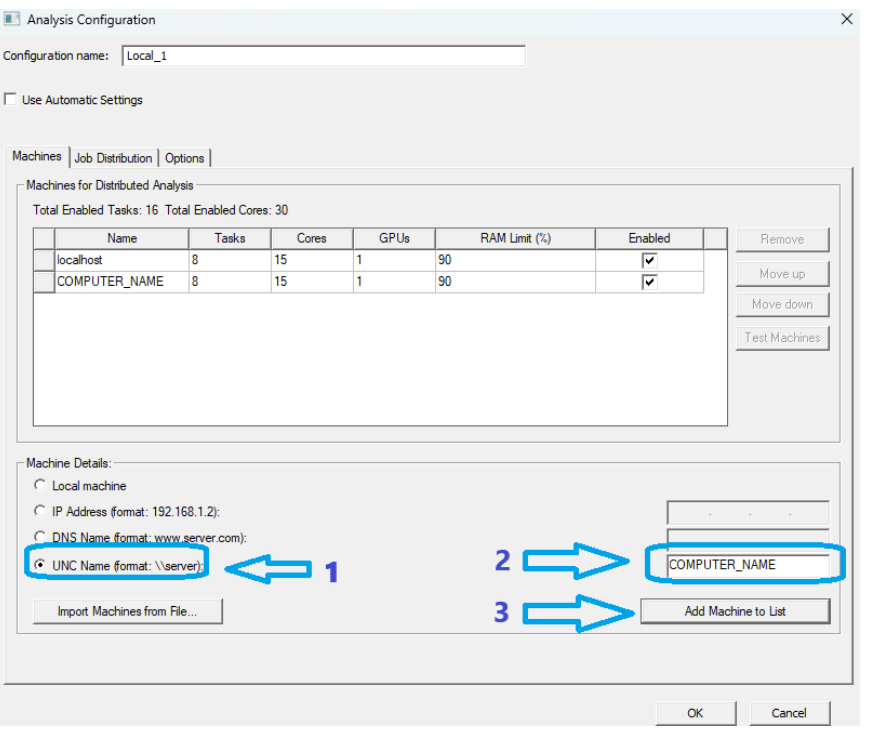

5. 点击 `Make Active` 激活配置，使用该配置进行计算

  

## 任务管理

提交任务有两种方案
- 方案一： 直接点击 `Analyze`，且像普通任务一样查看任务执行过程
- 方案二：使用 `submit` 工具提交任务，且使用 `moniter` 工具进行监控


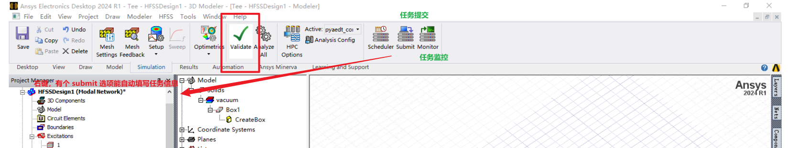


