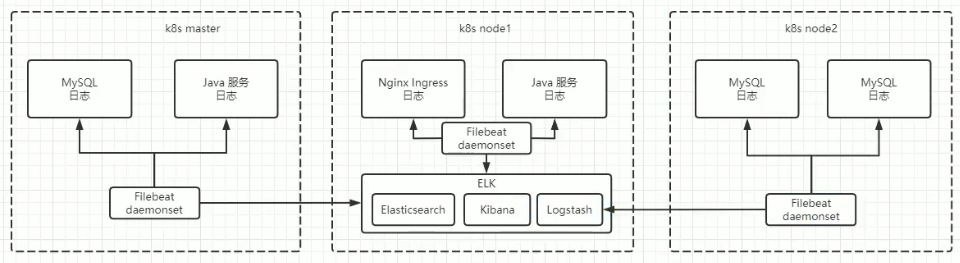

# ELK

# 概述

## 简介

[ELK stack](https://www.elastic.co/cn/elastic-stack/) : 并不是一款软件，而是一整套解决方案，**主要用于分布式系统日志收集**。

## 结构

- `FileBeat` : 收集每个节点上的日志，`docker` 容器的日志统一放在 `/var/log/containers` 下
- `Logstash` : 收集和分析、处理 `FileBeat` 发送的日志数据。若日志数据量过大，可在 `FileBeat` 与 `Logstash` 添加一个消息队列充当缓冲
- `Elasticsearch` : 开源的搜索引擎，存储 `Logstash` 处理后的日志数据，实现日志搜索
- `Kibana` : 对 `Elasticsearch` 接口的封装，实现数据可视化

