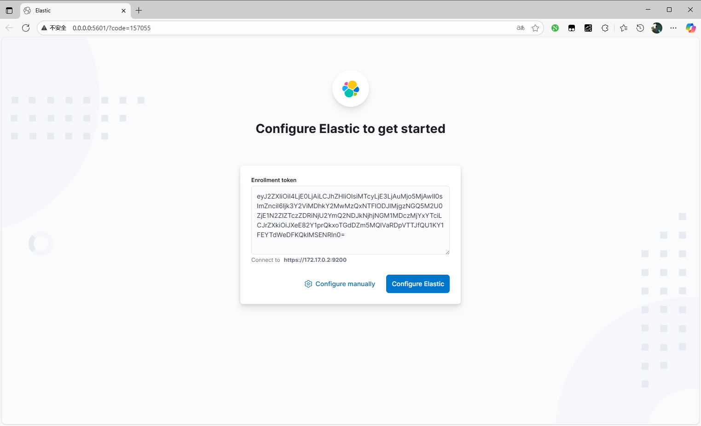
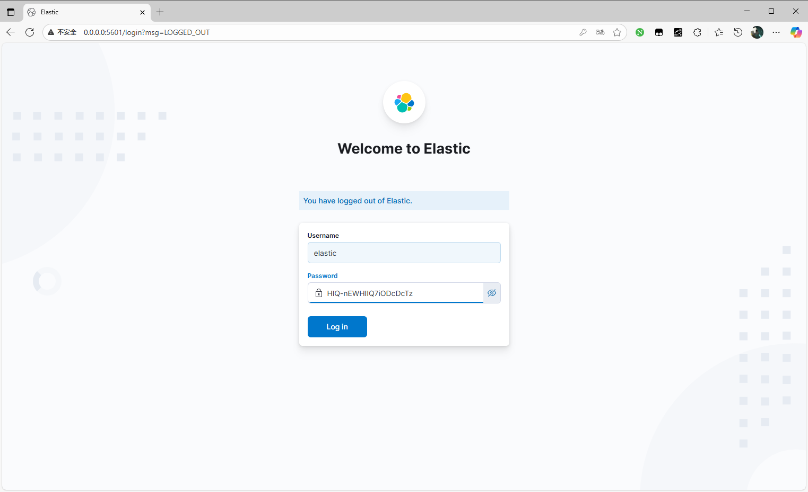
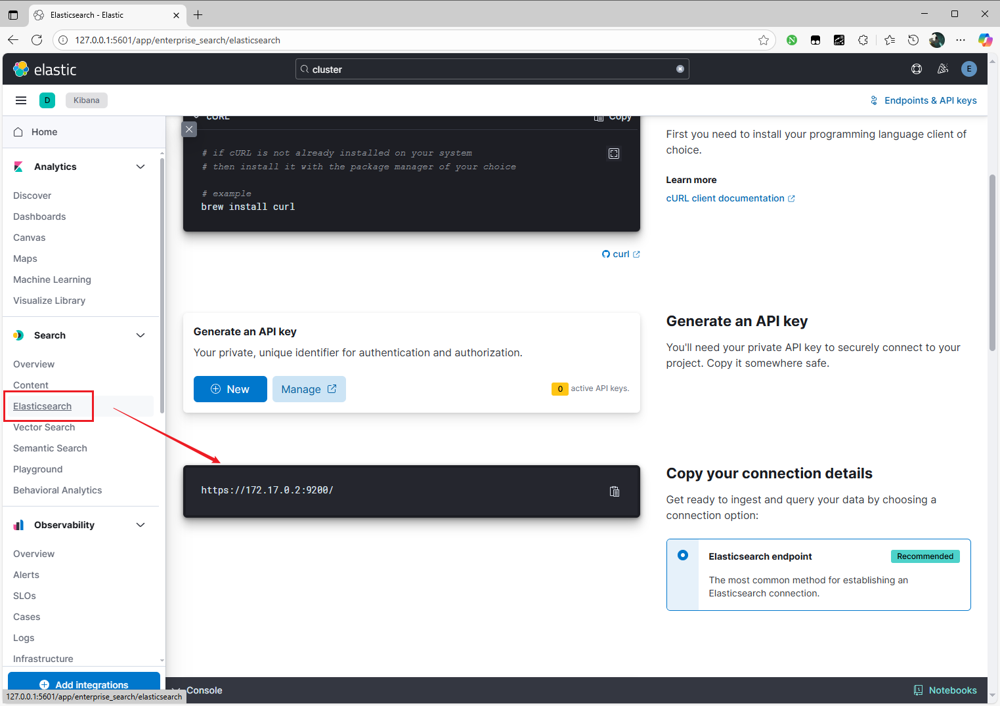
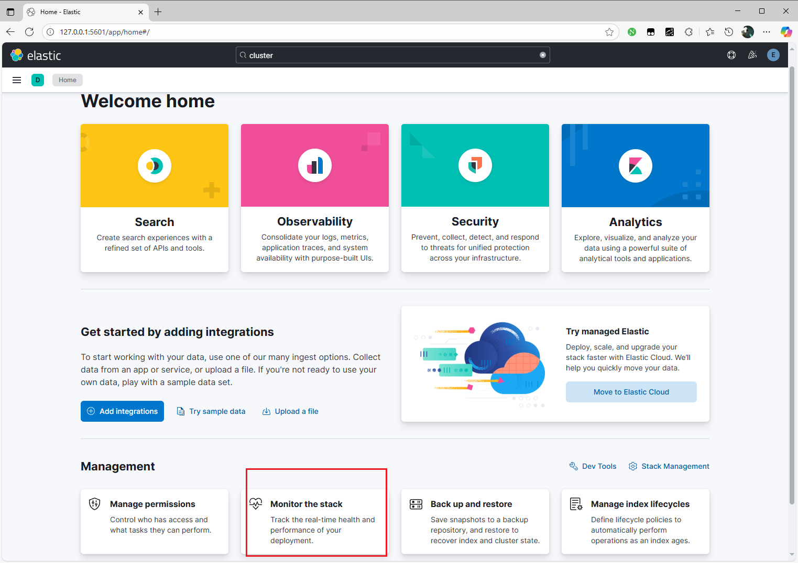
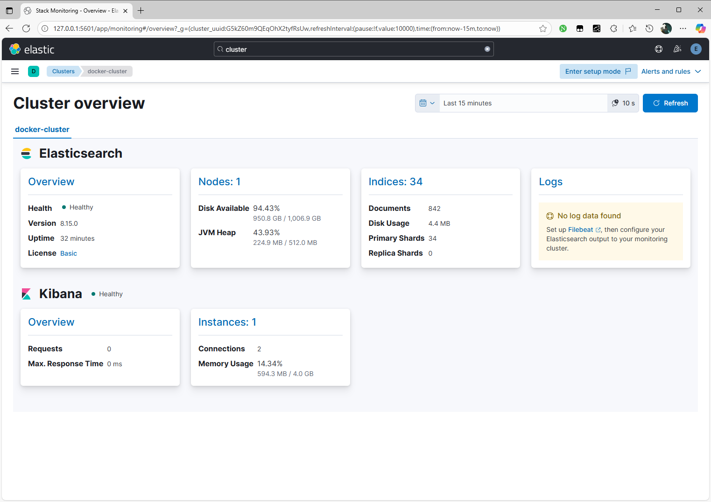
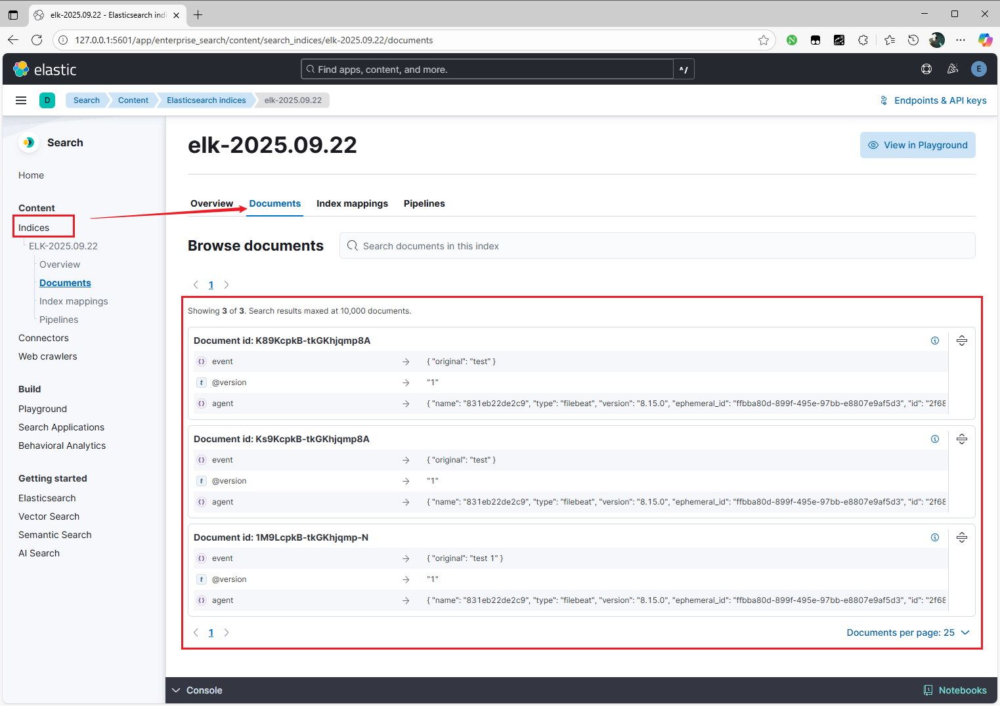

# ELK

-[ELK docker 部署](https://246859.github.io/posts/code/docker/docker_install_elk.html)

# 概述

## 简介

[ELK stack](https://www.elastic.co/cn/elastic-stack/) : 并不是一款软件，而是一整套解决方案，**主要用于分布式系统日志收集**。

## 结构


- `FileBeat` : 收集每个节点上的日志，`docker` 容器的日志统一放在 `/var/log/containers` 下
- `Logstash` : 收集和分析、处理 `FileBeat` 发送的日志数据。若日志数据量过大，可在 `FileBeat` 与 `Logstash` 添加一个消息队列充当缓冲
- `Elasticsearch` : 开源的搜索引擎，存储 `Logstash` 处理后的日志数据，实现日志搜索
- `Kibana` : 对 `Elasticsearch` 接口的封装，实现数据可视化


# 镜像

安装`ELK`时，所有组件的版本号要完全一致

```term
triangle@LEARN:~$ docker pull elasticsearch:8.15.0
triangle@LEARN:~$ docker pull kibana:8.15.0
triangle@LEARN:~$ docker pull logstash:8.15.0
triangle@LEARN:~$ docker pull elastic/filebeat:8.15.0
```

# Elasticsearch

## 试运行

1. 首次运行

```term
triangle@LEARN:~$ docker run -it --name elastic -p 9200:9200 -m 1g -e "discovery.type=single-node" elasticsearch:8.15.0
Options
    discovery.type          multi-node 多节点模式，生产环境使用
                            single-node 单节点模式，测试使用
```

2. 第一次运行会生成如下配置

```text
✅ Elasticsearch security features have been automatically configured!
✅ Authentication is enabled and cluster connections are encrypted.

ℹ️  Password for the elastic user (reset with `bin/elasticsearch-reset-password -u elastic`):
  HlQ-nEWHIIQ7iODcDcTz

ℹ️  HTTP CA certificate SHA-256 fingerprint:
  97ceb08dcc034151e82e2834d93e4f157fee73d4b656bd642d68c4c5073261a7

ℹ️  Configure Kibana to use this cluster:
• Run Kibana and click the configuration link in the terminal when Kibana starts.
• Copy the following enrollment token and paste it into Kibana in your browser (valid for the next 30 minutes):
  eyJ2ZXIiOiI4LjE0LjAiLCJhZHIiOlsiMTcyLjE3LjAuMjo5MjAwIl0sImZnciI6Ijk3Y2ViMDhkY2MwMzQxNTFlODJlMjgzNGQ5M2U0ZjE1N2ZlZTczZDRiNjU2YmQ2NDJkNjhjNGM1MDczMjYxYTciLCJrZXkiOiJqc2ViY1prQjJPeEs4T0xrNXUxMjpScUxHazBUUlFWQ2lRZzN1bkltYklBIn0=

ℹ️ Configure other nodes to join this cluster:
• Copy the following enrollment token and start new Elasticsearch nodes with `bin/elasticsearch --enrollment-token <token>` (valid for the next 30 minutes):
  eyJ2ZXIiOiI4LjE0LjAiLCJhZHIiOlsiMTcyLjE3LjAuMjo5MjAwIl0sImZnciI6Ijk3Y2ViMDhkY2MwMzQxNTFlODJlMjgzNGQ5M2U0ZjE1N2ZlZTczZDRiNjU2YmQ2NDJkNjhjNGM1MDczMjYxYTciLCJrZXkiOiJrTWViY1prQjJPeEs4T0xrNXUxMjp5cUZtVGhnTlJvdVZRZDdTMkRSSXZnIn0=

  If you're running in Docker, copy the enrollment token and run:
  `docker run -e "ENROLLMENT_TOKEN=<token>" docker.elastic.co/elasticsearch/elasticsearch:8.15.0`
```

也可以通过以下命令重新生成

```term
triangle@LEARN:~$ docker exec -it elastic /usr/share/elasticsearch/bin/elasticsearch-reset-password -u elastic // 密码
triangle@LEARN:~$ docker exec -it elastic /usr/share/elasticsearch/bin/elasticsearch-create-enrollment-token -s kibana // 生成 token 
```

3. 拷贝挂载内容

```term
triangle@LEARN:~$ docker cp elastic:/usr/share/elasticsearch/config /home/triangle/workspace/elk/elastic // 配置
triangle@LEARN:~$ docker cp elastic:/usr/share/elasticsearch/data /home/triangle/workspace/elk/elastic // 数据
triangle@LEARN:~$ docker cp elastic:/usr/share/elasticsearch/plugins /home/triangle/workspace/elk/elastic // 插件
triangle@LEARN:~$ docker cp elastic:/usr/share/elasticsearch/logs /home/triangle/workspace/elk/elastic // 日志
```

4. 删除试运行镜像

```term
triangle@LEARN:~$ docker rm elastic
```

## 正式启动

```bash
docker run -it \
    --name elastic \
    --restart=always \
    -p 9200:9200 \
    -m 1g \
    -v /home/triangle/workspace/elk/elastic/config:/usr/share/elasticsearch/config \
    -v /home/triangle/workspace/elk/elastic/data:/usr/share/elasticsearch/data \
    -v /home/triangle/workspace/elk/elastic/plugins:/usr/share/elasticsearch/plugins \
    -v /home/triangle/workspace/elk/elastic/logs:/usr/share/elasticsearch/logs \
    -e "discovery.type=single-node" \
    -e "LANG=C.UTF-8" \
    -e "LC_ALL=C.UTF-8" \
    elasticsearch:8.15.0
```

测试服务

```term
triangle@LEARN:~$ curl --cacert /home/triangle/workspace/elk/elastic/config/certs/http_ca.crt -u elastic:"HlQ-nEWHIIQ7iODcDcTz" https://localhost:9200
Options
    --cacert                证书，配置文件夹下
    -u                      账号:密码，密码第一次运行时会显示

# 返回内容，表示成功
{
  "name" : "b962769c36c7",
  "cluster_name" : "docker-cluster",
  "cluster_uuid" : "G5kZ60m9QEqOhX2tyfRsUw",
  "version" : {
    "number" : "8.15.0",
    "build_flavor" : "default",
    "build_type" : "docker",
    "build_hash" : "1a77947f34deddb41af25e6f0ddb8e830159c179",
    "build_date" : "2024-08-05T10:05:34.233336849Z",
    "build_snapshot" : false,
    "lucene_version" : "9.11.1",
    "minimum_wire_compatibility_version" : "7.17.0",
    "minimum_index_compatibility_version" : "7.0.0"
  },
  "tagline" : "You Know, for Search"
}
```

# Kibana

## 启动

```term
triangle@LEARN:~$ docker run  -it --name kibana -p 5601:5601 kibana:8.15.0 
   ...
i Kibana has not been configured.

Go to http://0.0.0.0:5601/?code=288993 to get started.          # 启动成功

```

## 配置

1. 打开 `http://0.0.0.0:5601/?code=288993`
2. 填写 `Elasticsearch` 的 `token`

    

3. 登录 `Elasticsearch` 的账号与密码

    

4. [可选]配置挂载，操作同 `Elasticsearch`

```term
triangle@LEARN:~$ ls -l /usr/share/kibana/
drwxrwxr-x   1 kibana root    4096 Aug 17  2024 config          # 配置
drwxrwxr-x   1 kibana root    4096 Sep 22 14:07 data            # 数据
drwxrwxr-x   2 kibana root    4096 Aug  5  2024 logs            # 日志
drwxrwxr-x   2 kibana root    4096 Aug  5  2024 plugins         # 插件
    ...
```

# Logstash

## 启动

1. 尝试启动

```term
triangle@LEARN:~$ docker run -d --name logstash -p 9600:9600 -p 5044:5044 logstash:8.15.0
```

2. 复制配置

```term
triangle@LEARN:~$ docker cp logstash:/usr/share/logstash/config /home/triangle/workspace/elk/logstash/
triangle@LEARN:~$ docker cp logstash:/usr/share/logstash/pipeline /home/triangle/workspace/elk/logstash/
triangle@LEARN:~$ cp -r /home/triangle/workspace/elk/elastic/config/certs/ /home/triangle/workspace/elk/logstash/config/certs // 复制 elastic 的证书
```

3. 修改配置文件 `logstash/config/logstash.yml`

```yml
xpack.monitoring.enabled: true
# elastic 地址，可查看 Kibana 获取
xpack.monitoring.elasticsearch.hosts: [ "https://172.17.0.2:9200" ]
# 用户名
xpack.monitoring.elasticsearch.username: "elastic"
# 密码
xpack.monitoring.elasticsearch.password: "HlQ-nEWHIIQ7iODcDcTz" 
# 容器内证书存放地址
xpack.monitoring.elasticsearch.ssl.certificate_authority: "/usr/share/logstash/config/certs/ca.pem"
# 之前生成的CA指纹
xpack.monitoring.elasticsearch.ssl.ca_trusted_fingerprint: "97ceb08dcc034151e82e2834d93e4f157fee73d4b656bd642d68c4c5073261a7"
```

  


4. 配置管道文件 `logstash/pipeline/logstash.conf`，由输入，过滤器，输出三个部分构成构成，详情见[官方文档](https://www.elastic.co/guide/en/logstash/current/config-examples.html)

```sh
input {
  beats {
    port => 5044
  }
}

# 将 logstash 收集的数据输出到 elasticsearch
output {
  elasticsearch {
    hosts => ["https://172.17.0.2:9200"]
    index => "elk-%{+YYYY.MM.dd}"
    user => "elastic"
    password => "HlQ-nEWHIIQ7iODcDcTz"
    ssl => true
    ssl_certificate_verification => true
    cacert => "/usr/share/logstash/config/certs/http_ca.crt"
    ca_trusted_fingerprint => "97ceb08dcc034151e82e2834d93e4f157fee73d4b656bd642d68c4c5073261a7"
  }
}
```

5. 删除 `Logstash`

```term
triangle@LEARN:~$ docker stop logstash
triangle@LEARN:~$ docker rm logstash
```

6. 重新创建 `Logstash`

```bash
docker run -d \
    --name logstash \
    --restart=always \
    --privileged=true \
    -p 9600:9600 \
    -p 5044:5044 \
    -v /home/triangle/workspace/elk/logstash/config:/usr/share/logstash/config \
    -v /home/triangle/workspace/elk/logstash/config/certs:/usr/share/logstash/config/certs \
    -v /home/triangle/workspace/elk/logstash/pipeline:/usr/share/logstash/pipeline \
    logstash:8.15.0
```

## 集群








> [!note]
> 如果第一次无法进入 `docker-cluster` 界面，需要在 `elastic/config/elasticsearch.yml` 中启用 `xpack.monitoring.collection.enabled: true` 配置


# Filebeat

## 启动

1. 编写配置 

```term
triangle@LEARN:~$ vim /home/triangle/workspace/elk/filebeat/filebeat.yml // 创建配置文件
```

```yml
filebeat.config:
  modules:
    path: ${path.config}/modules.d/*.yml
    reload.enabled: false

processors:
  - add_cloud_metadata: ~
  - add_docker_metadata: ~

output.logstash:                              # logstash 地址
  enabled: true
  hosts: ["172.29.225.58:5044"]

filebeat.inputs:                              # 需要监控的日志
- type: log
  enabled: true
  paths:
    - /usr/share/filebeat/target/server.log   # 要采集的日志文件
  scan_frequency: 10s

```

2. 启动

```bash
docker run -d \
  --name filebeat \ 
  -v /home/triangle/workspace/elk/filebeat/filebeat.yml:/usr/share/filebeat/filebeat.yml \
  -v /home/triangle/workspace/elk/target:/usr/share/filebeat/target \
  elastic/filebeat:8.15.0 /bin/bash \
  filebeat -e  -c /usr/share/filebeat/filebeat.yml
```

## 测试

往 `/home/triangle/workspace/elk/target/server.log` 写入日志内容

```term
triangle@LEARN:~$ echo "test" >> /home/triangle/workspace/elk/target/server.log
triangle@LEARN:~$ echo "test" >> /home/triangle/workspace/elk/target/server.log
triangle@LEARN:~$ echo "test 1" >> /home/triangle/workspace/elk/target/server.log
```



