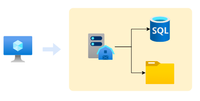
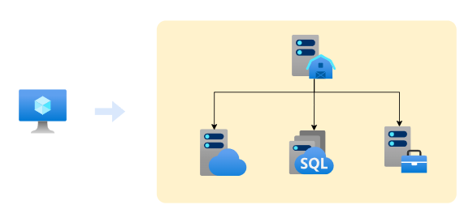
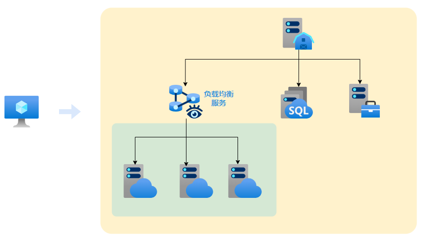
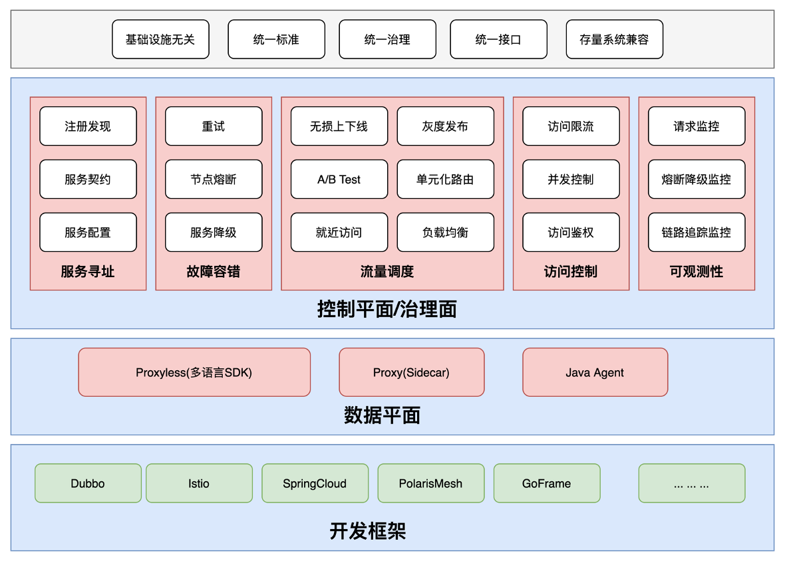

# 介绍

# 部署

> [!note]
> 定义本文能进行部署的「部署单位」都是可以独立运行的系统，例如软件、服务、镜像等

## 集中式

**集中式** ： 将构成业务系统的所有部署单位都安装到同一台机器上，例如在一台电脑上就部署好了服务程序、数据库、文件存储等。

## 分布式

**分布式** ：将业务系统功能拆分为多个可独立实现的子系统，子系统相互独立可以部署到不同的机器上，例如一台机器安装业务处理服务、一台安装云存储服务、一台安装数据库服务。

相对集中部署而言，分布式的特点有
- 对单机器性能要求下降。不用在一台机器上完成所有操作
- 子系统间解耦，系统复杂度降低
- 系统开发复杂度降低，利于组团开发。子系统交给专业的团队维护开发，不用一个团队包揽所有功能
- 子系统复用性增加。各个子系统功能独立，可以别的项目使用，例如云存储服务就负责资源存储上传与下载，只要项目需要云存储能力，就只管调用服务 API 就行。
- 系统整体复杂度升高，各个子系统主要通过网络服务通信。**因此，分布式系统只适合大型项目或者需要多机器协同运算的项目。**

## 集群

> [!note]
> 分布式部署系统有个十分致命问题：**一个子系统挂掉，整个系统将无法使用**。由于各个子系统都由不同团队开发维护，且部署在不同的机器上，会导致该问题更加容易出现。

**集群** ： 子系统使用多台机器处理「同样」的子业务。这样做不仅能提升业务处理吞吐量，还能提升子系统的稳定性。例如使用多台机器实现云存储服务，且使用「负载均衡服务」来实现云存储任务分配。

**负载均衡** ： 接受外部任务，并根据分配策略将任务分配给集群中的子系统工作服务机器。

在分布式系统可以引入集群
- 提升可用性。假设一台云存储服务宕机的概率为 `20%`，而使用由两台云存储服务构成的集群，其集群宕机的概率就变成了 `20% * 20% = 4%`
- 提升吞吐量。原来是所有任务由一台机器处理，而引入集群后则由多台机器处理，同样时间能处理更多任务。
- 提升可拓展性。将子系统重新部署到一台机器上，就能塞到集群中使用

# 设计

## SOA

**面向服务架构 SOA (Service-Oriented Architecture)** : 是一种软件架构设计模式，通过将应用程序功能分解为可重用的服务来构建系统。这些服务通过定义良好的接口和协议进行通信。

- 可重用性: 服务可以在多个应用程序中重复使用。
- 互操作性: 支持不同平台和语言的服务交互。
- 灵活性: 易于扩展和修改。
- 可组合性: 服务可以组合成更复杂的业务流程。

>[!note]
> **分布式只是 SOA 的一种实现方式，SOA 也可以只部署到一台机器上。**

## 微服务

**微服务** ： 特殊的 SOA 架构实现，强调服务的细粒度和独立性，将复杂的业务拆分成多个微小的服务，每个服务可单独运行和部署。

