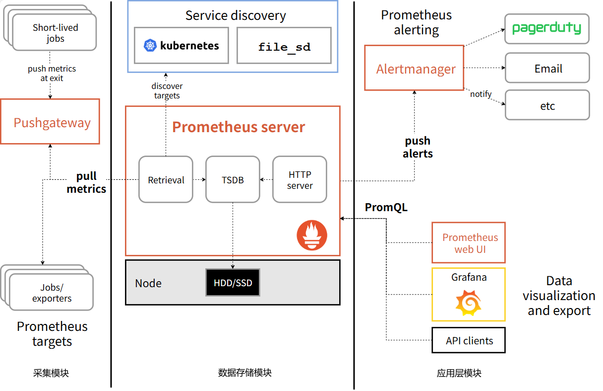
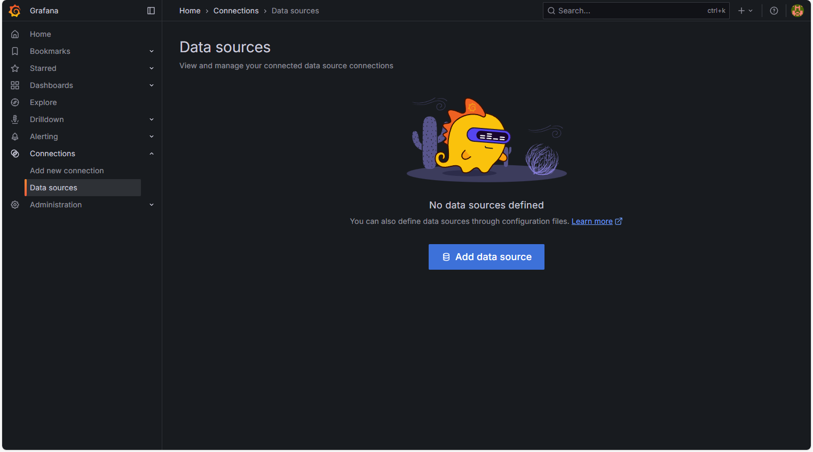
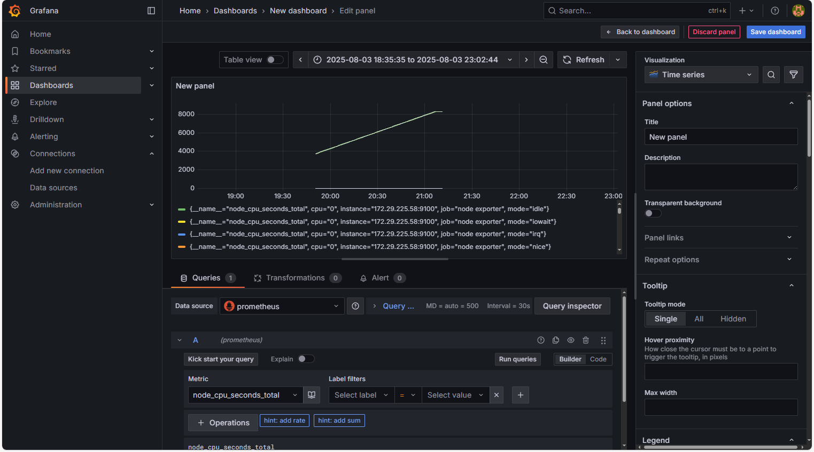
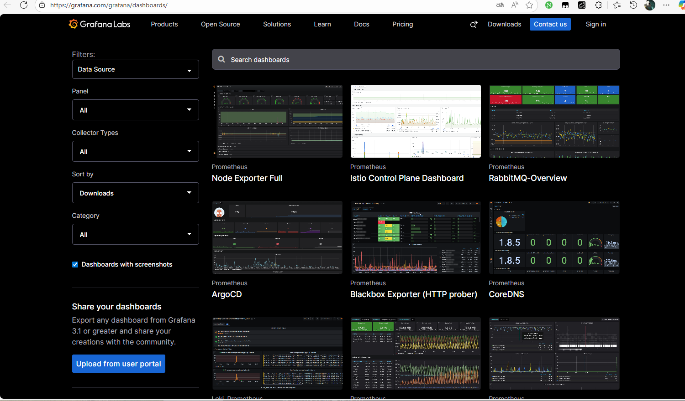
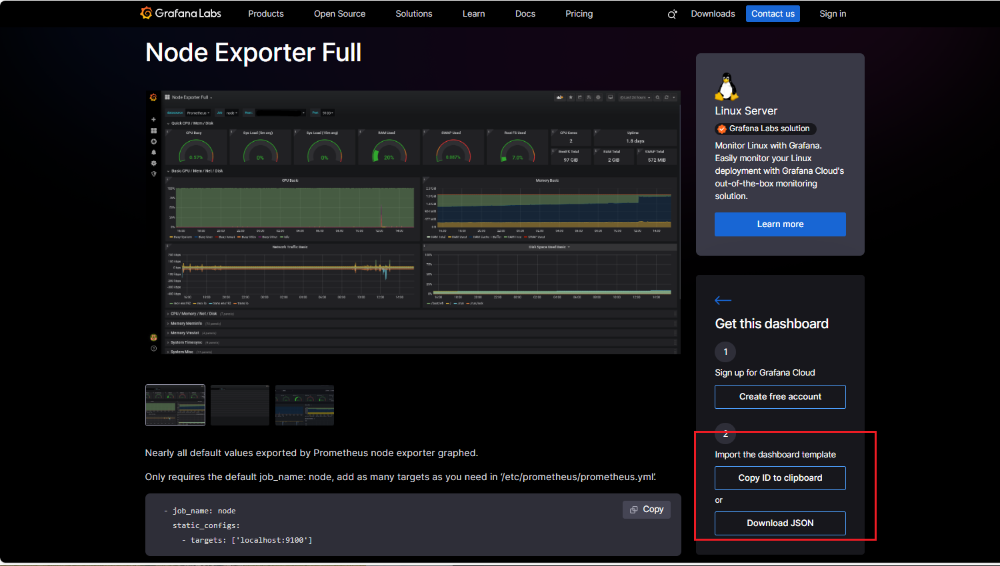
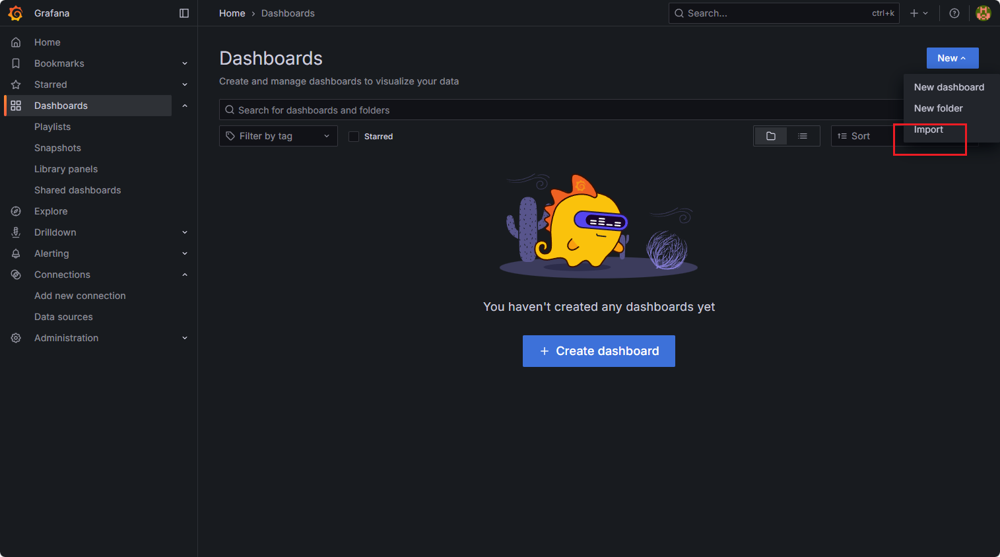
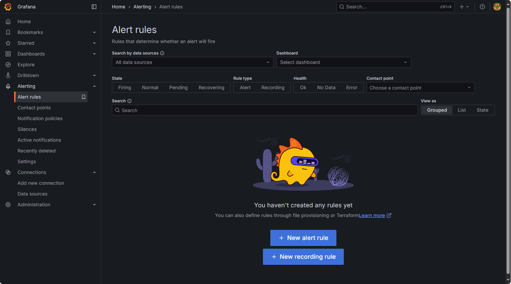

# prometheus

# 概述

## 简介

[prometheus](https://prometheus.ac.cn/docs/prometheus/latest/getting_started/): 是一款基于时序数据库的开源监控告警系统，非常适合集群的监控
- **`Grafana`**: 常用的可视化界面
- **服务发现**：被其他客户端修改后监控服务可动态增加
- **客户端库`client`**：应用程序可通过 `prometheus` 提供的 `client` 获取监控数据
- **时间序列数据库 `TSDB`** : 用于保存采集的监控数据
- **查询语言`PromQL`**: 用于从 `TSDB` 中检索数据


## 系统结构

- **采集模块**
  - `Pushgateway`: 监控指标临时存储区域，目标机器可上报指标到该中转站
  - `Exporters`：目标机器上直接实现 `HTTP` 接口，等待 `prometheus server` 拉取指标
- **数据存储模块**
  - `Retrieval`: 数据采集，从 `Pushgateway` 、 `Exporter` 中获取数据
  - `Service discovery` : 动态发现监控目标
  - `TSDB(Time Series Database)`: 时间序列数据库，存储监控指标
  - `HTTP Server`: 为告警和出图提供查询接口
- **应用层模块**
  - `Alermanager`: 告警系统
  - `Grafana`: 监控指标可视化界面



## 安装

### docker

- `prometheus`

```term
triangle@LEARN:~$ docker pull prom/prometheus // 拉取镜像
triangle@LEARN:~$ docker run -itd  -p 9090:9090 -v prometheus.yml:/etc/prometheus/prometheus.yml prom/prometheus // 启动容器
triangle@LEARN:~$ docker exec -it [container id] /bin/sh // 进入容器
triangle@LEARN:~$ cat /etc/prometheus/prometheus.yml // 配置文件
```

- `grafana`

```term
triangle@LEARN:~$ docker pull grafana/grafana // 拉取镜像
triangle@LEARN:~$ docker run -itd -p 3000:3000 grafana/grafana // 启动容器
triangle@LEARN:~$ docker exec -it [container id] /bin/bash // 进入容器
```

### 采集组件

- [download](https://prometheus.ac.cn/download/) : 下载 `exporter` 与 `pushgateway` 即可

- `node exporter`: 监控机器
  - 通过 `http://196.128.3.1:9100/metrics` 便可检查 `node exporter` 是否启动成功
  - [windows exporter](https://github.com/prometheus-community/windows_exporter)

- `pushgateway`: 监控指标临时存储区域
  - 通过 `http://196.128.3.1:9091/` 可进入 `Pushgateway` 的  `web` 界面

### 告警组件

- [download](https://prometheus.ac.cn/download/) : 下载 `altermanager` 即可


# prometheus


## 配置文件

```yml
# ======================== 全局配置 ==========================
global:
  scrape_interval: 15s #  prometheus server 获取 pull 监控指标时间间隔
  evaluation_interval: 15s # 告警时间间隔
  # scrape_timeout is set to the global default (10s).

# ============= prometheus 的 alertmanager 配置 ================
alerting:
  alertmanagers:
    - static_configs:
        - targets:
          # - alertmanager:9093

# Load rules once and periodically evaluate them according to the global 'evaluation_interval'.
rule_files:
  # - "first_rules.yml"
  # - "second_rules.yml"

# ===================== 目标机器配置方式 ============================
scrape_configs:
  # 监控 prometheus 运行情况
  - job_name: "prometheus"              # 分组名

    # metrics_path defaults to '/metrics'
    # scheme defaults to 'http'.
    static_configs:                     # 监控目标配置
      - targets: ["localhost:9090"]
       # The label name is added as a label `label_name=<label_value>` to any timeseries scraped from this config.
        labels:
          app: "prometheus"

  # 监控 exporter，需要额外安装
  - job_name: "node exporter"
    static_configs:
      - targets: ["node_ip:9100","node_ip:9100"]
  
  # 监控 pushgateway，需要额外安装
  - job_name: "pushgateway"
    static_configs:
      - targets: ["ip:9091"]
        labels:
          instance: pushgateway
```

配置文件被修改后，应用设置有两种方式
- 重启 `prometheus` 
- 热加载
  1. 启动 `prometheus` 时设置 `--web.enable-lifecycle` 选项
  2. 修改完配置文件后，发送请求 `curl --request POST http://localhost:9090/-/reload`


## 默认 UI

通过 `http://127.0.0.1:9090/` 便能进入自带 UI 界面


## 数据存储


```txt
metric{
    label=xxxx,
    label=xxxxx,
}
```

- `metric` : 指标，表示要统计的一类数据，例如 CPU 使用量、内存使用量、磁盘占用等
- `label` : 标签，指标的属性，记录了指标数据

```txt
node_cpu_seconds_total{cpu="0", instance="172.29.225.58:9100", job="node exporter", mode="idle"}
node_cpu_seconds_total{cpu="1", instance="172.29.225.58:9100", job="node exporter", mode="idle"}
```

## PromQL


- **瞬时时间表达式** : 查询当前时间点下的 `metric` 数据

```promql
metric                      # 查询当前时间的指标数据
metric{label = xxx}         # 根据 label 精确查找 metric
metric{label =~ 'regex'}    # 正则表达式
```

- **区间时间表达式** : 查询一定时间范围内的 `metric` 数据

```promql
metric{label = xxx}[5s]     # 查询最近 5s 内数据
```

- **时间位移查询**

```promql
metric{label = xxx}[5s] offset 5m    # 查询 5 分钟前 5s 内数据
```

- **数据统计函数**

```promql
# 求和
sum(metric{label = xxx}[5s])

# 均值
avg(metric{label = xxx}[5s]) by (mode) 
```

- [运算符号](https://prometheus.ac.cn/docs/prometheus/latest/querying/operators/) : 支持 `+,-,*,/` 四则运算符号，也支持 `and,or` 布尔运算


## python

### pushgateway

```term
triangle@LEARN:~$ pip install prometheus-client
```


```python
from prometheus_client import CollectorRegistry, Gauge,Counter, push_to_gateway

# 1. 创建指标注册表
registry = CollectorRegistry()

# 2. 定义指标（示例：CPU 温度）

g = Gauge(
    'cpu_temperature_celsius',  # 指标名称
    '当前CPU温度',               # 指标说明
    ['machine', 'core'],         # 标签（可选）
    registry=registry            # 绑定注册表
)

# 计数器（只增不减）
c = Counter('http_requests_total', 'HTTP请求总数', labelnames=["api","method"],registry=registry)

# 3. 设置指标值（带标签）
g.labels(machine='host1', core='0').set(65.3)  # 设置主机 host1 的 0 号核心温度
g.labels(machine='host2', core='0').set(68.1)  # 设置主机 host2 的 0 号核心温度

c.labels("/demo","get").inc()  # 增加1
c.labels("/test","post").inc()  # 增加1


# 4. 推送到 Pushgateway
pushgateway_address = 'http://172.29.225.58:9091'   # Pushgateway 地址
job_name = 'cpu_monitor'                            # 任务名称
push_to_gateway(
    pushgateway_address,
    job=job_name,
    registry=registry,
    grouping_key={'instance': 'pushgateway'}        # 分组键（可选）
)
```


### 查询指标

> [!note]
> 直接使用 `prometheus` 提供的 `/api/v1/query` 接口查询


```python
import requests
import json
from datetime import datetime, timedelta

# Prometheus 服务器地址（默认端口 9090）
PROMETHEUS_URL = "http://localhost:9090"

def query_prometheus(query, time=None):
    """
    执行 PromQL 查询
    :param query: PromQL 查询语句
    :param time: 查询时间点（datetime 对象），默认当前时间
    :return: 查询结果
    """
    # 构建请求参数
    params = {'query': query}
    if time:
        params['time'] = time.timestamp()  # 转换为 Unix 时间戳
    
    # 发送 GET 请求
    response = requests.get(
        f"{PROMETHEUS_URL}/api/v1/query",
        params=params
    )
    response.raise_for_status()  # 检查 HTTP 错误
    
    # 解析 JSON 响应
    data = response.json()
    
    # 检查 API 错误
    if data['status'] != 'success':
        raise Exception(f"Query failed: {data.get('error', 'Unknown error')}")
    
    return data['data']['result']

# 示例 1：查询当前 CPU 使用率
def get_cpu_usage():
    """获取所有实例的当前 CPU 使用率"""
    results = query_prometheus('100 - (avg by (instance) (irate(node_cpu_seconds_total{mode="idle"}[5m])) * 100')
    
    print("当前 CPU 使用率:")
    for result in results:
        instance = result['metric'].get('instance', 'N/A')
        value = float(result['value'][1])  # 值在数组的第二个位置
        print(f"- {instance}: {value:.2f}%")
```

# Grafana

## 界面

通过 `http://127.0.0.1:3000/` 便能进入 `Grafana`

- **登录界面**：默认账号密码为 `admin admin`


- **数据源** : 设置 `prometheus` 服务作为数据源




- **仪表盘**




## 仪表盘

[Grafana Dashboard](https://grafana.com/grafana/dashboards/) : 可以从官网下载预设好的仪表盘直接使用

1. 搜索仪表盘



2. 下载配置



3. 导入配置




## 告警



