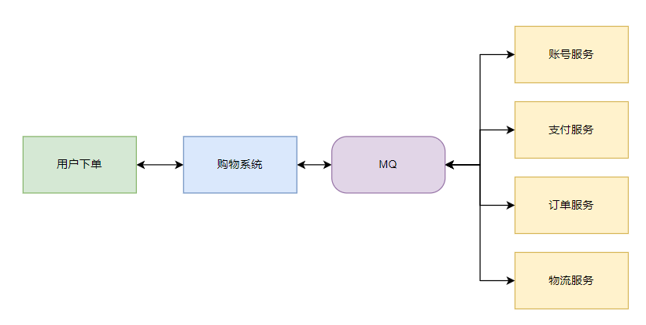
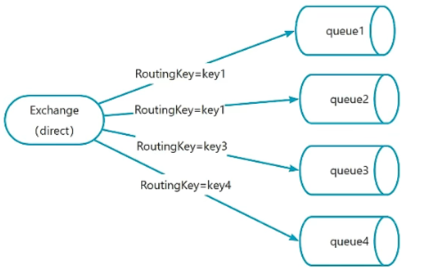

# RabbitMQ

# 简介

[RabbitMQ](https://www.rabbitmq.com/)： 是实现了高级消息队列协议（AMQP）的开源消息代理软件（亦称面向消息的中间件）。RabbitMQ 服务器是用 `Erlang` 语言编写的，所有主要的编程语言均有与代理接口通讯的客户端库。

现有的 `MQ` 产品
- `Kafka` : 吞吐量大、性能好、但功能单一
- `RabbitMQ` : 消息可靠性高，功能全面，但吞吐量小，性能弱
- `RocketMQ` : 高吞吐，高性能，功能全，但通用性没这么广


# 工具

## 安装

在安装前，查询[版本支持表](https://www.rabbitmq.com/docs/which-erlang) ，**因为 `RabbitMQ` 版本与 `Erlang` 版本强相关，且 `Erlang` 与操作系统版本强相关**。

- 方案一：直接使用 `docker` 安装，简单方便


```term
triangle@LEARN:~$ docker pull rabbitmq:4.0.7-management // 下载镜像
```


- 方案二：根据[安装指南](https://www.rabbitmq.com/docs/download)本地安装

## docker

```term
triangle@LEARN:~$ docker image ls
REPOSITORY   TAG                IMAGE ID       CREATED        SIZE
rabbitmq     4.0.7-management   87d72938da08   5 months ago   274MB
triangle@LEARN:~$ docker run -id --name=rabbitmq -p 5671:5671 -p 5672:5672 -p 4369:4369 -p 15671:15671 -p 15672:15672 -p 25672:25672 -e RABBITMQ_DEFAULT_USER=admin -e RABBITMQ_DEFAULT_PASS=admin 87d72938da08
RABBITMQ_DEFAULT_USER # 默认账号名
ABBITMQ_DEFAULT_PASS # 默认密码
triangle@LEARN:~$ docker ps -a // 查看运行的 rabbitmq 容器
docker ps -a
CONTAINER ID   IMAGE          COMMAND                  CREATED          STATUS          PORTS
                    NAMES
916fa3408d42   87d72938da08   "docker-entrypoint.s…"   28 minutes ago   Up 28 minutes   ...   jovial_brown
triangle@LEARN:~$ docker exec -it 916fa3408d42 /bin/bash // 进入容器
```

## 服务管理

> [!tip]
> 安装的 `docker` 版本不需要进行设置，直接能用

```term
triangle@LEARN:~$ service rabbitmq-server status // 查看服务状态
triangle@LEARN:~$ service rabbitmq-server start // 启动服务
triangle@LEARN:~$ service rabbitmq-server stop // 暂停服务
```

## rabbitmqctl

- **工具管理**

```term
triangle@LEARN:~$ rabbitmqctl start_app // 启动 rabbitmq 程序，docker 版不需要
triangle@LEARN:~$ rabbitmqctl status // 查看运行信息
Status of node rabbit@49170c30f8c7 ...
[]
Runtime

OS PID: 274
OS: Linux
Uptime (seconds): 50
Is under maintenance?: false
RabbitMQ version: 4.0.7
    ...
```

- **账号管理**

```term
triangle@LEARN:~$ rabbitmqctl add_user admin // 创建用户
triangle@LEARN:~$ rabbitmqctl set_permissions -p / admin "." "." ".*" // 设置权限
triangle@LEARN:~$ rabbitmqctl set_user_tags admin administrator // 设置管理员
```

## rabbitmq-plugins

```term
triangle@LEARN:~$ rabbitmq-plugins list // 查看插件启用状况
Listing plugins with pattern ".*" ...
 Configured: E = explicitly enabled; e = implicitly enabled
 | Status: * = running on rabbit@49170c30f8c7
 |/
[  ] rabbitmq_amqp1_0                  4.0.7
[  ] rabbitmq_auth_backend_cache       4.0.7
    ...
[E*] rabbitmq_management               4.0.7        # 后台管理 web 可视化插件
[e*] rabbitmq_management_agent         4.0.7
[  ] rabbitmq_mqtt                     4.0.7
[  ] rabbitmq_peer_discovery_aws       4.0.7
    ...
triangle@LEARN:~$ rabbitmq-plugins enable rabbitmq_management // 启动插件
```


# 概念

## 消息队列

**消息队列 (Message Queue)** : 操作系统中的一种进程间通信方式，以队列 `Queue` 的形式存储消息 `Message`，拥有权限的进程可以向消息队列中写入或读取消息。**而 `RabbitMQ` 则是借鉴该了该设计思路，实现服务间的通信** 

**同步模型** ： 在同步模型中，购物系统接在收到用户下单请求后会依次调用所有处理服务，然后才返回通知用户处理成功。该模型存在的问题有
  1. 扩展性差。若购物系统中想要增加会员积分服务，则需要修改购物系统组织处理流程的代码
  2. 容错性差。若在物流服务发生异常，则会依次回退订单服务、支付服务的数据库状态，并返回用户下单失败
  3. 响应速度慢。购物系统要跑完所有服务流程后，才会返回用户下单结果

    

**异步模型** ： 购物系统中引入「消息队列」机制，便能很好的解决同步模型中的问题
  1. 扩展性。子服务与购物系统无关，增加的子服务只要接收 `MQ` 发送出来的任务消息，进行业务处理即可
  2. 容错性。当物流服务挂掉了，`MQ` 中会暂存储任务消息，可等服务修好后再继续下发，不用返回下单失败
  3. 响应速度快。只要验证用户支付成功，即可返回用户下单成功，用户不用等订单服务与物流服务的处理结果
  4. 服务解耦。各个服务可以做到只与 `MQ` 交互通信下发任务，彼此之间无关联
  5. 提升服务稳定性。对于请求量剧增的秒杀活动，购物系统接收到用户订单后可以直接返回用户信息，让大量的用户订单在 `MQ` 中排队等待处理，这就能保证后续业务处理服务免受过载请求冲击。

    

## RabbitMQ 框架


`RabbitMQ` 框架核心是基于 **AMQP (Advanced Message Queuing Protocol)** 协议实现，该定义了一组规则和标准，以确保消息可以在不同的应用程序和平台之间传递和解释，其构成为
- 生产者：消息的提交者
- 消费者：消息的接收者
- 交换机 : 控制路消息能发送到哪些队列中
- 队列 : 定义了消息的获取与存储
- 绑定 : 建立起交换机与队列直接的连接


`RabbitMQ` 工作机制为

- `Producer` : 生产者
- `Consumer` : 消费者
- `Connection` : 生产者/消费者与 RabbitMQ 服务之间连接起来的 `TCP` 链接
  - `Channel` : 发送消息的管道。由于建立 `TCP` 链接开销较大，RabbitMQ 则在 TCP 链接上又建立了更轻量的 `Channel` 消息传输管道 （类似在进程中创建线程处理业务）。由于 channel 相互隔离，可以仅建立一个 Connection，然后各个线程使用自己的 channel 与服务间进行消息传输。
- `Broker` : 真正的 RabbitMQ 服务
  - `Virtual host` : 虚拟主机，为交换机与队列提供运行环境。一个 Broker 存在多个虚拟主机，且同一个虚拟主机内的交换机与队列不能重名
  - `Exchange` : 交换机
  - `Queue` : 队列
  - `Binding` : 关联 Exchange 与 Queue 


在 `RabbitMQ` 服务后台 UI 界面上可以对各个模块进行管理


# 基本流程

- [教程](https://www.rabbitmq.com/tutorials)


## 生产者

```python
import pika
import pika.exchange_type

# MQ 账号
credentials = pika.PlainCredentials('admin', 'admin')  

# 创建链接
parameter = pika.ConnectionParameters(
        host = '172.29.225.58',
        port = 5672,
        virtual_host = '/',
        credentials = credentials)
connection = pika.BlockingConnection(parameter)

# 获取通道
channel = connection.channel()

# 声明交换机
exchangeId = 'demo_exchage'
channel.exchange_declare(
    exchange = exchangeId, # 交换机不存在则创建
    durable = True,  # 持久化，服务重启交换机依然存在
    exchange_type = pika.exchange_type.ExchangeType.direct,
    auto_delete = False, # 没有队列绑定时，自动删除
    )

# 声明消息队列
queueId = 'demo_queue'
channel.queue_declare(
    queue = queueId, # 队列名如不存在，则创建
    durable=True,   # 持久化，服务重启后队列依然存在
    exclusive=False, # 私有化，只有创建这个队列的程序才能访问
    auto_delete=False,
    )

# 绑定
routingKey = 'demo_rout'   # 路由 key
channel.queue_bind(
    queue=queueId,
    exchange=exchangeId,
    routing_key=routingKey
    )


# 发送消息
channel.basic_publish(
    exchange=exchangeId,
    routing_key=routingKey,
    body="hello world")

# 释放资源
channel.close()
connection.close()
```

发送消息成功后，可以在 `Queues and Streams` 界面查看到队列中的消息


## 消费者

### 基本流程

```python
import pika

# 消息回调函数
def callback(ch, method, properties, body):
    print(f" [x] Received {body}")

# MQ 账号
credentials = pika.PlainCredentials('admin', 'admin')  

# 创建链接
parameter = pika.ConnectionParameters(
        host = '172.29.225.58',
        port = 5672,
        virtual_host = '/',
        credentials = credentials)
connection = pika.BlockingConnection(parameter)

# 获取通道
channel = connection.channel()

# prefetch_size:  限定一次只接收一个消息，接收成功后，服务才推送下一个消息
channel.basic_qos(prefetch_size = 1)

# 消费
queueId = 'demo_queue'
channel.basic_consume(
    queue=queueId,
    auto_ack=True, # 消费消息后是否自动应当。只要服务接收到确认，就表示当前消息接受，服务端删除消息
    on_message_callback=callback
)

# 阻塞开始消费
channel.start_consuming()

# 释放资源
channel.close()
connection.close()
```

### 消息确认

当消费者确认消息接收后会告知服务，服务则会认为消息被消费掉，并删除该消息。

- **自动确认**

```python
channel.basic_consume(
    queue=queueId,
    auto_ack=True,  # 自动确认
    on_message_callback=callback)
```

- **手动确认**

```python
def callback(
    ch: pika.adapters.blocking_connection.BlockingChannel, 
    method : pika.spec.Basic.Deliver, 
    properties, 
    body):
    # 确认接收消息
    ch.basic_ack( 
        delivery_tag = method.delivery_tag,  # 请求编号，递增值
        multiple = True # 在服务上，和当前一样的消息全部确认
        )

    # 拒绝消息
    ch.basic_nack( 
        delivery_tag = method.delivery_tag, 
        multiple = True,
        requeue=True # 拒绝后的消息还放回队列继续处理
        )

# 关闭自动确认
channel.basic_consume(
    queue=queueId,
    auto_ack=False, 
    on_message_callback=callback
)
```


> [!tip]
> **中毒消息 `poision message`** : 由于消费者代码错误，会导致消息处理结果永远返回 `ch.basic_nack()` ，那么服务就会将消息重新入队，然后又继续发送消息，形成服务与消费者之间的死循环。

### 接收模式

- **`Push` 模式** : 消费者会启动一个线程阻塞等待服务消息，服务有消息就调用 `callback` 进行接收

```python
# 消息回调函数
def callback(ch, method, properties, body):
    print(f" [x] Received {body}")


# 消费
queueId = 'demo_queue'
channel.basic_consume(
    queue=queueId,
    auto_ack=False,  # 消费消息后是否自动应当
    on_message_callback=callback
)

```

- **`Pull` 模式** : 消费者主动从服务获取消息

```python
# - 一次只能获取一条消息
# - 无消息时，（method,properties,body) 均为 None
method,properties,body = channel.basic_get(queueId, auto_ack=False)

```

## 监听

```python

# 监听注册接口
connection.add_xxx()
channel.add_xxx()

# 消费者队列被删除了
channel.add_on_cancel_callback()

# 发送的消息被拒绝
channel.add_on_return_callback()
```

## 多通道

```python
# 获取通道
# 指定唯一 channel 编号，便于生产者与 Rabbit 服务建立多个 channel 通信
channel1 = connection.channel(channel_number=1)
channel2 = connection.channel(channel_number=2)

# NOTE - 一个应用程序中 `channel_number` 不允许重复指定
channel3 = connection.channel(channel_number=2)
```

## 界面控制

所有的对象都可以在后台界面上进行快速创建

- 交换机

    

- 通道

    

- 用户

    

- 虚拟主机

    

- 消息与绑定

    

- 策略

    

# 交换机

## direct

**`direct` 类型** : 只有消息的 `routing_key` 和绑定交换机与队列设置的 `routing_key` 完全一致时，消息才会被交换机放入绑定队列中，且同一 `routing_key` 可以进行次绑定。




```python

# 声明交换机，指定 ExchangeType.direct 类型
exchangeId = 'demo_exchage_direct'
channel.exchange_declare(
    exchange = exchangeId, # 交换机不存在则创建
    exchange_type = pika.exchange_type.ExchangeType.direct,
    auto_delete = False, # 没有队列绑定时，自动删除
    )

# 绑定，设置交换机与队列的的 routin_gkey
routingKey = 'demo_direct' 
channel.queue_bind(
    queue=queueId,
    exchange=exchangeId,
    routin_gkey=routingKey
    )

# 消息推送，指定消息的 routing_key
channel.basic_publish(
    exchange=exchangeId,
    routing_key=routingKey,
    body="hello world")
```


> [!tip]
> `ExchangeType.direct` 为默认绑定方式，且队列名为默认 `routing_key`

## fanout

**`direct` 类型** : 所有与交换机绑定的的队列都能接收到消息

```python
# 声明交换机
exchangeId = 'demo_exchage_fanout'
channel.exchange_declare(
    exchange = exchangeId, 
    exchange_type = pika.exchange_type.ExchangeType.fanout,
    auto_delete = False)

# 声明消息队列
queueId1 = 'demo_queue_1'
queueId2 = 'demo_queue_2'
queueId3 = 'demo_queue_3'

channel.queue_declare(queue = queueId1, durable=False,  exclusive=False, auto_delete=False)
channel.queue_declare(queue = queueId2, durable=False,  exclusive=False, auto_delete=False)
channel.queue_declare(queue = queueId3, durable=False,  exclusive=False, auto_delete=False)

# 绑定，不需要指定 routing_key
channel.queue_bind(queue=queueId1,exchange=exchangeId)
channel.queue_bind(queue=queueId2,exchange=exchangeId)
channel.queue_bind(queue=queueId3,exchange=exchangeId)

# 发送消息，routing_key 设置为空字符串
channel.basic_publish(exchange=exchangeId,routing_key="",body="hello world")
```

只发送了一次消息，但是所有的队列都收到了该消息


## topic

**`topic` 类型** : 与 `direct` 类型相似，但只需要  `routing_key` 模糊匹配即可。
- routing_key 通过 `.` 可以被分割为多个「部分」
- `*` 表示任一一个「部分」
- `#` 表示零个或多个「部分」


例如，当 `routing_key = 'key1.key2.test.key4'` 时，交换机会往 `queue2` 与 `queue3` 放入消息

```python
# 声明交换机
exchangeId = 'demo_exchage_topic'
channel.exchange_declare(
    exchange = exchangeId, # 交换机不存在则创建
    exchange_type = pika.exchange_type.ExchangeType.topic,
    auto_delete = False, # 没有队列绑定时，自动删除
    )

# 声明消息队列
queueId1 = 'demo_queue_1'
queueId2 = 'demo_queue_2'
queueId3 = 'demo_queue_3'

channel.queue_declare(queue = queueId1, durable=False,  exclusive=False, auto_delete=False)
channel.queue_declare(queue = queueId2, durable=False,  exclusive=False, auto_delete=False)
channel.queue_declare(queue = queueId3, durable=False,  exclusive=False, auto_delete=False)

# 绑定
routingKey = ""
channel.queue_bind(queue=queueId1,exchange=exchangeId,routing_key="key1.key2.key3.*")
channel.queue_bind(queue=queueId2,exchange=exchangeId,routing_key="key1.#")
channel.queue_bind(queue=queueId3,exchange=exchangeId,routing_key="*.key2.*.key4")

# 发送消息
channel.basic_publish(exchange=exchangeId,routing_key="key1.key2.test.key4",body="hello world")
```

## headers

**`header` 类型** :  交换机不再通过 `routing_key` 进行队列匹配，而是通过 AMQP 协议规定的消息 `header` 进行匹配，且值要完全一致才会匹配上，**但该方式性能差，几乎没用** 。在消息 `header` 中可以通过 `x-match` 指定匹配方式
- `'x-match': 'all'` : 表示 headers 信息要完全匹配
- `'x-match': 'any'` : 表示 headers 信息只要部分匹配即可


例如，上图中发送的消息只有队列 `queue2` 才能接收到


```python
# 声明交换机
exchangeId = 'demo_exchage_headers'
channel.exchange_declare(
    exchange = exchangeId, # 交换机不存在则创建
    exchange_type = pika.exchange_type.ExchangeType.headers,
    auto_delete = False, # 没有队列绑定时，自动删除
    )

# 声明消息队列
queueId1 = 'demo_queue_1'
queueId2 = 'demo_queue_2'
channel.queue_declare(queue = queueId1, durable=False,  exclusive=False, auto_delete=False)
channel.queue_declare(queue = queueId2, durable=False,  exclusive=False, auto_delete=False)


# 绑定
headers1 = {
    'x-match' : 'all',
    "name" : 'zhang',
    'age' : 10
}
channel.queue_bind(queue=queueId1,exchange=exchangeId,arguments=headers1)

headers2 = {
    'x-match' : 'any',
    "name" : 'zhang',
    'age' : 10
}
channel.queue_bind(queue=queueId2,exchange=exchangeId,arguments=headers2)


# 发送消息，在 properties 中设定消息头
properties = pika.BasicProperties()
properties.headers = {
    "name" : 'zhang',
    'age' : 11
}
channel.basic_publish(exchange=exchangeId,routing_key="", properties=properties,body="hello world")
```

# 队列

## classic


**经典队列 `classic`** : 是 RabbitMQ 提供的原始队列类型。 它是非复制 `FIFO` 队列的实现，是一种适用于许多用例的通用队列类型。其中数据安全不是重中之重，因为数据存储在不会复制经典队列。如果数据安全很重要，建议使用仲裁队列和流队列。
- 消息严格遵守「先进先出」
- 队列中存储太多消息会产生性能问题，在 `RabbitMQ 3.12` 之前，会将队列完全加载内存中
- **适用于数据量不会太大，且生产者与消费者处理速度稳定的场景**

## Quorum


**仲裁队列 `Quorum`** :  基于 `Raft`共识算法的分布式`FIFO`队列。仲裁队列和流队列计划取代经典队列，且经典队列在未来计划删除。**用于 RabbitMQ 集群部署，一个消息入队时，需要一定数量的 RabbitMQ 结点的仲裁队列都存储上消息后，才认为这个消息被 RabbitMQ 集群接收成功，并同步所有 RabbitMQ 结点（类似举手表决的机制，少数服从多数）。可处理「中毒消息」，在头部信息中记录消息的投递次数。**
- 队列不会自动同步到新增集群结点上，官方文档有具体处理方案
- 延迟性高
- 消息量也不能长期积压

```python
# 代码声明为 Quorum 队列
arguments = {"x-queue-type" : "quorum"}
channel.queue_declare(queue = queueId, arguments = arguments)
```

## stream


**流队列 `stream`** : 该队列类型消息会被持久化到磁盘并具备分布式备份，适合消费者多场景。**核心实现思路为用 `append-only` 的方式将消息写入日志文件中，然后调整消费者的消费进度`offset` 实现消息的多次分发。**
- 信息本质上不会被删除
- 队列不会自动同步到新增集群结点上


```python
# 代码声明为 Quorum 队列
arguments = {"x-queue-type" : "stream"}
channel.queue_declare(queue = queueId, arguments = arguments)
```

## 死信队列

**死信队列** ： 类似回收站，用来暂存被删除的消息，可对未能正常消费的信息进行补救。只有 `classic`、`Quorum` 可以使用。
- 消费者 `reject` 或 `nack`，且拒绝重排队
- 消息生命周期过期
- 超出队列长度限制而被丢弃的消息

```python
arguments = {
    "x-dead-letter-exchange" : "exchange name", # 死信队列的交换机
    "x-dead-letter-routing-key" : "routing key", # 死信队列的 routing key
    "x-message-ttl" : 2000, # 消息存放多久
}

# 当前队列中的消息死掉之后，就会下发给 `x-dead-letter-exchange` 交换机处理
channel.queue_declare(queue = queueId, arguments = arguments, durable = True)
```

# 集群

- [集群部署](https://www.bilibili.com/video/BV1Am4y1z7Tu?p=13&vd_source=d53f882c21c3348e4c1b1cd1b04ecf98)

待续。。。

