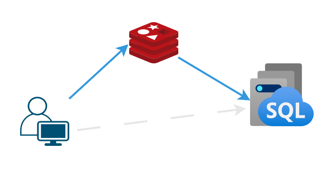
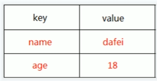
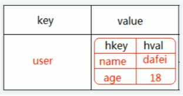
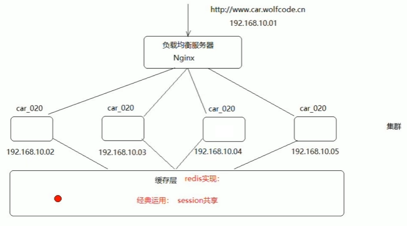
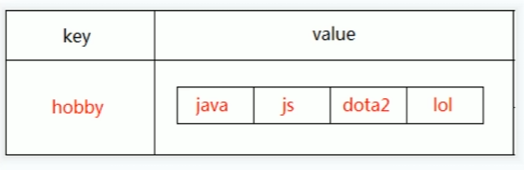
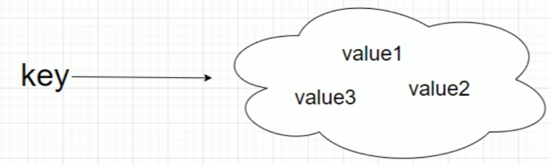
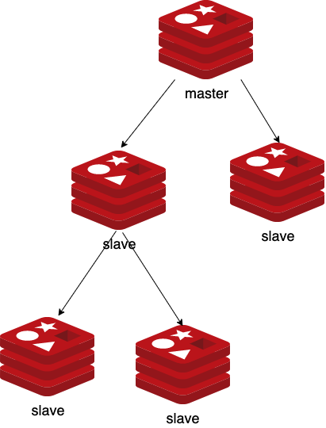

# Redis

# 介绍

## NoSQL

数据库分类主要为
- 关系型：`MySQL`、`PostgreSQL`
- 非关系型： `Redis`、`MongoDB`

关系型与非关系型数据库的主要区别为 `NOSQL (Not Only SQL)`。非关系型数据基于 `NOSQL` 这项概念实现，性能更优，吞吐量更大。


| 分类   | 功能           | 代表产品 |
| ------ | -------------- | -------- |
| 键值对 | 缓存           | Redis    |
| 列存储 | 分布式文件系统 | HBase    |
| 文档型 | web 应用       | MongoDb  |
| 图     | 社交网络       | Neo4J    |

## Redis

[Redis (Remote Dictionary Server)](https://redis.io/) : 是一个开源的、基于内存的键值存储数据库。它不仅支持简单的键值对，还支持丰富的数据结构，如字符串、哈希、列表、集合、位图、HyperLogLogs等。同时，Redis 也支持持久化，能够将内存中的数据异步保存到磁盘上，是内存数据库中最具代表性的产品之一。
- **速度极快，数据存储在内存中，而不是硬盘**
- 数据高并发读写
- 操作都是原子

数据库的性能已经满足不了互联网时代需求，因此，在应用与数据库间使用 Redis 充当缓存，减轻数据库压力。




# 安装

- [Linux](https://redis.io/downloads/) : 官方只有 Linux 版
- [Windows](https://github.com/tporadowski/redis/releases) : windows 版为民间移植
- [docker](https://hub.docker.com/_/redis)

```term
triangle@LEARN:~$ docker pull redis
triangle@LEARN:~$ docker run -it -p 6379:6379 --name redis <image id> /bin/bash
triangle@LEARN:redis$ redis-
redis-benchmark
redis-check-aof
redis-check-rdb
redis-sentinel
redis-cli           # 客户端
redis-server        # 服务端
triangle@LEARN:redis$ redis-server  # 直接启动服务，客户端就能连接
```

# 数据类型

## String

### 概念

在 Redis 中，`String ` 是基本的数据存储单元，**可存储字符串、整数或者浮点数** 。



```term
triangle@LEARN:~$ redis-cli // 进入客户端
127.0.0.1:6379> set key value           // 添加/修改键值对
127.0.0.1:6379> get key                   // 查看值
127.0.0.1:6379> del key                   // 删除
127.0.0.1:6379> incr key                  // 数值加 1
127.0.0.1:6379> decr key                  // 数值减 1
127.0.0.1:6379> setex key <n> value     // 添加一个键值对，并且 n 秒之后自动删除
127.0.0.1:6379> ttl key                   // 查看键值对在几秒后删除
-1  # 永久
-2  # 已经被删除
127.0.0.1:6379> setnx key value         // key 不存在则添加；key存在则忽略
```

### 应用

**计数器**: 使用 Redis 键值对来实现对播放量进行计数，等达到一定数量才一次性序列化到数据库


## Hash

### 概念

在 Redis 中的 `Hash` 数据类型就是对一堆 `String` 类型的数据进行分组管理




```term
triangle@LEARN:~$ hset key field value // 将 field-value 添加到 key 组下
triangle@LEARN:~$ hset key field  // 获取 key.field 的值
triangle@LEARN:~$ hexists key field  // 检查 key.field  存在性
triangle@LEARN:~$ hdel key field  // 删除 key.field 
triangle@LEARN:~$ hincrby key field <n>  //  key.field 的值增加 n
triangle@LEARN:~$ hlen key   // 查看 key 下有多少个 field 
triangle@LEARN:~$ hkeys key   // 查看 key 下所有的 field 
triangle@LEARN:~$ hvals key   // 查看 key 下所有的 value 
triangle@LEARN:~$ hgall key   // 查看 key 下所有的 field-value 
```


### 应用


利用 Redis 作为集群服务结点的共享内存，来存储用户登陆 session ，从而用户请求不管被分配到哪个集群服务结点上，都能识别出用户的登陆状态。



```cpp
struct SESSION_S{
    std::strng name;
    int age;
};
```

在 Redis 中有两种实现方案

- 字符串存储 
  - key : 会话的唯一 token 标识符
  - value : 将 `SESSION_S` 序列化为 json 文本
- Hash 存储
  - key : 会话的唯一 token 标识符
  - value : 将 `SESSION_S` 数据变成 fiedl-value 进行存储


## List

### 概念

Redis 中 `List` 是一个双端链表结构，可实现队列、栈等结构。




```term
triangle@LEARN:~$ rpush key values // 在 list 左边添加数据
triangle@LEARN:~$ lpush key values // 在 list 右边添加数据
triangle@LEARN:~$ lrange key i j // 查看 list 中 [i,j] 范围内的数据
- '-1' 表示逆向
- 索引从 0 开始
triangle@LEARN:~$ lpop key // 删除左边第一个
triangle@LEARN:~$ rpop key // 删除右边第一个
triangle@LEARN:~$ llen key // list 长度
triangle@LEARN:~$ linsert key before i value // 在 i 对应元素之前插入 value
triangle@LEARN:~$ lset key i value // 更改 i 对应元素的值
triangle@LEARN:~$ lindex key i // 查看 i 对应元素的值
```

### 应用

可作为分布式异步处理框架的消息中间件，充当任务队列，例如 `Celery`


## Set

### 概念

`Set` 是 `String` 类型的合集，可进行**交、并、差运算**。
- `value` 乱序
- `value` 不允许重复




```term
triangle@LEARN:~$ sadd key members // 插入值
triangle@LEARN:~$ smembers key  // 展示所有值
triangle@LEARN:~$ srem key members // 删除
triangle@LEARN:~$ spop key n // 从集合随机挑出 n 个元素
triangle@LEARN:~$ sdiff key1 key2 // 差集 
triangle@LEARN:~$ sinter key1 key2 // 交集
triangle@LEARN:~$ sunion key1 key2 // 并集
triangle@LEARN:~$ s___store dest key1 key2 // 运算结构存储到 dest 中
triangle@LEARN:~$ sismember key member // 查看 member 是否在集合 key 中
```

### 应用

1. 去重
2. 抽奖


## Zset

### 概念

`Zset` 与 `Set` 的唯一区别：Zset 会对元素进行排序。Zset 通过为每一个元素绑定一个 `double` 类型的分数进行排序。 

```term
triangle@LEARN:~$ zadd key score member // 添加 member 元素，其分数为 score
triangle@LEARN:~$ zrange key i j // 按照分数升序排序后，展示 [i,j] 索引的元素
triangle@LEARN:~$ zrevrange key i j // 按照分数降序排序后，展示 [i,j] 索引的元素
triangle@LEARN:~$ zrange key i j withscores // 展示分数值
triangle@LEARN:~$ zrank key member // 查看 member 排序后的索引
triangle@LEARN:~$ zrevrank key member // 查看 member 排序后的索引
triangle@LEARN:~$ zincrby key n member // 给 member 元素的分数加 n
triangle@LEARN:~$ zcard key // 查看集合个数
triangle@LEARN:~$ zrangebyscore key min max // 查询 [min,max] 分数范围的元素，且排序
```


### 应用

实时排行榜，例如热搜榜。

## 键值

在 Redis 中，键类型基本均是 `String` 类型
- 必须唯一
- 命名方式
  - 普通单值，例如`token:xxxxxx`
  - 关系数据库，例如 `表明:主键名:主键值:字段名`
  - 通用命名，例如 `模块:业务:xxxx:value类型`
  - 变量命名，例如 `变量1:xxxxxx:变量2:yyyyyyyyy`

# 全局命令

全局命令主要用于 Redis 的整体运维、管理

```term
triangle@LEARN:~$ keys pattern // 根据 pattern 查询 key
    *   模糊匹配，不要随便乱用，会卡住 Redis
triangle@LEARN:~$ exists key // 判断 key 是否存在
triangle@LEARN:~$ expire key n // 给存在的 key 设置 n 秒过期
triangle@LEARN:~$ persist key // 取消 key 的过期时间
triangle@LEARN:~$ select n  // 切换 Redis 到第 n 个数据库， 取值范围 [0,15] 
triangle@LEARN:~$ move key n // 将 key 移动到 n 数据库
triangle@LEARN:~$ randomkey // 随机生成 key
triangle@LEARN:~$ dbsize // 查看数据库中有多少 key
triangle@LEARN:~$ echo message // 打印信息
triangle@LEARN:~$ info // 查看信息
triangle@LEARN:~$ config get * // 查看配置信息
triangle@LEARN:~$ flushdb // 删除当前数据库
triangle@LEARN:~$ flushall // 删除所有数据库
``` 

# 事务

## multi

单个 Redis 命令的执行是原子性的，但 Redis 没有在事务上增加任何维持原子性的机制，所以  **Redis 事务的执行并不是原子性的**。事务可以理解为一个打包的批量执行脚本，但批量指令并非原子化的操作，中间某条指令的失败不会导致前面已做指令的回滚，也不会造成后续的指令不做。

```term
triangle@LEARN:~$ multi // 开启事务
triangle@LEARN:~$ ...  // 添加命令到待执行队列
triangle@LEARN:~$ exec // 执行队列中的所有命令
```

## 乐观锁

```term
triangle@LEARN:~$ watch key // 对 key 启用乐观锁监听
triangle@LEARN:~$ multi
triangle@LEARN:~$ ...
triangle@LEARN:~$ set key value // 修改值
triangle@LEARN:~$ ...
triangle@LEARN:~$ exec // 执行事务
```

若监视的 `watch key` **在执行 `exec` 前** 被其他客户端修改后，事务`exec`会失败，并抛出异常。


## 悲观锁

```term
triangle@LEARN:~$ setnx lock  value
- lock 存在值：setnx 失败，返回 0
- lock 不存在值： setnx 成功，返回 1
```

通过 `setnx` 便能实现一个简单的 `redis` 层面的「自旋锁」。
- 当有多个线程设置 `setnx lock value`的值时，
  - 返回 `1` 说明获取到了锁
  - 返回 `0` 说明获取锁失败
- 获取锁失败，可设置循环通过`get lock` 检查锁是否释放，通过`setNX` 继续获取锁
- 释放锁则是直接把`lock`删除

## lua 脚本

### 语法

- **变量定义**

```lua
-- 空
null = nil

-- 全局变量 
name = 'felord.cn'

-- 局部变量
local age = 18

-- 数组 table 类型
arr_table = {'felord.cn','Felordcn',1}
arr_table[1]

-- 字典 table 类型
arr_table = {name = 'felord.cn', age = 18}
arr_table.name

```

> [!note]
> `table` 类型中数组与字典可用混用，但是不建议这么干

- **if - else**

```lua
local a = 10
if a < 10  then
	print('a小于10')
elseif a < 20 then
	print('a小于20，大于等于10')
else
	print('a大于等于20')
end
```

- **循环**

```lua
local arr = {1,2,name='felord.cn'}

for i, v in ipairs(arr) do
    print('i = '..i)
    print('v = '.. v)
end

print('-------------------')

for i, v in pairs(arr) do
    print('p i = '..i)
    print('p v = '.. v)
end

-- i = 1
-- v = 1
-- i = 2
-- v = 2
-- -----------------------
-- p i = 1
-- p v = 1
-- p i = 2
-- p v = 2
-- p i = name
-- p v = felord.cn
```

- **函数**


```lua
--[[ 函数返回两个值的最大值 --]]
function max(num1, num2)

   if (num1 > num2) then
      result = num1;
   else
      result = num2;
   end

   return result; 
end

-- 调用函数
print("两值比较最大值为 ",max(10,4))
print("两值比较最大值为 ",max(5,6))
```

### 原子操作

上述机制用来保证业务处理的「原子性」还是挺麻烦，因此，**`Redis` 中可使用 `Lua` 脚本来定义符合业务逻辑的原子操作**。由于与其他指令一样，在 Redis 中都是单线程执行，因此，不应在 `Lua` 脚本中实现太过复杂的逻辑。

```term
triangle@LEARN:~$ EVAL luascript numkeys key [key ...] arg [arg ...]
- EVAL: 命令的关键字。
- luascript:  Lua 脚本
- numkeys: key 数组的长度
- key: 传递给 Lua 脚本零到多个键，空格隔开，在 Lua 脚本中通过 KEYS[i] 来获取对应的值，其中 1 <= i <= numkeys
- arg: 是传递给脚本的零到多个附加参数，空格隔开，在Lua脚本中通过 ARGV[i] 来获取对应的值
triangle@LEARN:~$ EVAL "return redis.call('GET',KEYS[1])" 1 hello 
```

在 `Lua` 脚本中，可用使用 `redis.call` 或 `redis.pcall` 执行 `redis-cil` 指令。
- 在 Redis 中，`Lua` 脚本就是在编写一个 `function` 函数
- 脚本中的所有变量都需要使用 `local` 标记

### 脚本管理


```term
triangle@LEARN:~$ SCRIPT LOAD "return 'hello'" // 将脚本缓存
"1b936e3fe509bcbc9cd0664897bbe8fd0cac101b"
triangle@LEARN:~$ EVALSHA 1b936e3fe509bcbc9cd0664897bbe8fd0cac101b 0 // 执行缓存中的脚本
triangle@LEARN:~$ SCRIPT FLUSH // 清空所有脚本缓存
triangle@LEARN:~$ SCRIPT EXISTS 1b936e3fe509bcbc9cd0664897bbe8fd0cac1012 // 检测脚本存在性
```


# 持久化

## 内存快照

**快照方式 `Snapshotting`** : 默认持久化方式，即 `RDB (Redis database)`，将内存数据中以快照的方式写入到二进制文件中，默认为 `dump.rdb`。
- 适合全量备份
- 加载速度快
- 备份过程比较耗时，实时性差
- `.rdb` 存在兼容问题

```term
triangle@LEARN:~$ save // 会阻塞 Redis，等待 dump 完成
triangle@LEARN:~$ bgsave // fork 子进程进行 dump
triangle@LEARN:~$ save m n // m 秒内有 n 个 key 发生改变，则使用 bgsave 创建快照
```

## 文件追加

**文件追加方式`AOF(Append Only File)`** : 使用日志记录所有的写命令，重启时再重新执行命令达到恢复数据的目的，解决了数据持久化的实时性的问题。
- 会记录 `flushall`
- 可以使用 `redis-check-aof` 修复日志
- 日志文件比 `.rdb` 大
- 日志文件还原速度慢
- **不建议单独使用**

```term
triangle@LEARN:~$ appendfsync always  // 发现写命令就更新日志
triangle@LEARN:~$ appendfsync everysec // 每一秒进行一次日志更新
triangle@LEARN:~$ appendfsync no    // 一般 30s 执行一次
```

## 混合方式


**混合持久化**: 结合了 RDB 和 AOF 的优点，在写入的时候，先把当前的数据以 RDB 的形式写入文件的开头，再将后续的操作命令以 AOF 的格式存入文件。即以 RDB 作为全量备份，AOF 作为增量备份，来提高备份效率。这样既能保证 Redis 重启时的速度，又能防止数据丢失的风险。
- **`Redis 4.0` 之后，作为默认方式**

# 内存释放

## 内存淘汰


**内存淘汰** ： 当内存资源使用完成后，Redis 会启用的保护机制。
- **随机淘汰** ： 随机清理内存
- **TTL** : 提前清理设置了过期时间的 key
- **LFU (Least Frequently Used)** : 清掉使用次数最少的 key
- **LRU (Least Recently Used)** : 清理长时间没有使用的 key

```term
triangle@LEARN:~$ // 只针对设置了 ttl 的 key
triangle@LEARN:~$ volatile-lru
triangle@LEARN:~$ volatile-ttl
triangle@LEARN:~$ volatile-random
triangle@LEARN:~$ volatile-lfu
triangle@LEARN:~$ 
triangle@LEARN:~$ // 针对所有 key
triangle@LEARN:~$ allkeys-lru
triangle@LEARN:~$ allkeys-lfu
triangle@LEARN:~$ allkeys-random
triangle@LEARN:~$ 
triangle@LEARN:~$ no-enviction // 禁用内存淘汰，默认
```

## 过期key

针对清理设置了 ttl 的过期 key， Redis 中存在三种方案：
- **惰性删除**：当访问Key时，才去判断它是否过期，如果过期，直接干掉。这种方式对CPU很友好，但是一个key如果长期不用，一直存在内存里，会造成内存浪费。
- **定时删除**：设置键的过期时间的同时，创建一个定时器，当到达过期时间点，立即执行对Key的删除操作，这种方式对CPU不友好，得额外让出CPU维护定时器。
- **定期删除**：隔一段时间，对数据进行一次检查，删除里面的过期Key，至于要删除多少过期Key，检查多少数据，则由算法决定。

Redis 服务器实际使用的是惰性删除和定期删除两种策略：通过配合使用这两种删除策略，可以很好地在合理使用CPU和避免浪费内存之间取得平衡。

# 配置文件

## 核心配置

```conf
daemonize no
# 默认情况下，redis不是在后台运行的。如果需要在后台运行，把该项的值更改为yes。
 
pidfile /var/run/redis.pid
# 当redis在后台运行的时候，redis默认会把pid文件放在/var/run/redis.pid，你可以配置到其他位置。当运行多个redis服务时，需要指定不同的pid文件和端口。
 
port 6379
# 指定redis运行的端口，默认是6379。
 
bind 127.0.0.1
# 指定redis只接收来自于该IP地址的请求看，如果不进行设置，那么将处理所有请求。在生产环境中最好设置该项。
 
loglevel debug
# 指定日志记录级别，其中redis总共支持四个级别：debug、verbose、notice、warning，默认为verbose。
# 1 . debug表示记录很多信息,用于开发和测试
# 2．verbose表示记录有用的信息, 但不像debug会记录那么多
# 3．notice表示普通的verbose，常用于生产环境
# 4．warning 表示只有非常重要或者严重的信息会记录到日志
 
logfile /var/log/redis/redis.log
# 配置log文件地址,默认值为stdout。若后台模式会输出到/dev/null。
 
databases 16
# 可用数据库数，默认值为16，默认数据库为0，数据库范围在0~15之间切换，彼此隔离。
 
save
# 保存数据到磁盘，格式为save，指出在多长时间内，有多少次更新操作，就将数据同步到数据文件rdb。相当于条件触发抓取快照，这个可以多个条件配合。
# save 9001就表示900秒内至少有1个key被改变就保存数据到磁盘。
 
rdbcompression yes
# 存储至本地数据库时(持久化到rdb文件)是否压缩数据，默认为yes。
 
dbfilename dump.rdb
# 本地持久化数据库文件名，默认值为dump.rdb。
 
dir ./
# 数据库镜像备份的文件放置的路径，即 dic/dbfilename 是完整路径。
# 这里的路径跟文件名要分开配置是因为redis在进行备份时，先会将当前数据库的状态写入到一个临时文件中，等备份完成时，再把该临时文件替换为上面所指定的文件。 而这里的临时文件和上面所配置的备份文件都会放在这个指定的路径当中，AOF文件也会存放在这个目录下面。 注意这里必须指定一个目录而不是文件。
 
slaveof
# 主从复制，设置该数据库为其他数据库的从数据库。设置当本机为slave服务时，设置master服务的IP地址及端口。 在redis启动时,它会自动从master进行数据同步。
 
masterauth
# ​当master服务设置了密码保护时(用requirepass制定的密码)slave服务连接master的密码。
 
slave-serve-stale-data yes
# 当从库同主机失去连接或者复制正在进行，从机库有两种运行方式：
# 如果slave-serve-stale-data设置为 yes(默认设置)，从库会继续相应客户端的请求。
# 如果slave-serve-stale-data是指为no，除去INFO和SLAVOF命令之外的任何请求都会返回一个错误"SYNC with master in progress"。
 
repl-ping-slave-period 10
# 从库会按照一个时间间隔向主库发送PING，可以通过repl-ping-slave-period设置这个时间间隔,默认是10秒。
 
repl-timeout 60
# 设置主库批量数据传输时间或者ping回复时间间隔，默认值是60秒，一定要确保repl-timeout大于repl-ping-slave-period。
 
requirepass foobared
# 设置客户端连接后进行任何其他指定前需要使用的密码。因为redis速度相当快，所以在一台比较好的服务器平台下, 一个外部的用户可以在一秒钟进行150K次的密码尝试，这意味着你需要指定非常强大的密码来防止暴力破解。
 
rename​command CONFIG “”
#命令重命名，在一个共享环境下可以重命名相对危险的命令，比如把CONFIG重名为一个不容易猜测的字符：
# rename-command CONFIG b840fc02d524045429941cc15f59e41cb7be6c52
# 如果想删除一个命令，直接把它重命名为一个空字符""即可：rename-command CONFIG “”。
 
maxclients 128
# 设置同一时间最大客户端连接数，默认无限制。redis可以同时打开的客户端连接数为redis进程可以打开的最大文件描述符数。
# 如果设置 maxclients 0，表示不作限制。当客户端连接数到达限制时，redis会关闭新的连接并向客户端返回max number of clients reached错误信息。
 
maxmemory
# 指定redis最大内存限制。redis在启动时会把数据加载到内存中，达到最大内存后，redis会先尝试清除已到期或即将到期的key，redis同时也会移除空的list对象。当此方法处理后,仍然到达最大内存设置，将无法再进行写入操作，但仍然可以进行读取操作。
# 注意：redis新的vm机制，会把key存放内存，value会存放在swap区。
 
maxmemory-policy volatile-lru
# 当内存达到最大值的时候redis会选择删除哪些数据呢？有五种方式可供选择：
# 1．volatile-lru代表利用LRU算法移除设置过期时间的key(LRU：最近使用LeastRecentlyUsed)
# 2．allkeys-lru代表利用LRU算法移除任何key
# 3．volatile-random代表移除设置过过期时间的随机key
# 4．allkeys_random代表移除一个随机的key
# 5． volatile-ttl代表移除即将过期的key(minor TTL)
# 6． noeviction代表不移除任何key，只是返回一个写错误
# 注意：对于上面的策略，如果没有合适的key可以移除，写的时候redis会返回一个错误。
 
appendonly no
# 默认情况下，redis会在后台异步的把数据库镜像备份到磁盘，但是该备份是非常耗时的，而且备份也不能很频繁。 如果发生诸如拉闸限电、拔插头等状况，那么将造成比较大范围的数据丢失，所以redis提供了另外一种更加高效的数据库备份及灾难恢复方式。
# 开启append only模式之后，redis会把所接收到的每一次写操作请求都追加到appendonly. aof文件中。当redis重新启动时，会从该文件恢复出之前的状态，但是这样会造成appendonly. aof文件过大，所以redis还支持BGREWRITEAOF指令对appendonly.aof。
 
appendfilename appendonly.aof
# AOF文件名称，默认为"appendonly.aof"。
 
appendfsync everysec
# redis支持三种同步AOF文件的策略：
# 1．no代表不进行同步,系统去操作
# 2．always代表每次有写操作都进行同步
# 3．everysec代表对写操作进行累积，每秒同步一次，默认是"everysec"，按照速度和安全折中这是最好的
 
slowlog-log-slower-than 10000
# 记录超过特定执行时间的命令。执行时间不包括I/O计算，比如连接客户端，返回结果等。只是命令执行时间，可以通过两个参数设置slow log：一个是告诉Redis执行超过多少时间被记录的参数slowlog-log-slower-than(微妙)，另一个是slow log 的长度。
# 当一个新命令被记录的时候最早的命令将被从队列中移除，下面的时间以微妙微单位，因此1000000代表一分钟。注意制定一个负数将关闭慢日志，而设置为0将强制每个命令都会记录。
 
hash-max-zipmap-entries 512 && hash-maxz-ipmap-value 64
# 当hash中包含超过指定元素个数并且最大的元素没有超过临界时，hash将以一种特殊的编码方式(大大减少内存使用)来存储，这里可以设置这两个临界值。Redis Hash对应Value内部实际就是一个HashMap，实际这里会有2种不同实现。这个Hash的成员比较少时redis为了节省内存会采用类似一维数组的方式来紧凑存储，而不会采用真正的HashMap结构，对应的value redisObject的encoding为zipmap。当成员数量增大时会自动转成真正的HashMap，此时encoding为ht。
 
hash-max-zipmap-entries 512 512
# list数据类型多少节点以下会采用去指针的紧凑存储格式。
 
list-max-ziplist-value 64
# 数据类型节点值大小小于多少字节会采用紧凑存储格式。
 
setmaxintsetentries 512
# set数据类型内部数据如果全部是数值型,且包含多少节点以下会采用紧凑格式存储。
 
zsetmaxziplistentries 128
# zsort数据类型多少节点以下会采用去指针的紧凑存储格式。
 
zsetmaxziplistvalue 64
# zsort数据类型节点值大小小于多少字节会采用紧凑存储格式。
 
activerehashing yes
# redis将在每100毫秒时使用1毫秒的CPU时间来对redis的hash表进行重新hash，可以降低内存的使用。
# 当你的使用场景中，有非常严格的实时性需要，不能够接受redis时不时的对请求有2毫秒的延迟的话，把这项配置为no。如果没有这么严格的实时性要求，可以设置为yes，以便能够尽可能快的释放内存。
```


## 密码

```term
triangle@LEARN:~$ cd /etc/redis/redis.conf
triangle@LEARN:~$ vim redis.conf // windows 叫 redis.windows.conf
# 设置 redis 密码
requirepass 11111 
    ...
triangle@LEARN:~$ redis-cli -a // 密码登陆
```


## 主从复制

**主从复制**：是指将一台 Redis 服务器的数据，复制到其他的 Redis服务器。前者称为「主节点(master)」，后者称为「从节点(slave)」。
- 复制单向，只能从主节点复制到从节点
- 主节点负责写操作
- 从节点负责读操作



- **主节点**

```conf
# master.conf
# redis 服务绑定的 ip 地址
bind 10.12.3.10
port 6379
```

- **从节点**

```conf
# slave.conf
# redis 服务绑定的 ip 地址
bind 10.12.3.11

# 修改 port
port 2333

# 指定主节点
slaveof 10.12.3.10 6376
```

```term
triangle@LEARN:~$ redis-server master.conf // 启动主节点
triangle@LEARN:~$ redis-server slave.conf  // 启动从节点
triangle@LEARN:~$ redis-cli -h <ip> -p <port> info Replication // 查看服务信息
triangle@LEARN:~$ redis-cli -h <ip> -p <port> // 连接不同的 redis 服务
```

## 集群配置

主从复用只能做到「读」的高可用，即一台用于读的节点挂掉后，可以用其他节点顶上，**但是无法保证「写」的高可用**。因此，为了实现主节点的高可用，可用采用 Redis 集群方案。


# 编程支持

- [Connect with Redis client API libraries](https://redis.io/docs/latest/develop/clients/)
