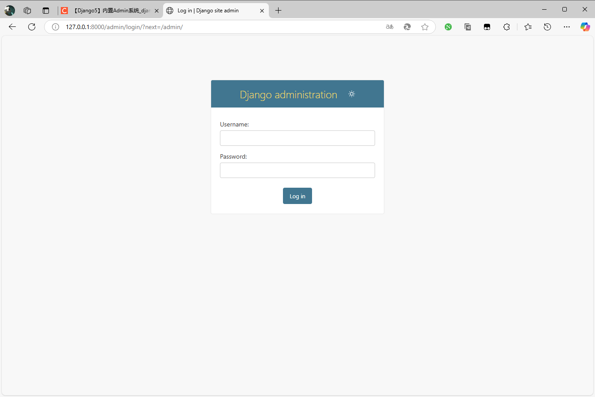
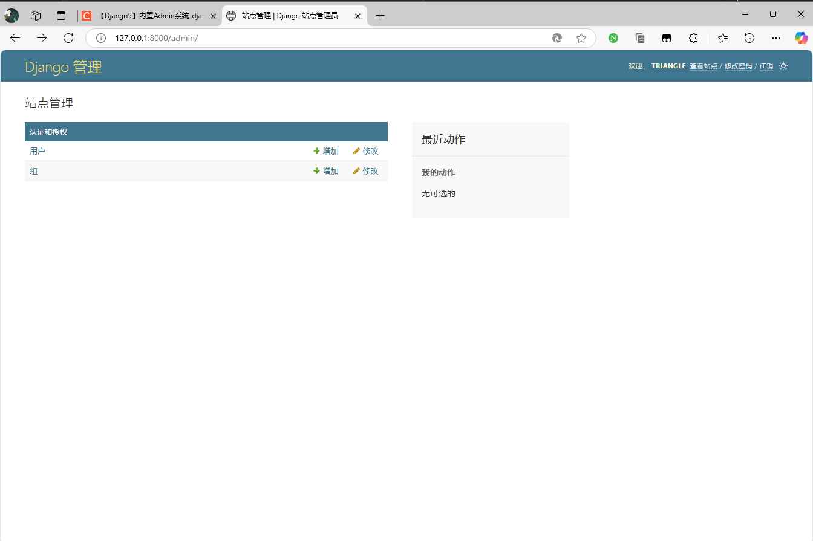
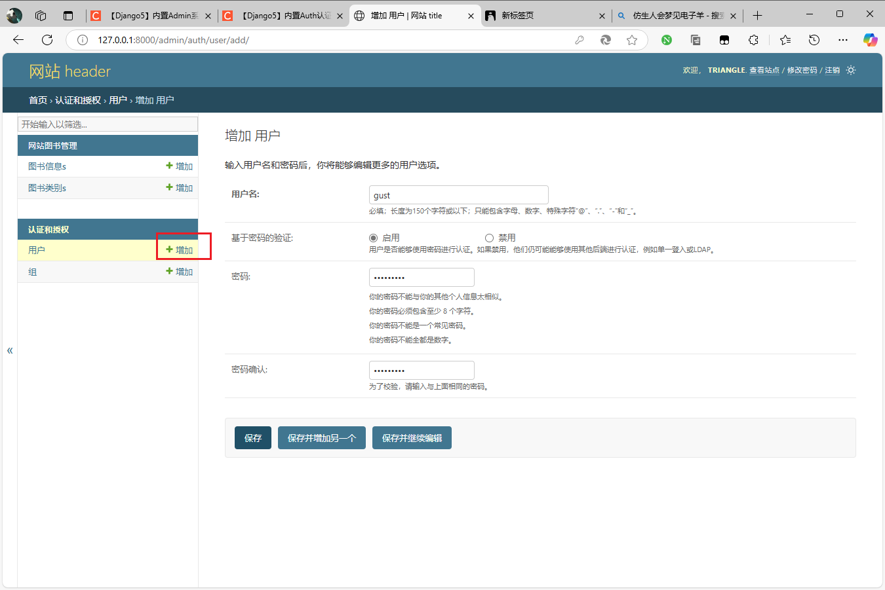
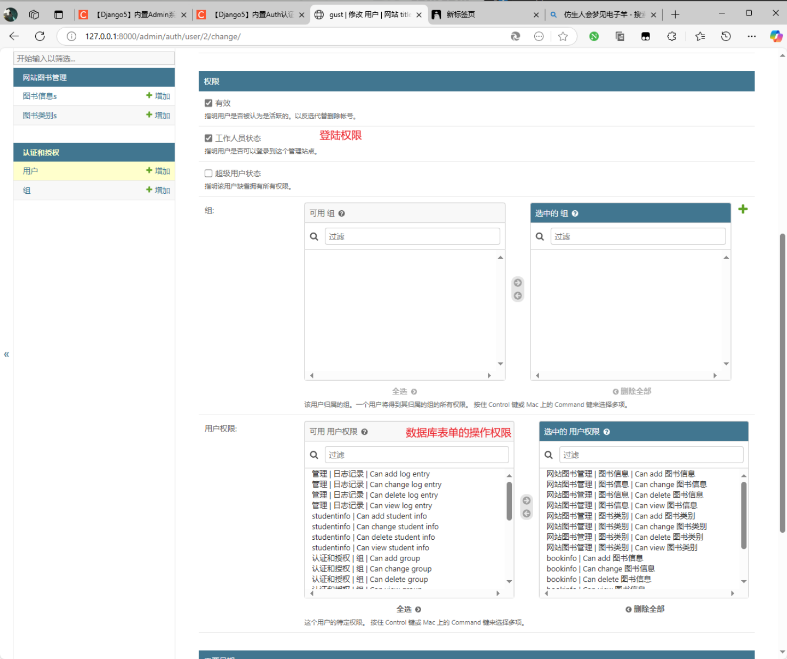
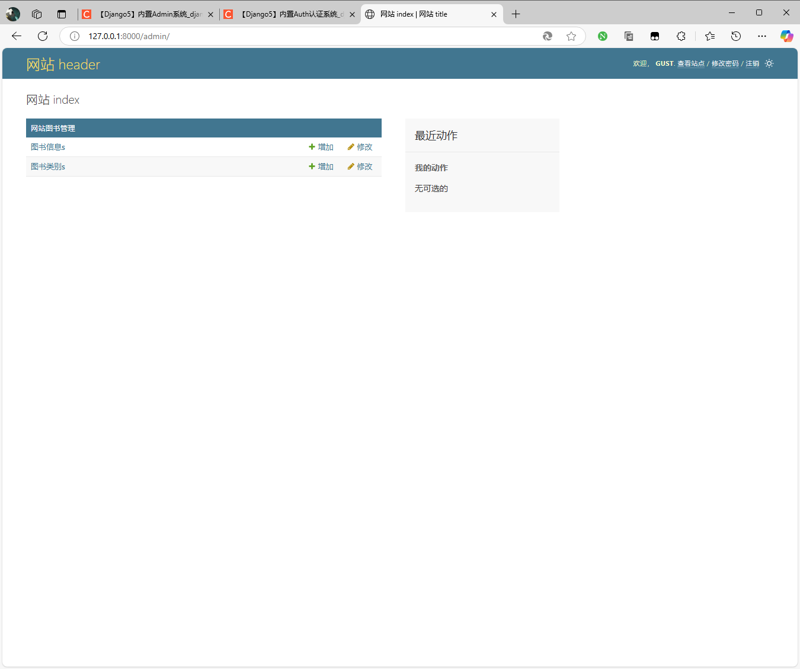
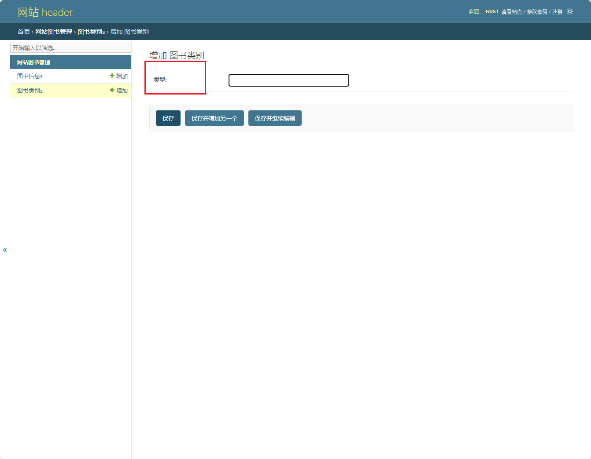
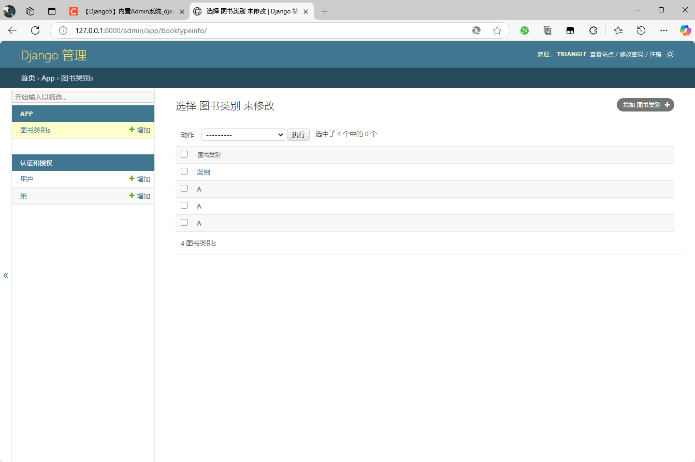
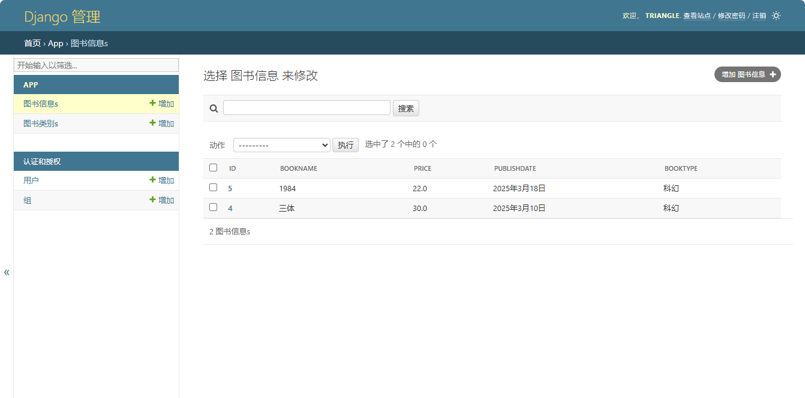
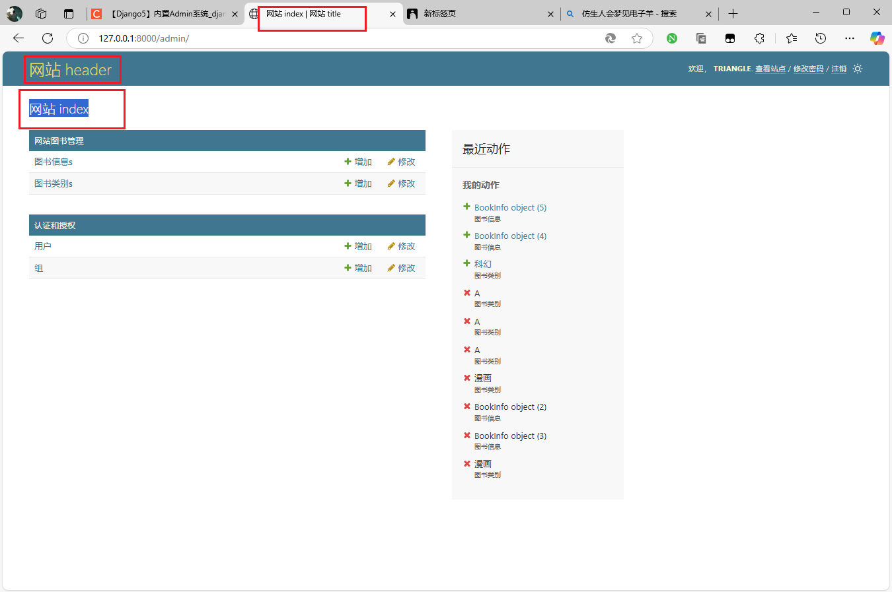
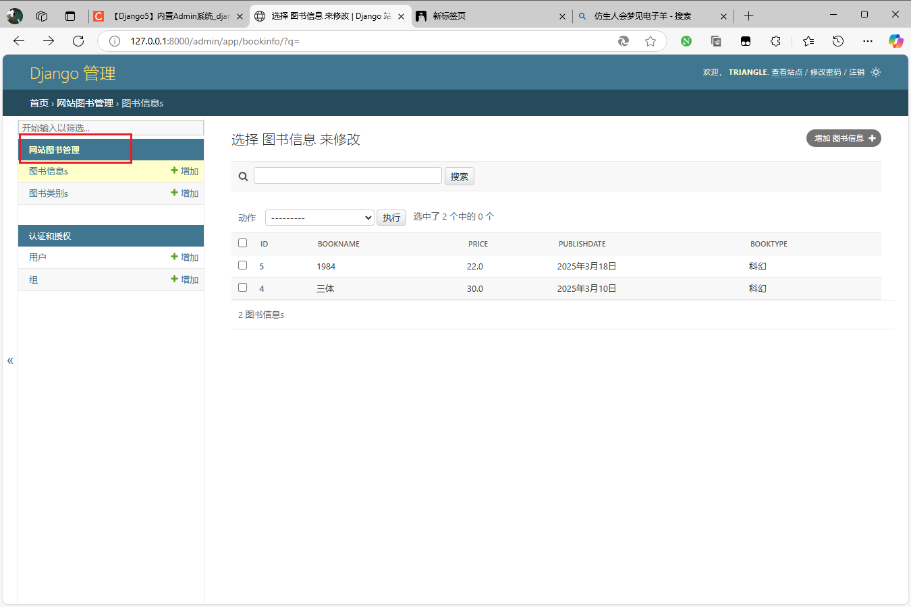

# Admin 系统

# 概述

## 管理系统

**`Admin` 后台系统** ： 即网站后台管理系统，主要对网站的信息进行管理，如文字、图片、影音和其他日常使用的文件的发布、更新、删除等操作，也包括功能信息的统计和管理，如用户信息、订单信息和访客信息等。简单来说，它是对网站数据库和文件进行快速操作和管理的系统，以使网页内容能够及时得到更新和调整。

在 `Django` 中，自带了一个后台应用，且支持二次开发。

```python
INSTALLED_APPS = [
    'django.contrib.admin',             # 后台管理系统
    'django.contrib.auth',
    'django.contrib.contenttypes',
    'django.contrib.sessions',
    'django.contrib.messages',
    'django.contrib.staticfiles',
]
```

通过 `http://127.0.0.1:8000/admin` 便能访问

```python
urlpatterns = [
    path('admin/', admin.site.urls),
]
```




默认界面为英文，可通过修改 `MIDDLEWARE` 配置中文中间件

```python
MIDDLEWARE = [
    'django.middleware.security.SecurityMiddleware',
    'django.middleware.locale.LocaleMiddleware',            # 中文中间件，顺序最好放第二个 
    'django.contrib.sessions.middleware.SessionMiddleware',
    'django.middleware.common.CommonMiddleware',
    'django.middleware.csrf.CsrfViewMiddleware',
    'django.contrib.auth.middleware.AuthenticationMiddleware',
    'django.contrib.messages.middleware.MessageMiddleware',
    'django.middleware.clickjacking.XFrameOptionsMiddleware',
]
```

## 账号管理

### 管理员

Admin 后台管理系统为实现账号权限管理，执行 `migrate` 后，会在数据库中自动生成用于账号管理的表单。所有表默认都是是空的，因此需要需要执行 `createsuperuser` 创建一个管理员账号。

```term
triangle@LEARN:~$ python manager.py migrate // 执行迁移脚本
triangle@LEARN:~$ \dt // psql 中的指令
                   List of relations
 Schema |            Name            | Type  |  Owner
--------+----------------------------+-------+----------
 public | auth_group                 | table | postgres     # 用户分组
 public | auth_group_permissions     | table | postgres     # 组权限，用户在哪个组，就能继承哪个组的权限
 public | auth_permission            | table | postgres
 public | auth_user                  | table | postgres
 public | auth_user_groups           | table | postgres
 public | auth_user_user_permissions | table | postgres
 public | django_admin_log           | table | postgres
 public | django_content_type        | table | postgres
 public | django_migrations          | table | postgres
 public | django_session             | table | postgres
triangle@LEARN:~$ python manager.py createsuperuser // 创建账号
Username (leave blank to use 'triangle'): 
Email address: 
Password: 
Password (again): 
Bypass password validation and create user anyway? [y/N]: y
Superuser created successfully.
```




> [!tip]
> 初始状态下，Admin 系统默认就只有一个账号管理功能，其他管理功能可以二次开发。


### 普通用户

1. 新建用户账号



2. 添加权限



3. 登陆 `gust` 账号



# 模型注册

**模型注册** ：在实际业务开发过程中，会定义很多的业务模型，可以把模型直接注册到 Admin 系统中，通过 Admin 系统便捷得维护这些模型。即在 Admin 后台实现模型增、删、改、查功能。

## 模型

```python
from django.db import models

class BookTypeInfo(models.Model):
    id = models.AutoField(primary_key=True)

    # NOTE - 可以通过定义 verbase_name 指定 Admin 界面上的字段展示名
    bookTypeName = models.CharField(max_length=20, verbase_name= '类型')
    class Meta:
        db_table = "t_bookType"
        verbose_name = "图书类别"

    def __str__(self):
        return self.bookTypeName

class BookInfo(models.Model):
    id = models.AutoField(primary_key=True)
    bookName = models.CharField(max_length=20)
    price = models.FloatField()
    publishDate = models.DateField()
    bookType = models.ForeignKey(to=BookTypeInfo, on_delete=models.PROTECT)

    class Meta:
        db_table = "t_book"
        verbose_name = "图书信息"
```



## 简单注册

修改 `admin.py`

```python
from django.contrib import admin

from .models import BookTypeInfo

# Register your models here.

# 将模型直接注册到admin后台
admin.site.register(BookTypeInfo)
```



## 自定义注册

### 注册定义

在 `admin.py` 中自定义 `ModelAdmin`

```python
@admin.register(BookInfo)
class BookInfoAdmin(admin.ModelAdmin):
    """ 
    可以对模型的增删改查操作做精细化的配置，包括显示字段，分页，可编辑字段，查询字段，排序等。  
    """
    # 设置显示字段
    list_display = ['id', 'bookName', 'price', 'publishDate', 'bookType']
    # 设置可查询字段
    search_fields = ['bookName']

```




### 权限控制

在 `admin.py` 中修改 `BookInfoAdmin`

```python
@admin.register(BookInfo)
class BookInfoAdmin(admin.ModelAdmin):
    """ 
    可以对模型的增删改查操作做精细化的配置，包括显示字段，分页，可编辑字段，查询字段，排序等。  
    """
    # 设置显示字段
    list_display = ['id', 'bookName', 'price', 'publishDate', 'bookType']
    # 设置可查询字段
    search_fields = ['bookName']

    # NOTE - 根据账号权限设置只读字段
    def get_readonly_fields(self, request, obj=None):
        if request.user.is_superuser:
            return []
        else:
            return [ 'price', 'bookType']

```

# 重命名

## 网站名

在 `admin.py` 中设置

```python
from django.contrib import admin

admin.site.site_header = '网站 header'
admin.site.site_title = '网站 title'
admin.site.index_title = '网站 index'
```



## 应用名



修改 `apps.py` 中的设置

```python
from django.apps import AppConfig

class AppConfig(AppConfig):
    default_auto_field = 'django.db.models.BigAutoField'
    name = 'app'
    # admin 展示名
    verbose_name = '网站图书管理'
```

# 模板定制

1. 查找 Django 包的安装位置

```term
triangle@LEARN:~$ pip show django
Name: Django
Version: 5.1.7
Summary: A high-level Python web framework that encourages rapid development and clean, pragmatic design.
Home-page: https://www.djangoproject.com/
Author: 
Author-email: Django Software Foundation <foundation@djangoproject.com>
License: BSD-3-Clause
Location: /home/triangle/miniforge3/lib/python3.12/site-packages        # Django 包所在文件夹
Requires: asgiref, sqlparse
Required-by: 
```

2. 找到 Admin 中要修改的模板，其路径 `django/contrib/admin/templates/admin/xxx/xxx.html`

3. 将需要二次定制的模板文件拷贝到当前项目的 `templates/admin/xxx/xxx.html` 文件夹下进行二次定制，**不要修改 `admin/xxx/xxx.html` 模板路径名，这样项目的模板优先级高于 Django 包中的模板，可被优先加载，从而实现替换。**


# 权限系统

## 表单

```term
triangle@LEARN:~$ \dt // psql 中的指令
                   List of relations
 Schema |            Name            | Type  |  Owner
--------+----------------------------+-------+----------
 public | auth_group                 | table | postgres     # 用户组
 public | auth_group_permissions     | table | postgres     # 组权限，用户在哪个组，就能继承哪个组的权限
 public | auth_permission            | table | postgres     # 用户权限
 public | auth_user                  | table | postgres     # 用户
 public | auth_user_groups           | table | postgres     # 用户与组关联表
 public | auth_user_user_permissions | table | postgres     # 户权限关联表
 public | django_admin_log           | table | postgres
 public | django_content_type        | table | postgres
 public | django_migrations          | table | postgres
 public | django_session             | table | postgres
```

由于 Django 已经建好了所有权限相关的表，因此，可以直接调用模型进行使用

```python
# 相关模型都在该路径下
import django.contrib.auth.models
```


## 用户注册

1. 用户注册需要一个注册界面和用户数据提交到数据库的路由接口

    ```python
    # 注册界面
    path('auth/toRegister/', app.views.toRegister),
    # 提交信息到数据库
    path('auth/register', app.views.register)
    ```

2. 路由操作定义

    ```python
    from django.contrib.auth.models import User

    def toRegister(request):
        """
        注册跳转页面
        """
        return render(request, 'auth/register.html')

    def register(request):
        """
        注册页面
        """
        username = request.POST.get('username')
        password = request.POST.get('password')

        # 存在性校验
        result = User.objects.filter(username=username)
        if result:
            return render(request, 'auth/register.html',
                        {
                            'error_info': '用户名已存在', 
                            'username': username,       # 让界面继续展示原来的账号密码
                            'password': password
                        })

        # 在 auth_user 中添加账号
        User.objects.create_user(username=usernamedvxxzxd, password=password)
        return HttpResponse('注册成功')
    ```

3. 注册界面模板 `auth/register.html`

    ```html
    <!DOCTYPE html>
    <html lang="en">
    <head>
        <meta charset="UTF-8">
        <title>注册页面</title>
    </head>
    <body>
    <form action="/register" method="post">
        
        <table>
            <tr>
                <th>用户注册</th>
            </tr>
            <tr>
                <td>用户名：</td>
                <td><input type="text" name="username" value="{{ username }}"></td>
            </tr>
            <tr>
                <td>密码：</td>
                <td><input type="password" name="password" value="{{ password }}"></td>
            </tr>
            <tr>
                <td><input type="submit" value="注册"></td>
            </tr>
            <tr>
                <td colspan="2"><font color="red">
                    {{ error_info }}
                </font>
                </td>
            </tr>
        </table>
    </form>
    </body>
    </html>
    ```

## 用户登陆


1. 用户登陆也一样，需要一个界面接口与登陆验证接口

    ```python
    path('auth/toLogin/', app.views.toLogin),
    path('auth/login', app.views.login),
    ```

2. 登陆路由接口实现

    ```python
    from django.contrib import auth


    def toLogin(request):
    """
    登录跳转页面
    """
    return render(request, 'auth/login.html')

    def login(request):
        """
        登录页面
        """
        username = request.POST.get('username')
        password = request.POST.get('password')

        # 通过 auth 模块来校验加密后的密码，校验成功返回用户对象，失败返回 None
        resUser = auth.authenticate(request, username=username, password=password)

        # 用户非空，且激活
        if resUser and resUser.is_active:
            # 系统登陆，会返回客户端 token ，并且服务会创建 session
            auth.login(request, resUser)
            # 返回主页
            return render(request, 'auth/index.html')
        else:
            # 返回登陆错误结果
            return render(request, 'auth/login.html', {'error_info': '用户名或密码错误'})
    ```

3. 在 `auth/index.html` 中可以使用 `request.user` 访问登陆成功的 `User` 对象属性

    ```html
    <!DOCTYPE html>
    <html lang="en">
    <head>
        <meta charset="UTF-8">
        <title>网站首页</title>
    </head>
    <body>
        <!-- 防止用户直接请求 index ，需要添加账号登陆情况验证 -->
        
            <p>欢迎: {{ request.user }}</p>
        
            <p><a href="/auth/toLogin">登录</a></p>
        
    </body>
    </html>
    ```

## 密码修改

1. 之前的用户登陆与用户注册都是通过两个路由接口实现，为了简便也可以合并为一个
   - `GET` 请求，返回模板界面
   - `POST` 请求，进行具体业务操作

    ```python
    path('auth/setPwd', app.views.setPwd),
    ```

2. 路由业务逻辑

    ```python
    def setPwd(request):
    """
    修改密码
    """
    if not request.user.is_authenticated:
        return redirect('/toLogin')  # 根据你的项目实际登录URL修改
    if request.method == "POST":
        oldPwd = request.POST.get("oldPwd")
        newPwd = request.POST.get("newPwd")
        # 1,校验用户密码 check_password
        # request.user 可以直接访问登陆成功的 `User` 对象
        isRight = request.user.check_password(oldPwd)
        if not isRight:
            return render(request, 'auth/setPwd.html',
                          context={"error_info": "原密码错误", "oldPwd": oldPwd, "newPwd": newPwd})
        # 2,设置新密码 set_password 实现加密
        request.user.set_password(newPwd)
        # 3,保存用户信息
        request.user.save()
        return render(request, 'auth/index.html')
    elif request.method == 'GET':
        return render(request, "auth/setPwd.html")
    ```

3. `auth/setPwd.html`

    ```html
    <!DOCTYPE html>
    <html lang="en">
    <head>
        <meta charset="UTF-8">
        <title>修改密码页面</title>
    </head>
    <body>
    <form action="/setPwd/" method="post">
        
        <table>
            <tr>
                <th>修改密码</th>
            </tr>
            <tr>
                <td>用户名：</td>
                <td><input type="text" name="username" value="{{ username }}"></td>
            </tr>
            <tr>
                <td>原密码：</td>
                <td><input type="password" name="oldPwd" value="{{ oldPwd }}"></td>
            </tr>
            <tr>
                <td>新密码：</td>
                <td><input type="password" name="newPwd" value="{{ newPwd }}"></td>
            </tr>
            <tr>
                <td><input type="submit" value="修改"></td>
            </tr>
            <tr>
                <td colspan="2"><font color="red">
                    {{ error_info }}
                </font>
                </td>
            </tr>
        </table>
    </form>
    </body>
    </html>
    ```

## 账号登出

1. 定义账号登出接口，且需要主页切换到登陆界面

    ```python
    # 跳转主页
    path('auth/logout/', helloWorld.views.logout),
    ```

2. 实现路由接口
    ```python
    def logout(request):
        """
        注销
        """
        # 会删除登陆会话
        auth.logout(request)
        return render(request, 'auth/login.html')
    ```
