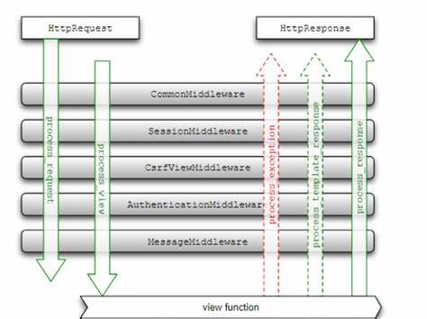

# 项目配置

- `project/settings.py`

# 常规配置

```python
from pathlib import Path

# Build paths inside the project like this: BASE_DIR / 'subdir'.
# 项目路径
BASE_DIR = Path(__file__).resolve().parent.parent

# 密钥配置，自动配
SECRRET_KEY = ''

# 调试模式，方便开发
DEBUG = True

# 域名白名单
ALLOWED_HOSTS = ['*']

# 应用
INSTALLED_APPS = [
    'django.contrib.admin',         # 后台管理系统
    'django.contrib.auth',          # 认证系统
    'django.contrib.contenttypes',  # model 元数据, 实现 ORM 框架
    'django.contrib.sessions',      # 标识当前访问网站用户身份
    'django.contrib.messages',      # 消息提示
    'django.contrib.staticfiles',   # 静态资源查找
    'hello.apps.HelloConfig'
]

# urls.py 文件所在位置
ROOT_URLCONF = 'project.urls'

# wsgi 路径，部署的时候需要填写
WSGI_APPLICATION = 'project.wsgi.application'
```


# 静态资源

**静态资源** ：设置好，应用中就不变了

```python
# 路由路径，默认查找 DASE_DIR 路径下的 'static' 文件夹
STATIC_URL = 'static/'

#  设置应用路径 'BASE_DIR' 下的多个存放静态文件的文件夹
STATICFILES_DIRS = [ DASE_DIR / 'static', BASE_DIR / 'images']

# 通过 'collectstatic' 收集应用涉及的所有的静态文件放到指定文件夹下，发布时使用
STATIC_ROOT = BASE_DIR / 'static'
```

# 媒体资源

**媒体资源** ： 应用运行过程中，可能需要修改的

- **配置**

    ```python
    # 路由路径
    MEDIA_URL = 'media/'

    # 资源路径
    MEDIA_ROOT = BASE_DIR / 'media'
    ```

- **注册 `project/urls.py`** 

    ```python
    from django.contrib import admin
    from django.urls import path, re_path
    from django.views.static import serve
    from django.conf import settings
    import hello.views

    urlpatterns = [
        path('admin/', admin.site.urls),
        path('index/', hello.views.index),
        # 配置媒体资源的路由路径
        re_path('media/(?P<path>.*)', serve, {'document_root' : settings.MEDIA_ROOT}, name='media')
    ]
    ```

# 模板配置

```python
TEMPLATES = [
    { 
        "BACKEND": "django.template.backends.django.DjangoTemplates", # 这里使用 Django 内置的模板引擎
        # NOTE - 重名文件根据 DIRS 顺序查找模板文件
        "DIRS": [BASE_DIR / 'templates', BASE_DIR / 'hello/templates'],
        "APP_DIRS": True, # 会查找应用内部的模板
        "OPTIONS": {
            "context_processors": [
                "django.template.context_processors.debug", # 启用调试信息
                "django.template.context_processors.request",# 启用请求相关的上下文变量
                "django.contrib.auth.context_processors.auth",  # 启用用户认证相关的上下文变量
                "django.contrib.messages.context_processors.messages",# 启用消息框架相关的上下文变量
            ],
        },
    },
]

```

# 数据库


- `sqlite`

```python
DATABASES = {
    "default": {
        "ENGINE": "django.db.backends.sqlite3",
        "NAME": BASE_DIR / "db.sqlite3",
    }
}
```

- `postgresql`

```term
triangle@LEARN:~$ pip install psycopg2    // 报错了就装下面的
triangle@LEARN:~$ pip install psycopg2-binary
```

```python
DATABASES = {
    'default': {
        'ENGINE': 'django.db.backends.postgresql',
        'NAME': 'your_database_name',
        'USER': 'your_database_user',
        'PASSWORD': 'your_database_password',
        'HOST': 'localhost',
        'PORT': '5432',
    },
    'other' :{
        '..' : '...'
    }
}
```

```term
triangle@LEARN:~$ python manage.py makemigrations // 去检查创建或修改数据库，如果不合法会给出提示，且生成迁移脚本
triangle@LEARN:~$ python manage.py migrate // 执行数据库迁移
```

# 中间件

**中间件**: 是一个钩子框架，用于在请求和响应处理过程中插入自定义逻辑。它可以在全局范围内修改 Django 的输入或输出。中间件可以理解为介于 HttpRequest 与 HttpResponse 处理之间的一道处理过程。




重写图中的五个函数，可实现中间件自定义

```python
# hello/middles/custom.py
from django.utils.deprecation import MiddlewareMixin

class Middle(MiddlewareMixin):
    # 调用 view 之前
    def process_request(self, request):
        pass

    # 调用 view 之后
    def process_response(self, response):
        return response
```

```python
MIDDLEWARE = [
    "django.middleware.security.SecurityMiddleware",
    "django.contrib.sessions.middleware.SessionMiddleware",
    "django.middleware.common.CommonMiddleware",
    "django.middleware.csrf.CsrfViewMiddleware",
    "django.contrib.auth.middleware.AuthenticationMiddleware",
    "django.contrib.messages.middleware.MessageMiddleware",
    "django.middleware.clickjacking.XFrameOptionsMiddleware",
    # 注册自定义中间件
    "hello.middles.custom.Middle"
]
```

