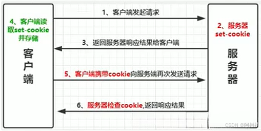
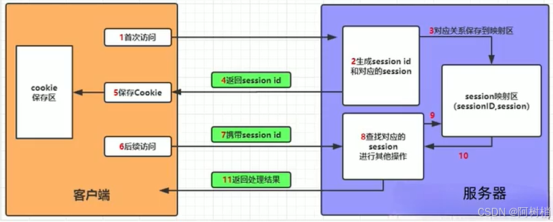

# 请求响应

# 响应

## 常用响应

- `views.py`

```python
from django.shortcuts import HttpResponse,render
from django.http import HttpResponseNotFound,JsonResponse

def resp_200(request):
    # 文本
    return HttpResponse('txt')

def resp_404(request):
    return HttpResponseNotFound()

def resp_json(request):
    return JsonResponse({'name': 'zhang', 'age': 10})

def resp_html(request):
    return render(request,'index.html')
```

## 模板传参

- `view.py`

```python
from django.shortcuts import render

def index(request):
    context = {
        'msg' : 'text'
    }
    return render(request, 'index.html', context=context)
```

- `index.html`

```html
<!DOCTYPE html>
<html lang="en">
<head>
    <meta charset="UTF-8">
    <title>Document</title>
</head>
<body>
    <!-- msg 会被替换为 'text' -->
    {{ msg }}
</body>
</html>
```

## 重定向响应


重定向响应码
- `301` : 永久重定向，不会保留旧网址
- `302` : 临时重定向，会保留旧网址


```python
# hello/view.py
from django.shortcuts import HttpResponseRedirect,HttpResponsePermanentRedirect,redirect

def index(request,id):
    if id == 0:
        # HttpResponseRedirect 与 HttpResponsePermanentRedirect 的封装函数
        return redirect('http://www.github.com',permanent=False)
    elif id == 1:
        # 301
        return HttpResponseRedirect('http://www.github.com')
    else:
        # 302
        return HttpResponsePermanentRedirect('app/index')
```

> [!note]
> 浏览器可能会有缓存，无痕模式就没有缓存


## 文件下载响应

下载文件存在三种方式
- `HttpResponse` : 小文件
- `StreamingHttpResponse` : 流式传输，适合大规模数据，支持分段处理
- `FileResponse` : 基于 StreamingHttpResponse 重写，适合大文件

```python
def index_HttpResponse(request):
    # 二进制流打开
    file = open('/mnt/e/testspace/django/manage.py',mode='rb')
    resp = HttpResponse(file)
    # 设置文件响应头
    resp['Content_Type'] = 'application/octet-stream'
    resp['Content-Dispositon'] = 'attachment;filename=test.py'
    return resp

def index_StreamingHttpResponse(request):
    file = open('/mnt/e/testspace/django/manage.py',mode='rb')
    resp = StreamingHttpResponse(file)
    resp['Content_Type'] = 'application/octet-stream'
    resp['Content-Dispositon'] = 'attachment;filename=test.exe'
    return resp

def index_FileResponse(request):
    file = open('/mnt/e/testspace/django/manage.py',mode='rb')
    resp = FileResponse(file)
    resp['Content_Type'] = 'application/octet-stream'
    resp['Content-Dispositon'] = 'attachment;filename=test.exe'
    return resp

```

# 请求

常见的 HTTP 协议请求方法
- `GET`: 用于从服务器获取资源，不会改变资源的状态。例如，请求网页或图片。
- `POST`: 向服务器发送数据以创建新资源，通常用于提交表单或上传文件。
- `PUT`: 向服务器发送数据以更新现有资源，如果资源不存在，则创建新资源。PUT请求通常是幂等的，多次执行相同的PUT请求不会产生不同的结果。
- `DELETE`: 请求服务器删除指定的资源。
- `PATCH`: 对资源进行部分修改，只更改资源的一部分而不是整个资源。
- `HEAD`: 类似于GET，但服务器只返回响应头，不返回实际数据。用于获取资源的元数据。
- `OPTIONS`: 返回服务器支持的HTTP方法，用于检查服务器支持哪些请求方法，通常用于CORS的预检请求。
- `TRACE`: 回显服务器收到的请求，主要用于诊断。
- `CONNECT`: 建立一个到服务器的隧道，通常用于HTTPS连接

## HttpRequest

在Django5中，HTTP 请求信息都被封装到了`HttpRequest`类中，常用属性如下：
- `COOKIE`: 获取客户端（浏览器）的Cookie信息，以字典形式表示，并且键值对都是字符串类型。
- `FILES`:  所有的文件上传信息
- `GET`: 获取GET请求的请求参数
- `POST`: 获取POST请求的请求参数
- `META`: 获取客户端（浏览器）的请求头信息，以字典形式存储。
- `method`: 获取当前请求的请求方式(`GET`、`POST`).
- `path`: 获取当前请求的路由地址。
- `session`: 一个类似于字典的对象，用来操作服务器的会话信息，可临时存放用户信息。
- `user`: 启用`AuthenticationMiddleware` 中间件时才可用。值是内置数据模型`User`的对象，表示当前登录的用户。若没有登录，则未 `django.contrib.auth.models.AnonymousUser` 的一个实例。

常用方法
- `is_secure()`: 是否是采用 HTTPS 协议
- `get_host()`: 获取服务器的域名
- `get_full_path()`: 返回路由地址。若为 `GET` 将包含参数

```python
def get_request(request):
    # 若没有给参数，则返回 None
    print(request.GET.get("name"))
    print(request.GET.get("pwd"))
    # 指定默认值
    print(request.GET.get("default", "默认值"))
    return HttpResponse('ok')

def post_request(request):
    # 若没有给参数，则返回 None
    print(request.POST.get("name"))
    print(request.POST.get("pwd"))
    # 指定默认值
    print(request.POST.get("default", "默认值"))
    return HttpResponse('ok')
```

在 HTML 中创建 `POST` 请求界面

```html
<form action="/post_url" method="post">
    <!-- 设置 token，会自动赋值。CSRF 中间件和模板标签提供易于使用的保护，防止跨站点请求伪造。 -->
    
    name: <input type='name'><br>
    pwd: <input type='pwd'><br>
    <input type="submit" value="提交">
</form>
```

## 会话管理


### 概念

HTTP 是一种无状态协议，每次客户端访问web页面时，客户端打开一个单独的浏览器窗口连接到web服务器，由于服务器不会自动保存之前客户端请求的相关信息，所有无法识别一个HTTP请求是否为第一次访问。这就引进了web客户端和服务器端之间的会话，这就是「会话管理」。

- **`Cookie`** 

`Cookie` 是网站为了辨别用户身份，进行 `Session` 跟踪而暂时或永久储存在「浏览器」上的数据（通常经过加密）。该机制通过在请求头与响应头添加额外信息实现。



服务器会在响应信息中包含一个`Set-Cookie`的响应头，客户端会根据这个响应头存储Cookie信息。再次请求服务器时，客户端会在请求信息中包含一个Cookie请求头，而服务器会根据这个请求头进行用户身份、状态等较验。

- **`Session`** 

`Session` 是在浏览器访问服务器的时，「服务器」上记录的客户端信息。客户端浏览器再次访问时，可在 `Session` 中查找该客户端信息。



服务器首先检查这个客户端的请求里是否已包含了一个 session 标识，即 `session id`，该标识符唯一不重复
- 包含，服务器就按照 session id 把 session 检索出来使用
- 不包含，服务器创建一个 session 并且生成相关联的 session id，并将 session id 返回给客户端保存。

Session 和 Cookie 的区别
- Cookie 存储在浏览器；Session 存储在服务器
- Cookie 可以单独使用，但是不安全
- Session 会与 Cookie 配合使用，安全性高，但是会占用服务器资源

### Cookie

```python
# 获取
def get_cookie(request):
    # 三种获取方式
    request.COOKIES['key']
    request.COOKIES.get('key')
 
    # default: 默认值
    # salt:  加密盐
    # max_age: 后台控制过期时间，默认是秒数
    # expires: 专门针对IE浏览器设置超时时间
    request.get_signed_cookie(key, default=RAISE_ERROR, salt='', max_age=None)

    return HttpResponse('ok')
 
# 设置
def set_cookie(request):
    rep = HttpResponse('ok')
    # 两种设置 cookie 的方式
    rep.set_cookie(key, value,...)
    rep.set_signed_cookie(key, value,salt='加密盐', max_age=None, ...)
    return rep

# 删除
def delete_cookie(request):
    key = equest.COOKIES['key']
    rep = HttpResponse('ok')
    rep.delect_cookie(key)
    return resp
```

> [!tip]
> 前端与服务端都需要记住的参数，例如记住密码选项，可以通过 cookie 实现

### Session

```python
def manage_session(request): 
    # 查询
    request.session['k1']                   # 没有值会报错
    request.session.get('k1',None)          # 可以获取多组
    request.session.session_key             # 会话的key
    request.session.exists("session_key")   # 存在性校验

    # 赋值
    request.session['k1'] = 123             # 可以设置多组
    request.session.setdefault('k1',123)    # 存在则不设置

    # 删除
    del request.session['k1']
    request.session.clear_expired()         # 将所有Session失效日期小于当前日期的数据删除
    request.session.delete()                # 只删客户端
    request.session.flush()                 # 服务端、客户端都删
    
    # 遍历
    request.session.keys()
    request.session.values()
    request.session.items()
    request.session.iterkeys()
    request.session.itervalues()
    request.session.iteritems()

    # 如果value是个整数，session会在些秒数后失效。
    # 如果value是个datatime或timedelta，session就会在这个时间后失效。
    # 如果value是0,用户关闭浏览器session就会失效。
    # 如果value是None,session会依赖全局session失效策略。
    request.session.set_expiry(value)       # 设置保存时间，默认 14 天

    return HttpResponse('ok')
```

在 `settings.py` 中配置

```python
1. 数据库Session
SESSION_ENGINE = 'django.contrib.sessions.backends.db'   # 引擎（默认）
 
2. 缓存Session
SESSION_ENGINE = 'django.contrib.sessions.backends.cache'  # 引擎
SESSION_CACHE_ALIAS = 'default'                            # 使用的缓存别名（默认内存缓存，也可以是memcache），此处别名依赖缓存的设置
 
3. 文件Session
SESSION_ENGINE = 'django.contrib.sessions.backends.file'    # 引擎
SESSION_FILE_PATH = None                                    # 缓存文件路径，如果为None，则使用tempfile模块获取一个临时地址tempfile.gettempdir() 
 
4. 缓存+数据库
SESSION_ENGINE = 'django.contrib.sessions.backends.cached_db'        # 引擎
 
5. 加密Cookie Session
SESSION_ENGINE = 'django.contrib.sessions.backends.signed_cookies'   # 引擎
 
其他公用设置项：
SESSION_COOKIE_NAME ＝ "sessionid"        # Session的cookie保存在浏览器上时的key，即：sessionid＝随机字符串（默认）
SESSION_COOKIE_PATH ＝ "/"                # Session的cookie保存的路径（默认）
SESSION_COOKIE_DOMAIN = None              # Session的cookie保存的域名（默认）
SESSION_COOKIE_SECURE = False             # 是否Https传输cookie（默认）
SESSION_COOKIE_HTTPONLY = True            # 是否Session的cookie只支持http传输（默认）
SESSION_COOKIE_AGE = 1209600              # Session的cookie失效日期（2周）（默认）
SESSION_EXPIRE_AT_BROWSER_CLOSE = False   # 是否关闭浏览器使得Session过期（默认）
SESSION_SAVE_EVERY_REQUEST = False        # 是否每次请求都保存Session，默认修改之后才保存（默认）
```

# 文件夹上传

- `upload.html`

```html
<!DOCTYPE html>
<html lang="en">
<head>
    <meta charset="UTF-8">
    <title>文件上传测试</title>
</head>
<body>

<!-- 'multipart/form-data' 文件上传 -->
<form action="/upload" method="post" enctype="multipart/form-data">
    
    <input type="file" name="文件"><br>
    <input type="submit" value="上传">
</form>
</body>
</html>

```

- `views.py`

```python
def upload_html(request):
    return render(request, 'upload.html')


def upload(request):
    # 获取上传的文件，没有文件返回 None
    myFile = request.FILES.get("文件", None)  
    if myFile:
        myFile.name # 文件名，包含后缀
        myFile.size # 文件大小
        myFile.content_type # 文件类型，通过后缀判断

         # 将文件写到服务本地
        file = open(os.path.join("D:\\myfile", myFile.name), 'wb+') 
         # 分块写入文件
        for chunk in myFile.chunks(): 
            file.write(chunk)
        file.close()
        return HttpResponse("文件上传成功")
    else:
        return HttpResponse("没有发现文件")
```
