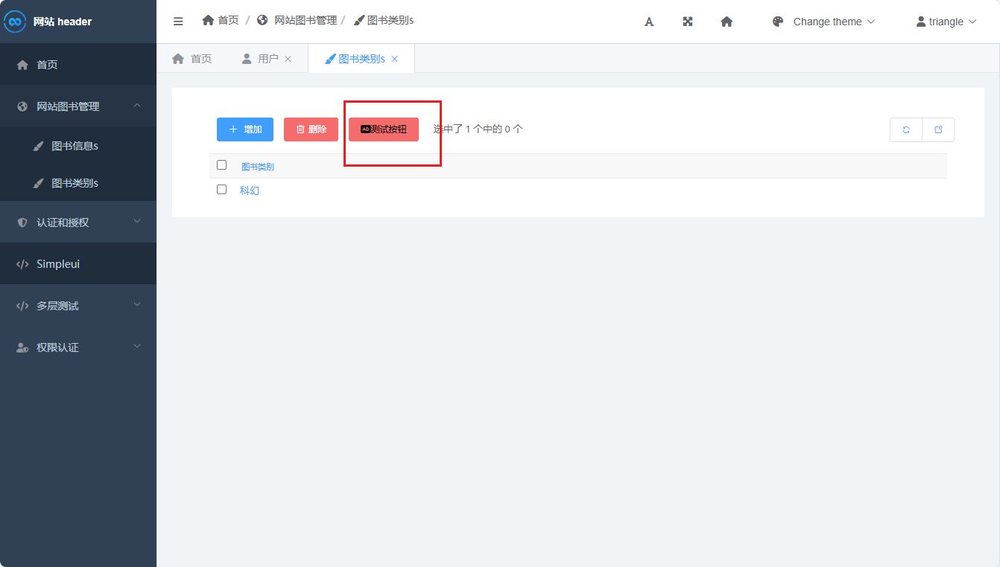

# SimpleUi

# 介绍

- [simpleui](https://newpanjing.github.io/simpleui_docs/) : 美化后的 Admin 后台管理系统，界面更加现代化，可以直接用来开发实际项目的管理系统
- [import-export](https://django-import-export.readthedocs.io/en/latest/) : 是一个 `Model` 代理插件，可在在 Admin 后台系统中为模型数据添加导入、导出功能

# 安装


```term
triangle@LEARN:~$ pip install django-simpleui       # simpleui 插件
triangle@LEARN:~$ pip install django-import-export  # 导入导出插件
```

# [可选] import-export 插件

1. 在项目 `settings.py` 中引入插件

```python
INSTALLED_APPS = [
    'import_export',    # 导入导出插件
    'django.contrib.admin',
    'django.contrib.auth',
    'django.contrib.contenttypes',
    'django.contrib.sessions',
    'django.contrib.messages',
    'django.contrib.staticfiles',
    'app.apps.AppConfig'
]
```

2. 配置 `app/resources.py` 文件

```python
from import_export import resources
from .models import BookInfo

# 定义一个代理模型
class BookInfoResource(resources.ModelResource):
    class Meta:
        model = BookInfo

```

3. 在 `admin.py` 中配置

```python
from import_export.admin import ImportExportModelAdmin
from .models import BookInfo
from .resources import BookInfoResource

@admin.register(BookInfo)
# 不再继承 admin.ModelAdmin ，而是换用 ImportExportModelAdmin
class BookInfoAdmin(ImportExportModelAdmin):
    """ 
    可以对模型的增删改查操作做精细化的配置，包括显示字段，分页，可编辑字段，查询字段，排序等。  
    """
    # 设置显示字段
    list_display = ['id', 'bookName', 'price', 'publishDate', 'bookType']
    # 设置可查询字段
    search_fields = ['bookName']

    # 设置代理模型
    resource_classes = [BookInfoResource]

```


# simpleui 插件

> [!tip]
> 修改 simpleui 展示界面后，需要 `ctrl + F5` 刷新缓存后，才会正确显示修改效果。

## 配置

 在项目 `settings.py` 中引入插件

```python
INSTALLED_APPS = [
    'simpleui',    # 导入导出插件
    'django.contrib.admin',
    'django.contrib.auth',
    'django.contrib.contenttypes',
    'django.contrib.sessions',
    'django.contrib.messages',
    'django.contrib.staticfiles',
    'app.apps.AppConfig'
]

# 指定simpleui默认的主题,指定一个文件名，相对路径就从simpleui的theme目录读取
SIMPLEUI_DEFAULT_THEME = 'admin.lte.css'
```


## 工作原理


1. 查找 Django 包的安装位置

```term
triangle@LEARN:~$ pip show django
Name: Django
Version: 5.1.7
Summary: A high-level Python web framework that encourages rapid development and clean, pragmatic design.
Home-page: https://www.djangoproject.com/
Author: 
Author-email: Django Software Foundation <foundation@djangoproject.com>
License: BSD-3-Clause
Location: /home/triangle/miniforge3/lib/python3.12/site-packages        # Django 包所在文件夹
Requires: asgiref, sqlparse
Required-by: 
```

2. 找到 Admin 中要修改的模板，其路径 `django/contrib/admin/templates/admin/xxx/xxx.html`

3. 将需要二次定制的模板文件拷贝到当前项目的 `templates/admin/xxx/xxx.html` 文件夹下进行二次定制，**不要修改 `admin/xxx/xxx.html` 模板路径名，这样项目的模板优先级高于 Django 包中的模板，可被优先加载，从而实现替换。**

4. simpleui 便是修改 Admin 的原始模板，从而实现新的界面的


## 菜单配置

- [菜单配置](https://newpanjing.github.io/simpleui_docs/config.html#%E8%8F%9C%E5%8D%95)

```python

SIMPLEUI_CONFIG = {
    # 是否保留系统默认的菜单
    "system_keep": True,

    # 控制菜单如何展示，可以定义显示顺序
    # - 不填此字段为默认排序和全部显示
    # - 空列表 [] 为全部不显示.
    # "menu_display": [],

    # 设置是否开启动态菜单, 默认为False. 如果开启, 则会在每次用户登陆时动态展示菜单内容
    "dynamic": True,
    
    "menus": [
        {
            "name": "Simpleui",
            "icon": "fas fa-code",  # 自定义图标 font awesome
            "url": "https://gitee.com/tompeppa/simpleui",
            "newTab": True,  # 浏览器新标签中打开
        },
        {
            "name": "多层测试",
            "icon": "fas fa-code",
            "url": "www.bilibili.com",
            "models": [
                {
                    "name": "哔哩哔哩",
                    "url": "https://www.bilibili.com",
                    # 第四级就不支持了，element只支持了3级
                },
                {
                    "name": "百度问答",
                    "icon": "far fa-surprise",
                    "url": "https://zhidao.baidu.com/",
                },
            ],
        },
        {
            "app": "auth",
            "name": "权限认证",
            "icon": "fas fa-user-shield",
            "models": [{"name": "用户", "icon": "fa fa-user", "url": "auth/user/"}],
        }
    ],
}
```


## 自定义按钮

 在 `admin.py` 中定义按钮

```python
@admin.register(BookTypeInfo)
class BookTypeInfoAdmin(admin.ModelAdmin):
    # 定义按钮  
    actions = ['test']

    # 按钮处理函数
    def test(self, request, queryset):
        pass

    # 显示文本
    test.short_description = '测试按钮'
    # icon，参考element-ui icon与https://fontawesome.com
    test.icon = 'fas fa-audio-description'
    # 指定element-ui的按钮类型，参考https://element.eleme.cn/#/zh-CN/component/button
    test.type = 'danger'
    # 给按钮追加自定义的颜色
    test.style = 'color:black;'
```



## 自定义开发

渲染流程

```txt
服务器： Django 翻译模板文件 -> html 文件 -> 服务发送 html
浏览器： 浏览器接收 html -> 启用 Javascript 脚本 -> 翻译 vue 标签 -> 最终的 html 文件 -> 浏览器渲染
```

同 [ simpleui 工作原理](#工作原理) ，也可以重写模板实现界面二次开发

```term
triangle@LEARN:~$ pip show django-simpleui
Name: django-simpleui
Version: 2025.1.13
Summary: django admin theme 后台模板
Home-page: https://github.com/newpanjing/simpleui
Author: panjing
Author-email: newpanjing@icloud.com
License: Apache License 2.0
Location: /home/triangle/miniforge3/lib/python3.12/site-packages # 库路径
Requires: django
Required-by: 
triangle@LEARN:~$ cd /home/triangle/miniforge3/lib/python3.12/site-packages/simpleui/
triangle@LEARN:simpleui$ tree .
├── templates
│   ├── admin                           # admin 相关的模板文件
│   │   ├── 404.html
│   │   ├── home.html
│   │   ├── ...
│   │   └── widgets
│   └── registration
│       ├── logged_out.html
│       ├── password_change_done.html
│       ├── password_change_form.html
│       ├── password_reset_complete.html
│       ├── password_reset_confirm.html
│       ├── password_reset_done.html
│       ├── password_reset_email.html
│       └── password_reset_form.html
```

找到需要修改的模板文件，按照原路径复制到本地项目修改即可。
