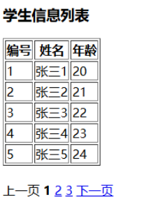
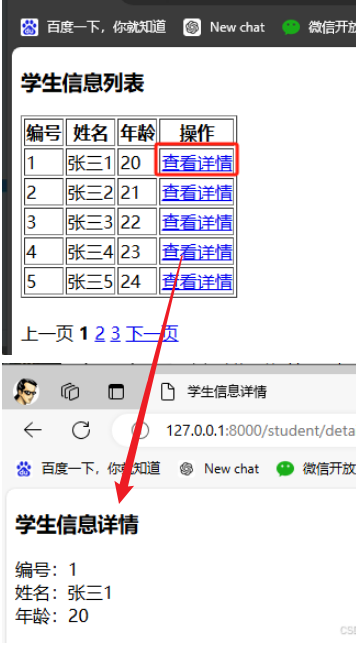

# 视图类

# 概念

**`CBV (Class Base View)`** : 为了实现快速开发，Django 提供了视图类功能，封装了视图开发常用的代码，可通过类实现视图的响应与请求。

# ORM 概述

在 Django 中，数据库将通过 ORM 框架进行映射（后续章节详细介绍），可以通过类对象的形式操作数据库
 - 类对象对应一张表
 - 类属性对应字段
 - 类实例对应一行数据


操作流程

1. 定义 `app/models.py` 

```python
from django.db import models

class StudentInfo(models.Model):
    # 表字段
    id = models.AutoField(primary_key=True)
    name = models.CharField(max_length=20)
    age = models.IntegerField()

    class Meta:
        # 表名
        db_table = "t_student"
```

2. 生成迁移脚本

```term
triangle@LEARN:~$ python manage.py makemigrations
```

3. 执行数据库迁移

```term
triangle@LEARN:~$ python manage.py migrate
```

4. 往数据库插入数据

```sql
insert into student VALUES(1,'张三1',20);
insert into student VALUES(2,'张三2',20);
insert into student VALUES(3,'张三3',20);
insert into student VALUES(4,'张三4',20);
insert into student VALUES(5,'张三5',20);
```

# ListView

**ListView**: 可将数据库表的数据以列表的形式显示到页面，常用于数据的查询和展示。

- `views.py`

```python
from models import StudentInfo
from django.views.generic import ListView

class List(ListView):
    # 显示数据的模板界面
    template_name = 'listview.html'

    # 传递给模板的参数
    extra_context = {'title': '学生信息列表'}

    # 定义查询集，获取所有学生信息
    queryset = StudentInfo.objects.all()

    # 定义数据在模板中的名称
    context_object_name = 'students_list'

    # 设置分页参数，每页显示5条学生信息
    paginate_by = 5

```

- `urls.py`

```python
import app.views

urlpatterns = [
    path('student/list', app.views.List.as_view())
]
```

- `listview.html`

```html
<!DOCTYPE html>
<html lang="en">
<head>
    <meta charset="UTF-8">
    <!-- List 中传入的 extra_context -->
    <title>{{ title }}</title>
</head>
<body>
<h3>{{ title }}</h3>
<table border="1">
    <tr>
        <th>编号</th>
        <th>姓名</th>
        <th>年龄</th>
    </tr>

    <!-- 遍历获取数据库中的数据 -->
    
    <tr>
        <td>{{ student.id }}</td>
        <td>{{ student.name }}</td>
        <td>{{ student.age }}</td>
    </tr>
    

</table>
<br>

<!-- 检测是否分页 -->


    <!-- 上一页 -->
    
    <a href="/student/list?page={{ page_obj.previous_page_number }}">上一页</a>
    
    <a>上一页</a>
    

    <!-- 页码 -->
    
        <!-- 修改当前页码颜色 -->
        
            <a><b><font color="black">{{ current }}</font></b></a>
        
            <a href="/student/list?page={{ current }}">{{ current }}</a>
        
    
    
    <!-- 下一页 -->
    
    <a href="/student/list?page={{ page_obj.next_page_number }}"> 下一页</a>
    
    <a>下一页</a>
    

</body>
</html>
```



`Paginator` 常用属性和方法

1.`count`： 总共有多少条数据。
2.`num_pages`： 总共有多少页。
3.`page_range`：页面的区间。比如有三页，那么就是```range``(``1``,``4``)`。

`page_obj` 常用属性和方法：

1.`has_next`: 是否还有下一页。
2.`has_previous`: 是否还有上一页。
3.`next_page_number`: 下一页的页码。
4.`previous_page_number`: 上一页的页码。
5.`number`: 当前页。
6.`start_index`: 当前页的第一条数据的索引值。
7.`end_index`: 当前页的最后一条数据的索引值。

> [!note]
> `<a href="/student/list">` 引用本地 url 路径，必须 `/` 开头，表示相对路径

# DetailView

**DetailView** : 用于展示某一个具体数据对象的详细信息的页面


- `views.py`

```python

from models import StudentInfo
from django.views.generic import DetailView

class Detail(DetailView):
    # 模板文件名，用于渲染学生信息详情页面
    template_name = 'detailview.html'
    
    # 添加到模板上下文的额外数据，用于在页面中显示标题
    extra_context = {'title': '学生信息详情'}
    
    # 指定模型类，本页面处理的对象是StudentInfo类的实例
    model = StudentInfo
    
    # 在模板中的对象名
    context_object_name = 'student'
    
    # 指定用于获取数据库主键的URL参数名称，默认为'pk'
    pk_url_kwarg = 'id'
```

- `urls.py`

```python
import app.views

urlpatterns = [
    # id 就是 pk_url_kwarg 变量名
    path('student/<int:id>', app.views.Detail.as_view())
]
```


- `detailview.html`

```html
<!DOCTYPE html>
<html lang="en">
<head>
    <meta charset="UTF-8">
    <title>{{ title }}</title>
</head>
<body>
    <h3>{{ title }}</h3>
    编号：{{ student.id }}<br/>
    姓名：{{ student.name }}<br/>
    年龄：{{ student.age }}
</body>
</html>
```

通过 `http://localhost/student/1` 就能在界面上展示数据库中主键为 `1` 的数据，这样便能在 `listview.html` 中增加链接，便能通过 `detailview.html` 展示单条数据

```html
<!-- listview.html -->

<tr>
    ....
    <td>
        <a href="/student/{{ student.id }}"> 详情 </a>
    </td>
    ....
</tr>

```




