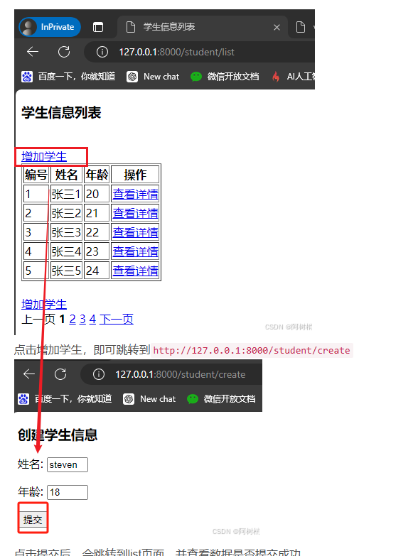

# 视图类

# 概念

**`CBV (Class Base View)`** : 为了实现快速开发，Django 提供了视图类功能，封装了视图开发常用的代码，可通过类实现视图的响应与请求。

# ORM 概述

在 Django 中，数据库将通过 ORM 框架进行映射（后续章节详细介绍），可以通过类对象的形式操作数据库
 - 类对象对应一张表
 - 类属性对应字段
 - 类实例对应一行数据


操作流程

1. 定义 `app/models.py` 

```python
from django.db import models

class StudentInfo(models.Model):
    # 表字段
    id = models.AutoField(primary_key=True)
    name = models.CharField(max_length=20)
    age = models.IntegerField()

    class Meta:
        # 表名
        db_table = "student"
```

1. 生成迁移脚本

```term
triangle@LEARN:~$ python manage.py makemigrations
```

3. 执行数据库迁移

```term
triangle@LEARN:~$ python manage.py migrate
```

4. 往数据库插入数据

```sql
insert into student VALUES(1,'张三1',20);
insert into student VALUES(2,'张三2',20);
insert into student VALUES(3,'张三3',20);
insert into student VALUES(4,'张三4',20);
insert into student VALUES(5,'张三5',20);
```

# ListView

**ListView**: 可将数据库表的数据以列表的形式显示到页面，常用于数据的查询和展示。

- `views.py`

```python
from models import StudentInfo
from django.views.generic import ListView

class List(ListView):
    # 显示数据的模板界面
    template_name = 'listview.html'

    # 传递给模板的参数
    extra_context = {'title': '学生信息列表'}

    # 定义查询集，获取所有学生信息
    queryset = StudentInfo.objects.all()

    # 定义数据在模板中的名称
    context_object_name = 'students_list'

    # 设置分页参数，每页显示5条学生信息
    paginate_by = 5

```

- `urls.py`

```python
import app.views

urlpatterns = [
    path('student/list', app.views.List.as_view())
]
```

- `listview.html`

```html
<!DOCTYPE html>
<html lang="en">
<head>
    <meta charset="UTF-8">
    <!-- List 中传入的 extra_context -->
    <title>{{ title }}</title>
</head>
<body>
<h3>{{ title }}</h3>
<table border="1">
    <tr>
        <th>编号</th>
        <th>姓名</th>
        <th>年龄</th>
    </tr>

    <!-- 遍历获取数据库中的数据 -->
    
    <tr>
        <td>{{ student.id }}</td>
        <td>{{ student.name }}</td>
        <td>{{ student.age }}</td>
    </tr>
    

</table>
<br>

<!-- 检测是否分页 -->


    <!-- 上一页 -->
    
    <a href="/student/list?page={{ page_obj.previous_page_number }}">上一页</a>
    
    <a>上一页</a>
    

    <!-- 页码 -->
    
        <!-- 修改当前页码颜色 -->
        
            <a><b><font color="black">{{ current }}</font></b></a>
        
            <a href="/student/list?page={{ current }}">{{ current }}</a>
        
    
    
    <!-- 下一页 -->
    
    <a href="/student/list?page={{ page_obj.next_page_number }}"> 下一页</a>
    
    <a>下一页</a>
    

</body>
</html>
```


`Paginator` 常用属性和方法

1.`count`： 总共有多少条数据。
2.`num_pages`： 总共有多少页。
3.`page_range`：页面的区间。比如有三页，那么就是```range``(``1``,``4``)`。

`page_obj` 常用属性和方法：

1.`has_next`: 是否还有下一页。
2.`has_previous`: 是否还有上一页。
3.`next_page_number`: 下一页的页码。
4.`previous_page_number`: 上一页的页码。
5.`number`: 当前页。
6.`start_index`: 当前页的第一条数据的索引值。
7.`end_index`: 当前页的最后一条数据的索引值。

> [!note]
> `<a href="/student/list">` 引用本地 url 路径，必须 `/` 开头，表示相对路径

# DetailView

**DetailView** : 用于展示某一个具体数据对象的详细信息的页面


- `views.py`

```python

from models import StudentInfo
from django.views.generic import DetailView

class Detail(DetailView):
    # 模板文件名，用于渲染学生信息详情页面
    template_name = 'detailview.html'
    
    # 添加到模板上下文的额外数据，用于在页面中显示标题
    extra_context = {'title': '学生信息详情'}
    
    # 指定模型类，本页面处理的对象是StudentInfo类的实例
    model = StudentInfo
    
    # 在模板中的对象名
    context_object_name = 'student'
    
    # 指定用于获取数据库主键的URL参数名称，默认为'pk'
    pk_url_kwarg = 'id'
```

- `urls.py`

```python
import app.views

urlpatterns = [
    # id 就是 pk_url_kwarg 变量名
    path('student/<int:id>', app.views.Detail.as_view())
]
```


- `detailview.html`

```html
<!DOCTYPE html>
<html lang="en">
<head>
    <meta charset="UTF-8">
    <title>{{ title }}</title>
</head>
<body>
    <h3>{{ title }}</h3>
    编号：{{ student.id }}<br/>
    姓名：{{ student.name }}<br/>
    年龄：{{ student.age }}
</body>
</html>
```

通过 `http://localhost/student/1` 就能在界面上展示数据库中主键为 `1` 的数据，这样便能在 `listview.html` 中增加链接，便能通过 `detailview.html` 展示单条数据

```html
<!-- listview.html -->

<tr>
    ....
    <td>
        <a href="/student/{{ student.id }}"> 详情 </a>
    </td>
    ....
</tr>

```


# CreateView

**CreateView** : 用于在模型上新增数据，基于表单视图类 FormView 封装，加入了数据新增的功能。

1. `app/forms.py` : 所有涉及到表单视图的功能开发，都要定义表单

```python
from django import forms
from django.forms import ModelForm

# 导入学生模型
from .models import StudentInfo

class StudentForm(ModelForm):
    """
    学生信息表单类，用于创建和验证学生信息表单。
    继承自django.forms.ModelForm，针对StudentInfo模型进行了表单字段和样式的自定义。
    """
    class Meta:

        # 导入model
        model = StudentInfo 

        # 代表所有字段
        # fields = '__all__' 

        # 指定需要修改值的字段
        fields = ['name', 'age']
        
        # 定义输入界面
        widgets = {
            # 为 html 控件设置 'id' 与 'class'，便于 css 修改样式
            # <input type='text', name='name', id='name', class='form-control'> 
            'name': forms.TextInput(attrs={'id': 'name', 'class': 'form-control'}),
            'age': forms.NumberInput(attrs={'id': 'age', 'class': 'form-control'})
        }

        # 自定义界面上字段名如何展示
        labels = {
            'name': '姓名',
            'age': '年龄'
        }
```


2. `views.py`

```python
from django.views.generic import CreateView
from .forms import StudentForm,StudentInfo

class Create(CreateView):
    # 模板文件名，用于渲染创建学生信息的页面
    template_name = 'student/create.html'

    # 添加到模板上下文的额外数据，用于在页面中显示标题
    extra_context = {'title': '创建学生信息'}

    # 指定form
    form_class = StudentForm

    # 执行成功后跳转地址
    success_url = '/student/list'
```

3. `urls.py`

```python
import app.views

urlpatterns = [
    path('admin/', admin.site.urls),
    path('student/create',app.views.Create.as_view())
]
```

4. `creatview.html`

```html
<!DOCTYPE html>
<html lang="en">
<head>
    <meta charset="UTF-8">
    <title>{{ title }}</title>
    
    <style>
        .form-control {width: 50px;}
    </style>
</head>
<h3>{{ title }}</h3>
<body>
<form method="post">
    
    <!-- 
        1. 根据 `forms.py` 中自定义 `widgets` 生成界面 
        2. 也生成了自动提交请求的功能
     -->
    {{ form.as_p }}
    <input type="submit" value="提交">
</form>
</body>
</html>

```

5. 同样在 `listview.html` 中增加链接，实现数据添加功能

```html
    <a href="student/create"> 增加学生 </a>
```




# UpdateView

**UpdateView** : 首先使用视图类 DetailView 查询表种数据并显示在网页上，然后通过 FormView 表单方式修改数据。

1. `views.py`

```python
from django.views.generic import UpdateView
from .forms import StudentForm,StudentInfo

class Update(UpdateView):
    # 模板文件名
    template_name = 'updateview.html'
    # 添加到模板参数
    extra_context = {'title': '修改学生信息'}
    # 指定模型类
    model = StudentInfo
    # 指定form
    form_class = StudentForm

    # 主键值
    pk_url_kwarg = 'id'

    # 执行成功后跳转地址
    success_url = '/student/list'
```

2. `urls.py`

```python
# id 指定数据库主键
path('student/update/<int:id>',app.views.Update.as_view()),

```

3. `updateview.html` 与 `creatview.html` 一样，**区别是，在加载界面时，会通过 `DetailView` 读取表格数据，并添加到表单中。**


# DeleteView

**DeleteView** : 基于主键，只能删除数据库中单条数据。

1. `views.py`

```python

from django.views.generic import DeleteView
from .models import StudentInfo

class Delete(DeleteView):
    # 模板文件名，用于渲染创建学生信息的页面
    template_name = 'deleteview.html'
    # 添加到模板上下文的额外数据，用于在页面中显示标题
    extra_context = {'title': '删除学生信息'}
    # 指定模型类，本页面处理的对象是StudentInfo类的实例
    model = StudentInfo
    # 指定模板中使用的对象名称，使得在模板中可以通过这个名称访问对象
    context_object_name = 'student'
    # 执行成功后跳转地址
    success_url = '/student/list'
```

2. `urls.py`

```python
# 使用默认名 pk
path('student/delete/<int:pk>', app.views.Delete.as_view()),
```

3. `deleteview.html` 实现一个确认删除的界面


```html
<!DOCTYPE html>
<html lang="en">
<head>
    <meta charset="UTF-8">
    <title>{{ title }}</title>
</head>
<h3>{{ title }}</h3>
<body>
<form method="post">
    
    <a>你确认要删除编号为{{ student.id }}，姓名为{{ student.name }}，年龄为{{ student.age }}的学生吗？</a>
    <input type="submit" value="确认">
</form>
</body>
</html>
```


