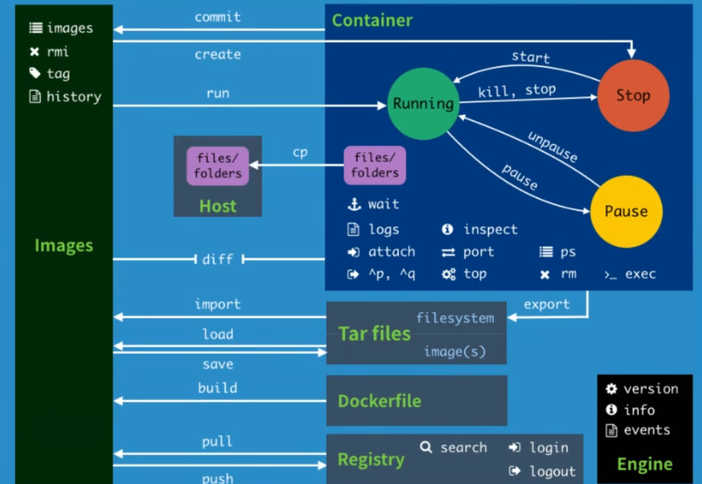

# 命令行


> [!tip]
> [命令行文档](https://docs.docker.com/reference/cli/docker/)




# 帮助命令

```term
triangle@LEARN:~$ docker version // 版本信息
triangle@LEARN:~$ docker version // 系统信息，包括镜像和容器数量
triangle@LEARN:~$ docker --help  // 帮助
```

# 镜像管理

## 查看本机镜像

```term
triangle@LEARN:~$ docker image ls // 查看镜像
REPOSITORY    TAG       IMAGE ID       CREATED         SIZE
hello-world   latest    d2c94e258dcb   10 months ago   13.3kB
triangle@LEARN:~$ docker images // docker image ls 的简写
triangle@LEARN:~$ docker images -q // 只显示镜像 id
```

## 查看仓库镜像

```term
triangle@LEARN:~$ docker search [name] 
triangle@LEARN:~$ docker search --filter=STARS=200 mysql // --filter 筛选条件
NAME         DESCRIPTION                                     STARS     OFFICIAL
mysql        MySQL is a widely used, open-source relation…   14891     [OK]
mariadb      MariaDB Server is a high performing open sou…   5684      [OK]
percona      Percona Server is a fork of the MySQL relati…   624       [OK]
phpmyadmin   phpMyAdmin - A web interface for MySQL and M…   953       [OK]
```

## 下载镜像

```term
triangle@LEARN:~$ docker pull [name:tag] // docker image pull 的别名
triangle@LEARN:~$ docker pull mysql
Using default tag: latest               # 默认下载 latest 版，
latest: Pulling from library/mysql
81badc5f380f: Already exists            # 分层下载，类似于动态库，本地存在就不再下载，详情见「联合文件系统」
c490e5dd1a9d: Already exists
87aeb61f1478: Pull complete
1cacbea6ceda: Pull complete
1e72891ace67: Pull complete
42b720363d36: Pull complete
6b3b50f9990a: Pull complete
3811d52cfa61: Pull complete
05bc7a0277d8: Pull complete
cc0abd25a274: Pull complete
Digest: sha256:ff5ab9cdce0b4c59704b4e2a09deed5ab8467be795e0ea20228b8528f53fcf82
Status: Downloaded newer image for mysql:latest
docker.io/library/mysql:latest          # mysql 对应的真实地址
triangle@LEARN:~$ docker pull docker.io/library/mysql:latest // 与上面等价
```

## 删除镜像

```term
triangle@LEARN:~$ docker images
REPOSITORY    TAG       IMAGE ID       CREATED         SIZE
mysql         latest    a88c3e85e887   6 weeks ago     632MB
hello-world   latest    d2c94e258dcb   10 months ago   13.3kB
triangle@LEARN:~$  docker rmi a88c3e85e887 // 根据 IMAGE ID 删除，rmi 中的 i 是 image
Untagged: mysql:latest
Untagged: mysql@sha256:ff5ab9cdce0b4c59704b4e2a09deed5ab8467be795e0ea20228b8528f53fcf82
Deleted: sha256:a88c3e85e887d78c6c16ee6a0a6297e09bd573193918a08f269a942ddad77856
Deleted: sha256:a47e3f5184188d0ded58167f81ed399bda838b37716d6a0d9fb538ae64371767
Deleted: sha256:750ea5242272cdbf344d0af35c4eff64c7b0296491bf9747214d4012c4feb391
Deleted: sha256:2f17d48c81db0969179826d20d81e1cd333676a714e293a19a6fdaa2d57b1f27
Deleted: sha256:bea3f162c4bd2492d6cfce9f715c60a61020205e82647343034c33c2d2c1c720
Deleted: sha256:d3ad25eecba2cc8f5d837c5436fd4ce2230c51c6a6b206125b9dba76f83bd02f
Deleted: sha256:8fb5524227094d3e8963e8bb93af8835a5928f34a072e2272aaf330b00fc3a58
Deleted: sha256:3dcdcc4db1094b30a257b6feb414db6149934171333bc8c6ea543578021862ac
Deleted: sha256:706b673eebeed9bc92da642eee3a1f5ea076e149b98491624ce7436ee40d115d
Deleted: sha256:ed862c4f3420f8cdf5fb1160305a714585ffd0cc739c6f6306c750e82d50cd75
Deleted: sha256:55d310cc1793fd699f7389585b86d5ff0270ad8f516f81db295e51e12f6d0b5b
triangle@LEARN:~$  docker rmi $(docker images -aq) // 批量删除
```

# 容器管理

## 容器查看

### 查询容器

```term
triangle@LEARN:~$ docker ps [OPTIONS]
Options:
                        当前运行的容器
    -a                  当前运行的容器 + 历史运行过的容器
    -n                  显示 n 个最近创建的容器
    -q                  只显示容器编号
triangle@LEARN:~$ docker ps -a
CONTAINER ID   IMAGE         COMMAND       CREATED         STATUS                     PORTS     NAMES
c66d975d5cd8   centos        "/bin/bash"   8 minutes ago   Exited (0) 2 minutes ago             wonderful_turing
6ff2861f85cd   hello-world   "/hello"      2 hours ago     Exited (0) 2 hours ago               thirsty_lamport
5aa83dbebe24   hello-world   "/hello"      2 hours ago     Exited (0) 2 hours ago               hopeful_kowalevski
triangle@LEARN:~$ docker stats // 查看资源占用
```

### 详细信息

```term
triangle@LEARN:~$  docker inspect a8ac22219a85
[
    {
        "Id": "a8ac22219a851ad89e3255339c87818d6db4bf99b522f0d66d623af765a2ee31",
        "Created": "2024-03-02T07:35:24.046372671Z",
        "Path": "/bin/bash",
        "Args": [
            "-c",
            "while true;do echo hello; done"
        ],
        "State": {
            "Status": "running",
            "Running": true,
            "Paused": false,
            "Restarting": false,
            "OOMKilled": false,
    ...
```

## 容器控制

### 运行容器

- **前台启动**

```term
triangle@LEARN:~$ docker run [options] image
Options:
    --name string       指定容器名
    --rm                用完就删除容器，用于测试
    -d                  detach 后台运行
    -i                  interaction 与镜像交互，STDIN 能输入信息给容器
    -t                  tty 创建一个终端
    -p                  指定容器端口
            -p ip:主机端口:容器端口 
            -p 主机端口:容器端口
            -p 容器端口
    -P                  随机端口
    -e                  在容器中添加环境变量
triangle@LEARN:~$ docker run -it centos
root@c66d975d5cd8:/$ cat /etc/os-release
NAME="CentOS Linux"
VERSION="8"
ID="centos"
....
root@c66d975d5cd8:/$ uname -a // 可以看见容器的内核还是宿主机
Linux c66d975d5cd8 5.15.133.1-microsoft-standard-WSL2 #1 SMP Thu Oct 5 21:02:42 UTC 2023 x86_64 x86_64 x86_64 GNU/Linux
root@c66d975d5cd8:/$ exit // 退出容器
exit
```
>[!note]
> 容器运行内核与宿主机一样，容器并没有真正的去模拟一个完整的操作系统

- **后台启动**

```term
triangle@LEARN:~$ docker run -d centos 
99819860032efb1ab496f49704b5e48bf34a6c5b72afac6ad95466225e24d658
triangle@LEARN:~$ 
triangle@LEARN:~$ docker ps -a 
CONTAINER ID   IMAGE     COMMAND       CREATED          STATUS                      PORTS     NAMES
99819860032e   centos    "/bin/bash"   35 seconds ago   Exited (0) 34 seconds ago             crazy_carver
triangle@LEARN:~$ docker run -dt centos  // 给 centos 创建了一个终端
b1629236e946f166ba6173c9226d84564caf912429c99e005230fb714e357532
triangle@LEARN:~$ docker ps -a
CONTAINER ID   IMAGE     COMMAND       CREATED         STATUS                     PORTS     NAMES
b1629236e946   centos    "/bin/bash"   6 seconds ago   Up 5 seconds                         dazzling_hellman
99819860032e   centos    "/bin/bash"   9 minutes ago   Exited (0) 2 minutes ago             crazy_carver
```
>[!warning|style:flat]
> 使用 docker 后台运行镜像时，必须确保镜像是能呆在后台运行。`centos` 在后台启动后，检测到没有终端（终端可以理解为一个文件，centos 对终端命令的读取，即`STDIN`，会阻塞），就直接运行结束并退出。

### 退出容器

```txt
exit            # 停止容器，退出到终端
ctrl + p + q    # 容器不停止，退出到终端
```

### 进入容器

- **方法一**

```term
triangle@LEARN:~$  docker ps -a
CONTAINER ID   IMAGE         COMMAND       CREATED              STATUS                      PORTS     NAMES
c66d975d5cd8   centos        "/bin/bash"   About a minute ago   Up About a minute                     elated_hoover
6ff2861f85cd   hello-world   "/hello"      2 hours ago          Exited (0) 2 hours ago                thirsty_lamport
triangle@LEARN:~$ docker exec -it c66d975d5cd8 /bin/bash // 通过容器执行一个命令，然后进入
root@c66d975d5cd8:/$ 
```

- **方法二**

```term
triangle@LEARN:~$ docker ps
CONTAINER ID   IMAGE     COMMAND                  CREATED          STATUS          PORTS     NAMES
a8ac22219a85   centos    "/bin/bash -c 'while…"   33 minutes ago   Up 33 minutes             focused_benz
triangle@LEARN:~$ docker attach a8ac22219a85 // 将容器后台运行内容展示到前台
hello
hello
hello
hello
hello
...
```

### 停止启动

```term
triangle@LEARN:~$ docker start 容器id 
triangle@LEARN:~$ docker restart 容器id 
triangle@LEARN:~$ docker stop 容器id 
triangle@LEARN:~$ docker kill 容器id 
```

### 删除容器

```term
triangle@LEARN:~$  docker ps -a
CONTAINER ID   IMAGE         COMMAND       CREATED              STATUS                      PORTS     NAMES
cb3cce70496c   centos        "/bin/bash"   About a minute ago   Up About a minute                     elated_hoover
c66d975d5cd8   centos        "/bin/bash"   18 minutes ago       Exited (0) 12 minutes ago             wonderful_turing
6ff2861f85cd   hello-world   "/hello"      2 hours ago          Exited (0) 2 hours ago                thirsty_lamport
triangle@LEARN:~$ docker rm c66d975d5cd8 
c66d975d5cd8    # 删除成功
triangle@LEARN:~$ docker rm cb3cce70496c // 不能直接删除正在运行的，可以用 -f 强制删除
Error response from daemon: cannot remove container "/elated_hoover": container is running: stop the container before removing or force remove
```

## 输出信息

```term
triangle@LEARN:~$ docker logs [OPTIONS] CONTAINER
Options:
    -n, --tail string    打印最新的 n 条日志
    -f, --follow         持续读取容器输出的日志，不指定则只读取一次
    -t, --timestamps     日常时间戳
triangle@LEARN:~$ docker run -d centos /bin/bash -c "while true;do echo hello; done"
a8ac22219a851ad89e3255339c87818d6db4bf99b522f0d66d623af765a2ee31
triangle@LEARN:~$  docker ps
CONTAINER ID   IMAGE     COMMAND                  CREATED          STATUS          PORTS     NAMES
a8ac22219a85   centos    "/bin/bash -c 'while…"   11 seconds ago   Up 10 seconds             focused_benz
triangle@LEARN:~$ docker logs -n 10 -t a8ac22219a85 | cat -n
     1  2024-03-02T07:36:30.969703169Z hello
     2  2024-03-02T07:36:30.969704899Z hello
     3  2024-03-02T07:36:30.969709739Z hello
     4  2024-03-02T07:36:30.969711549Z hello
     5  2024-03-02T07:36:30.969713229Z hello
     6  2024-03-02T07:36:30.969714939Z hello
     7  2024-03-02T07:36:30.969716639Z hello
     8  2024-03-02T07:36:30.969718349Z hello
     9  2024-03-02T07:36:30.969725679Z hello
    10  2024-03-02T07:36:30.969729079Z hello
```

> [!tip]
> `docker logs` 读取内容本质上就是容器的 `STDOUT` 


## 内部进程

```term
triangle@LEARN:~$ docker top a8ac22219a85
UID                 PID                 PPID                C                   STIME               TTY
TIME                CMD
root                5064                5044                96                  07:35               ?
00:05:01            /bin/bash -c while true;do echo hello; done
```

# 文件拷贝

```term
triangle@LEARN:~$ docker ps -a
CONTAINER ID   IMAGE     COMMAND       CREATED         STATUS                      PORTS     NAMES
c2de15be257e   centos    "/bin/bash"   4 minutes ago   Exited (0) 45 seconds ago             mystifying_volhard
triangle@LEARN:~$ docker cp c2de15be257e:/home/test.txt ./ // 从容器的虚拟磁盘中将文件拷贝出来
Successfully copied 2.05kB to /home/triangle/./
```
