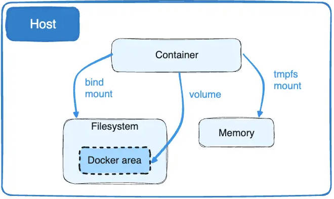
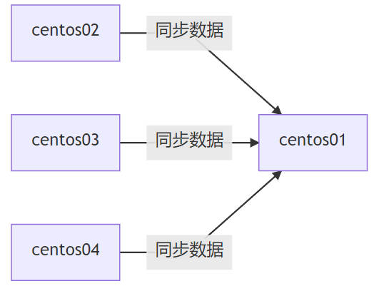

# 卷


# 数据卷

> [!note]
> 容器运行产生的数据都存放在「容器层」中，当容器被删除，相应的容器层也被销毁，会造成数据丢失。



**数据卷：将本机的文件目录作为数据卷，挂载到容器中**。这样就能保证容器被删除后，数据还能保存在本机上。数据卷不属于联合文件系统（Union FileSystem），因此能够绕过联合文件系统提供一些用于持续存储或共享数据的特性
- 数据卷可在容器之间共享或重用数据
- 卷中的更新实时同步更新
- 数据卷中的更改不会包含在镜像的更新中
- 数据卷的生命周期一直持续到没有容器使用它为止

>[!WARNING]
> 「数据卷」不是指在本机上存放数据的具体文件夹，而是 docker 中的一个概念，对本机文件夹的抽象。例如，在程序中，能使用文件描述符读写文件，但程序关闭文件描述符后，文件依然存在。

# 挂载

## 指定目录挂载

- **指定路径** : `-v 主机目录:容器目录[:权限]` ，

```term
triangle@LEARN:~$ docker run -it -v 本机目录:容器目录 image
triangle@LEARN:~$ docker run -dt -v /home/triangle/centos:/home centos
root@9eb45e9c158d:~$ lsblk
NAME  MAJ:MIN RM   SIZE RO TYPE MOUNTPOINT
loop0   7:0    0 458.4M  1 loop
loop1   7:1    0 169.1M  1 loop
loop2   7:2    0 601.8M  1 loop
sda     8:0    0 389.8M  1 disk
sdb     8:16   0     2G  0 disk [SWAP]
sdc     8:32   0     1T  0 disk
sdd     8:48   0     1T  0 disk /etc/hosts
sde     8:64   0     1T  0 disk /home               # 在 centos 中，/home 是一个块设备
root@9eb45e9c158d:~$ df -h
Filesystem      Size  Used Avail Use% Mounted on
overlay        1007G  2.3G  954G   1% /
tmpfs            64M     0   64M   0% /dev
tmpfs           3.9G     0  3.9G   0% /sys/fs/cgroup
shm              64M     0   64M   0% /dev/shm
/dev/sde       1007G  3.1G  953G   1% /home         # /home 是 /dev/sde 设备的挂载点
/dev/sdd       1007G  2.3G  954G   1% /etc/hosts
tmpfs           3.9G     0  3.9G   0% /proc/acpi
tmpfs           3.9G     0  3.9G   0% /sys/firmware
root@9eb45e9c158d:~$ mount | grep home
/dev/sde on /home type ext4 (rw,relatime,discard,errors=remount-ro,data=ordered)
root@9eb45e9c158d:~$ 
triangle@LEARN:~$ docker inspect 9eb45e9c158d
    ...
        "Mounts": [
            {
                "Type": "bind",  
                "Source": "/home/triangle/centos",  # 本机目录
                "Destination": "/home",             # 容器目录
                "Mode": "",
                "RW": true,
                "Propagation": "rprivate"
            }
        ],
    ...
```

## 具名/匿名挂载

- **匿名挂载** : `-v 容器目录[:权限]`，
- **具名挂载** : `-v 卷名:容器目录[:权限]`


```term
triangle@LEARN:~$ docker run -dt -v /home centos // // 匿名挂载
triangle@LEARN:~$ docker run -dt -v name:/home centos // 具名挂载
triangle@LEARN:~$ docker volume ls // 查看卷
DRIVER    VOLUME NAME
local     2cfdda4dca03272898f61044b773746f0028a22507ddc0eea029b58c02eeb643 # 匿名挂载
local     bfd51e7b1e7dacf78f1aa27d857800058419ea31e3b076c70d112bf894974584
local     d0677d8fbc756eba67ccc395a0ed42fc61433582905f161296f8e2519774989e
local     name                                                              # 具名挂载
```

## 区别

| 方式     | 类型     | 源                            | 数据卷 |
| -------- | -------- | ----------------------------- | ------ |
| 指定路径 | `bind`   | 主机本地文件夹                | 无     |
| 匿名挂载 | `volume` | docker 在本机上创建一个文件夹 | 有     |
| 具名挂载 | `volume` | docker 在本机上创建一个文件夹 | 有     |

- **指定路径挂载**

```term
triangle@LEARN:~$ docker volume ls -q |xargs docker volume rm // 删除所有数据卷文件
triangle@LEARN:~$ docker volume ls  
DRIVER    VOLUME NAME
triangle@LEARN:~$ docker run -dt -v /home/triangle/workspace/test/:/home centos // 指定路径挂载
32a0de93ca92349b8d246d6ff15e23d872dbc23cb9fa0ce5f1a553526d21f879
triangle@LEARN:~$ docker volume ls  
DRIVER    VOLUME NAME
triangle@LEARN:~$ docker inspect 32a0de93ca92
    ...
        "Mounts": [
            {
                "Type": "bind",                             # 模式为绑定
                "Source": "/home/triangle/workspace/test/",
                "Destination": "/home",
                "Mode": "",
                "RW": true,
                "Propagation": "rprivate"
            }
        ],
    ...
```

- **匿名/具名挂载**

```term
triangle@LEARN:~$ docker run -dt -v /home centos // 匿名挂载
754b37b42ff1ee096a70d165a2bc84c1dd54ea2e31181d5238b026a9069be4fe
triangle@LEARN:~$ docker volume ls
DRIVER    VOLUME NAME
local     aa95a05740e6179dc3a885511c12bcb9a74b42aafa9ea18a7603d14318492d5a  # docker 自己在本机上创建了数据卷存放数据的文件夹
triangle@LEARN:~$ docker inspect 754b37b42ff1
        "Mounts": [
            {
                "Type": "volume",                           # 模式为数据卷
                "Name": "aa95a05740e6179dc3a885511c12bcb9a74b42aafa9ea18a7603d14318492d5a",
                # 本机上为数据卷创建文件夹
                "Source": "/var/lib/docker/volumes/aa95a05740e6179dc3a885511c12bcb9a74b42aafa9ea18a7603d14318492d5a/_data",
                "Destination": "/home",
                "Driver": "local",
                "Mode": "",
                "RW": true,
                "Propagation": ""
            }
        ],
```


# 数据卷管理


## 命令行

```term
triangle@LEARN:~$ docker volume ls // 查看卷
DRIVER    VOLUME NAME
local     2cfdda4dca03272898f61044b773746f0028a22507ddc0eea029b58c02eeb643 
local     bfd51e7b1e7dacf78f1aa27d857800058419ea31e3b076c70d112bf894974584
local     d0677d8fbc756eba67ccc395a0ed42fc61433582905f161296f8e2519774989e
local     name                                                              # 具名挂载
triangle@LEARN:~$ docker volume rm name // 删除数据卷在本机上的数据文件夹
triangle@LEARN:~$ docker volume inspect name // 查看卷
[
    {
        "CreatedAt": "2024-03-03T06:41:17Z",
        "Driver": "local",
        "Labels": null,
        "Mountpoint": "/var/lib/docker/volumes/name/_data",    # 本机具体路径地址
        "Name": "name",
        "Options": null,
        "Scope": "local"
    }
]

```

## 卷路径

```term
triangle@LEARN:~$ cd /var/lib/docker/volumes/  // linux 版卷路径
triangle@LEARN:~$ dir \\wsl.localhost\docker-desktop-data\data\docker\volumes // wsl2 版卷路径
Mode         LastWriteTime   Length Name
----         -------------   ------ ----
d-----  2024/3/3      0:14          d0677d8fbc756eba67ccc395a0ed42fc61433582905f161296f8e2519774989e
d-----  2024/3/3     14:45          2cfdda4dca03272898f61044b773746f0028a22507ddc0eea029b58c02eeb643
d-----  2024/3/3     14:41          name
d-----  2024/3/3      0:26          bfd51e7b1e7dacf78f1aa27d857800058419ea31e3b076c70d112bf894974584
------  2024/3/3     14:45    32768 metadata.db
-----l  2024/3/3     11:02        0 backingFsBlockDev
```

## DockerFile 配置卷

```docker
# 指定基础操作系统
FROM centos

# 配置数据卷
# NOTE - 配置结果为匿名挂载。如果具名挂载，会有和其他容器重名风险
VOLUME ["volume1","volume2"]

# shell 命令
CMD echo "end"
CMD /bin/bash
```

```term
triangle@LEARN:~$ docker build -f dockerfile -t triangle/centos:1.0 ./ // 生成镜像
[+] Building 0.4s (5/5) FINISHED                                                            docker:default
 => [internal] load build definition from dockerfile                                                  0.0s
 => => transferring dockerfile: 110B                                                                  0.0s
 => [internal] load metadata for docker.io/library/centos:latest                                      0.0s
 => [internal] load .dockerignore                                                                     0.1s
 => => transferring context: 2B                                                                       0.0s
 => [1/1] FROM docker.io/library/centos:latest                                                        0.1s
 => exporting to image                                                                                0.0s
 => => exporting layers                                                                               0.0s
 => => writing image sha256:e8f4ccf13f3aba8fcac8e37cb6f57550dd1e6b56737a1cf1e3ca4ee7a8654733          0.0s
 => => naming to docker.io/triangle/centos:1.0
triangle@LEARN:~$ docker images
REPOSITORY            TAG       IMAGE ID       CREATED         SIZE
portainer/portainer   latest    5f11582196a4   15 months ago   287MB
triangle/centos       1.0       e8f4ccf13f3a   2 years ago     231MB    # 通过 dockerfile 创建的镜像
centos                latest    5d0da3dc9764   2 years ago     231MB
triangle@LEARN:~$ docker run -it e8f4ccf13f3a
root@d67ccdf99173:/$ ls -l
total 56
lrwxrwxrwx   1 root root    7 Nov  3  2020 bin -> usr/bin
drwxr-xr-x   5 root root  360 Mar  3 08:01 dev
...
drwxr-xr-x  20 root root 4096 Sep 15  2021 var
drwxr-xr-x   2 root root 4096 Mar  3 08:01 volume1          # dockerfile 中的匿名挂载
drwxr-xr-x   2 root root 4096 Mar  3 08:01 volume2
root@d67ccdf99173:/$
triangle@LEARN:~$ docker inspect d67ccdf99173
    ...
        "Mounts": [
            {
                "Type": "volume",
                "Name": "81afeaad4dd8cb3eb6c394b457d7d8dd32db3a387b46d8ce0605d3425400f8f5",
                "Source": "/var/lib/docker/volumes/81afeaad4dd8cb3eb6c394b457d7d8dd32db3a387b46d8ce0605d3425400f8f5/_data",
                "Destination": "volume1",
                "Driver": "local",
                "Mode": "",
                "RW": true,
                "Propagation": ""
            },
            {
                "Type": "volume",
                "Name": "6a7edb0ab538376df4976bcf8ae7e198f29546b3c22ccf24bf7edfa191e065c9",
                "Source": "/var/lib/docker/volumes/6a7edb0ab538376df4976bcf8ae7e198f29546b3c22ccf24bf7edfa191e065c9/_data",
                "Destination": "volume2",
                "Driver": "local",
                "Mode": "",
                "RW": true,
                "Propagation": ""
            }
        ],
    ...
```
## 卷共享




通过 `--volumes-from` 把容器 `centos01` 的数据卷共享给了 `centos02`
- 两个容器可以是不同的镜像
- 共享是单向的， `centos01` 不能访问 `centos02` 中其他的数据卷


```term
triangle@LEARN:~$ docker run -dt --name centos01 triangle/centos:1.0 // 启动上面自定义的镜像
d69c26e04acb2cfcf38dcba1619a036e5435ba8469c8316e2f76e1075772eb52
triangle@LEARN:~$ docker run -dt --name centos02 --volumes-from centos01  triangle/centos:1.0 
f859ec6bb2c324d0a99dd5d453deb1366405239478a160f4b4bbdf0bcda1f9a4
triangle@LEARN:~$ docker ps
CONTAINER ID   IMAGE                 COMMAND                  CREATED         STATUS         PORTS     NAMES
f859ec6bb2c3   triangle/centos:1.0   "/bin/sh -c /bin/bash"   4 minutes ago   Up 4 minutes             centos02
d69c26e04acb   triangle/centos:1.0   "/bin/sh -c /bin/bash"   5 minutes ago   Up 5 minutes             centos01
triangle@LEARN:~$ docker inspect f859ec6bb2c3
    ...
        "Mounts": [
            {
                "Type": "volume",
                "Name": "bcedce75a454977264f69171d053c339c8642696f93bd14022f4fa0a4326593f",
                "Source": "/var/lib/docker/volumes/bcedce75a454977264f69171d053c339c8642696f93bd14022f4fa0a4326593f/_data",
                "Destination": "volume1",
                "Driver": "local",
                "Mode": "",
                "RW": true,
                "Propagation": ""
            },
            {
                "Type": "volume",
                "Name": "f13f4d02b3f93c9b16e0eb35de2352381a3ee5bd9a4ea3710964eaecca64df98",
                "Source": "/var/lib/docker/volumes/f13f4d02b3f93c9b16e0eb35de2352381a3ee5bd9a4ea3710964eaecca64df98/_data",
                "Destination": "volume2",
                "Driver": "local",
                "Mode": "",
                "RW": true,
                "Propagation": ""
            }
        ],
    ...
triangle@LEARN:~$ docker inspect d69c26e04acb
    ...
        "Mounts": [
            {
                "Type": "volume",
                "Name": "bcedce75a454977264f69171d053c339c8642696f93bd14022f4fa0a4326593f",
                "Source": "/var/lib/docker/volumes/bcedce75a454977264f69171d053c339c8642696f93bd14022f4fa0a4326593f/_data",
                "Destination": "volume1",
                "Driver": "local",
                "Mode": "",
                "RW": true,
                "Propagation": ""
            },
            {
                "Type": "volume",
                "Name": "f13f4d02b3f93c9b16e0eb35de2352381a3ee5bd9a4ea3710964eaecca64df98",
                "Source": "/var/lib/docker/volumes/f13f4d02b3f93c9b16e0eb35de2352381a3ee5bd9a4ea3710964eaecca64df98/_data",
                "Destination": "volume2",
                "Driver": "local",
                "Mode": "",
                "RW": true,
                "Propagation": ""
            }
        ],
    ...
```
