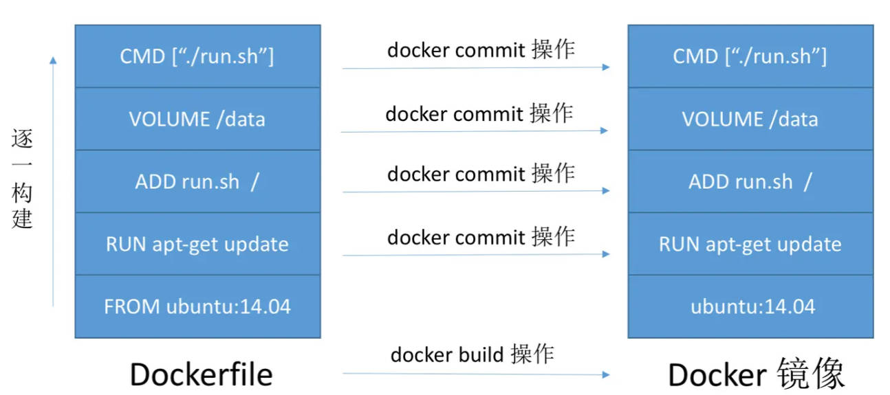

# DockerFile

# 简介

`DockerFile` 是用来构建Docker镜像的构建文件，是由一系列命令参数构成的脚本。在 Dockerfile 中描述的就是镜像层级搭建的过程。



# 语法规则

**基本规则:**

1. 关键字必须大写
2. 指令顺序执行
3. `#` 进行注释
4. 每一条指令对应一层镜像

**关键字**

```docker
FROM            # 基础镜像
MAINTAINER      # 作者名<邮箱>
RUN             # 镜像构建时，需要执行的命令。
ADD             # 本地需要添加到镜像中的内容。会自动解压压缩包
WORKDIR         # 工作目录
VOLUME          # 设置数据卷
EXPOSE          # 指定暴露端口，同 -p
CMD             # 容器启动后，执行的脚本命令。 docker run 会替换
ENTRYPOINT      # 容器启动后，执行的脚本命令。 docker run 会追加
ONBUILD         # 触发指令
COPY            # 拷贝，将文件拷贝到镜像中
ENV             # 设置容器环境变量
```

**案例**

```docker
FROM node:14-alpine AS build        # build 阶段的镜像
WORKDIR /app                        # 镜像的工具目录
COPY package*.json ./               # 从本机拷贝内容到镜像
RUN npm install                     # 镜像中执行 npm install
COPY . .
RUN npm run build
 
FROM node:14-alpine                 # 正式发布的镜像
MAINTAINER  learn<test@gmali.com>
ADD tools.tar.gz   /var/opt         # 解压到镜像的 /var/opt 文件夹
WORKDIR /app
COPY --from=build /app/dist ./dist  # 从 build 阶段中产生的结果拷贝出来
COPY package*.json ./
RUN npm install --production
EXPOSE 2333:20                      # 暴露端口
CMD ["npm", "start"]                # 容器启动后，执行命令
```

# 命令行

## 构建

```term
triangle@LEARN:~$ docker build -f dockerfile -t name[:tag] ./ 
Options:
    -f      指定 dockerfile 文件路径。不指定，则默认查找 Dockerfile 文件
    -t      生成镜像名和版本号
```

## 生成信息

```term
triangle@LEARN:~$ docker images
REPOSITORY            TAG       IMAGE ID       CREATED         SIZE
portainer/portainer   latest    5f11582196a4   15 months ago   287MB
triangle/centos       1.0       e8f4ccf13f3a   2 years ago     231MB
centos                latest    5d0da3dc9764   2 years ago     231MB
triangle@LEARN:~$ docker history 5f11582196a4
IMAGE          CREATED         CREATED BY                                      SIZE      COMMENT
5f11582196a4   15 months ago   ENTRYPOINT ["/portainer"]                       0B        buildkit.dockerfile.v0
<missing>      15 months ago   EXPOSE map[8000/tcp:{}]                         0B        buildkit.dockerfile.v0
<missing>      15 months ago   EXPOSE map[9443/tcp:{}]                         0B        buildkit.dockerfile.v0
<missing>      15 months ago   EXPOSE map[9000/tcp:{}]                         0B        buildkit.dockerfile.v0
<missing>      15 months ago   WORKDIR /                                       0B        buildkit.dockerfile.v0
<missing>      15 months ago   VOLUME [/data]                                  0B        buildkit.dockerfile.v0
<missing>      15 months ago   COPY build/docker-extension / # buildkit        5.97kB    buildkit.dockerfile.v0
<missing>      15 months ago   COPY dist / # buildkit                          287MB     buildkit.dockerfile.v0
<missing>      15 months ago   LABEL org.opencontainers.image.title=Portain…   0B        buildkit.dockerfile.v0
<missing>      2 years ago     COPY /buildtmp /tmp # buildkit                  0B        buildkit.dockerfile.v0
<missing>      2 years ago     COPY /etc/ssl/certs/ca-certificates.crt /etc…   203kB     buildkit.dockerfile.v0
```

## 发布

```term
triangle@LEARN:~$ docker login // 登录 docker hub 账号
triangle@LEARN:~$ docker push author/repository:tag // 发布镜像到 docker hub
```

## 镜像包

```term
triangle@LEARN:~$ docker save // 保存镜像包
triangle@LEARN:~$ docker load // 加载镜像包
```
