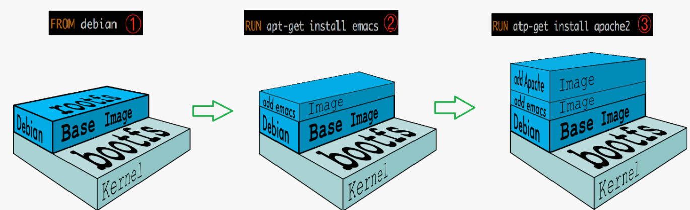
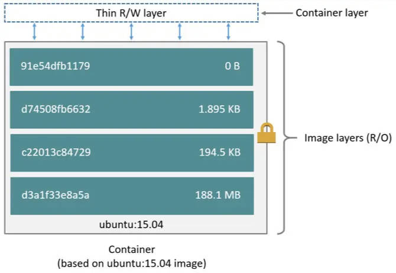
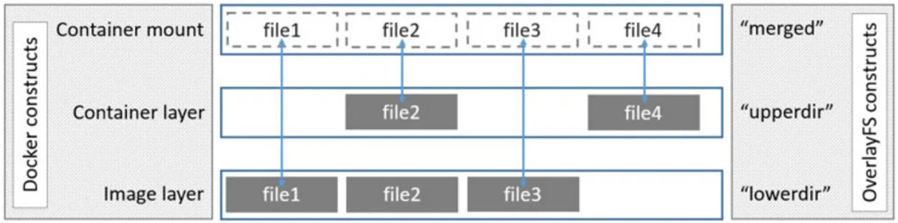

# 文件系统

> [!note]
> `Linux` 系统哲学中：一切皆是「文件」。**一个镜像能代表一个操作系统，其本质就是内部模拟了一个完善的 Linux 文件系统。**

# 联合文件系统

## 概念

**联合文件系统 (Union File System)** : 是一种分层、轻量级并且高性能的文件系统，它支持对文件系统的修改作为一次提交来一层层的叠加，同时可以将不同目录挂载到同一个虚拟文件系统下。UnionFS 是 Docker 镜像的基础。镜像可以通过分层来进行继承，基于基础镜像（没有父镜像），可以制作各种具体的应用镜像。



不同 Docker 容器就可以共享一些基础的文件系统层。拉去一个镜像时，若发现 `Base Image` 或依赖镜像已经存在，则直接复用，不会再次下载。

```term
triangle@LEARN:~$ docker pull mysql
Using default tag: latest               # 默认下载 latest 版，
latest: Pulling from library/mysql
81badc5f380f: Already exists            # 分层下载，类似于动态库，本地存在就不再下载
c490e5dd1a9d: Already exists
87aeb61f1478: Pull complete
1cacbea6ceda: Pull complete
1e72891ace67: Pull complete
42b720363d36: Pull complete
6b3b50f9990a: Pull complete
3811d52cfa61: Pull complete
05bc7a0277d8: Pull complete
cc0abd25a274: Pull complete
Digest: sha256:ff5ab9cdce0b4c59704b4e2a09deed5ab8467be795e0ea20228b8528f53fcf82
Status: Downloaded newer image for mysql:latest
docker.io/library/mysql:latest
```

## 层级结构

Docker镜像的联合文件系统的主要构成部分有：
- **Base Image Layer** : 这是 Docker 镜像的初始层，通常包含操作系统的基本文件系统。基础镜像层是只读的，不可更改
- **Image Layers** : 在基础镜像层之上，可以有一个或多个镜像层。每个镜像层都包含了一组文件或目录的快照。镜像层是只读的
- **Container Layer** : 当使用镜像创建容器时，会在镜像层的顶部添加一个容器层。容器层是可写的，用于存储容器运行时的文件修改和数据。
- **Mount Point** : Docker 容器可以将主机上的目录或文件挂载到容器内的指定路径。挂载点允许容器访问主机的文件系统，以实现数据共享和持久化存储。



联合文件系统通过将这些部分以一种有效的方式组合在一起，形成一个单一的可读写的文件系统。容器在运行时会将这些层叠加在一起，形成一个完整的容器文件系统视图。

## 文件系统实现

```term
triangle@LEARN:~$  docker ps
CONTAINER ID   IMAGE                 COMMAND        CREATED        STATUS          PORTS                                        NAMES
a22f0d35427e   portainer/portainer   "/portainer"   11 hours ago   Up 38 minutes   8000/tcp, 9443/tcp, 0.0.0.0:2333->9000/tcp   prtainer
triangle@LEARN:~$ docker inspect a22f0d35427e
    ....
        "GraphDriver": {
            "Data": {
                "LowerDir": "/var/lib/docker/overlay2/1d28/diff:/var/lib/docker/overlay2/9850/diff",
                "MergedDir": "/var/lib/docker/overlay2/1d28/merged",
                "UpperDir": "/var/lib/docker/overlay2/1d28/diff",
                "WorkDir": "/var/lib/docker/overlay2/1d28/work"
            },
            "Name": "overlay2"
        },
    ....
```

- **LowerDir** :属于镜像层(image layer)，其中就包含`bootfs`、`rootfs`层。
    - **bootfs** : 与Linux/Unix 系统一样，包含 `bootloader` 和 `kernel` (内核实际直接挂载主机的)
    - **rootfs** : 包含 Linux 系统中的 `/dev /proc /bin /etc` 等标准目录和文件，**靠这一层就能区分出不同的发现版**
- **Upperdir** :  `Container Layer`，在启动一个容器的时候会在最后的镜像层的上一层自动创建，所有对容器数据的更改都会发生在这一层
- **MergedDir** : 联合挂载层，将镜像层和容器层结合，最终虚拟出的文件系统。在查看某一文件时，只要容器层中有此文件，便展示容器层中的文件内容；若容器层中没有，则展示镜像层中的。

**通过「联合挂载层」就能为容器中的程序虚拟出了一个文件系统。** 




| 行为       | 实现                                                                                               |
| ---------- | -------------------------------------------------------------------------------------------------- |
| 同路径文件 | 上层覆盖下层，即最优先展示容器层中的文件                                                           |
| 添加文件   | 在容器中创建文件时，新文件被添加到容器层中                                                         |
| 读取文件   | 从上往下依次在各镜像层中查找此文件。一旦找到，立即将其复制到容器层，然后打开并读入内存             |
| 修改文件   | 修改已存在的文件时，从上往下依次在各镜像层中查找此文件。一旦找到，立即将其复制到容器层，然后修改之 |
| 删除文件   | 从上往下依次在镜像层中查找此文件。找到后，会在容器层中记录下此删除操作。（只是记录删除操作）       |


# 容器提交

通过容器提交，可以将现有的容器打包成一个新的镜像，即将容器的 `Container Layer` 也 `Image Layers` 合并，创建出一个新的镜像。

```term
triangle@LEARN:~$ docker commit -a "author" -m "description"  [container]  [repository:tag]
```


